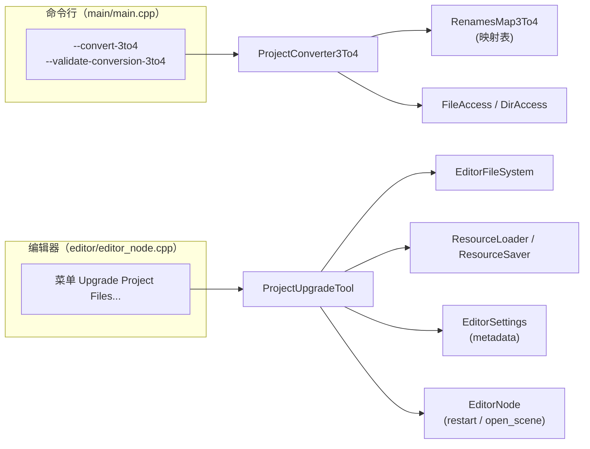
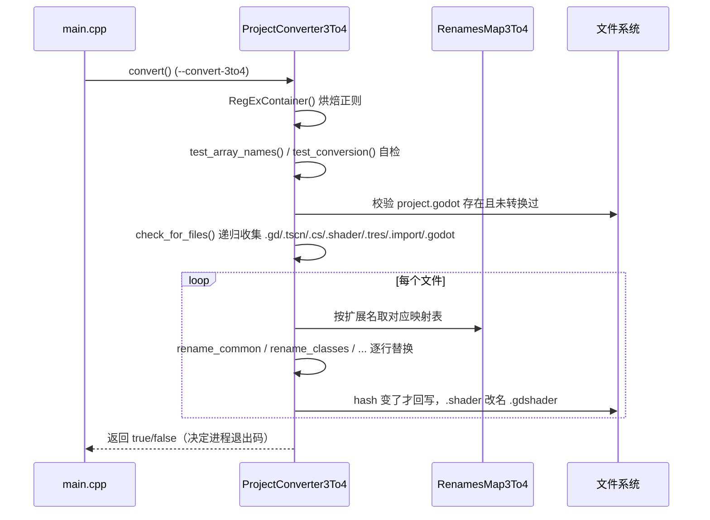

# project_upgrade（editor）

> 一句话：这个模块是 Godot 给老项目准备的「搬家师傅」——一个命令行工具把 Godot 3 项目整目录「翻译」成 Godot 4，一个编辑器对话框把 Godot 4 项目整体「重刷」到最新小版本。

**结论**：`project_upgrade` 干两件互不重叠的事——`ProjectConverter3To4` 靠正则替换把 3.x 项目的源码/场景/资源一次性升级成 4.x；`ProjectUpgradeTool` 靠「重导入 + 重保存」把 4.x 项目批量刷到新小版本。代价是转换基于文本正则，只改名字不保语义，复杂工程仍需人工复核。

## 是什么 / 不是什么

它负责「批量、机械地改写旧版项目文本」，把 3.x 的类名、函数名、属性名、信号名、枚举、颜色、输入映射按一张张映射表替换成 4.x 的新名字。

它**不是**语义级迁移工具：它不编译、不跑你的代码，不保证改完逻辑正确（`ProjectConverter3To4` 的 `.cs` 分支甚至留着 `// TODO`，见 `project_converter_3_to_4.cpp:392`）。它也不管 Godot 4 内部的小版本差异之外的任何东西——真正的加载/保存交给 `ResourceLoader`/`ResourceSaver` 去做。

## 在引擎里的位置

两个入口，两条链路，全部挂在 `DISABLE_DEPRECATED` 编译开关之外（编不进 editor 二进制时整个 `ProjectConverter3To4` 和 `RenamesMap3To4` 都不存在）。

- `ProjectConverter3To4` 是纯命令行工具，只在 `main.cpp:4311` 被构造一次，不进场景树、不注册到 ClassDB。
- `ProjectUpgradeTool` 继承 `Object`，在 `editor_node.cpp:8433` 由 `memnew` 创建，靠 `EditorNode` 菜单触发。

## 关键概念

- **搬家清单**：`RenamesMap3To4` 这个 `struct` 是 15 张静态字符串映射表（枚举、GDScript/C# 函数、属性、信号、工程设置、输入映射、内置类型、着色器、类名、颜色、主题覆盖），是转换的全部「词库」——锚点 `renames_map_3_to_4.h:35`。
- **逐行翻译工**：`ProjectConverter3To4` 把每个文件切成 `SourceLine`（一行 + 是否注释），再按扩展名分发到不同的 `rename_*` 函数，锚点 `project_converter_3_to_4.h:48`。
- **正则工厂**：内部类 `RegExContainer` 在构造时把上面每张表「烘焙」成一批 `RegEx`，避免转换时重复编译正则，锚点 `project_converter_3_to_4.cpp:60`。
- **升级管家**：`ProjectUpgradeTool` 用 `EditorSettings` 的 metadata 在两次编辑器启动之间传递「要重导/要重存」的文件清单，锚点 `project_upgrade_tool.h:38`。

## 核心文件（按阅读顺序）

1. `editor/project_upgrade/renames_map_3_to_4.h` — 声明 15 张「旧名 → 新名」映射表，全部 `static const char *[][2]`。
2. `editor/project_upgrade/renames_map_3_to_4.cpp` — 映射表的具体数据（约 1800 行，纯数据，无逻辑）。
3. `editor/project_upgrade/project_converter_3_to_4.h` — `ProjectConverter3To4` 公开接口：`convert()` / `validate_conversion()` 加一堆私有 `rename_*`。
4. `editor/project_upgrade/project_converter_3_to_4.cpp` — 转换主逻辑（约 2953 行）：`check_for_files()`、`convert()`、按扩展名分发、内置测试。
5. `editor/project_upgrade/project_upgrade_tool.h` — `ProjectUpgradeTool` 接口：`popup_dialog` / `prepare_upgrade` / `begin_upgrade` / `finish_upgrade`。
6. `editor/project_upgrade/project_upgrade_tool.cpp` — 编辑器升级的完整实现（153 行）。
7. `editor/project_upgrade/SCsub` — 只把 `*.cpp` 加进 `editor_sources`，编译单元由这 3 个 `.cpp` 构成。

## 数据流 / 调用链

两条链路各自独立，这里画「3→4 转换」这条主线：

「4.x 小版本升级」这条短链：菜单 → `popup_dialog()` → 用户点「Restart & Upgrade」→ `prepare_upgrade()` 把清单写进 metadata → `EditorNode::restart_editor` → 重启后 `begin_upgrade()` 删 `uid_cache.bin` → `_execute_upgrades()`（`editor_node.cpp:1221`）里 `finish_upgrade()` 重导/重存 → 发 `upgrade_finished` 信号 → 再扫一遍文件系统。

## 中文口诀

- 三转四，靠正则，映射表里查旧名。
- 类名函数属性信号，十五张表全备好。
- 逐行切、按后缀，注释行里不瞎改。
- 改前先自检，改后 hash 对，没变就不回写。
- 小版本升级另条路：重导重存，删缓存重扫。
- 一次只搬一种，别指望它读懂你代码。

## 练习（15 分钟）

1. 打开 `renames_map_3_to_4.cpp:1459` 的 `class_renames`，数一数这张表有多少个类名映射，挑一个你认识的旧类名（如 `Spatial`）说出它的新名字。
2. 在 `project_converter_3_to_4.cpp` 的 `convert()` 里找到 `.gd` 分支（约 346 行），按顺序列出它调用了哪些 `rename_*`。
3. 读 `project_upgrade_tool.cpp` 的 `finish_upgrade()`，用一句话概括「场景重存」和「资源重存」分别是怎么遍历的。

## 自测

- [ ] `ProjectConverter3To4` 在 `check_for_files()` 里显式跳过哪两个目录名？它收集哪些扩展名的文件？
- [ ] `.shader` 文件在转换时会被改名成什么？这一步发生在哪个函数？
- [ ] `ProjectUpgradeTool` 的「待重存清单」存在哪里（哪个类的哪个字段）？为什么不能直接存内存？

## 一句话总结

> 一个正则驱动的 3→4 命令行转换器 + 一个「重导重存」的编辑器升级管家，合起来把「老项目开进新引擎」这件事自动化，但不替你把关语义。
