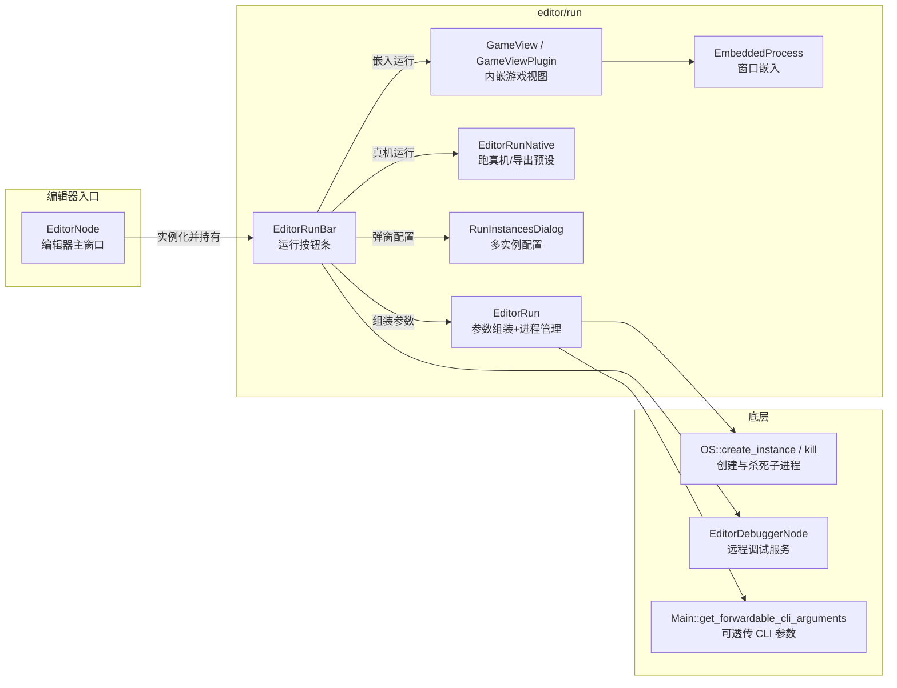

# run（editor）

> 一句话：编辑器顶部的「▶ 运行」按钮，本质是一台「命令行参数组装机」——它把场景、调试、断点、窗口位置等信息拼成一条命令行，再拉起一个新的游戏子进程跑给你看。

**结论**：`editor/run` 负责编辑器里「运行 / 调试 / 停止项目」这件事，它把一次运行请求翻译成子进程的启动参数并管理这批子进程的生命周期；代价是它只管「派发」，不负责「游戏本身怎么跑」，运行起来的游戏是独立进程，跟编辑器靠调试协议通信。

## 是什么 / 不是什么

这个模块是「运行命令的组装与派发层」。你在编辑器按 F6 / F5 / Ctrl+F5，它负责三件事：算出要跑哪个场景、拼出完整的启动命令行、把子进程的 PID 记下来以便停止。运行起来之后，游戏画面、物理、渲染全在**另一个进程**里，本模块不碰那些。

它**不是**导出系统——`_run_native` 里虽然会调 `EditorExportPreset` 拿「可运行的导出预设」跑真机，但真正打包导出是 `editor/export` 的活。它**不是**调试器——断点、远程调试协议由 `editor/debugger` 负责，本模块只负责把 `--remote-debug`、`--breakpoints` 这些参数喂给子进程。

## 在引擎里的位置



- `EditorNode` 在 `editor/editor_node.cpp` 里实例化 `EditorRunBar`，把它当作顶部工具栏的一部分。
- `EditorRunBar::_run_scene` 最终落到 `editor_run.run(...)`，由后者真正调 `OS::create_instance` 拉起进程。

## 关键概念

- **运行按钮条 = 前台收银员**：`EditorRunBar`（`editor_run_bar.h:45`）是用户直接点的那排按钮（播放 / 暂停 / 停止 / 播放自定义场景），它判断「跑主场景、跑当前场景、还是跑自定义场景」，然后把请求转发下去。
- **参数组装机 = 后台厨房**：`EditorRun`（`editor_run.h:44`）的 `run()` 方法（`editor_run.cpp:51`）是核心——一条条 `args.push_back(...)` 拼出完整命令行，最后 `OS::get_singleton()->create_instance(instance_args, &pid)`（`editor_run.cpp:182`）真正启动。
- **PID 名单 = 记账本**：`EditorRun::pids`（`editor_run.h:52`）是 `List<ProcessID>`，记住所有被拉起的子进程；`stop()`（`editor_run.cpp:222`）靠 `OS::kill` 逐个清掉它们。
- **多实例 = 一键开多个窗口**：`RunInstancesDialog`（`run_instances_dialog.h:43`）让同一个项目同时跑 N 个进程，每个实例可有独立参数和 feature tag（通过 `GODOT_EDITOR_CUSTOM_FEATURES` 环境变量，见 `run_instances_dialog.cpp:295`）。
- **内嵌运行 = 游戏窗口塞进编辑器**：`GameView`（`game_view_plugin.h:119`）配合 `EmbeddedProcess`（`embedded_process.h:85`）把游戏窗口嵌入编辑器（依赖 `DisplayServer::FEATURE_WINDOW_EMBEDDING`），还能缩放、截图、覆盖相机。

## 核心文件（按阅读顺序）

1. `editor/run/editor_run.h` — 定义 `EditorRun` 类与 `Status` 枚举、`WindowPlacement` 结构，模块的「账本」。
2. `editor/run/editor_run.cpp` — `run()` 组装参数 + 创建子进程，`stop()` 清理进程，`get_window_placement()` 算窗口位置。
3. `editor/run/editor_run_bar.h` — 定义 `EditorRunBar`（运行按钮条）与 `RunMode` 枚举。
4. `editor/run/editor_run_bar.cpp` — `_run_scene()` 决定跑哪个场景、`_run_native()` 跑真机、`play_*_scene()` 三个公开入口。
5. `editor/run/editor_run_native.h` — `EditorRunNative`，负责「在真机/导出预设上运行」。
6. `editor/run/run_instances_dialog.h` — `RunInstancesDialog`，多实例运行配置对话框。
7. `editor/run/embedded_process.h` — `EmbeddedProcessBase` / `EmbeddedProcess`，把游戏进程窗口嵌入编辑器。
8. `editor/run/game_view_plugin.h` — `GameView` / `GameViewPlugin` / `GameViewDebugger`，内嵌游戏视图 + 内嵌调试。

## 数据流 / 调用链

按下「运行」到子进程被拉起，一次典型调用如下：

```mermaid
sequenceDiagram
    participant U as 用户按 F6
    participant BAR as EditorRunBar
    participant EN as EditorNode
    participant RUN as EditorRun
    participant OS as OS 单例
    participant GAME as 新游戏进程

    U->>BAR: play_main_scene()
    BAR->>BAR: _run_scene("")
    BAR->>EN: try_autosave() / call_build()
    BAR->>EN: call_run_scene(scene, args)
    Note over EN: 广播给所有 EditorPlugin::run_scene
    BAR->>RUN: run(scene, write_movie, args)
    RUN->>RUN: 拼 --path / --remote-debug / --breakpoints ...
    RUN->>OS: create_instance(instance_args, &pid)
    OS-->>GAME: 启动独立的 godot 子进程
    RUN->>RUN: pids.push_back(pid); status = STATUS_PLAY
```

要点：`EditorNode::call_run_scene`（`editor_node.cpp:7685`）只是把请求广播给所有 `EditorPlugin`（让插件有机会拦截/改写参数），**真正拉进程的是紧随其后的 `editor_run.run(...)`**（`editor_run_bar.cpp:364`）。停止时反向：`EditorRunBar::stop_playing()` → `editor_run.stop()` → `OS::kill(pid)` 逐个杀子进程。

## 中文口诀

- 按 F6 发请求，`EditorRunBar` 收。
- 跑主跑当跑自定义，`_run_scene` 来分清。
- `EditorRun::run` 拼命令，`create_instance` 拉起进程。
- PID 记进名单里，`stop` 一杀全清空。
- 真机交给 `EditorRunNative`，嵌入画面靠 `EmbeddedProcess`。
- 多开窗口 `RunInstancesDialog`，游戏不跑编辑器里。

## 练习（15 分钟）

1. 在 `editor_run.cpp` 的 `run()` 里找到所有 `args.push_back(...)`，数一数一共会往命令行塞几类参数（path / remote-debug / debug-* / write-movie / position / breakpoints / scene），列成一张清单。
2. 打开 `editor_run_bar.cpp` 的 `_run_scene()`，画出 `RUN_CUSTOM`、`RUN_CURRENT`、`default`（主场景）三个分支各自如何决定 `run_filename`。
3. 给 `RunInstancesDialog` 设置实例数为 2，然后观察 `editor_run.cpp:163` 的 `for` 循环如何为两个实例分别拼参数、分别 `create_instance`。

## 自测

- [ ] `EditorRun::run()` 用哪个 OS 方法启动子进程？返回值失败时（`ERR_FAIL_COND_V`）会怎样？
- [ ] `EditorRunBar::_run_scene()` 在调 `editor_run.run()` 之前，先调用了哪两个 `EditorNode` 方法？它们各自干什么？
- [ ] 停止运行时，`EditorRun::stop()` 靠什么记住并杀死所有子进程？
- [ ] 内嵌游戏视图依赖 `DisplayServer` 的哪个 feature？在 `embedded_process.cpp` 里搜一下校验在哪一行。

## 一句话总结

> `editor/run` 是编辑器与游戏进程之间的「派发员」：把运行意图拼成命令行，拉起并看管子进程，游戏本身则在进程之外运行。
