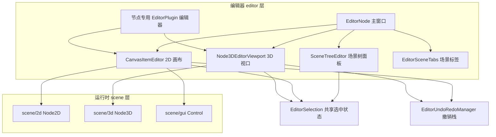
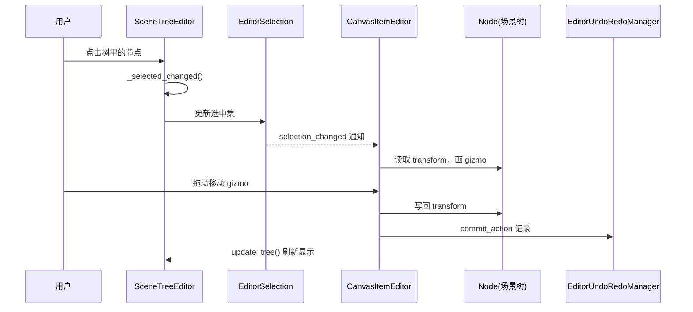

# scene（editor）

> 一句话：这是 Godot 编辑器的「场景工作台」——把一棵 `Node` 树变成你能看见、点选、拖动、改属性的可视化界面。

**结论**：`editor/scene` 是编辑器专用的场景编辑 UI 层，为「用 Godot 编辑器搭关卡/搭 UI」的开发者服务，代价是完全不参与运行时——它是一层厚厚的、只活在 `editor` 进程里的 GUI 代码。

## 是什么 / 不是什么

**是什么**：编辑器里你每天打交道的那几块面板的代码——场景树面板（`SceneTreeEditor`）、2D 画布（`CanvasItemEditor`）、3D 视口（`Node3DEditorViewport`）、场景标签页（`EditorSceneTabs`），以及挂在这些面板下面的几十个「节点专用编辑器」（画 2D 多边形、编 SpriteFrames 帧动画、调材质参数等）。

**不是什么**：它不实现节点本身的行为逻辑——`Node2D`/`Node3D`/`Control` 的运行时语义在 `scene/2d`、`scene/3d`、`scene/gui` 里，本模块只是它们的「遥控器」。它也不负责编辑器主窗口骨架（那是 `editor/editor_node.cpp` 的 `EditorNode`）。

一句话分界：`scene/*` 让节点「会动」，`editor/scene` 让你「好改」。

## 在引擎里的位置

- 向上：被 `EditorNode`（`editor/editor_node.cpp`）组装进主窗口各 Dock。
- 向下：依赖 `scene/gui`（`Tree`、`Control`、对话框）、`editor/plugins`（`EditorPlugin` 基类）、`EditorSelection`（跨面板共享选中状态）。
- 平级：与 `editor/inspector`、`editor/file_system` 等 Dock 是邻居，靠 `EditorSelection` 对齐「选中的是同一个节点」。

## 关键概念

1. **场景树面板（`SceneTreeEditor`）**：把整棵 `Node` 树画成一个可展开的 `Tree` 控件，是场景的「目录」。锚点 `editor/scene/scene_tree_editor.h:44`。它内部用 `NodeCache` 缓存 `Node* → TreeItem*` 映射，节点增删改时增量刷新而不是整树重建（`scene_tree_editor.h:84`）。

2. **2D 画布（`CanvasItemEditor`）**：一个 `VBoxContainer` 单例，负责 2D 场景的移动/缩放/旋转/锚点编辑，带网格、标尺、辅助线、吸附。锚点 `editor/scene/canvas_item_editor_plugin.h:75`，单例 `get_singleton()` 在 `:591`。

3. **3D 视口（`Node3DEditorViewport`）**：内嵌一个 `SubViewport` 渲染 3D 场景，负责视角切换（顶/前/正交/透视）、gizmo、帧时间等显示。锚点 `editor/scene/3d/node_3d_editor_plugin.h:113`，右上角那个旋转小方块是 `ViewportRotationControl`（`:71`）。

4. **场景标签页（`EditorSceneTabs`）**：顶部那排「场景页签」，管理多场景打开/关闭/切换/设为当前，也是单例。锚点 `editor/scene/editor_scene_tabs.h:44`。

5. **节点专用编辑器**：继承 `EditorPlugin` 的一堆小插件，各认领一种节点类型（`handles(Object*)` 返回 true 才接管），塞进 2D 画布或 Inspector。比如 `Polygon2DEditor`（`2d/polygon_2d_editor_plugin.h:51`）、`SpriteFramesEditor`（`sprite_frames_editor_plugin.h:72`）。

## 核心文件（按阅读顺序）

1. `editor/scene/SCsub` — 编译入口：把本目录 `*.cpp` 收进 `editor_sources`，再递归进 `2d/3d/gui/texture` 四个 `SConscript`。
2. `editor/scene/scene_tree_editor.h` — `SceneTreeEditor` 场景树面板 + `SceneTreeDialog` 选节点弹窗，最核心的「主干」文件。
3. `editor/scene/canvas_item_editor_plugin.h` — `CanvasItemEditor` / `CanvasItemEditorViewport` / `CanvasItemEditorPlugin`，2D 编辑器全套。
4. `editor/scene/3d/node_3d_editor_plugin.h` — `Node3DEditor` / `Node3DEditorViewport` / `ViewportRotationControl`，3D 编辑器全套（约 1100 行，模块内最大头文件）。
5. `editor/scene/editor_scene_tabs.h` — `EditorSceneTabs` 场景标签页。
6. `editor/scene/connections_dialog.h` — `ConnectDialog` 连接信号弹窗 + `ConnectionsDock` 信号列表 Dock。
7. `editor/scene/2d/`、`3d/`、`gui/`、`texture/` — 各节点专用编辑器：多边形、骨架、相机预览、Control 锚点、纹理区域等。

## 数据流 / 调用链

一次「在场景树里点选节点 → 2D 画布高亮 → 拖动改位置」的典型链路：

关键点：`SceneTreeEditor`、`CanvasItemEditor`、`Node3DEditorViewport` 都持有一个 `EditorSelection *editor_selection`（见 `scene_tree_editor.h:47`、`canvas_item_editor_plugin.h:631`），谁先被点选，其余面板跟着对齐到同一个节点——这就是「一处选中、处处联动」的实现。

## 中文口诀

- 场景树是目录，画布是桌面，标签页是书签。
- 选中的状态只有一个 `EditorSelection`，三块面板共用它。
- 节点会动靠 `scene/*`，好改靠 `editor/scene`。
- 树用 `NodeCache` 增量刷，别整树重建。
- 每种节点一个 `EditorPlugin`，`handles` 对上才接管。
- 动了节点别忘 `commit_action`，撤销才回得来。

## 练习（15 分钟）

1. 打开 `editor/scene/SCsub`，数一数它递归进了哪几个子目录，理解顶层 `*.cpp` 和子目录文件怎么一起进 `editor_sources`。
2. 在 `scene_tree_editor.h` 里找到 `SceneTreeEditorButton` 枚举（约 `:49`），说出每个按钮对应场景树里那一列的图标（可见性、锁、脚本…）。
3. 在 `canvas_item_editor_plugin.h` 里找到 `enum Tool`（约 `:79`）和 `enum SnapMode`（约 `:571`），对比「工具」和「吸附」两套枚举各自解决什么问题。
4. 打开 `3d/node_3d_editor_plugin.h` 的 `Node3DEditorViewport`，找到 `VIEW_TOP`、`VIEW_PERSPECTIVE` 这些视角枚举，对应编辑器右上角视角菜单。

## 自测

- [ ] `SceneTreeEditor` 为什么不直接操作场景树、而要维护一份 `NodeCache`（`HashMap<Node*, CachedNode>`）？
- [ ] `CanvasItemEditor` 和 `Node3DEditorViewport` 是怎么知道「现在选中的是哪个节点」的？线索在各自成员 `editor_selection` 上。
- [ ] 一个 2D 节点编辑器（如 `Polygon2DEditor`）是通过哪个基类、哪个虚函数「认领」自己要编辑的节点类型的？

## 一句话总结

> `editor/scene` 是场景的「编辑台」：把 `scene/*` 里会动的节点，变成编辑器里能看、能选、能拖、能改的 UI，靠 `EditorSelection` 把树、画布、视口串成一条心。
