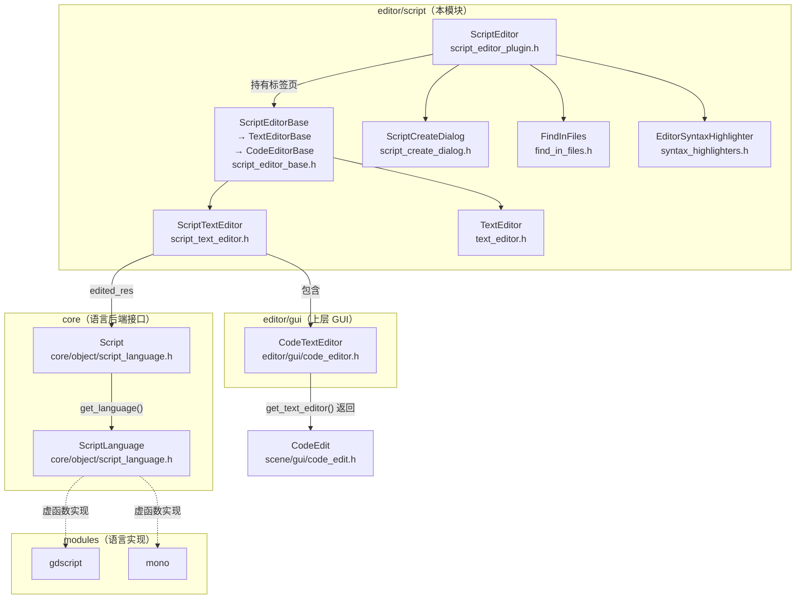
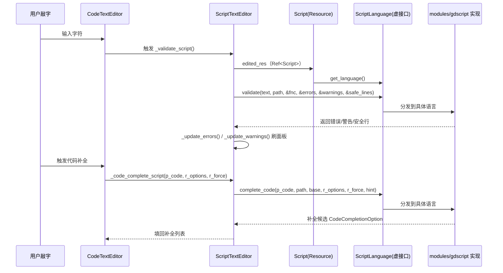

# script（editor）

> 一句话：脚本编辑器像一间「装修好的出租房」——房型（代码高亮、自动补全、断点）由引擎统一提供，家具家电（语法规则、报错、补全内容）由各家语言后端自带。

**结论**：`editor/script/` 是 Godot 编辑器里写脚本的主界面（Script 主屏），负责把「打开/编辑/保存/断点/查找」这套通用编辑器骨架，套接到 `core` 层的 `ScriptLanguage` 语言后端上；代价是它自己不实现任何一门语言，所有语言相关的能力都要通过虚函数回吐给模块层（gdscript、mono 等）实现。

## 是什么 / 不是什么

它**是**：脚本与文本文件的多标签编辑器主屏（`ScriptEditor`）、每个标签页的抽象基类与具体实现（`ScriptEditorBase` / `ScriptTextEditor` / `TextEditor`）、新建脚本对话框（`ScriptCreateDialog`）、跨文件查找替换（`FindInFiles`）、语法高亮适配器（`EditorSyntaxHighlighter`）、以及让用户写编辑器脚本的入口（`EditorScript` / `EditorScriptPlugin`）。

它**不是**：任何一门脚本语言的编译器或解析器——那在 `core/object/script_language.h` 的 `ScriptLanguage` 虚接口和 `modules/gdscript/`、`modules/mono/` 里；它也不负责底层的文本编辑控件本身——真正的输入、光标、折叠由 `scene/gui/code_edit.h` 的 `CodeEdit` 承担，本模块只负责把它包成「代码编辑器」。

## 在引擎里的位置

依赖方向：本模块向上依赖 `editor/gui`（`CodeTextEditor`）与 `core`（`Script`/`ScriptLanguage`），向下被 `EditorNode`（主窗口）当作一个主屏插件挂载；真正的语言能力由 `modules/` 通过实现 `ScriptLanguage` 的纯虚函数注入。

## 关键概念

- **主屏与插件**：`ScriptEditor` 是编辑器主工作区里「脚本」标签页的整体（`script_editor_plugin.h:83`）；`ScriptEditorPlugin` 是把它注册成主屏的 `EditorPlugin` 外壳（`script_editor_plugin.h:466`），`has_main_screen()` 返回 `true`。
- **三层编辑器基类**：`ScriptEditorBase`（抽象：`apply_code`/`validate_script`/`is_unsaved`，`script_editor_base.h:40`）→ `TextEditorBase`（补上 `CodeTextEditor` 与编辑菜单，`:76`）→ `CodeEditorBase`（补上代码补全与断点接口，`:235`）。三层像「毛坯房 → 通水电 → 精装修」逐层加料。
- **按扩展名选编辑器**：`ScriptEditor` 里存着一组 `CreateScriptEditorFunc`（`script_editor_plugin.h:213`）工厂函数，`ScriptTextEditor::register_editor()`（`script_text_editor.h:238`）和 `TextEditor::register_editor()`（`text_editor.h:50`）各自注册自己的工厂；打开资源时按类型分派到脚本编辑器还是纯文本编辑器。
- **语言后端交互**：每个编辑器标签持有一个 `Script` 资源（`edited_res`），通过 `script->get_language()`（`core/object/script_language.h:179`）拿到 `ScriptLanguage*`，再调它的纯虚函数 `validate`/`complete_code`/`lookup_code`/`auto_indent_code`/`make_function` 完成校验、补全、跳转、缩进。
- **语法高亮适配器**：`EditorSyntaxHighlighter`（`syntax_highlighters.h:35`）是把引擎内置 `SyntaxHighlighter` 包一层、能感知 `ScriptLanguage` 的编辑器专用高亮器；内置标准、纯文本、JSON、Markdown、ConfigFile 五种实现（`syntax_highlighters.h:58-143`）。

## 核心文件（按阅读顺序）

1. `script_editor_base.h` — 三层抽象基类 `ScriptEditorBase`/`TextEditorBase`/`CodeEditorBase`，定义标签页公共契约（`apply_code`、`validate_script`、`is_unsaved`）。
2. `script_editor_plugin.h` — `ScriptEditor` 主屏 + `ScriptEditorPlugin` 插件外壳，多标签管理、断点、历史、语法高亮注册都在这里。
3. `script_text_editor.h` — 脚本标签页具体实现，报错/警告面板、断点、函数列表、行内取色器、符号跳转。
4. `text_editor.h` — 纯文本标签页实现，最薄的编辑器，用于 `.txt`/`.md` 等非脚本文件。
5. `script_create_dialog.h` — 新建/加载脚本对话框，语言下拉、模板、内置脚本、继承基类。
6. `find_in_files.h` — 跨文件查找替换的完整栈：`FindInFilesSearch`（扫描）/`FindInFilesDialog`（参数）/`FindInFilesPanel`（结果）/`FindInFilesContainer`（多结果页）/`FindInFiles`（门面）。
7. `syntax_highlighters.h` — `EditorSyntaxHighlighter` 及其五种内置实现。
8. `editor_script.h` — `EditorScript`：用户在编辑器里写自动化脚本的基类（`RefCounted` + `GDVIRTUAL0_REQUIRED(_run)`）。
9. `editor_script_plugin.h` — `EditorScriptPlugin`：把 `EditorScript` 注册进命令面板/工具菜单。
10. `SCsub` — 一句 `add_source_files(env.editor_sources, "*.cpp")` 编译目录下全部 `.cpp`。

## 数据流 / 调用链

一次「敲代码 → 实时校验 → 智能补全」的典型调用：

主线的关键锚点：`ScriptTextEditor::_validate_script()` 在 `script_text_editor.cpp:841` 调用 `script->get_language()->validate(...)`（`:853`）；`_code_complete_script()` 在 `:1144` 调用 `complete_code(...)`（`:1155`）；符号跳转走 `lookup_code(...)`（`:1199` / `:1318`）。`ScriptLanguage` 的纯虚签名定义在 `core/object/script_language.h:279`（`validate`）、`:363`（`complete_code`）、`:408`（`lookup_code`）。

## 中文口诀

> 脚本主屏 `ScriptEditor`，标签页靠基类分层。
> 三层基类层层套，`Text` 到 `Code` 再到 `ScriptText`。
> 编辑资源拿 `get_language`，校验补全跳转全靠它。
> 语言实现不在这，`modules` 里把虚函数填。
> 高亮适配器包一层，标准纯文 JSON 到 MD。
> 查找替换独立栈，`Search` 干活 `Dialog` 问参数。

## 练习（15 分钟）

1. 打开 `script_editor_base.h`，画出 `ScriptEditorBase → TextEditorBase → CodeEditorBase` 的继承链，并列出每一层新增的关键虚函数。
2. 在 `script_text_editor.cpp` 里找到 `_validate_script()`，读它如何拿到 `script->get_language()` 并调用 `validate`，用一句话复述错误/警告如何回到 `errors_panel` / `warnings_panel`。
3. 打开 `syntax_highlighters.h`，对比 `EditorJSONSyntaxHighlighter` 与 `EditorConfigFileSyntaxHighlighter` 的 `_get_supported_languages()` 返回值差异。

## 自测

- [ ] `ScriptTextEditor` 和 `TextEditor` 各自如何把自己注册进 `ScriptEditor` 的编辑器工厂数组（提示：`register_editor` 与 `register_create_script_editor_function`）？
- [ ] `ScriptEditor` 通过哪个方法把一次「跨文件查找」的入口暴露出来（提示：`open_find_in_files_dialog`），它和 `FindInFiles::open_dialog` 是什么关系？
- [ ] 为什么说「本模块不实现任何语言」，支撑这个结论的是 `core/object/script_language.h` 里的哪些纯虚函数？

## 一句话总结

> `editor/script/` 是「通用编辑器骨架」与「语言后端」之间的插线板：骨架和主屏 UI 在这里，语法与语义的活全通过 `ScriptLanguage` 虚接口甩给 `modules/` 的语言实现。
