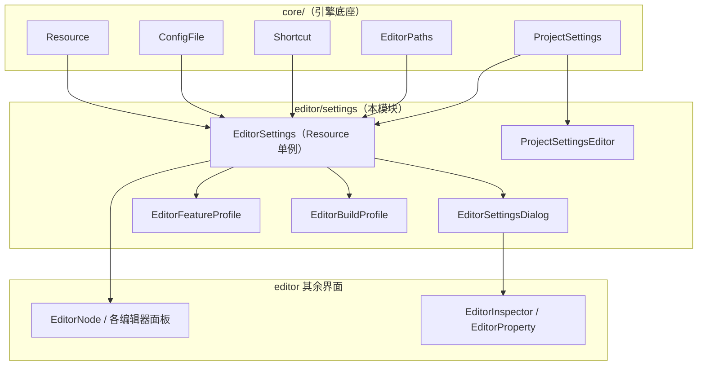
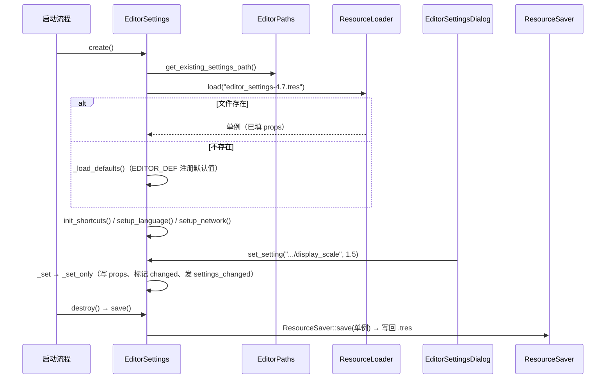

# settings（editor）

> 一句话：编辑器设置就像是「编辑器的个人档案」——把你对编辑器外观、快捷键、插件开关的改动记在一个 `.tres` 文件里，下次启动原样读回。

**结论**：`editor/settings` 是编辑器的「配置中枢」，核心类 `EditorSettings` 负责把全引擎的编辑器偏好（主题、语言、快捷键、gizmo 颜色等）统一存进用户配置目录下的 `editor_settings-4.7.tres`，并广播变更；代价是它把几百项设置揉进一个 `Resource` 单例，读多写少、以字符串键索引，改动需要走它才能持久化。

## 是什么 / 不是什么

- 它是**编辑器级**的、按用户持久化的偏好存储（`EditorSettings`，一个 `Resource` 单例），落盘在用户配置目录，跟具体项目无关。
- 它不是**项目级**设置：项目级设置归 `ProjectSettings`（`core/config/project_settings.h`），存 `project.godot`。这个目录里的 `ProjectSettingsEditor` 只是**编辑** `ProjectSettings` 的对话框界面，不是存储本体。
- 它不是任意数据的缓存：`EditorSettings` 只认「注册过的键」（`EDITOR_DEF` / `EDITOR_SETTING_USAGE` 声明的），通过字符串路径（如 `interface/editor/localization/editor_language`）读写，不提供任意键值的自由存取值（比对句 3 处止）。

## 在引擎里的位置

- 上游：`EditorSettings` 继承 `Resource`，靠 `EditorPaths` 定位配置文件，靠 `ConfigFile` 读 self-contained 附加配置，靠 `Shortcut` 承载快捷键（`editor/settings/editor_settings.h:40`、`editor_settings.cpp:1351`）。
- 下游：`EditorNode` 和各编辑器面板通过 `EDITOR_GET` 宏读值、通过 `settings_changed` 信号与 `NOTIFICATION_EDITOR_SETTINGS_CHANGED` 通知响应变更（`editor_settings.cpp:2348`）。

## 关键概念

- **设置项 = 键值对加元数据**：每个设置是一个 `String` 键 → `VariantContainer`（含 `variant`、`initial`、`save`、`restart_if_changed` 等标记）。像图书馆卡片，除了书名（值）还标注「借出状态」（是否已改动、是否需重启）。锚点：`editor/settings/editor_settings.h:72-88`。
- **默认值注册 = `EDITOR_DEF` 宏**：写 `EDITOR_DEF("interface/editor/appearance/display_scale", 0)` 等于说「如果用户没改过，就用 0」。它展开到 `_EDITOR_DEF`，最终走 `_initial_set` 落进 `props`。锚点：`editor_settings.h:226-229`、`editor_settings.cpp:264`。
- **读写双通道**：读用 `EDITOR_GET` → `get_setting`；写用 `set_setting` → `_set` → `_set_only`。写成功会塞进 `changed_settings` 并发射 `settings_changed` 信号，做到「改一次、全引擎都知道」。锚点：`editor_settings.cpp:73`、`editor_settings.cpp:93`、`editor_settings.cpp:1569`。
- **变更广播 = 通知树**：`notify_changes()` 拿到 `SceneTree` 根节点，向整棵节点树传播 `NOTIFICATION_EDITOR_SETTINGS_CHANGED`（值 10000），语言变化时还会额外 `setup_language`。锚点：`editor_settings.h:140-142`、`editor_settings.cpp:2348-2367`。
- **项目级覆盖**：`get_setting` 会先查 `ProjectSettings` 有没有 `editor_setting_override`（项目可覆盖编辑器设置），没有再回退到自身 `props`。锚点：`editor_settings.cpp:1574-1580`。

## 核心文件（按阅读顺序）

1. `editor/settings/editor_settings.h` — 核心类 `EditorSettings` 声明：`VariantContainer` 结构、读写 API、`EDITOR_DEF`/`EDITOR_GET`/`ED_SHORTCUT` 宏。
2. `editor/settings/editor_settings.cpp` — 主线实现：`create()`（加载或建默认）、`_load_defaults()`（注册几百个默认项）、`save()`（`ResourceSaver::save` 落盘）、`notify_changes()`。文件约 2400 行，是目录里最大的一块。
3. `editor/settings/editor_settings_dialog.h` — 「编辑器设置」窗口 `EditorSettingsDialog`（继承 `AcceptDialog`），配 `SectionedInspector` 展示设置，`EditorSettingsPropertyWrapper`/`EditorSettingsInspectorPlugin` 把 `EditorSettings` 属性桥接进 inspector。
4. `editor/settings/project_settings_editor.h` — 「项目设置」窗口 `ProjectSettingsEditor`，编辑 `ProjectSettings`，聚合 `ActionMapEditor`、`EditorAutoloadSettings` 等多个子页签。
5. `editor/settings/action_map_editor.h` — 输入映射编辑器 `ActionMapEditor`（继承 `Control`），维护 `InputMap` 动作表。
6. `editor/settings/editor_feature_profile.h` / `editor_build_profile.h` — 功能裁剪档 `EditorFeatureProfile`、构建档 `EditorBuildProfile`（均 `RefCounted` + 对应 `*Manager` 对话框）。
7. `editor/settings/editor_command_palette.h` / `editor_folding.h` / `editor_layouts_dialog.h` — 命令面板、代码折叠、布局对话框等零散编辑器工具。
8. `editor/settings/SCsub` — 编译清单：`*.cpp` 全收，另递归 `gdextension/` 子目录。

## 数据流 / 调用链

一条「启动加载 → 改一项 → 保存退出」的完整链路：

关键锚点：`create()` 见 `editor_settings.cpp:1373`，加载/回退分支见 `editor_settings.cpp:1398-1451`；`save()` 见 `editor_settings.cpp:1515`；`destroy()` 见 `editor_settings.cpp:1555`。

## 中文口诀

> 一条单例管全局，字符串当钥匙来取值；
> EDITOR_DEF 立默认，EDITOR_GET 去读取；
> 改了就发 settings_changed，改了语言再刷新语种；
> 存是 tres 一个文件，ResourceSaver 来落笔；
> 项目设置别来混，那是 ProjectSettings 自己的事。

## 练习（15 分钟）

1. 打开 `editor_settings.cpp`，在 `_load_defaults()`（约 403 行起）里数一数 `EDITOR_SETTING_USAGE` 出现的次数，感受默认项的量级。
2. 用 grep 找 `settings_changed` 信号是在哪个函数里发射的（提示：`_set`），再找谁 `connect` 了这个信号。
3. 在 `editor_settings.cpp` 里定位 `get_newest_settings_path()`，算出当前版本配置文件的确切文件名格式。

## 自测

- [ ] `EditorSettings::save()` 用的是哪个 API 把单例写到磁盘？（提示：`editor_settings.cpp:1522`）
- [ ] `get_setting` 返回项目覆盖值之前，先调用了哪个对象的什么方法？（提示：`editor_settings.cpp:1576`）
- [ ] 编辑器设置文件落在哪个目录、以什么后缀命名？（提示：`editor_settings.cpp:1350-1371`）

## 一句话总结

> `editor/settings` 用 `EditorSettings` 这个 `Resource` 单例，把「编辑器偏好」统一注册、按字符串键读写、变更即广播，最后借 `ResourceSaver` 写进用户配置目录的 `.tres` 文件，是编辑器跨会话保持记忆的那条主线。
