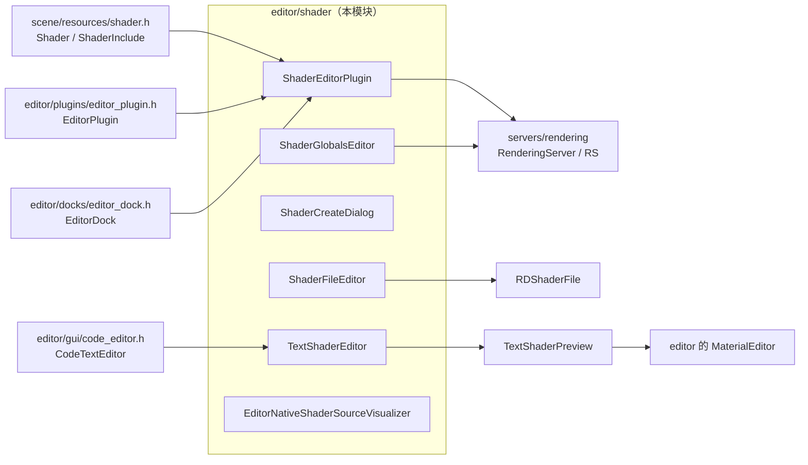
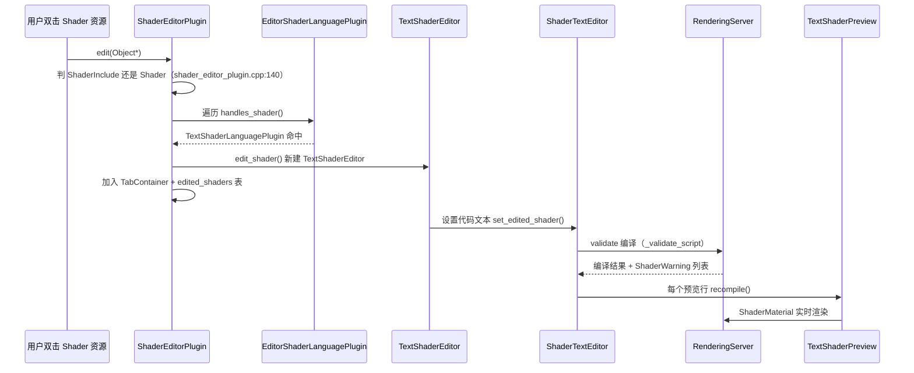

# shader（editor）

> 一句话：这是编辑器里的「着色器写字台」——给 `.gdshader` 文本和全局参数一个能写、能看、能即时预览的窗口，对应 `editor/shader/`。

**结论**：`editor/shader/` 是 Godot 编辑器的着色器编辑器子系统，为 `Shader` / `ShaderInclude` 资源提供多标签编辑、语法高亮、编译警告和行内实时预览，同时管全局着色器参数和原生着色器字节码查看；代价是它只服务编辑器态，不碰运行时渲染，真正的编译与画图交给 `servers/rendering`。

## 是什么 / 不是什么

它负责「编辑着色器文本」这一件事：打开资源、代码编辑、编译报错、逐行预览、新建对话框、全局参数面板。它不负责着色器的实际编译与 GPU 执行——那归 `servers/rendering`（`RS` / `RenderingServer`）和 `scene/resources/shader.h` 里的 `Shader` 资源；它也不负责材质编辑，材质界面在 `editor/plugins` 的 Material 编辑器里，本模块只借它的 `MaterialEditor` 做预览。

换句话说：编辑器在这里「打字 + 预览」，渲染后端负责「算」，两者靠 `Ref<Shader>` 这一根线连起来。

## 在引擎里的位置

依赖方向：本模块挂在 `editor/plugins`、`editor/gui`、`editor/docks` 之上，向下只调 `servers/rendering` 的 `RS` 单例和 `Shader` 资源接口。被谁依赖：编辑器主窗口在启动时注册这些 `EditorPlugin`（`ShaderEditorPlugin` 注册名 `"Shader"`），Inspector 双击一个 Shader 资源时把对象塞进 `edit()`。

## 关键概念

- **编辑器插件**：`ShaderEditorPlugin` 是入口，`get_plugin_name()` 返回 `"Shader"`，继承 `EditorPlugin`（`editor/shader/shader_editor_plugin.h:48`）。它开一个底部 `EditorDock`，左侧 `ItemList` 列文件、右侧 `TabContainer` 排标签。
- **语言插件可插拔**：`EditorShaderLanguagePlugin` 是个抽象基类（`editor/shader/editor_shader_language_plugin.h:35`），用静态表 `register_shader_language()` 登记。`TextShaderLanguagePlugin` 是唯一的文本实现（`editor/shader/text_shader_language_plugin.h:35`）。换一种着色器语言，只消再登记一个实现。
- **编辑器与代码分离**：`ShaderEditor` 是抽象基类（`editor/shader/shader_editor.h:39`），`TextShaderEditor` 是它的文本实现（`editor/shader/text_shader_editor.h:207`），内部再包一层 `ShaderTextEditor : CodeTextEditor`（`editor/shader/text_shader_editor.h:141`）复用代码编辑器的通用能力。
- **行内预览**：`TextShaderPreview` 嵌在代码行旁边，给一个 `ShaderMaterial` 做即时渲染（`editor/shader/text_shader_editor.h:61`），靠 `TextShaderPreviewLineLayer` 对齐到滚动位置（`editor/shader/text_shader_editor.h:121`）。
- **全局参数**：`ShaderGlobalsEditor` 面板（`editor/shader/shader_globals_editor.h:40`）通过内部 `ShaderGlobalsEditorInterface`（`editor/shader/shader_globals_editor.cpp:77`）读写 `RS::global_shader_parameter_set/get`，改的是所有 Shader 共享的全局 uniform。

## 核心文件（按阅读顺序）

1. `editor/shader/SCsub` — 编译本目录 `*.cpp`，并转入 `shader_baker/`。
2. `editor/shader/shader_editor.h` — `ShaderEditor` 抽象基类，定义 8 个纯虚接口（`edit_shader` / `apply_shaders` / `is_unsaved` 等）。
3. `editor/shader/editor_shader_language_plugin.h` — 着色器语言插件基类与静态注册表。
4. `editor/shader/text_shader_language_plugin.h` — 文本语言的注册实现。
5. `editor/shader/shader_editor_plugin.h` — 主编插件，管理 dock、文件列表、标签页、菜单。
6. `editor/shader/text_shader_editor.h` — 文本编辑器主体，含语法高亮、警告、预览三大件。
7. `editor/shader/shader_create_dialog.h` — 新建/加载着色器的 `ConfirmationDialog`。
8. `editor/shader/shader_globals_editor.h` — 全局着色器参数编辑面板。
9. `editor/shader/shader_file_editor_plugin.h` — 编辑编译后的 `RDShaderFile` 字节码文件。
10. `editor/shader/editor_native_shader_source_visualizer.h` — 查看着色器经各后端编译后的原生源码。
11. `editor/shader/shader_baker/` — 导出时的着色器预烘焙插件，按 Vulkan / D3D12 / Metal 分平台。

## 数据流 / 调用链

典型链路：`ShaderEditorPlugin::edit()`（`editor/shader/shader_editor_plugin.cpp:140`）拿到资源后，先查已开的标签去重，再遍历语言插件找到 `TextShaderLanguagePlugin`，它新建 `TextShaderEditor` 塞进标签页；用户在 `ShaderTextEditor` 里一打字就触发 `apply_shaders()` 重新编译，编译结果同步到警告面板和每行的 `TextShaderPreview`。

## 中文口诀

编辑着色器，先找 Plugin；
语言可插拔，插件做登记。
文本编辑器，外包 CodeText；
预览贴行边，编译通 RS。
新建走 Dialog，全局走 Globals；
字节码看 RD，原生码看 Visualizer。

## 练习（15 分钟）

1. 打开 `editor/shader/shader_editor_plugin.cpp`，找到 `edit()`（第 140 行），标出它判断 `ShaderInclude` 与 `Shader` 的分支各在哪几行。
2. 在 `text_shader_editor.h` 里找出 `ShaderTextEditor` 和 `TextShaderEditor` 的继承链，各追一层父类。
3. 读 `shader_globals_editor.cpp:80` 的 `_set_var`，说清一次修改全局参数会调用 `RS` 的哪两个方法。

## 自测

- [ ] `ShaderEditorPlugin::handles()` 只认哪两个资源类型？（提示：`shader_editor_plugin.cpp:209`）
- [ ] 行内预览类 `TextShaderPreview` 内部持有的是 `Ref<Shader>` 还是 `Ref<ShaderMaterial>`？（提示：`text_shader_editor.h:74`）
- [ ] `shader_baker/` 目录下三个平台插件的共同基类叫什么？

## 一句话总结

> `editor/shader/` 是编辑器的着色器写字台：把「打开、编辑、编译、预览、全局参数、原生码查看」串成一条主线，输出给 `servers/rendering` 去真正干活。
