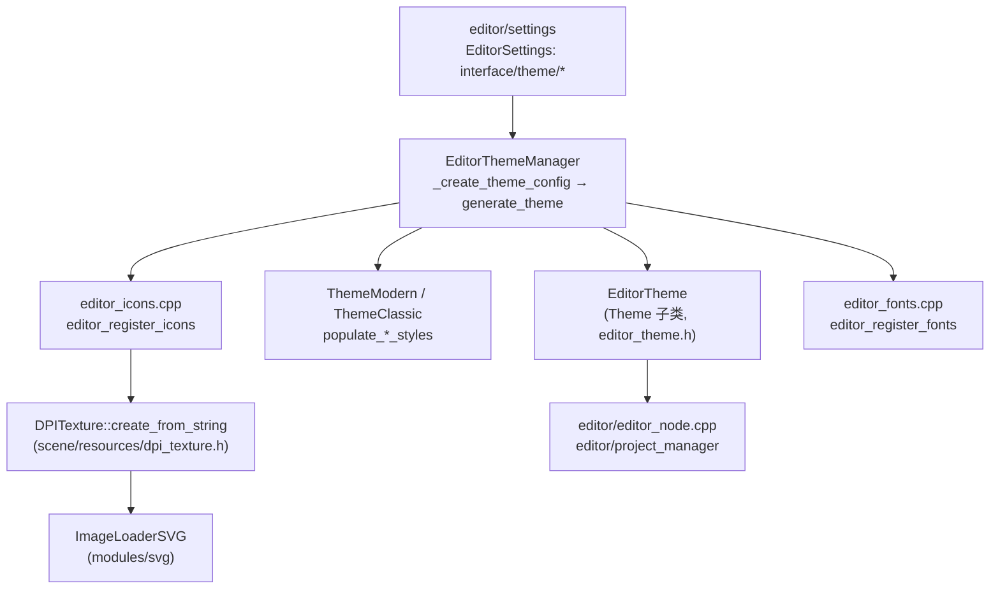
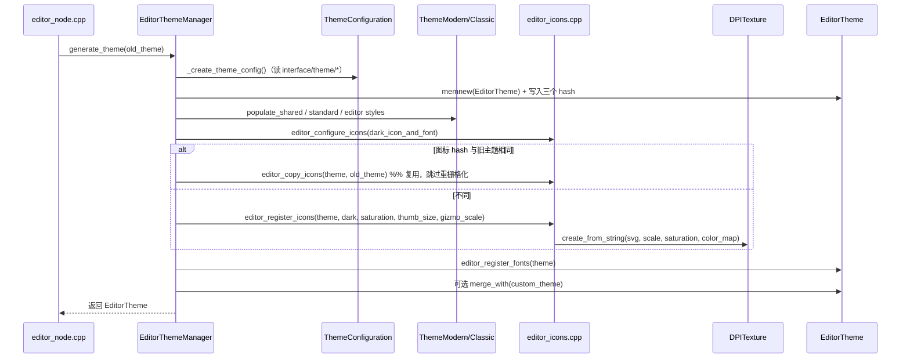

# themes（editor）

> 一句话：编辑器界面的「调色盘 + 衣柜」——把用户在设置里选的颜色、间距、图标样式，变成一整套能直接贴到控件上的 `Theme`。

**结论**：`editor/themes` 负责在编辑器启动/设置变更时，把 `interface/theme/*` 这些设置翻译成一个完整的 `EditorTheme`（颜色、常量、字体、图标、StyleBox），并把 1024 个 SVG 图标按当前缩放与饱和度在运行时栅格化成 `DPITexture` 注册进去；代价是启动时一段可观测的 CPU 时间（源码里用 benchmark 分段计时），以及每次改主题都要重算 hash 来决定「复用还是重生成」。

## 是什么 / 不是什么

它做三件事：**读设置、生成主题、注册图标与字体**。入口是 `EditorThemeManager::generate_theme()`（`editor/themes/editor_theme_manager.cpp:686`），产出一个 `EditorTheme`（`Theme` 的子类）。

它**不是**：
- 不是游戏运行时的主题系统——那是 `scene/resources/theme.*` 与 `scene/theme/default_theme.cpp`，`EditorTheme` 只是复用 `Theme` 的存储结构。
- 不是 SVG 解析器——图标栅格化时真正干活的是 `modules/svg` 的 `ImageLoaderSVG`，这里只负责喂参数。
- 不是图标素材本身——1024 个 `.svg` 躺在 `editor/icons/`，这里只消费构建期生成的 `editor_icons.gen.h`。

## 在引擎里的位置



上流是 `EditorSettings`（`editor/settings` 模块）和 `scene`/`modules` 的基础设施；下流只有两个消费方：编辑器本体 `editor/editor_node.cpp:8638` 和项目管理器 `editor/project_manager/project_manager.cpp:1408`，二者都调用 `generate_theme()` 再赋给各自窗口。

## 关键概念

- **`EditorTheme`（主题成品）**：`Theme` 的子类，把 `get_color/get_constant/get_font/get_icon/get_stylebox` 全部 override，查不到时用 `WARN_PRINT` 提示缺失项而不是静默返回。锚点：`editor/themes/editor_theme.h:35`。
- **`ThemeConfiguration`（配方）**：把几十项设置读进一个结构体，并算出三份 murmur3 hash（整体 / 字体 / 图标），用来判断新主题能不能复用旧资源。锚点：`editor/themes/editor_theme_manager.h:53` 与 `:56` 的 `hash()`。
- **图标栅格化**：图标不是图片，是 SVG 字符串。`editor_generate_icon()` 调 `DPITexture::create_from_string()`，按 `EDSCALE`、饱和度、配色字典把 SVG 渲染成可绘制纹理，按需在多个缩放级别缓存。锚点：`editor/themes/editor_icons.cpp:50`、`scene/resources/dpi_texture.h:73`。
- **`EditorColorMap`（深浅转换）**：默认图标按深色主题设计，浅色主题时用一张 `HashMap<Color, Color>` 把图标里的颜色映射成浅色可读版本。锚点：`editor/themes/editor_color_map.h:40`。
- **`EditorScale` / `EDSCALE`（全局缩放）**：一个静态浮点 + 宏 `EDSCALE`，主题里所有 margin、圆角、图标尺寸都要乘它。锚点：`editor/themes/editor_scale.h:41`。

## 核心文件（按阅读顺序）

1. `editor/themes/SCsub` — 编译入口：把 `thirdparty/fonts/*` 打包进 `builtin_fonts.gen.h`，并把 `*.cpp` 加入 `editor_sources`。
2. `editor/themes/editor_theme_manager.h` — 主入口 `EditorThemeManager` 与 `ThemeConfiguration` 的声明。
3. `editor/themes/editor_theme.cpp` — `EditorTheme` 各 `get_*` 的 override 与 `editor_theme_types` 初始化（`Editor`/`EditorFonts`/`EditorIcons`/`EditorStyles` 四个类型，见 `editor/editor_string_names.h:47`）。
4. `editor/themes/theme_modern.h` / `theme_classic.h` — 两种风格各自的 `populate_shared_styles / standard / editor` 三组填充函数。
5. `editor/themes/editor_icons.cpp` — 图标注册主逻辑：颜色转换、饱和度例外、缩略图分档、`editor_copy_icons` 复用。
6. `editor/themes/editor_color_map.cpp` — 深浅配色映射与例外集合的填充。
7. `editor/themes/editor_fonts.cpp` — 把内置字体注册进主题。
8. `editor/themes/editor_theme_builders.py` — 构建期脚本，生成 `builtin_fonts.gen.h`。

## 数据流 / 调用链



关键分支在「复用」：`_create_base_theme()` 会比较新旧主题的 `generated_icons_hash`，一致就直接 `editor_copy_icons()` 把旧图标搬过来（`editor_theme_manager.cpp:196`），避免每次改字体设置都重栅格化上千个 SVG。

## 中文口诀

```
设置是配方，配置读进来；
哈希三兄弟，判断改没改。
样式分两家，Modern 与 Classic；
图标是 SVG，DPITexture 画。
深浅靠映射，缩放 EDSCALE；
旧货能复用，复制不重画。
```

## 练习（15 分钟）

1. 在 `editor_theme_manager.cpp` 找到 `_create_theme_config()`，数一下它从 `interface/theme/*` 读了多少项设置，并说出其中三项的用途。
2. 打开 `editor_icons.cpp:76` 的 `editor_register_icons()`，画出「颜色转换 / 饱和度例外 / accent 色 / 缩略图分档」四类处理各自作用于哪些图标。
3. 在 `editor_theme.cpp` 里找一个 `WARN_PRINT` 分支，解释它为什么只在 `editor_theme_types.has(p_theme_type)` 时才打印。
4. 修改 `interface/theme/icon_saturation` 后重启，用 verbose 日志观察是否打印 `EditorTheme: Generating new icons.`，并说明原因。

## 自测

- [ ] `EditorThemeManager::generate_theme()` 里，旧主题的图标在什么条件下会被 `editor_copy_icons()` 直接复用，而不是重新栅格化？
- [ ] 为什么 `DPITexture::create_from_string()` 需要传入 `scale`、`saturation`、`color_map` 三个参数，它们各自解决什么问题？
- [ ] `is_generated_theme_outdated()` 里刻意忽略了哪一项设置？为什么不把它算进「需要重建主题」的判断？（提示：看 `editor_theme_manager.cpp:711` 的注释）

## 一句话总结

> `editor/themes` 是编辑器外观的「配方 → 成品」转换器：读设置算 hash，按需栅格化 SVG 图标并注册字体与样式，产出一个可被编辑器窗口直接使用的 `EditorTheme`。
