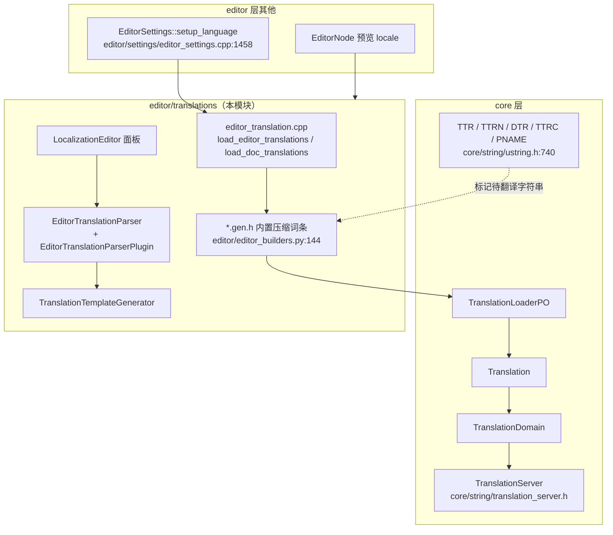
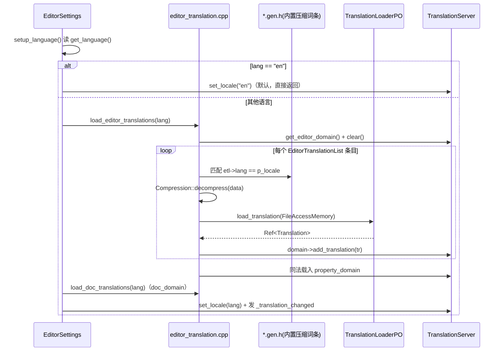
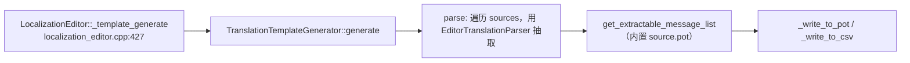

# translations（editor）

> 一句话：编辑器界面、类参考、属性名、可提取字符串四套词库，在构建期被压成「内置压缩包」，运行时按语言解压喂给翻译系统——就像把几本字典塞进二进制里，切语言时现场换字典。

**结论**：`editor/translations` 是「编辑器本地化」的仓库与装卸机——它把编辑器 UI（`editor/*.po`）、类参考（`doc`）、可提取字符串（`extractable/*.pot`）和属性名（`properties/*.po`）在构建期压缩进 `.gen.h`，运行时按 locale 解压加载到 `TranslationServer` 的三个专用域里；代价是这些词条全部打进编辑器二进制，且只有编辑器（`TOOLS_ENABLED`）能吃到。

## 是什么 / 不是什么

这个目录干四件事：**加载编辑器翻译**、**生成 POT 模板**、**本地化编辑器面板**、**翻译预览按钮**。

- 它负责：把编译期压好的 `.po` 词条按语言载入 `TranslationServer`（`load_editor_translations` / `load_doc_translations`）；给开发者一个「从场景/脚本里抽取字符串 → 生成 .pot」的抽取框架（`EditorTranslationParser` + `TranslationTemplateGenerator`）。
- 它**不**负责：游戏运行时的翻译（那是 `core/string/translation_server.h` 和 `Translation` 资源的事，游戏打包时靠 `internationalization/locale/translations` 里的 CSV/PO）；也不负责 `.po` 文件本身的编辑（那是 Weblate 等外部工具的事）。它管的是「编辑器自身」和「帮游戏生成模板」两条线。

## 在引擎里的位置

- 依赖：`core/string`（`TranslationServer`/`TranslationDomain`/`Translation`）、`core/io`（`Compression`/`FileAccessMemory`/`TranslationLoaderPO`）。
- 被依赖：`editor/settings/editor_settings.cpp` 在 `setup_language()`（`editor_settings.cpp:1473-1474`）里调 `load_editor_translations` 和 `load_doc_translations`。

## 关键概念

- **域（Domain）**：`TranslationServer` 里的三个专用词库，互不污染。编辑器 UI 走 `get_editor_domain()`，属性名走 `get_property_domain()`，类参考走 `get_doc_domain()`（`core/string/translation_server.h:105-107`）。好比三个抽屉，各放各的字典。
- **内置压缩词条（`EditorTranslationList`）**：构建脚本 `editor/editor_builders.py:144` 把每个 `.po` 转成 `{lang, comp_size, uncomp_size, data}` 的 C 结构数组（如 `_editor_translations`），运行时用 `Compression::decompress` 解压后交给 `TranslationLoaderPO::load_translation`（`editor_translation.cpp:53-73`）。等于把字典 DEFLATE 压缩后塞进二进制。
- **抽取插件（`EditorTranslationParserPlugin`）**：一个 GDScript 可继承的 `RefCounted`（`editor_translation_parser.h:37`），实现 `_parse_file` / `_get_recognized_extensions` 就能告诉引擎「哪个后缀的文件里藏着哪些可翻译字符串」。`EditorTranslationParser`（`editor_translation_parser.h:57`）是单例，把标准插件和用户自定义插件（`CUSTOM` 优先）统一管理。
- **翻译宏**：`TTR`/`TTRN`/`DTR` 在 `TOOLS_ENABLED` 下才真正求值，`TTRC`/`PNAME` 只是标记（`core/string/ustring.h:740-761`）。这些标记是「可提取字符串」的来源——构建脚本扫源码里的 `TTR(...)` 生成 `extractable/extractable.pot`。

## 核心文件（按阅读顺序）

1. `editor/translations/SCsub` — 把目录下所有 `*.cpp` 加进 `env.editor_sources`，无单独注册逻辑。
2. `editor/translations/editor_translation.h` — 四个自由函数的声明：`get_editor_locales` / `load_editor_translations` / `load_doc_translations` / `get_extractable_message_list`（`:36-39`）。
3. `editor/translations/editor_translation.cpp` — 这四个函数的实现：遍历 `EditorTranslationList` 解压并 `add_translation` 到对应域（`:53-91`）；还内联了一个 POT 解析器（`:111-247`）。
4. `editor/translations/editor_translation_parser.h/.cpp` — 抽取框架的公共接口：`EditorTranslationParser` 单例 + `EditorTranslationParserPlugin` 虚类。
5. `editor/translations/localization_editor.h/.cpp` — 项目设置里的「本地化」面板（`LocalizationEditor : VBoxContainer`），管三个列表：译文、资源重映射、模板生成源文件。
6. `editor/translations/template_generator.h/.cpp` — `TranslationTemplateGenerator` 单例，把收集到的消息写进 `.pot` 或 `.csv`。
7. `editor/translations/editor_locale_dialog.h/.cpp` — `EditorLocaleDialog` 语言/脚本/国家/变体四段选择对话框。
8. `editor/translations/editor_translation_preview_button.h/.cpp` + `editor_translation_preview_menu.h/.cpp` — 工具栏的「翻译预览」入口，切换 `EditorNode` 的 `preview_locale`。
9. `editor/translations/packed_scene_translation_parser_plugin.h/.cpp` — 标准插件之一：从 `.tscn` 场景文件抽取含翻译字符串的节点属性。

## 数据流 / 调用链

启动编辑器 → 切语言时的一次典型调用：

生成 POT 模板的链（面板点「Generate」）：

## 中文口诀

> 翻译不是运行时凑，构建期就压进包。
> 三个域分三抽屉，编辑、属性、文档照。
> 解压靠 Compression，解析交给 PO loader。
> TTR 一标可提取，插件管着后缀和抽取。
> 面板只改项目设置，生成 POT 靠 generator。
> 预览只切 locale，改了立刻见真章。

## 练习（15 分钟）

1. 打开 `editor/translations/editor_translation.cpp:75`，跟踪 `load_editor_translations` 到底调用了哪个域的 `add_translation`，画出它覆盖的三个域。
2. 在 `editor/settings/editor_settings.cpp:1458` 找到 `setup_language`，确认 `lang == "en"` 时为何直接 `return`。
3. 读 `editor/translations/packed_scene_translation_parser_plugin.h:35`，说明 `PackedSceneEditorTranslationParserPlugin` 继承谁、它识别什么后缀。

## 自测

- [ ] `load_editor_translations` 和 `load_doc_translations` 分别加载到 `TranslationServer` 的哪两个域？（提示：看 `editor_translation.cpp:76-91`）
- [ ] 用户自定义的翻译解析插件与标准插件冲突时，`EditorTranslationParser::get_parser` 优先返回哪一个？（提示：看 `editor_translation_parser.cpp:153-178`）
- [ ] 为什么 `extractable/extractable.pot` 的 `lang` 是 `"source"`？（提示：看 `editor_translation.cpp:98`）

## 一句话总结

> `editor/translations` 把「编辑器自己的多语言词库」和「帮游戏抽取字符串的工具」装在一起：前者构建期压包、运行时解压进三个 TranslationDomain，后者靠 `EditorTranslationParser` 插件框架 + `TranslationTemplateGenerator` 产出 `.pot`，最终都汇入 `TranslationServer`。
