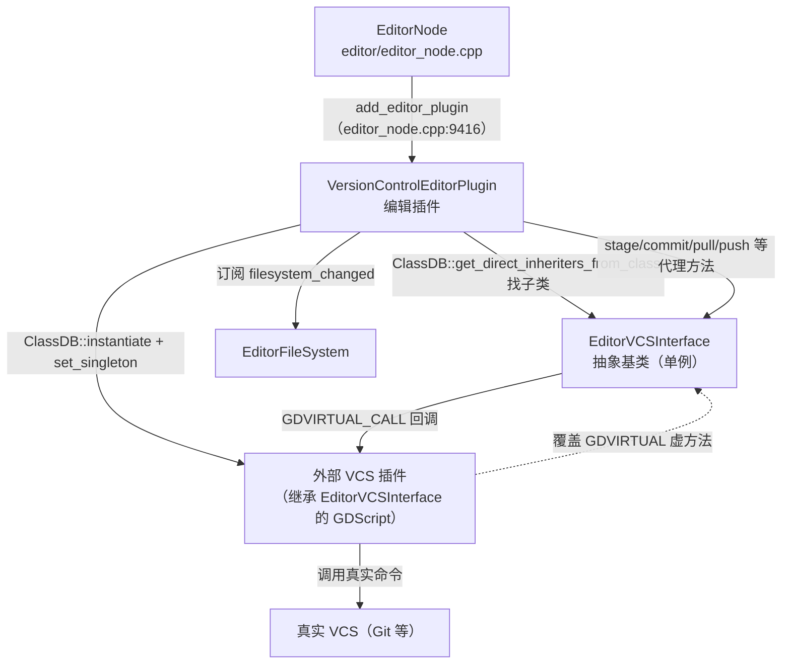

# version_control（editor）

> 一句话：编辑器里的「版本控制插座」——Godot 自己不会 git，它只提供一排标准接口，让任何外部版本控制系统（Git 等）通过一个抽象基类 `EditorVCSInterface` 插进来，把 commit / diff / branch 的能力接到一个图形界面上。

**结论**：这个模块（源目录 `editor/version_control/`，共 4 个源文件 + 1 个 `SCsub`）是编辑器的版本控制前端——它把「选插件 → 读状态 → stage / commit / pull / push → 看 diff」整套交互做成界面，把具体 VCS 命令全部下放给外部插件实现；代价是它自己一行真正的 git 操作都没有，全靠插件「填坑」。

## 是什么 / 不是什么

这个模块是一层**桥接**：它只定义「编辑器想要什么」，不定义「VCS 怎么做」。

- 它负责：收集工程状态（改了哪些文件）、提供 staging 区 / 提交列表 / 分支与远程列表的 UI、展示 diff（split 与 unified 两种视图）、触发 commit/pull/push/fetch、给新工程生成 `.gitignore` / `.gitattributes` 元数据文件。
- 它不负责：执行任何真实的 `git add` / `git commit` / `git push` 命令。这些由外部插件（一个继承 `EditorVCSInterface` 的 GDScript 类）去实现——通常由用户从 Asset Library 装一个 Git 插件。
- 它也不负责文件系统的扫描与索引，那是 `EditorFileSystem` 的事；它只订阅后者的 `filesystem_changed` 信号来刷新界面（`version_control_editor_plugin.cpp:200`）。

一句话：**界面归这里，命令归插件，中间用虚方法做契约。**

## 在引擎里的位置



核心依赖链：`EditorNode` 把插件注册进编辑器（`editor_node.cpp:9416`），插件通过 `ClassDB` 反射发现所有 `EditorVCSInterface` 的子类（`version_control_editor_plugin.cpp:974`），用户选中一个后实例化并设为单例，此后界面上所有按钮都变成对这个单例的代理调用，单例再回调进外部插件的虚方法实现。

## 关键概念

- **接口单例 `EditorVCSInterface`**：像一台「同声传译器」，左边对编辑器讲统一 C++ 方法（`stage_file`、`commit`、`get_diff`），右边对插件讲统一虚方法（`_stage_file`、`_commit`、`_get_diff`）。它是 `Object` 的子类（`editor_vcs_interface.h:37`），用静态指针 `singleton` 记住当前激活的那个插件实现。
- **虚方法契约（GDVIRTUAL）**：24 个以 `_` 开头的虚方法是插件的「作业单」（`editor_vcs_interface.h:106-129`）。插件必须覆盖它们，否则 `ERR_PRINT_ONCE` 报「必须覆盖」。
- **数据结构三件套**：`DiffLine` / `DiffHunk` / `DiffFile` 描述一份 diff（行 → 块 → 文件，逐级嵌套）；`Commit` 描述一次提交；`StatusFile` 描述一个文件的状态（在哪个区、改了什么）（`editor_vcs_interface.h:56-92`）。
- **两个枚举**：`ChangeType`（NEW/MODIFIED/RENAMED/DELETED/TYPECHANGE/UNMERGED 六种变更）与 `TreeArea`（COMMIT/STAGED/UNSTAGED 三个区域）（`editor_vcs_interface.h:41-54`）。
- **字典中转**：插件返回的是 `TypedArray<Dictionary>`（跨语言边界安全），C++ 侧用 `_convert_status_file`、`_convert_diff_file` 等把字典转成内部结构体（`editor_vcs_interface.cpp:294-322`）。

## 核心文件（按阅读顺序）

1. `editor/version_control/SCsub` — 只编译 `*.cpp` 进 `env.editor_sources`，无独立 register_types（`SCsub:6`）。
2. `editor/version_control/editor_vcs_interface.h` — 接口类声明：虚方法清单、数据结构、两个枚举，184 行。
3. `editor/version_control/editor_vcs_interface.cpp` — 代理实现：每个公开方法就是一个 `GDVIRTUAL_CALL` 包装；外加字典构造/转换辅助函数与元数据文件生成。
4. `editor/version_control/version_control_editor_plugin.h` — 插件声明：两座 dock 的所有控件指针、几十个槽函数。
5. `editor/version_control/version_control_editor_plugin.cpp` — 主战场（1612 行）：建 UI、加载插件、刷新各列表、渲染 diff、处理 commit/pull/push。

## 数据流 / 调用链

一次「提交」的完整链路（双向桥接，最能看清接口如何翻译）：

```mermaid
sequenceDiagram
    participant UI as 用户点 Commit 按钮
    participant VCP as VersionControlEditorPlugin
    participant IF as EditorVCSInterface 单例
    participant EXT as 外部 VCS 插件
    participant VCS as 真实 VCS(Git)

    UI->>VCP: _commit()
    VCP->>IF: commit(msg, amend)
    IF->>EXT: GDVIRTUAL_CALL(_commit, msg, amend)
    EXT->>VCS: 执行 git commit
    VCS-->>EXT: 结果
    EXT-->>IF: 返回
    IF-->>VCP: 返回
    VCP->>IF: get_modified_files_data()
    IF->>EXT: GDVIRTUAL_CALL(_get_modified_files_data)
    EXT-->>IF: TypedArray&lt;Dictionary&gt;
    IF->>IF: _convert_status_file 逐条转换
    IF-->>VCP: List&lt;StatusFile&gt;
    VCP->>VCP: _refresh_stage_area() 刷新暂存/未暂存列表
```

反向查询同理：`_refresh_stage_area` 调 `get_modified_files_data`（`version_control_editor_plugin.cpp:437`），接口把插件返回的字典数组转成 `List<StatusFile>`，再按 `area` 分到 `staged_files` / `unstaged_files` 两棵 `Tree`。点开一个文件看 diff，走 `_load_diff` → `get_diff` → `_get_diff`，插件返回的 `Dictionary` 被 `_convert_diff_file` 逐层拆成 `DiffFile`/`DiffHunk`/`DiffLine`，最后由 `_display_diff_split_view` 或 `_display_diff_unified_view` 渲染成富文本（`version_control_editor_plugin.cpp:552-691`）。

## 中文口诀

```
接口单例坐中间，插件在外实现全。
虚法带杠是契约，二十四条要写全。
字典来回路畅通，结构三件套 diff 链。
暂存未存两棵树，提交推送走代理。
元数据只写忽略，真枪实弹靠插件。
```

## 练习（15 分钟）

1. 打开 `editor_vcs_interface.h:106-129`，逐条读 24 个 `GDVIRTUAL`，圈出哪些是「查询类」（返回数据）、哪些是「动作类」（无返回）。
2. 在 `editor_vcs_interface.cpp` 里挑 `stage_file` 和 `get_remotes` 对比：为什么前者只需一行 `GDVIRTUAL_CALL`，后者要多写一个循环把结果装进 `List<String>`。
3. 到 `version_control_editor_plugin.cpp` 读 `_load_plugin`（186 行起）：写出「一个 GDScript 类名 → 成为全局 VCS 单例」需要哪四步。
4. 找 `create_vcs_metadata_files`（`editor_vcs_interface.cpp:384`），说说它给 Git 项目写了哪两个文件、各写了几行什么内容。

## 自测

- [ ] `EditorVCSInterface` 的公开方法（如 `commit`）自己做了 git 操作吗？它的实现体里唯一真正干活的机制是什么（提示：一个宏）？
- [ ] 插件返回的数据是 `TypedArray<Dictionary>`，编辑器内部用的却是 `List<DiffFile>` 这类结构体——这个转换发生在哪个文件的哪些函数里？
- [ ] 为什么说这个模块「一行 git 命令都没执行」，却依然能完成提交？缺失的那块由谁补上，通过什么机制补上？
- [ ] `CHECK_PLUGIN_INITIALIZED()` 宏（`version_control_editor_plugin.cpp:57`）检查的单例是什么？如果用户没选 VCS 插件，会发生什么？

## 一句话总结

> version_control 是编辑器的「版本控制插座」：它用 `EditorVCSInterface` 定义 24 个虚方法契约，用 `VersionControlEditorPlugin` 搭好 commit/diff/branch/remote 全套界面，真正的 git 命令交给继承该接口的外部插件去执行——桥接两头，一行真 VCS 操作都不沾。
