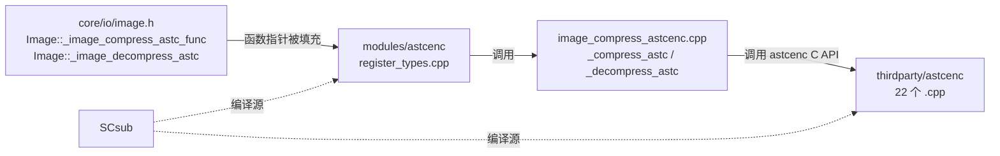
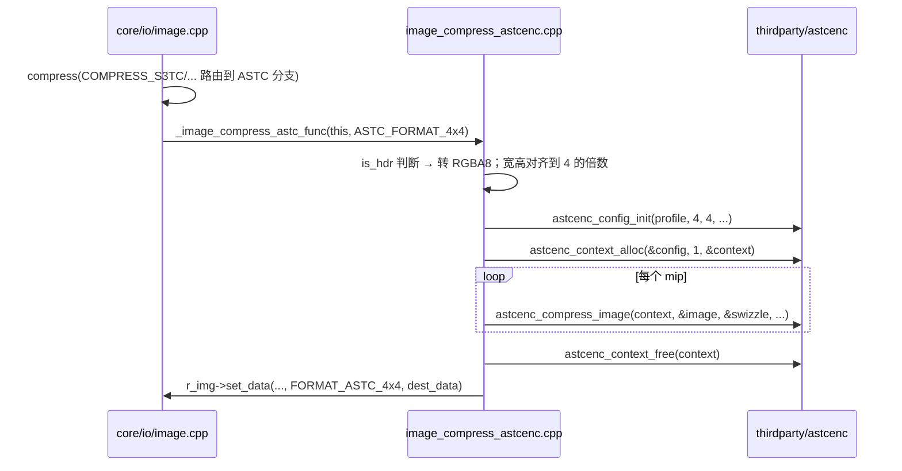

# astcenc（modules）

> 一句话：把第三方 ASTC 压缩库「翻译」成 Godot `Image` 能直接调用的两个函数指针——就像一个只装了两个插头的转接头。

**结论**：`modules/astcenc` 是第三方 `astcenc` 库的**薄封装**，它不注册任何新类，只向 `core/io/image.h` 暴露一个 ASTC 压缩函数和一个 ASTC 解压函数；压缩只进编辑器构建（代价是运行时多背一份解压代码，编辑期多花 CPU 压纹理）。

## 是什么 / 不是什么

- **是**：一层胶水，把 `Image` 的 `ASTCFormat` / `Format` 枚举翻译成 astcenc 的 `astcenc_config` / `astcenc_image`，再调用 astcenc 的 C API 干活。
- **不是**：不包含任何 ASTC 压缩算法——算法全在 `thirdparty/astcenc/` 的 22 个 `.cpp` 里（见 `SCsub:14-37`），本文不展开。
- **不负责**：不负责纹理导入调度、文件格式解析（.astc 加载是 `Image` 的事），也不碰 BC/BPTC/ETC 等其他 VRAM 压缩格式——那些各有各的模块。

## 在引擎里的位置



`Image`（core 层）只有两个空函数指针，astcenc 模块在初始化时把它们指向自己的实现，于是 `Image::decompress()` 里那行 `_image_decompress_astc(this)` 才真正能跑。

## 关键概念

- **外部 VRAM 压缩函数指针**：`Image` 里留了一排 `static void (*_image_compress_astc_func)(Image *, ASTCFormat)` 这样的函数指针（`core/io/image.h:236`），模块负责填空。这是 Godot「薄封装」模块的标准插法。
- **ASTC 块尺寸**：压缩按固定像素块切分，Godot 只支持 4×4 和 8×8 两种，对应枚举 `Image::ASTCFormat::ASTC_FORMAT_4x4 / ASTC_FORMAT_8x8`（`core/io/image.h:148-149`）。
- **LDR / HDR 双 profile**：astcenc 用 `ASTCENC_PRF_LDR` / `ASTCENC_PRF_HDR` 区分精度档，Godot 靠源格式是不是浮点（`is_hdr`）来选，见 `image_compress_astcenc.cpp:47-58`。
- **TOOLS_ENABLED 分界**：压缩函数只在编辑器构建注册（`register_types.cpp:40-42`），非编辑器构建给第三方库定义 `ASTCENC_DECOMPRESS_ONLY`（`SCsub:48-49`），只保留解压。

## 核心文件（按阅读顺序）

1. `config.py` — 一行 `can_build` 恒返回 `True`，任何平台都编。
2. `register_types.cpp` — 模块入口，在 `MODULE_INITIALIZATION_LEVEL_SCENE` 阶段把两个函数指针接到实现上。
3. `image_compress_astcenc.h` — 只声明 `_compress_astc`（`TOOLS_ENABLED` 下）和 `_decompress_astc` 两个自由函数。
4. `image_compress_astcenc.cpp` — 全部胶水逻辑：格式翻译、块对齐、逐 mip 调 astcenc 压/解。
5. `SCsub` — 编译清单：22 个 thirdparty 源 + 本模块 `*.cpp`，并声明模块对象依赖第三方对象。

## 数据流 / 调用链

以「导入一张 RGBA8 纹理 → 压成 ASTC 4x4」为例：



解压路径对称：`Image::decompress()` 命中 `FORMAT_ASTC_*` 时调 `_image_decompress_astc`（`core/io/image.cpp:2924-2925`），内部调 `astcenc_decompress_image` 后 `set_data` 回 RGBA8/RGBAH。

## 中文口诀

```
astcenc 是个转接头，
不造算法只搬砖头；
指针两个填 Image，
压进编辑、解压全留；
四四八八定块距，
浮点是 HDR 整数 LDR；
mip 逐级调 astcenc，
对齐倍数八要凑。
```

## 练习（15 分钟）

1. 打开 `register_types.cpp`，圈出 `#ifdef TOOLS_ENABLED` 包住的那一行，说出为什么压缩只在编辑器注册。
2. 打开 `image_compress_astcenc.cpp:64-78`，对照 `core/io/image.h:148` 的 `ASTCFormat` 枚举，写清 4x4 / 8x8 各映射到哪个 `Format`。
3. 打开 `SCsub:46-49`，说出非编辑器构建给第三方库加了哪个宏、效果是什么。
4. 在 `image_compress_astcenc.cpp` 里 grep `thread_count`，说出 Godot 为什么写死 1 线程（提示：读那行注释）。

## 自测

- [ ] `Image::_image_decompress_astc` 在 `core/io/image.h` 里是什么类型？（答：`static void (*)(Image *)`）
- [ ] 运行时（非编辑器）能否压出新的 ASTC 纹理？为什么？
- [ ] `_decompress_astc` 遇到 `FORMAT_ASTC_4x4` 时，`block_x`/`block_y` 是多少？

## 一句话总结

> `modules/astcenc` 是第三方 ASTC 库在 Godot 里的「两个函数指针」胶水层：编辑期把纹理压成 4x4/8x8 ASTC，运行期把 ASTC 解回 RGBA，算法本体留在 `thirdparty/`。
