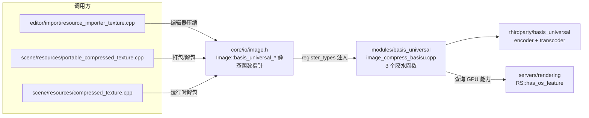
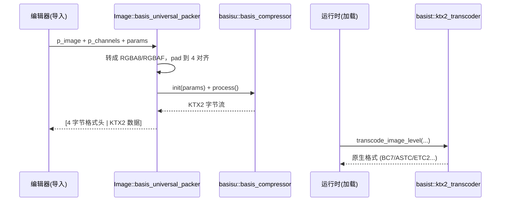

# basis_universal（modules）

> 一句话：它是 Godot 到第三方 [Basis Universal](https://github.com/BinomialLLC/basis_universal) 纹理压缩库的一根「转接头」——把引擎的 `Image` 翻译成 Basis Universal 能读写的字节流。

**结论**：`basis_universal` 是一个**薄封装胶水模块**，不注册任何脚本可见的类，只向 `core/io/image.h` 里预置的 3 个函数指针注入实现，把「一张图压缩一次、运行时按 GPU 能力转码成原生格式」这件事接入引擎；代价是编辑器打包时编译约 23 个第三方编码源文件，运行时始终链接 1 个转码源文件。

## 是什么 / 不是什么

**是什么**：纹理的「通用中间格式」编解码桥。Basis Universal 的核心价值是：贴图在导入期只压一次（编码成 UASTC 并包进 KTX2 容器），到运行期再根据当前 GPU 支持，转码成 BC7 / BC6H / ASTC / ETC2 / S3TC 等原生显存压缩格式，省去「同一张贴图为每种 GPU 各存一份」的麻烦。

**不是什么**：它不决定贴图什么时候被导入、也不参与资源加载的调度——那是 `editor/import/resource_importer_texture.cpp` 和 `scene/resources/compressed_texture.cpp` 的活。它更不是压缩算法本身：真正的编码器和转码器全在 `thirdparty/basis_universal/` 里，本模块只做翻译和数据搬运。它也不注册任何 `GDREGISTER_CLASS` 的类（`register_types.cpp` 全文无 `_bind_methods`）。

## 在引擎里的位置

依赖方向一句话：`scene`/`editor` 只认识 `Image` 上的函数指针，不知道模块存在；模块在 `MODULE_INITIALIZATION_LEVEL_SCENE` 阶段把指针填上（`register_types.cpp:49-53`），并把调用转发给 `thirdparty` 库。

## 关键概念

- **函数指针注入**：`Image` 只声明 `static ... (*basis_universal_packer)(...)`（`core/io/image.h:254`），初值是 `nullptr`（`core/io/image.cpp:117`）。模块加载时把真实函数地址赋进去——引擎核心不依赖模块，模块却能被核心调用。
- **UASTC + KTX2 容器**：编码时 `params.m_uastc = true`、`params.m_create_ktx2_file = true`（`image_compress_basisu.cpp:115,123`），输出是 KTX2 文件；转码时据此走 `basist::ktx2_transcoder`（`image_compress_basisu.cpp:419`）。
- **格式头 4 字节**：输出缓冲区前 4 字节是 `decompress_format | BASIS_DECOMPRESS_FLAG_KTX2`（`image_compress_basisu.cpp:266`），解包时靠它判断「是 RG/RGB/RGBA 哪种布局、是不是 KTX2」（`image_compress_basisu.cpp:298-300`）。
- **按 GPU 能力选目标格式**：解包时用 `RS::get_singleton()->has_os_feature("bptc"/"astc"/"s3tc"/...)` 决定转成哪种原生格式（`image_compress_basisu.cpp:288-293`），兜底是 `cTFRGBA32` 即 RGBA8。
- **通道裁剪/交换**：`BasisDecompressFormat` 枚举（`image_compress_basisu.h:35`）标记了 R、RG、RGBA 等布局；对单通道/双通道纹理，解包后还要 `convert_ra_rgba8_to_rg()` 或 `convert(FORMAT_R8/RG8)` 把多余通道裁掉（`image_compress_basisu.cpp:481-493`）。

## 核心文件（按阅读顺序）

1. `modules/basis_universal/register_types.cpp` — 入口：初始化转码器、注册 3 个项目设置、注入 3 个函数指针。
2. `modules/basis_universal/image_compress_basisu.h` — 公共接口：`BasisDecompressFormat` 枚举、`BasisRGBAF` 结构、3 个胶水函数声明。
3. `modules/basis_universal/image_compress_basisu.cpp` — 全部实现：`basis_universal_packer`（编辑器编码）、`basis_universal_unpacker` / `basis_universal_unpacker_ptr`（运行时转码）。
4. `modules/basis_universal/SCsub` — 编译清单：编辑器才编 `encoder/`（约 23 个文件），`transcoder/` 始终编（1 个文件）。
5. `modules/basis_universal/config.py` — 声明编辑器构建依赖 `tinyexr` 模块。

## 数据流 / 调用链

编码走「编辑器侧」：导入贴图时 `resource_importer_texture.cpp:343` 调 `Image::basis_universal_packer`，模块内 `basis_universal_packer`（`image_compress_basisu.cpp:89`）把 `Image` 转成 `basisu::image` 后交给 `basisu::basis_compressor`，产物是带 4 字节格式头的 KTX2。解码走「运行时侧」：`compressed_texture.cpp:416` / `portable_compressed_texture.cpp:116` 调 `basis_universal_unpacker_ptr`（`image_compress_basisu.cpp:275`），按 GPU 能力选目标格式后逐 mip 级转码回 `Image`。

## 中文口诀

- 核心不认模块，指针认——`Image` 只留三个空指针，模块加载才填。
- 压一次，转多地——UASTC 编一次，运行时按 GPU 转原生格式。
- 头四字节定乾坤——`decompress_format | KTX2 标志`，解包先读它。
- 有 bptc 走 BC7，有 astc 走 ASTC，啥都没有回退 RGBA8。
- 编辑器才编 encoder，运行时只带 transcoder。

## 练习（15 分钟）

1. 打开 `register_types.cpp`，数一数它一共注册了几个类（`GDREGISTER_CLASS`）、几行 `GLOBAL_DEF`、几次对 `Image::` 静态成员的赋值。
2. 在 `image_compress_basisu.cpp:302-413` 找到 `BASIS_DECOMPRESS_RGB` 分支，默写它的优先级链：`bptc → astc → s3tc → etc2 → RGBA8`。
3. 打开 `SCsub`，找出哪一行决定了「编码器只在编辑器构建时编译」，并说明运行时为什么只链接一个 `basisu_transcoder.cpp`。
4. 用 grep 找出 `Image::basis_universal_unpacker` 在 `scene/resources/` 和 `editor/import/` 里的所有调用点，确认「模块被谁依赖」。

## 自测

- [ ] `basis_universal` 模块向 `Image` 注入的 3 个函数指针分别叫什么名字？它们分别在哪个文件被赋值？
- [ ] 编码产物的前 4 字节是什么含义？解包时如何区分 KTX2 和旧版 `.basis` 文件？
- [ ] 运行时转码的目标格式由谁决定？如果一个 GPU 什么压缩格式都不支持，最终解成什么格式？

## 一句话总结

> `basis_universal` 是 Godot 给第三方 Basis Universal 库套的一层薄胶水：不建类、只填 `Image` 的三个函数指针，让「一次压缩、按 GPU 转码」成为引擎内置的纹理管线。
