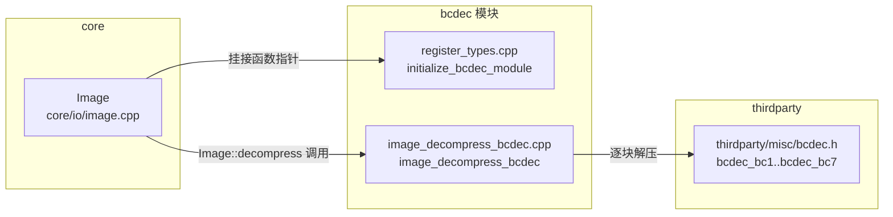
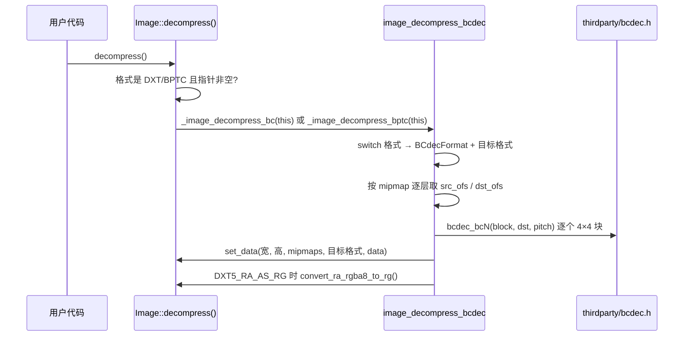

# bcdec（modules）

> 一句话：bcdec 是一个「翻译官」——把 GPU 上的 BC（块压缩）纹理格式翻译回 CPU 能直接读的普通像素，术语叫 **BC 纹理解码器**。

**结论**：bcdec 模块是第三方单头文件库 `thirdparty/misc/bcdec.h` 的一层薄胶水——它不注册任何类，只在引擎初始化时把两个函数指针挂到 `Image` 上，让 `Image::decompress()` 能把 DXT/BPTC 等压缩纹理解回 RGBA8/RGBH 等普通格式。代价是纯软件解码，慢，只作「没有 GPU 时的兜底」。

## 是什么 / 不是什么

**是什么**：一个只有 5 个源文件的薄封装。它把 `Image` 的压缩格式枚举（`FORMAT_DXT1` … `FORMAT_BPTC_RGBA`）翻译成 bcdec 自己的格式枚举 `BCdecFormat`（`BCdec_BC1` … `BCdec_BC7`），再逐个 4×4 块调用库函数解压，最后写回 `Image`。

**不是什么**：
- 不是真正实现解码算法的代码——算法全在 `thirdparty/misc/bcdec.h`，本模块不展开、不解释它。
- 不是 GPU 解压。bcdec 是纯 CPU 单头文件库，速度远低于显卡原生解压。
- 不负责压缩（`Image::compress()`），压缩由别的模块/函数指针（`_image_compress_bc_rd_func` 等）承接。

## 在引擎里的位置



关键锚点：`Image` 在 `core/io/image.h:243` 声明了两个静态函数指针 `_image_decompress_bc` 和 `_image_decompress_bptc`，默认是 `nullptr`（`core/io/image.cpp:106`）。bcdec 模块的职责就是给这两个空指针「塞进」真实函数。

## 关键概念

1. **函数指针挂钩** —— 像一个「插座」：`Image` 预留了空插座（`_image_decompress_bc` / `_image_decompress_bptc`），bcdec 在启动时插上插头。锚点：`register_types.cpp:40-41`。
2. **格式映射表** —— 把 `Image::Format` 翻译成 `BCdecFormat`，同时定好目标格式。例如 `FORMAT_DXT1 → BCdec_BC1 → FORMAT_RGBA8`。锚点：`image_decompress_bcdec.cpp:228-273` 的 `switch`。
3. **非 4 对齐安全解压** —— 压缩格式以 4×4 为最小块，若宽高不是 4 的倍数，边角块不能整块写出，用栈上临时缓冲 `temp_buf` 逐个像素拷。锚点：`_safe_decompress_mipmap`（`image_decompress_bcdec.cpp:48`）。
4. **通道 swizzle** —— 法线贴图用 `FORMAT_DXT5_RA_AS_RG`，解压后要把 RA 通道重新排成 RG，解压完再调 `convert_ra_rgba8_to_rg()`。锚点：`image_decompress_bcdec.cpp:297-299`。

## 核心文件（按阅读顺序）

1. `modules/bcdec/config.py` — `can_build` 恒返回 `True`，所有平台都编译，无依赖。
2. `modules/bcdec/SCsub` — 一句 `add_source_files(env.modules_sources, "*.cpp")`，编译目录下所有 `.cpp`。
3. `modules/bcdec/register_types.h` — 只声明 `initialize_bcdec_module` / `uninitialize_bcdec_module` 两个函数。
4. `modules/bcdec/register_types.cpp` — 在 `MODULE_INITIALIZATION_LEVEL_SCENE` 级别把 `image_decompress_bcdec` 挂到 `Image` 的两个函数指针上。
5. `modules/bcdec/image_decompress_bcdec.h` — 定义 `BCdecFormat` 枚举（BC1~BC7）和入口函数签名。
6. `modules/bcdec/image_decompress_bcdec.cpp` — 胶水主体：格式映射、mipmap 遍历、安全/快速两条解压路径。

## 数据流 / 调用链



调用入口在 `core/io/image.cpp:2915` 的 `Image::decompress()`：它先判断 `_image_decompress_bc` / `_image_decompress_bptc` 是否非空，非空才调用（否则落到 ETC/ASTC 分支或返回 `ERR_UNAVAILABLE`）。`Image::can_decompress()`（`core/io/image.cpp:2932`）也用同样的指针判断「s3tc / bptc 能否解压」。

## 中文口诀

```
压缩纹理塞 GPU，CPU 读它要解码。
Image 留好空插座，启动时刻插插头。
DXT 对应 BC1 到五，BPTC 六和七。
四乘四块逐块解，边角不齐临时补。
法线贴图通道乱，解完再排 RA 和 RG。
纯 CPU 软件解码，没有显卡当兜底。
```

## 练习（15 分钟）

1. 打开 `modules/bcdec/register_types.cpp`，指出两个函数指针分别对应哪段格式（BC1~BC5 vs BC6H/BC7）。
2. 在 `image_decompress_bcdec.cpp` 找到 `FORMAT_DXT3` 对应的 `BCdecFormat` 和目标格式。
3. 比较 `_decompress_mipmap` 和 `_safe_decompress_mipmap`，说明什么条件下走哪条分支（看 `decompress_image` 里的 `if`）。
4. 在 `core/io/image.cpp:2915` 的 `Image::decompress()` 里，找出如果 bcdec 没被编译，DXT 纹理解压会返回什么错误。

## 自测

- [ ] `Image::_image_decompress_bc` 和 `_image_decompress_bptc` 的默认值是什么？在哪里被改成真实函数？
- [ ] 一张宽 10、高 6 的 `FORMAT_BC6H`（即 `FORMAT_BPTC_RGBFU`）图，解压会走「安全」还是「快速」路径？为什么？
- [ ] `FORMAT_DXT5` 和 `FORMAT_DXT5_RA_AS_RG` 都用 `BCdec_BC3` 解，那它们的差异在哪一行代码体现？

## 一句话总结

> bcdec 是一个「不注册类、只插函数指针」的薄胶水层：把 `Image` 的压缩格式接到第三方单头文件 BC 解码器上，用纯 CPU 兜底完成 GPU 压缩纹理的软件解压。
