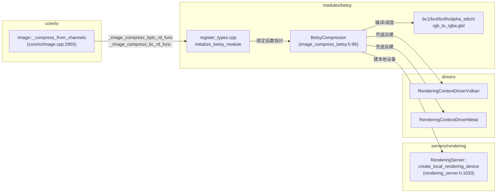
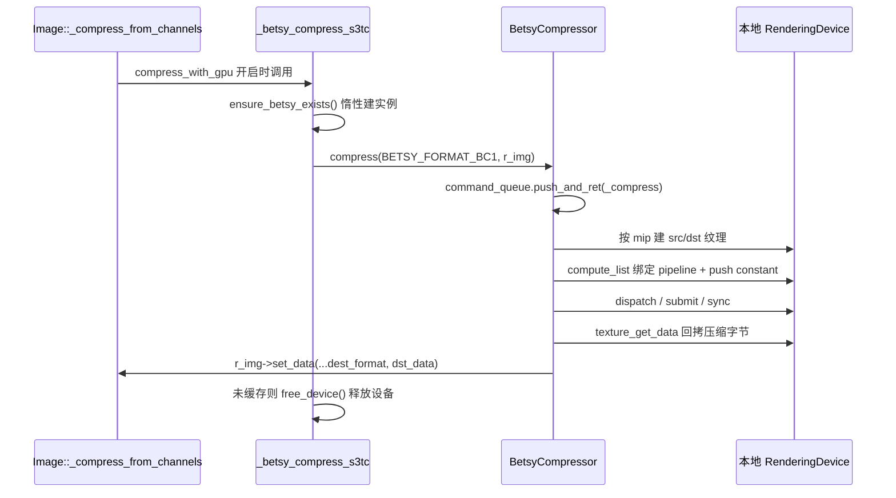

# betsy（modules）

> 一句话：betsy 是「把 BC 纹理压缩搬到 GPU 上算」的胶水层——真正的压缩算法是一组 GLSL 计算着色器，本模块只负责建设备、编译着色器、喂数据、搬结果。

**结论**：`betsy` 是 Godot 的 GPU 版 BC 块压缩器，为 `Image::compress` 提供 S3TC（BC1/BC3/BC4/BC5）与 BPTC（BC6H）两条压缩路径；它通过两个函数指针挂钩进 `Image`，让编辑器/导出模板在启用 `compress_with_gpu` 时用 GPU 而非 CPU 压缩纹理，代价是编译产物里要多带约 5 个 GLSL 着色器。

## 是什么 / 不是什么

**它是什么**：一套「用 RenderingDevice 跑计算着色器压缩 BC 纹理」的胶水代码。着色器本身（`bc1.glsl`、`bc4.glsl`、`bc6h.glsl`、`alpha_stitch.glsl`、`rgb_to_rgba.glsl`）来自第三方项目 [darksylinc/betsy](https://github.com/darksylinc/betsy)，但被直接收进模块目录并在构建期用 `GLSL_HEADER` 编译进 `.glsl.gen.h`（`SCsub:10-14`），而不是 `thirdparty/` 里的动态库封装。

**它不是什么**：

- 它不是 CPU 压缩器——CPU 侧已有 `Image::_image_compress_bc_func`（`core/io/image.cpp:2990`），betsy 只抢 GPU 这条「加速路径」。
- 它不支持 BC7——`_compress_from_channels` 里注释明写「BC7 is unsupported currently」（`core/io/image.cpp:2962`），BC4 signed、BC1 dither 变体在 `image_compress_betsy.cpp` 里也被注释掉了（`:166-171`、`:183-188`）。
- 它不负责 ASTC/ETC 压缩，那些走各自的 `_image_compress_astc_func` / `_image_compress_etc*_func`。

## 在引擎里的位置

模块在 `config.py` 里限定了可编译条件：`can_build` 返回 `env.editor_build or env["betsy_export_templates"]`（`config.py:1-2`），即只在编辑器构建、或显式开了 `betsy_export_templates` 选项时才编进去（默认 `False`，`config.py:9-13`）。

## 关键概念

- **函数指针挂钩**：`Image` 留了两个 `static` 函数指针空位 `_image_compress_bptc_rd_func` / `_image_compress_bc_rd_func`（`core/io/image.h:238-239`），betsy 在模块初始化时把自己的实现填进去，不碰 `Image` 本体。这是 Godot「模块向后端注入能力」的标准姿势。
- **本地 RenderingDevice**：`BetsyCompressor::_init` 先用 `RenderingServer::create_local_rendering_device` 要一个独立渲染设备，失败再兜底自建 `RenderingContextDriverVulkan`/`RenderingContextDriverMetal`（`image_compress_betsy.cpp:101-130`）。目的是不占用主渲染线程的上下文。
- **命令队列 + 工作线程**：压缩请求通过 `CommandQueueMT` 投递到一条 `WorkerThreadPool` 线程，串行 `flush_all`（`image_compress_betsy.cpp:277-295`），所以 GPU 压缩在后台线程排队执行。
- **格式分派表**：三个并行数组 `FORMAT_TO_TYPE`、`BETSY_TO_RD_FORMAT`、`BETSY_TO_IMAGE_FORMAT`（`image_compress_betsy.cpp:59-93`）把 `BetsyFormat` 映射到着色器类型、RD 存储格式和 `Image::Format`。

## 核心文件（按阅读顺序）

1. `modules/betsy/SCsub` — 编译清单：5 个 GLSL 用 `GLSL_HEADER` 转成 `.glsl.gen.h`，C++ 源用 `add_source_files` 收编。
2. `modules/betsy/config.py` — 模块开关：仅编辑器构建或 `betsy_export_templates` 开启时编译。
3. `modules/betsy/register_types.cpp` — 入口：在 `MODULE_INITIALIZATION_LEVEL_SCENE` 阶段把两个函数指针挂到 `Image`。
4. `modules/betsy/image_compress_betsy.h` — 公共接口：`BetsyFormat`/`BetsyShaderType` 枚举、`BetsyCompressor` 类、`_betsy_compress_bptc`/`_betsy_compress_s3tc`/`free_device`。
5. `modules/betsy/image_compress_betsy.cpp` — 全部胶水逻辑：设备创建、着色器编译缓存、逐 mipmap 压缩、GPU 结果回拷。
6. `modules/betsy/betsy_bc1.h` — DXT1 编码查找表 `stb__OMatch5`/`stb__OMatch6`（stb 风格量化表，供 BC1/BC3 用）。
7. `modules/betsy/*.glsl` — 真正的压缩算法（计算着色器本体）。

## 数据流 / 调用链

一条 S3TC 压缩的典型链路（`Image::compress_from_channels` → GPU → 回填）：

关键回退点：`_compress` 开头若 `compress_rd == nullptr` 返回 `ERR_CANT_CREATE`（`image_compress_betsy.cpp:436-438`），`Image` 侧据此回退到 CPU 压缩（`core/io/image.cpp:2966-2969`、`:2976-2979`）。

## 中文口诀

- 着色器是外援，C++ 是胶水。
- 两个指针挂进 Image，BC 与 BPTC 各占一条。
- 先要本地 RenderingDevice，Vulkan 不行 Metal 兜底。
- 命令队列排队跑，后台线程串行消。
- 三张表并行查，格式分派不迷路。
- GPU 压完 texture_get_data，字节塞回 Image 里。
- 设备要省就 free_device，不缓存即刻释放。

## 练习（15 分钟）

1. 在 `image_compress_betsy.cpp:83-93` 数一数 `BETSY_TO_IMAGE_FORMAT` 共 9 个表项，对照 `BetsyFormat` 枚举（`image_compress_betsy.h:41-52`）逐个写出「BC1→DXT1、BC3→DXT5、BC4→RGTC_R、BC5→RGTC_RG、BC6 signed→BPTC_RGBF、BC6 unsigned→BPTC_RGBFU」的映射。
2. 打开 `register_types.cpp:35-42`，解释为什么初始化必须卡在 `MODULE_INITIALIZATION_LEVEL_SCENE`（提示：此时 `Image` 类已注册、渲染服务器可用）。
3. 读 `image_compress_betsy.cpp:867-885` 的 `_betsy_compress_bptc`，回答：什么条件下选 BC6 signed、什么条件下选 BC6 unsigned。

## 自测

- [ ] `_betsy_compress_s3tc` 里 `Image::USED_CHANNELS_RGBA` 会分派到哪个 `BetsyFormat`，最终对应哪个 `Image::Format`？
- [ ] `BetsyCompressor::compress` 为什么要走 `command_queue.push_and_ret` 而不是直接调 `_compress`？
- [ ] 若 `rendering/textures/vram_compression/cache_gpu_compressor` 为 `false`，压缩完成后 betsy 做了什么动作？（看 `_betsy_compress_bptc` 结尾）

## 一句话总结

> betsy 是把第三方 BC 压缩 GLSL 着色器包进 Godot 的胶水模块：用本地 RenderingDevice 在后台线程跑计算着色器，再通过两个函数指针把 GPU 压缩结果喂回 `Image`，不碰压缩算法本身。
