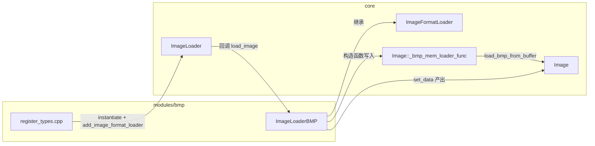
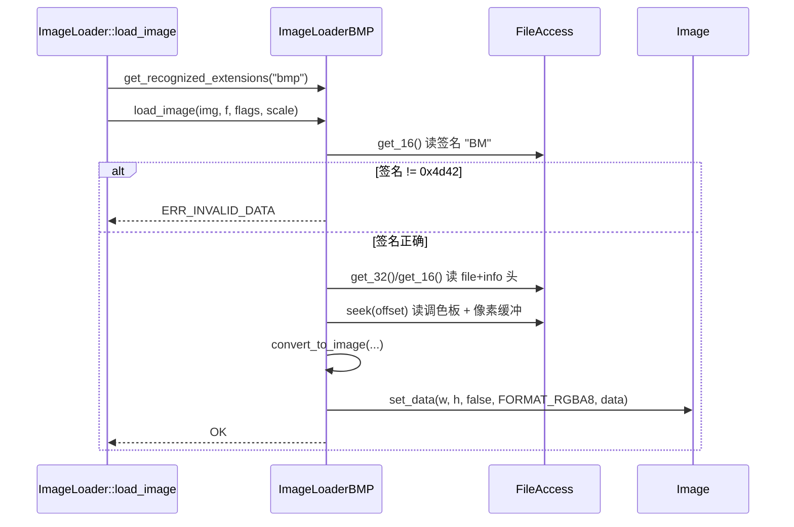

# bmp（modules）

> 一句话：BMP 是图片界的「老式传真机」——格式老旧但结构死板简单，这个模块就是 Godot 读懂那台传真机吐出的纸的翻译器。

**结论**：`bmp` 模块给 Godot 的 `Image` 注册了一个**只读的** BMP 解码器（`ImageLoaderBMP`），代价是约 330 行手写 C++ 且**不支持 RLE 压缩**；它为谁服务——所有需要把 `.bmp` 变成 `Image` 的代码路径（资源导入 + `load_bmp_from_buffer` 运行时 API）。

## 是什么 / 不是什么

- **是**：一个「格式 loader 插件」。它继承 `ImageFormatLoader`（`image_loader_bmp.h:35`），把自己挂到全局 `ImageLoader` 上，声明能识别 `.bmp` 扩展名（`image_loader_bmp.cpp:314-316`）。
- **是**：一个纯**解码**模块。整份源码只有 load、没有 save，没有 `ImageFormatLoader` 之外的类，也没有脚本暴露的新类。
- **不是**：RLE 压缩 BMP 的解码器。遇到 `BI_RLE8` / `BI_RLE4` / `BI_CMYKRLE8` / `BI_CMYKRLE4` 直接返回 `ERR_UNAVAILABLE`（`image_loader_bmp.cpp:263-270`）。
- **不是**：通用图片管线。像素解码细节在这里做，但「读文件」「识别格式」「找对 loader」这些由 `core/io/image_loader.cpp` 负责，本模块只实现被回调的两个虚函数。

## 在引擎里的位置

- 依赖：`core/io/image_loader.h`（基类）、`core/io/file_access_memory.h`（内存文件）。
- 被依赖：`core/io/image.cpp` 的 `Image::load_bmp_from_buffer`（`image.cpp:4465-4471`）和编辑器的资源导入路径都间接用到它。

## 关键概念

1. **格式签名 = 门禁卡**：`BITMAP_SIGNATURE = 0x4d42`（`image_loader_bmp.h:37`）就是文件头两个字节 `"BM"`，读文件先刷这张卡，不对就直接拒绝（`image_loader_bmp.cpp:217-218`）。
2. **Loader 协议 = 两条腿**：`ImageFormatLoader` 要求子类实现 `load_image` 和 `get_recognized_extensions` 两个纯虚函数（`image_loader.h:58-59`），本模块正是靠这两条腿被 `ImageLoader` 驱动。
3. **内存直读钩子 = 第二条路**：构造函数把静态函数 `_bmp_mem_loader_func` 塞进 `Image::_bmp_mem_loader_func`（`image_loader_bmp.cpp:331-333`），让 `Image::load_bmp_from_buffer` 不经过文件系统也能解码（`image.cpp:4465-4471`）。
4. **位深 = 翻译难度等级**：支持 1/2/4/8/16/24/32 bpp（`image_loader_bmp.cpp:88-157`），其中 ≤8 bpp 走「索引 + 调色板」，≥16 bpp 直接是颜色，最终统一输出 `FORMAT_RGBA8`。

## 核心文件（按阅读顺序）

1. `modules/bmp/config.py` — SCons 入口，`can_build` 恒真（任何平台都能编）。
2. `modules/bmp/SCsub` — 编译规则，只把 `*.cpp` 收进 `env.modules_sources`。
3. `modules/bmp/register_types.h` — 声明 `initialize_bmp_module` / `uninitialize_bmp_module`。
4. `modules/bmp/register_types.cpp` — 在 `SCENE` 初始化级别注册/注销 loader。
5. `modules/bmp/image_loader_bmp.h` — `ImageLoaderBMP` 类声明 + BMP 头结构体 + 位深枚举。
6. `modules/bmp/image_loader_bmp.cpp` — 真正的解码实现（读头、解像素、查调色板）。

## 数据流 / 调用链

主链路：`ImageLoader` 按扩展名找到本 loader → `load_image` 读 BMP 头 → `convert_to_image` 逐像素解包成 RGBA8 → `Image::set_data` 落地。另一条旁路：`Image::load_bmp_from_buffer` 直接把字节数组交给 `_bmp_mem_loader_func`，内部包一层 `FileAccessMemory` 走同样的 `load_image`（`image_loader_bmp.cpp:318-329`）。

## 中文口诀

- 头两字节看 `BM`，不是 `4d42` 就翻脸。
- 文件头十四、信息头四十，头都读不对别想解。
- 位深一到八，先查调色板；十六到三二，直接是颜色。
- 输出永远是 RGBA8，`set_data` 一把梭。
- RLE 压缩不伺候，甩个 `ERR_UNAVAILABLE` 走人。
- 注册在 SCENE 级，扩展名就叫 `bmp`。

## 练习（15 分钟）

1. 打开 `modules/bmp/register_types.cpp`，找到 `MODULE_INITIALIZATION_LEVEL_SCENE`，说清为什么不是 `CORE` 或 `EDITOR` 级别。
2. 在 `image_loader_bmp.cpp` 里找到 `case 24` 分支，解释为什么 `write_buffer[index+2] = line_ptr[0]`（BGR → RGB 换位）。
3. 搜索 `BI_RLE8`，找到被拒绝的那一行，写出它返回的错误码和报错文案。
4. 在 `core/io/image.cpp` 里找到 `load_bmp_from_buffer`，对比它和 `load_tga_from_buffer` 的区别（仅 loader 函数指针不同）。

## 自测

- [ ] `ImageLoaderBMP` 继承的基类叫什么？在哪个头文件里声明？
- [ ] 这个模块有没有保存 BMP 的能力？依据是哪一行？
- [ ] `Image::_bmp_mem_loader_func` 在哪里被赋值、在哪里被调用？
- [ ] 16 位位深时，红绿蓝各占多少位（默认 `bmp_bitfield` 初值）？

## 一句话总结

> `bmp` 是 Godot 的一个只读图片格式插件：约 330 行手写解码器，把 `"BM"` 开头的字节流翻译成 `FORMAT_RGBA8` 的 `Image`，并同时挂进文件加载链和 `load_bmp_from_buffer` 运行时 API。
