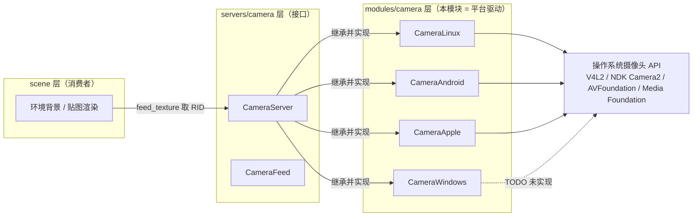
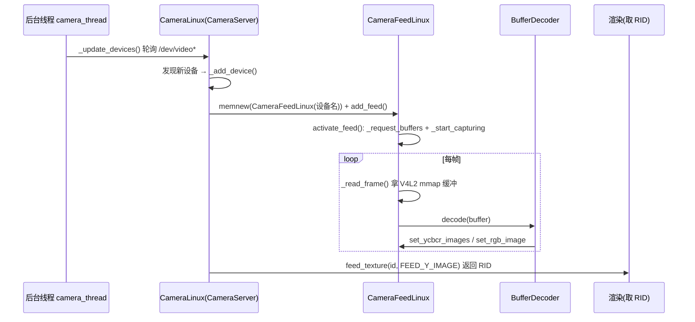

# camera（modules）

> 一句话：把电脑的摄像头（webcam）或手机的「前/后置摄像头」变成一张能在引擎里当背景用的动态贴图，相当于给 Godot 接上「眼睛」的驱动层。

**结论**：`modules/camera` 是 Godot 物理摄像头输入的平台驱动后端——它为 `CameraServer` 提供 Windows / Linux / macOS / iOS / Android / visionOS 六个平台各自的采集实现，把摄像头画面喂给引擎当背景用；代价是平台之间实现差异极大、且 Windows 端至今仍是未实现的空壳。

## 是什么 / 不是什么

它负责「拿到真实摄像头画面」：枚举设备、打开采集、把每一帧原始像素转成引擎能用的 `Image`，再塞进 `CameraFeed` 的纹理。它不负责「怎么把贴图显示出来」（那是渲染侧的事），也不负责「虚拟相机的位置/投影」——`Camera3D`、`Camera2D` 住在 `scene/` 层，跟这里没有任何代码关系，只是共享了「camera」这个单词。

同样，它不负责定义 `CameraServer` / `CameraFeed` 的对外接口——那两个基类在 `servers/camera/`，本模块只是继承并实现它们的虚函数。

## 在引擎里的位置

依赖方向一句话：`modules/camera` 只向上依赖 `servers/camera` 的两个基类（`camera_win.h:33` 的 `#include "servers/camera/camera_server.h"` 就是证据），向下直连各平台操作系统 API。

## 关键概念

- **摄像头服务（CameraServer）**：一台「设备总管家」，维护所有摄像头 feed 列表、负责枚举与增删。基类在 `servers/camera/camera_server.h:48`，本模块每个平台各造一个子类顶替它。
- **摄像头流（CameraFeed）**：一个具体摄像头 = 一条 feed，带名字、前后位置、分辨率格式列表和一张纹理。基类在 `servers/camera/camera_feed.h:42`。
- **默认实现注入（make_default）**：`CameraServer::make_default<T>()`（`camera_server.h:84`）把「要造哪个平台子类」的工厂函数记下来，启动时 `initialize_camera_module` 调用它（`register_types.cpp:52`），后续 `create()` 就造出对应平台的 server。
- **帧格式（FeedDataType）**：摄像头给的数据不一定是 RGB——可能是 YCbCr、甚至拆成两片（Y 一片、CbCr 一片）。`CameraFeed::FeedDataType`（`camera_feed.h:46`）枚举这几种形态。
- **缓冲解码器（BufferDecoder）**：Linux 专属，把 V4L2 出来的 YUYV/JPEG 字节流转成 `Image`。基类在 `buffer_decoder.h:43`。

## 核心文件（按阅读顺序）

1. `register_types.cpp` — 模块入口，`MODULE_INITIALIZATION_LEVEL_SCENE` 阶段按编译平台调用 `CameraServer::make_default<Camera<平台>>()`（`:46-61`）。
2. `SCsub` — 决定每个平台编译哪些 .cpp（`camera_win.cpp` / `camera_linux.cpp`+`camera_feed_linux.cpp`+`buffer_decoder.cpp` / `camera_android.cpp` / `camera_apple.mm`），见 `:12-31`。
3. `config.py` — 构建门禁：只有 windows/macos/linuxbsd/android/ios/visionos 可编译，FreeBSD/OpenBSD 直接关掉（`:6-13`）。
4. `camera_linux.h` / `camera_linux.cpp` — Linux V4L2 实现：后台线程轮询 `/dev` 下 `video*` 设备并增删 feed（`camera_linux.cpp:48`）。
5. `camera_feed_linux.h` / `camera_feed_linux.cpp` — 单条 Linux feed 的采集与解码（`activate_feed` 在 `camera_feed_linux.cpp:234`）。
6. `buffer_decoder.h` / `buffer_decoder.cpp` — YUYV→RGB/灰度、JPEG 解码等 6 个解码器类。
7. `camera_android.h` / `camera_android.cpp` — Android NDK Camera2 实现（`CameraFeedAndroid::activate_feed` 在 `camera_android.cpp:227`）。
8. `camera_apple.h` / `camera_apple.mm` — macOS/iOS/visionOS 共用 AVFoundation 实现（`CameraApple` 在 `camera_apple.h:38`）。
9. `camera_win.h` / `camera_win.cpp` — Windows 空壳：`CameraFeedWindows::activate_feed()` 直接 `return true`，满屏 `@TODO`（`camera_win.cpp:71-82`）。

## 数据流 / 调用链

以 Linux 为例，一条 feed 从「发现设备」到「出画面」：

Android 走同一条主干，只是把「轮询」换成 `AImageReader` 的回调：`onImage`（`camera_android.cpp:434`）拿到帧后 `call_deferred("set_ycbcr_images", ...)`（`camera_android.cpp:592`）把 Y/UV 两片塞回 feed。

## 中文口诀

- 摄像头驱动层，六个平台四个活（Win 空壳）。
- 基类在 servers，子类在 modules，一个平台一个娃。
- make_default 点菜，create 上菜，启动时只认一次。
- Linux 扫 `/dev/video*`，Android 靠 AImageReader，苹果一家 AVFoundation。
- 出图不靠猜：YUYV 先解码，Y 一片 CbCr 一片。
- 前端是 feed，后端是 OS，纹理是那根「喂到嘴边的吸管」。

## 练习（15 分钟）

1. 打开 `register_types.cpp`，数一数 `make_default<...>` 一共出现了几次，对应哪几个平台（对照 `SCsub` 的平台分支）。
2. 打开 `camera_feed_linux.cpp:245` 的 `_create_buffer_decoder()`，列出每个 `pixel_format` 分支分别 new 了哪个解码器。
3. 打开 `camera_win.cpp`，找出 3 处 `@TODO`，说明为什么 Windows 摄像头「有 server 无画面」。

## 自测

- [ ] `CameraServer::FeedImage` 里的 `FEED_RGBA_IMAGE`、`FEED_YCBCR_IMAGE`、`FEED_Y_IMAGE` 三者的枚举值为什么都是 0？
- [ ] `CameraLinux` 用哪个线程安全原语在退出时通知后台线程停止？（提示：看 `camera_linux.h` 的成员变量）

## 一句话总结

> `modules/camera` 是 Godot 物理摄像头输入的「平台驱动箱」：向下接 V4L2 / NDK Camera2 / AVFoundation，向上实现 `servers/camera` 的 `CameraServer`/`CameraFeed` 接口，把真实摄像头变成引擎可渲染的动态背景贴图——唯独 Windows 那格还是空的。
