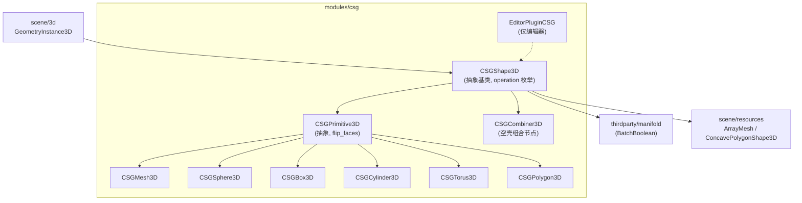
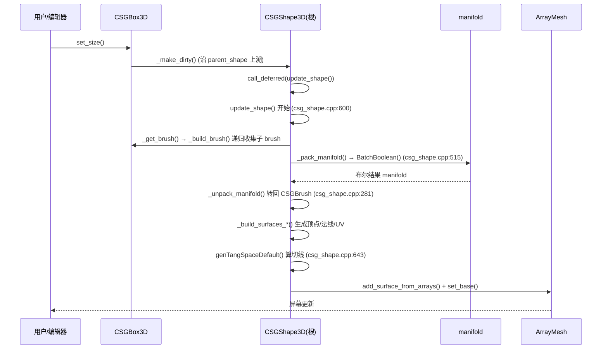

# csg（modules）

> 一句话：把盒子、球、柱子这些「积木块」当成面糊倒进一台布尔运算搅拌机，倒出来一块能直接渲染的实体网格——这就是 CSG（Constructive Solid Geometry，构造实体几何）。

**结论**：`csg` 模块提供一组 `CSGShape3D` 节点，用「并集 / 交集 / 差集」三种布尔运算把简单几何体拼成复杂实体，再通过第三方库 `manifold` 生成三角网格；它服务于需要快速搭建关卡白模 / 原型几何的开发者，代价是运行时布尔运算较慢、网格质量依赖输入的流形（manifold）性。

## 是什么 / 不是什么

它**是**：一套「节点即形状」的建模工具——你把 `CSGBox3D`、`CSGSphere3D` 这类节点在场景树里摆成父子层级，父节点按 `operation` 属性对子节点做布尔运算，最后在根节点上生成一张合并后的 `ArrayMesh`。建模逻辑全部发生在 `modules/csg/` 内，不依赖 DCC 软件。

它**不是**：一个全功能建模器（没有倒角、雕刻、曲面细分），也不是渲染后端（不碰 `servers/rendering/`）。真正的布尔运算外包给 `thirdparty/manifold/`（`csg_shape.cpp:53` 只 `#include <manifold/manifold.h>`），本模块负责把节点树翻译成 manifold 的输入、再把它吐出的网格翻译回 Godot 的 `Mesh`。

## 在引擎里的位置

## 关键概念

- **CSGBrush（三角形面的袋子）**：一个 `CSGBrush` 就是一堆三角形 `Face`（每个面 3 个顶点 + UV + 材质 id），见 `csg.h:41`。每个形状节点的 `_build_brush()` 都吐出一个 brush，它不关心布尔运算，只描述「这个形状长什么样」。
- **operation（三种布尔刀法）**：`CSGShape3D::Operation` 只有三个值——`OPERATION_UNION`（并）、`OPERATION_INTERSECTION`（交）、`OPERATION_SUBTRACTION`（差），见 `csg_shape.h:52-57`。父节点对子节点施加的正是这个操作。
- **根节点 / 脏标记（谁算、何时算）**：`is_root_shape()`（`csg_shape.h:184`）判断谁是 CSG 树的顶。子节点改了什么只调用 `_make_dirty()`，把整棵树标脏，根节点用 `call_deferred` 延迟到帧末再 `update_shape()`，避免一改十算。
- **manifold 流形约束**：布尔运算要求输入是「流形」（每条边恰好属于两个面、无破洞）。`get_configuration_warnings()` 会在网格非流形时给出警告（`csg_shape.cpp:1154-1165`）。

## 核心文件（按阅读顺序）

1. `modules/csg/register_types.cpp` — 入口：在 `MODULE_INITIALIZATION_LEVEL_SCENE` 注册 9 个类（2 个抽象 `CSGShape3D`/`CSGPrimitive3D` + 7 个具体形状），并挂载编辑器插件，见 `register_types.cpp:41-54`。
2. `modules/csg/csg.h` — `CSGBrush` / `CSGBrush::Face` 结构体定义（`csg.h:41-66`），是形状与布尔库之间的中间表示。
3. `modules/csg/csg_shape.h` — 全部节点类声明：`CSGShape3D` 及其子类、`Operation` 枚举、`_build_brush()` 纯虚接口（`csg_shape.h:126`）。
4. `modules/csg/csg_shape.cpp` — 核心实现：`update_shape()`（`:600`）、`_get_brush()`（`:485`）、`_pack_manifold` / `_unpack_manifold`（`:399` / `:281`）、曲面组装 `_build_surfaces_*`（`:675` / `:799`）。
5. `modules/csg/SCsub` — 编译清单：Godot 侧 `*.cpp` + 16 个 `thirdparty/manifold` 源文件（`SCsub:15-33`），并定义 `MANIFOLD_PAR` 宏。
6. `modules/csg/editor/csg_gizmos.h` — `EditorPluginCSG`（`:91`）与 gizmo 插件，负责编辑器里的交互和形状预览。

## 数据流 / 调用链

一次「改盒子尺寸 → 屏幕更新」的典型链路：

## 中文口诀

盒子球柱环，都是 CSG 积木块；
并交差三招，operation 刀法裁。
子改先标脏，根节点延迟算；
brush 装三角，manifold 来布尔；
拆回再组面，切线 UV 一起补；
想要快速白模，csg 模块拿手菜。

## 练习（15 分钟）

1. 在 Godot 编辑器新建一个 `CSGCombiner3D` 作为根，下面放一个 `CSGBox3D` 和一个 `CSGSphere3D`，把球节点的 `operation` 改成 `Subtraction`，观察盒子被挖出球形凹槽。
2. 给根节点开 `use_collision`，运行后让一个 `CharacterBody3D` 掉到 CSG 形状上，验证碰撞面是布尔结果而不是单个子形状。
3. 读 `csg_shape.cpp:600` 的 `update_shape()`，用一句话写出它从拿到 brush 到 `set_base()` 之间的四个关键步骤。

## 自测

- [ ] `CSGShape3D` 的 `Operation` 枚举有哪三个值，分别对应 `manifold::OpType` 的哪个操作？（提示：看 `csg_shape.cpp:466-483` 的 `convert_csg_op`）
- [ ] 为什么子节点修改属性后要 `call_deferred` 而不是立刻 `update_shape()`？（提示：看 `csg_shape.cpp:251-268` 的注释）
- [ ] `CSGCombiner3D` 的 `_build_brush()` 返回什么？它在 CSG 树里扮演什么角色？（提示：`csg_shape.cpp:1258`）

## 一句话总结

> `csg` 模块是 Godot 内置的「节点式构造实体几何」层：把一堆简单形状节点用布尔运算拼成一张可渲染、可碰撞的网格，主力活交给 thirdparty 的 `manifold`，自己只负责搭桥。
