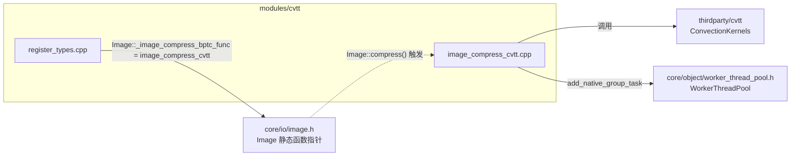
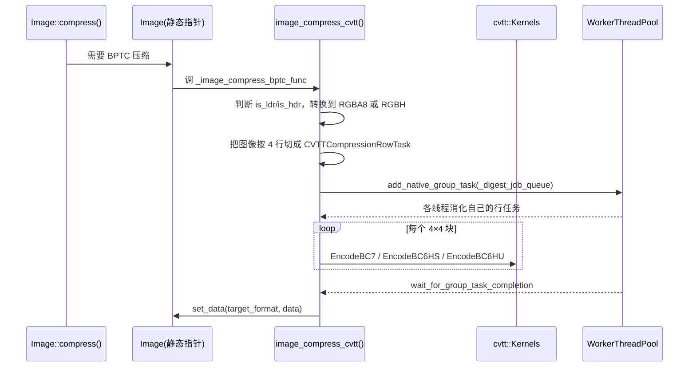

# cvtt（modules）

> 一句话：cvtt 是 Godot 到第三方库 ConvectionKernels（CVTT）之间的一层「转接头」——把 `Image` 的像素喂给 `cvtt::Kernels`，把压出来的 BC7 / BC6H 块写回 `Image`。

**结论**：cvtt 模块只做一件事——把 `Image` 的 BPTC 纹理压缩需求转发给第三方 ConvectionKernels 库，为引擎补上「BC7（LDR）+ BC6H（HDR）压缩」这一环；代价是编译产物变大，所以默认只在编辑器里编译，导出模板要用还得手动开 `cvtt_export_templates=yes`。

## 是什么 / 不是什么

cvtt 是典型的**薄封装（glue layer）**，不是功能模块：

- 它**负责**：把未压缩的 `Image` 转成 BC7 / BC6H 块，交给 `cvtt::Kernels` 编码，再塞回 `Image`。
- 它**不负责**：真正的压缩算法（那是 `thirdparty/cvtt/` 里 ConvectionKernels 的活儿）；也不负责 BC6H/BC7 的**解压**——引擎里的解压由另一个模块 `bcdec` 接管（`modules/bcdec/register_types.cpp:41` 把 `Image::_image_decompress_bptc` 设成了 `image_decompress_bcdec`）。
- 本模块虽然也写了 `image_decompress_cvtt()`（`image_compress_cvtt.h:36`），但没有任何地方接它，属于未挂线的死胶水。

## 在引擎里的位置

cvtt 唯一的「出人头地」方式，是在 `MODULE_INITIALIZATION_LEVEL_SCENE` 初始化时，把自己塞进 `Image` 的一个静态函数指针槽位（`Image::_image_compress_bptc_func`，`core/io/image.h:233`）。之后谁调 `Image::compress()`，谁就会顺着这个指针进到 cvtt。

## 关键概念

1. **函数指针槽位**：`Image` 里留了一个「空插座」`_image_compress_bptc_func`，初始化时 cvtt 把自己插上去。引擎其他部分从不直接认识 cvtt，只认识这个插座。
2. **BC7 / BC6H（BPTC 家族）**：一块 4×4 像素压成固定 16 字节。BC7 压 LDR（`FORMAT_BPTC_RGBA`），BC6H 分有符号（`FORMAT_BPTC_RGBF`）和无符号（`FORMAT_BPTC_RGBFU`）两种，用来压 HDR。
3. **逐行任务切片**：压缩按「每 4 行一块」切成 `CVTTCompressionRowTask`，丢进 `WorkerThreadPool` 的 native group task 并行处理（`image_compress_cvtt.cpp:272-292`）。
4. **质量档位**：BC7 编码计划固定用质量 5（`cvtt::Kernels::ConfigureBC7EncodingPlanFromQuality(..., 5)`，`image_compress_cvtt.cpp:213`）。

## 核心文件（按阅读顺序）

1. `config.py` — 编译开关：只在 `editor_build` 或开启 `cvtt_export_templates` 时编译；后者提示「增加二进制体积」。
2. `SCsub` — 编译 `thirdparty/cvtt/` 下 10 个 ConvectionKernels `.cpp`，再编译本目录 `*.cpp`。
3. `register_types.h` — 声明 `initialize_cvtt_module` / `uninitialize_cvtt_module`。
4. `register_types.cpp` — 在 SCENE 初始化级别把 `Image::_image_compress_bptc_func` 指向 `image_compress_cvtt`。
5. `image_compress_cvtt.h` — 两个函数声明：压缩 + 解压（解压没被用）。
6. `image_compress_cvtt.cpp` — 胶水主体：格式判断、目标格式选择、切片、并行调度、写回。

## 数据流 / 调用链

## 中文口诀

- 转接头，不扛活儿，算法都靠第三方。
- 一个指针占插座，SCENE 初始化就上线。
- BC7 压低动态，BC6H 分正负扛高动态。
- 四行一块切任务，线程池里齐开工。
- 只压不解压，解压隔壁 bcdec 管。

## 练习（15 分钟）

1. 打开 `modules/cvtt/register_types.cpp`，找出一行「函数指针赋值」，确认它把谁赋给了谁、在哪个初始化级别。
2. 在 `image_compress_cvtt.cpp` 里找 `ConfigureBC7EncodingPlanFromQuality`，确认质量档位是几。
3. 打开 `modules/bcdec/register_types.cpp:41`，对比 cvtt 与 bcdec 各自占用了 `Image` 的哪个静态指针，验证「cvtt 只压不解压」这句话。

## 自测

- [ ] `Image::_image_compress_bptc_func` 在哪个文件、哪一行被赋值为 `image_compress_cvtt`？`image_decompress_cvtt` 又被谁调用？
- [ ] 为什么 `image_decompress_cvtt()` 存在却没被接线？引擎里 BPTC 解压实际由哪个模块负责？

## 一句话总结

> cvtt 是「只压不解压」的薄胶水：初始化时把 `Image::_image_compress_bptc_func` 接到 `image_compress_cvtt`，用并行切片调第三方 ConvectionKernels，把 BC7 / BC6H 压缩能力还给引擎。
