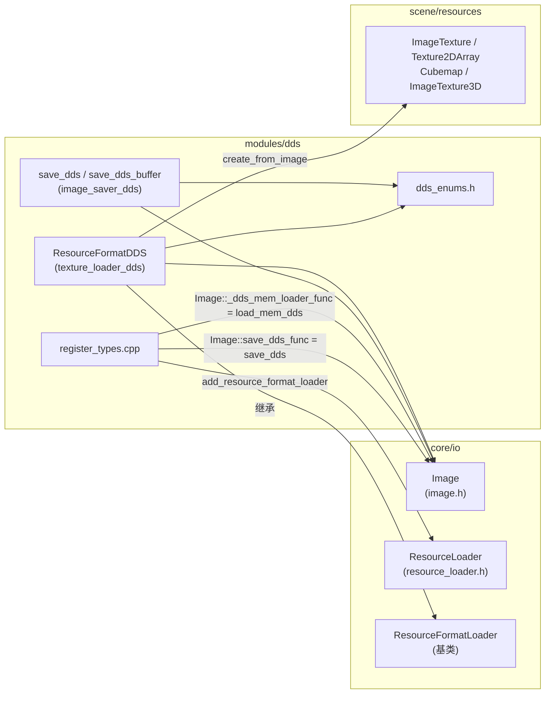
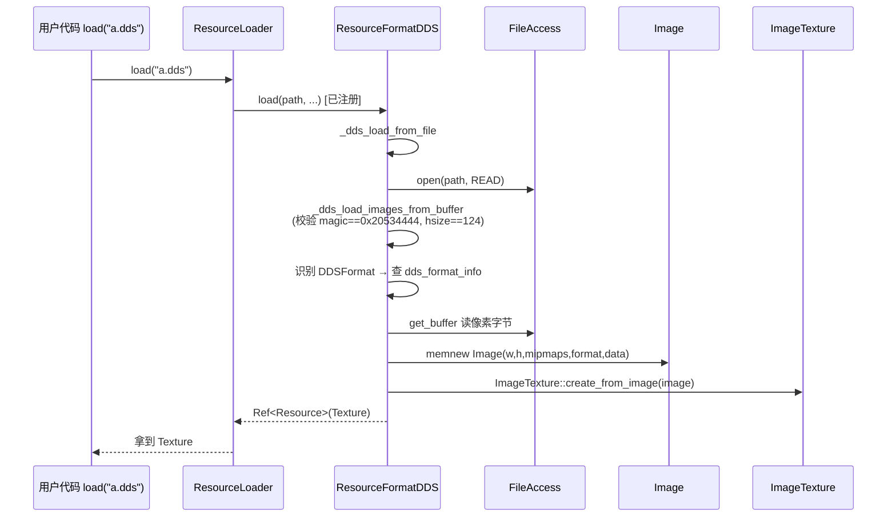

# dds（modules）

> 一句话：它是 Godot 里处理 `.dds` 贴图的「转接头」——把 DirectX 的纹理容器翻译成引擎自己的 `Image` / `Texture`。

**结论**：`modules/dds` 是 DDS 纹理格式的读写胶水层，给 `Image` 类装上 DDS 的保存/内存加载能力、给 `ResourceLoader` 注册一个 `.dds` 资源加载器；代价是它不真正做 BC 压缩解压，只负责解析头、搬运字节、把结果塞进 `Image`。

## 是什么 / 不是什么

这个模块只干三件事：**解析 DDS 头**、**把像素数据读进 `Image`**、**把 `Image` 写成 DDS**。

- 它**是**：`.dds` 文件 ↔ Godot `Image`/`Texture` 之间的格式转换器。
- 它**不是**：BC1/BC3/BC7 这类压缩算法本身——真正的编解码在 `core/io/image.cpp` 的 `Image` 里，DDS 模块只是按块大小（`block_size`）把压缩字节原样搬过去，交给 `Image` 去解压。
- 它**不是**：Godot 侧新增的脚本可见类。`ResourceFormatDDS` 用 `GDSOFTCLASS` 标记，不注册进 ClassDB，脚本里看不到它；你用的是 `Image.save_dds()` / `Image.load_dds_from_buffer()` 这些已有 API。

## 在引擎里的位置



三条线记住它：**保存**（`Saver` → `Image` 的函数指针空槽）、**内存加载**（`Loader` 构造时填 `Image::_dds_mem_loader_func`）、**资源加载**（`Loader` 注册进 `ResourceLoader`）。

## 关键概念

- **函数指针空槽（hook）**：`Image` 在 `core/io/image.h:210/215/227` 留了三个 `static inline` 函数指针，初始为 `nullptr`。DDS 模块的职责就是启动时把真函数填进去。这是 Godot 让可选模块给核心类「加能力」的标准做法。
- **DDS 头（124 字节）**：`DDS_MAGIC = 0x20534444`（即 `"DDS "`），`DDS_HEADER_SIZE = 124`（`dds_enums.h:40-41`）。加载先校验这两个数，错就报 `Invalid or unsupported DDS texture file`（`texture_loader_dds.cpp:512`）。
- **`ResourceFormatDDS`**：继承 `ResourceFormatLoader` 的资源格式加载器（`texture_loader_dds.h:35`）。它回答四个问题：认不认 `.dds`、是不是 `Texture` 类型、`load` 出什么、资源类型叫什么。
- **`DDSFormat` 表（`dds_format_info`）**：一张 41 项的静态表（`dds_enums.h:189`），每条记录一个 `Image::Format` 的映射、是否压缩、块大小（`block_size`）、对齐因子（`divisor`）。加载和保存都靠它换算字节数。
- **三种头部写法**：保存时按格式选 bitmask / FourCC / DX10 三种像素格式头之一（`image_saver_dds.cpp:390`），对应 `DDFT_BITMASK` / `DDFT_FOURCC` / `DDFT_DXGI`。

## 核心文件（按阅读顺序）

1. `modules/dds/register_types.cpp` — 入口。`initialize_dds_module` 把保存函数、加载器、内存加载函数三处接上，`uninitialize_dds_module` 再摘掉。
2. `modules/dds/dds_enums.h` — 全部常量与映射表：DDS 头标志位、`DDSFourCC`、`DXGIFormat`、`DDSFormat` 枚举，以及 `dds_format_info` 表。
3. `modules/dds/texture_loader_dds.h` — `ResourceFormatDDS` 的类声明（四个虚函数 + 构造）。
4. `modules/dds/texture_loader_dds.cpp` — 加载主逻辑：解析头、识别格式、按层读数据、创建 `Texture`。
5. `modules/dds/image_saver_dds.h` / `image_saver_dds.cpp` — 两个自由函数 `save_dds` / `save_dds_buffer`，把 `Image` 写成 DDS 文件或字节数组。
6. `modules/dds/SCsub` — 只编译当前目录 `*.cpp`（3 个源文件）。
7. `modules/dds/tests/test_dds.h` — doctest 用例，验证保存后加载回来的图像与原始 `Image` 逐像素一致。

## 数据流 / 调用链

加载一张 `.dds` 纹理（走资源系统）的典型路径：



保存走另一条线：`Image::save_dds()`（`image.cpp:2838`）检查 `save_dds_func` 非空后转发给 `save_dds`（`image_saver_dds.cpp:38`），后者调 `save_dds_buffer` 序列化整个 DDS（含 mipmap），再 `FileAccess::open(..., WRITE)` 落盘。

## 中文口诀

```
DDS 是转接头，读写两不愁
Image 留空槽，模块来填表
保存塞 save_dds，内存塞 load_mem
资源注册进 Loader，认准扩展 .dds
一百二十四字节头，魔数四二四五零
查表对齐块大小，字节搬进 Image 里
```

## 练习（15 分钟）

1. 打开 `register_types.cpp`，找到 `initialize_dds_module` 里的三处「塞空槽」代码，逐句对上 `image.h:210/215/227` 三个静态指针。
2. 在 `texture_loader_dds.cpp:512` 打一个断点，用 `load("res://xx.dds")` 加载任意 DDS，观察 `magic` 和 `hsize` 的值。
3. 读 `_dds_create_texture`（`texture_loader_dds.cpp:423`），列出它能创建哪 5 种 `Texture` 子类，以及各自对应 `DDST_2D / DDST_CUBEMAP / DDST_3D` 的哪个分支。

## 自测

- [ ] 为什么 `ResourceFormatDDS` 用了 `GDSOFTCLASS` 而不是 `GDCLASS`？脚本里能用 `Image.save_dds()` 吗，为什么能？
- [ ] `initialize_dds_module` 为什么只在 `MODULE_INITIALIZATION_LEVEL_SCENE` 才注册，而不是更早的 `CORE` 阶段？
- [ ] 压缩格式（如 DXT5）加载时，模块有没有真的解压 BC 块？它做了什么？

## 一句话总结

> `modules/dds` 是 DDS 格式的胶水层：往 `Image` 的三个函数指针空槽里填读写函数、往 `ResourceLoader` 里注册一个 `.dds` 加载器，剩下全靠解析 124 字节头和查 `dds_format_info` 表搬运字节。
