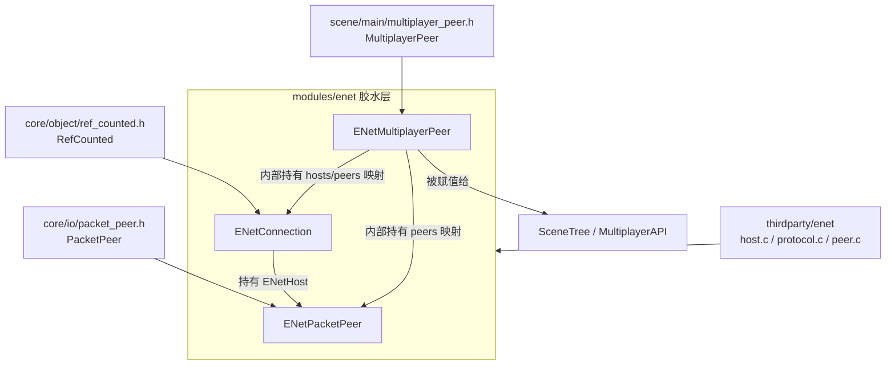
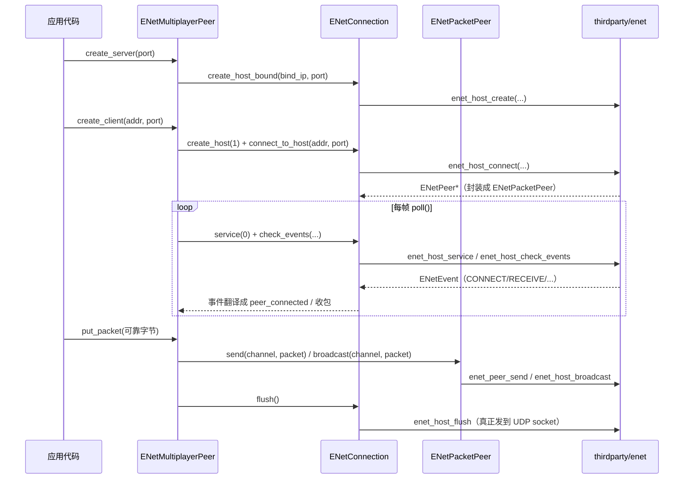

# enet（modules）

> 一句话：把 C 语言写成的 ENet UDP 网络库包成三个 Godot 类，让「不可靠的 UDP」变成「带确认、带重传、带顺序」的连接，再挂进引擎的多人游戏框架。

**结论**：`modules/enet` 是 Godot 对 ENet 网络库的胶水层——负责把底层 ENet 的 host/peer/packet 翻译成引擎可用的 `ENetConnection`、`ENetPacketPeer`、`ENetMultiplayerPeer` 三个类，为多人游戏提供一套「客户端/服务器 + 可选 P2P 网状」传输，代价是这一层自己几乎不含网络逻辑，全部转手给 `thirdparty/enet`。

## 是什么 / 不是什么

**是什么**：一层薄薄的 C++ 封装。它把 `enet_host_create`、`enet_peer_send`、`enet_host_service` 这些 C 函数，映射成 Godot 侧带 `GDCLASS` 的对象方法（`register_types.cpp:53-55` 注册了 3 个类）。它同时是「底层 ENet」和「上层 MultiplayerPeer 接口」之间的翻译官。

**不是什么**：不实现任何拥塞控制、可靠重传、分片重组——这些全在 `thirdparty/enet` 里（`SCsub:13-32` 只负责把 `host.c`、`protocol.c`、`peer.c` 等 vendored 文件编进来）。它也不是多人游戏的同步逻辑（谁拥有哪个节点、怎么序列化），那是 `scene/` 的 `MultiplayerSynchronizer` 等系统的事，本模块只提供「怎么把字节送出去」的通道。

对比句（≤3）：**ENetConnection 管「一个主机」**，**ENetPacketPeer 管「一个连接」**，**ENetMultiplayerPeer 把前两者打包成引擎标准的 `MultiplayerPeer`**。

## 在引擎里的位置

- `ENetConnection : RefCounted`（`enet_connection.h:43`）：一个「主机」，客户端或服务器都先建它。
- `ENetPacketPeer : PacketPeer`（`enet_packet_peer.h:37`）：一条到远端 peer 的连接，抽象类，只能由 `ENetConnection` 内部实例化（`register_types.cpp:54` 用 `GDREGISTER_ABSTRACT_CLASS`）。
- `ENetMultiplayerPeer : MultiplayerPeer`（`enet_multiplayer_peer.h:39`）：把上面两者翻译成引擎多人框架认识的接口，`SceneTree` 靠它收发 RPC。

## 关键概念

- **Host（主机）**：比喻成「一个电话总机」。它绑定一个本地端口、管理最多 N 条连接、统一收发数据包。真实锚点：`ENetConnection` 里的 `ENetHost *host`（`enet_connection.h:81`），由 `create_host_bound()` / `create_host()` 创建（`enet_connection.cpp:46-72`）。
- **Peer（连接）**：比喻成「一条已经拨通的专线」。它对应远端一个客户端，有自己的状态机（连接中/已连接/断开中等 10 态，`enet_packet_peer.h:67-78`）。真实锚点：`ENetPacketPeer` 里的 `ENetPeer *peer`（`enet_packet_peer.h:41`）。
- **Event（事件）**：ENet 是「轮询制」——你不问它就不说话。`service()` 每调用一次吐出一个事件：连接来了、断了、还是收到包。真实锚点：`EventType` 枚举 `EVENT_CONNECT / EVENT_DISCONNECT / EVENT_RECEIVE / EVENT_NONE / EVENT_ERROR`（`enet_connection.h:62-68`）。
- **Channel（信道）**：比喻成「同一条专线里分出来的多条车道」。不同信道可设不同可靠性（可靠/不可靠有序/不可靠无序），互不阻塞。真实锚点：`ENetPacketPeer::send(uint8_t p_channel, ...)`（`enet_packet_peer.h:109`）。
- **TransferMode（传输模式）**：上层 `MultiplayerPeer` 的「可靠/不可靠」语义，在 `ENetMultiplayerPeer::put_packet` 里被翻译成 ENet 的包标志位（`enet_multiplayer_peer.cpp:342-361`）。

## 核心文件（按阅读顺序）

1. `modules/enet/register_types.cpp` — 模块入口：`initialize_enet_module` 调 `enet_initialize()` 并注册 3 个类（`:42-56`）。
2. `modules/enet/config.py` — 声明文档类清单（`get_doc_classes` 返回 3 个类名，`:9-14`）。
3. `modules/enet/SCsub` — 编译脚本：`builtin_enet` 时编 `thirdparty/enet` 的 C 文件，否则链系统库（`:13-32`）。
4. `modules/enet/enet_connection.h` — 主机层公共接口：创建/连接/服务/广播/压缩/DTLS。
5. `modules/enet/enet_connection.cpp` — 主机层实现：`_create` 转调 `enet_host_create`（`:306-321`）、`service` 转调 `enet_host_service`（`:163-187`）。
6. `modules/enet/enet_packet_peer.h` — 连接层接口：发送/断开/ping/统计/状态。
7. `modules/enet/enet_packet_peer.cpp` — 连接层实现：几乎每个方法都是一行转调 `enet_peer_*`（`:35-112`）。
8. `modules/enet/enet_multiplayer_peer.h` — 多人 peer 接口：`create_server / create_client / create_mesh / add_mesh_peer`（`:120-123`）。
9. `modules/enet/enet_multiplayer_peer.cpp` — 把 ENet 事件翻译成 `peer_connected` / `peer_disconnected` 信号的核心循环（`:166-261`）。

## 数据流 / 调用链

一次「服务器建主机、客户端连上、发一条可靠消息」的典型路径：

关键落点：`create_server` 里 `host->create_host_bound(...)` 绑定端口后把 `unique_id` 设为 1、状态置 `CONNECTION_CONNECTED`（`enet_multiplayer_peer.cpp:62-77`）。`poll()` 按模式分支（client/server/mesh）循环 `service(0)` + `check_events()`，把 `EVENT_CONNECT` 变成 `peer_connected` 信号、`EVENT_RECEIVE` 存进 `incoming_packets`（`enet_multiplayer_peer.cpp:166-261`）。发送时 `put_packet` 根据 `TransferMode` 选信道和包标志，服务器端 `broadcast` 或定点 `send`，最后 `flush()` 才真正走 UDP（`enet_multiplayer_peer.cpp:336-417`）。

## 中文口诀

> 总机是 Host，专线是 Peer；
> 不问不说话，service 来轮询；
> 连接靠事件，收包进队列；
> 可靠走车道，标志定顺序；
> 多人大管家，把包译成接口；
> 底层全在 enet，本层只当翻译。

## 练习（15 分钟）

1. 打开 `enet_packet_peer.cpp:35-112`，数一数有多少个方法是一行 `enet_peer_*` 直接转调——验证「胶水层不装逻辑」这个结论。
2. 打开 `enet_multiplayer_peer.cpp:166-261`，画出 `MODE_SERVER` 分支里 `EVENT_CONNECT` 的完整处理路径（它怎么把 `event.data` 当成 peer id 写入 `_net_id` 元数据）。
3. 在 `enet_multiplayer_peer.cpp` 里找到 `put_packet` 中 `TRANSFER_MODE_UNRELIABLE` 对应的 `packet_flags` 与 `channel` 组合，和 `TRANSFER_MODE_RELIABLE` 对比。

## 自测

- [ ] `ENetMultiplayerPeer` 的三个模式（`MODE_SERVER` / `MODE_CLIENT` / `MODE_MESH`）分别在哪三个 `create_*` 方法里被设置？`MODE_MESH` 下为什么 `get_host()` 会返回空？
- [ ] `ENetConnection::service()` 返回 `EVENT_NONE` 和 `EVENT_ERROR` 时，底层 `enet_host_service` 的返回值分别是什么？（提示：看 `enet_connection.cpp:163-187`）
- [ ] 服务器如何区分「新连接」和「数据包」？`EVENT_CONNECT` 时 `event.data` 被用来做什么？（提示：`enet_multiplayer_peer.cpp:202-215`）

## 一句话总结

> `modules/enet` 是 ENet 的「翻译官」：把 C 网络库的 host/peer/event 翻成 Godot 的三个类，再把它们装进引擎的 `MultiplayerPeer` 接口，让 SceneTree 的多人框架能用一套 UDP 传输跑起来。
