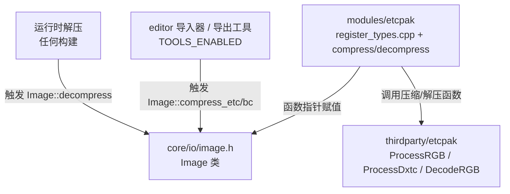
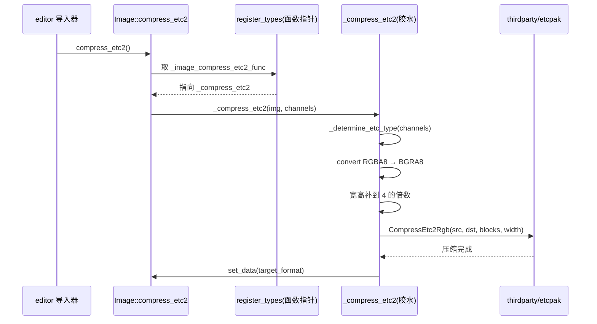

# etcpak（modules）

> 一句话：etcpak 是给 Godot 的 `Image` 装上的「压缩/解压引擎」——把真正干活的第三方 ETC/BC 纹理压缩库，通过 5 个函数指针插进核心层。

**结论**：这是一个**第三方 etcpak 库的薄封装胶水层**——它自己不实现任何压缩算法，只在 `MODULE_INITIALIZATION_LEVEL_SCENE` 阶段把压缩/解压函数指针挂到 `Image` 上；代价是它依赖 `thirdparty/etcpak/`，且压缩只面向编辑器/导出工具（`TOOLS_ENABLED`）。

## 是什么 / 不是什么

etcpak 模块负责两件事：**纹理压缩**（把未压缩的 RGBA8 图像转成 ETC1/ETC2/DXT/RGTC 格式）和**纹理解压**（把上述压缩格式还原成 RGBA8）。

它不是：

- 不是压缩算法的实现者——真正的 `CompressEtc2Rgb`、`CompressBc3`、`DecodeRGBBlock` 等都在 `thirdparty/etcpak/` 里，本模块不碰。
- 不是一个面向脚本的功能模块——它**不注册任何脚本可见类**（没有 `GDCLASS`、没有 `register_scene_types`），完全由 `Image` 内部调用。
- 不负责 png/jpg/webp 等其他格式——那些交给各自的驱动模块。

## 在引擎里的位置

数据流自上而下：编辑器导入器要压缩纹理 → 调 `Image::compress_*` → 命中本模块挂进去的函数指针 → 调 `thirdparty/etcpak` 的 C++ 压缩函数。解压则任何构建都能走通。

## 关键概念

- **函数指针挂载点**：`Image` 类留了 5 个静态函数指针（`core/io/image.h:232-246`），默认全是 `nullptr`，本模块在初始化时把它们填上（`register_types.cpp:41-48`）。这是「胶水」的本质。
- **通道判定**：`_determine_etc_type` / `_determine_dxt_type` 把图像的 `Image::UsedChannels`（L/LA/R/RG/RGB/RGBA）映射成具体的 `EtcpakType` 枚举（`image_compress_etcpak.cpp:41-79`）。
- **4x4 块对齐**：ETC/BC 都以 4x4 像素块为最小单元，宽高不是 4 的倍数时，先「smearing」（边缘像素外扩）补齐（`image_compress_etcpak.cpp:230-256`）。
- **BGRA8 约定**：etcpak 的 ETC 压缩期望 BGRA8 输入，胶水层在压缩前做 `convert_rgba8_to_bgra8()`（`image_compress_etcpak.cpp:159-162`）。
- **对齐快路径 vs 安全慢路径**：解压时，宽高恰好是 4 的倍数走 `_decompress_mipmap`，否则走 `_safe_decompress_mipmap` 逐边处理（`image_decompress_etcpak.cpp:43-180`）。

## 核心文件（按阅读顺序）

1. `register_types.cpp` — 入口：初始化时把 5 个函数指针挂到 `Image`，压缩三路只在 `TOOLS_ENABLED` 下生效，解压两路始终生效。
2. `image_compress_etcpak.h` — 定义 `EtcpakType` 枚举和 `_compress_etc1/_compress_etc2/_compress_bc/_compress_etcpak` 声明。
3. `image_compress_etcpak.cpp` — 压缩胶水：通道判定 → 转 RGBA8/BGRA8 → 块对齐 → 逐 mipmap 调 etcpak 压缩函数。
4. `image_decompress_etcpak.h` — 定义 `EtcpakFormat` 枚举（R/RG/RGB/RGBA）和 `_decompress_etc` 声明。
5. `image_decompress_etcpak.cpp` — 解压胶水：源格式 → `EtcpakFormat` → 逐 mipmap 解压 → 通道交换收尾。
6. `SCsub` — 编译清单：本目录 `*.cpp` 加上 `thirdparty/etcpak/` 下 5 个源文件，并对第三方关闭警告。
7. `config.py` — 无配置逻辑，`can_build` 恒为 `True`。

## 数据流 / 调用链

以一次「压缩 ETC2」为例：

解压对称：`Image::decompress`（`core/io/image.cpp:2920-2923`）调 `_image_decompress_etc1/_etc2` → `_decompress_etc` → `DecodeRGBBlock` 等。

## 中文口诀

- 一个胶水模块，五根函数指针。
- 压缩只在工具里，解压随便都能跑。
- 通道先判型，再转 BGRA。
- 四乘四块对齐，边缘外扩补齐。
- 真功夫在 thirdparty，薄壳只管接线。

## 练习（15 分钟）

1. 打开 `register_types.cpp:36-49`，数出 5 个被赋值的函数指针，写出它们各自的类型签名（对照 `core/io/image.h:232-246`）。
2. 在 `image_compress_etcpak.cpp:107-157` 里，把每个 `EtcpakType` 映射到它对应的 `Image::Format`，做成一张两列表格。
3. 找到 `image_decompress_etcpak.cpp:193-215` 的 switch，说明为什么 `FORMAT_DXT1` 之类的格式不在解压支持列表里。
4. 阅读 `image_compress_etcpak.cpp:230-256` 的 smearing 逻辑，用一句话解释「为什么 x 方向补完再补 y 方向」。

## 自测

- [ ] `Image::_image_compress_etc1_func` 默认值是 `nullptr`，谁在什么时候把它变成非空？（提示：搜 `MODULE_INITIALIZATION_LEVEL_SCENE`）
- [ ] 压缩与解压两套函数指针，哪套包在 `#ifdef TOOLS_ENABLED` 里？为什么解压不包？
- [ ] `_compress_etcpak` 里为什么要在 `p_compress_type < ETCPAK_TYPE_DXT1` 时转 BGRA8？

## 一句话总结

> etcpak 是 Godot 给第三方 ETC/BC 压缩库搭的接线盒——压缩归工具侧，解压归运行时，算法全在 thirdparty。
