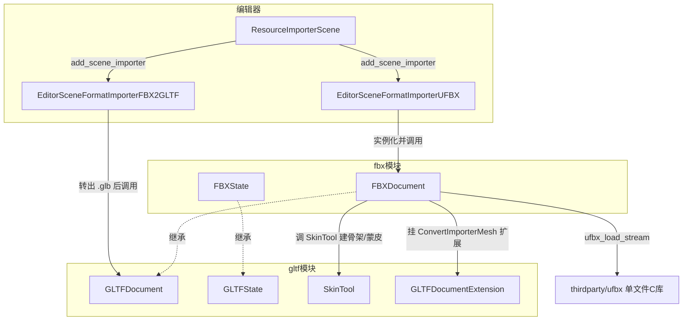
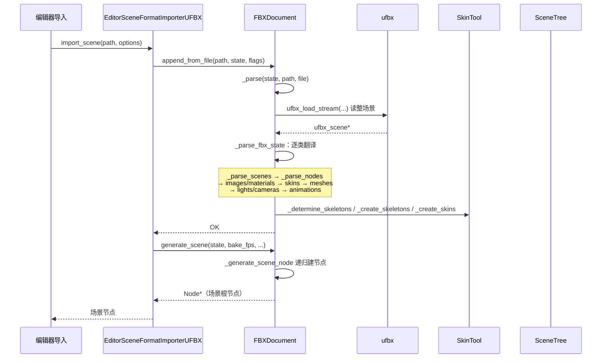

# fbx（modules）

> 一句话：把 Autodesk FBX 文件「翻译」成 Godot 的 glTF 形状中间状态，再走 glTF 那套生成场景的流水线。

**结论**：`fbx` 模块是 FBX 3D 场景的导入器——它用第三方单文件库 ufbx 把 .fbx 解析成内存场景，再转写进 `GLTFState`/`GLTFDocument` 的子类里，最终复用 glTF 模块的场景生成逻辑输出 `Node` 树；代价是它几乎不「理解」FBX 本身，一切都要先翻译成 glTF 的概念，因此必须依赖 `gltf` 模块，且不负责导出回 FBX。

## 是什么 / 不是什么

fbx 模块只做**导入**：`.fbx` 文件进、Godot 场景节点出。

- 它**负责**：把 FBX 的网格、材质、贴图、骨骼蒙皮、相机、灯光、动画读进来，翻译成 Godot 的场景资源。
- 它**不负责**：把 Godot 场景导出成 .fbx（`FBXDocument::generate_buffer`/`write_to_filesystem` 是空实现，见 `modules/fbx/fbx_document.cpp:2482`）；也不负责 glTF 本身的解析（那是 `gltf` 模块的活）。
- 它**两条路**：默认用内置库 ufbx 直接解析；可选地调用外部命令行工具 FBX2glTF 先把 FBX 转成 .glb 再交给 `GLTFDocument`。

## 在引擎里的位置

模块在 `config.py:2` 声明依赖 `gltf`，且在 `disable_3d` 时直接禁用（`can_build` 返回 `not env["disable_3d"]`）。

## 关键概念

- **FBXState**（`modules/fbx/fbx_state.h:39`）：`GLTFState` 的子类。比基类多一层「FBX 原始场景」——用一个 `ufbx_unique_ptr<ufbx_scene> scene` 智能指针抱住 ufbx 解析出来的内存场景（`fbx_state.h:46`）。Godot 侧的一切数据仍沿用 glTF 的 `nodes`/`meshes`/`skins` 这些数组。
- **FBXDocument**（`modules/fbx/fbx_document.h:40`）：`GLTFDocument` 的子类。核心是 `_parse_fbx_state`（`fbx_document.cpp:2186`）——它按固定顺序调用一长串 `_parse_*`，把 ufbx 场景逐类翻译进 state。
- **ufbx**：一个单文件 C 库（`thirdparty/ufbx/ufbx.c`），由 `SCsub` 编译进来，并用 `UFBX_NO_*` 宏砍掉细分曲面、几何缓存等用不到的功能（`SCsub:22-30`）。Godot 用 `ufbx_load_stream` 一次性读入整个场景。
- **SkinTool**（`modules/gltf/skin_tool.h:43`）：属于 gltf 模块的骨架/蒙皮工具类。fbx 不自己造轮子，直接调 `SkinTool::_determine_skeletons`、`_create_skeletons`、`_create_skins`（`fbx_document.cpp:2218-2229`）把 FBX 的蒙皮转成 Godot 的 `Skeleton3D` + `Skin`。
- **两条导入路径**：`EditorSceneFormatImporterUFBX`（内置 ufbx，默认）和 `EditorSceneFormatImporterFBX2GLTF`（外部命令行转 .glb）。二者都实现了 `EditorSceneFormatImporter`，通过 `ResourceImporterScene::add_scene_importer` 挂到编辑器导入流程（`register_types.cpp:50`）。

## 核心文件（按阅读顺序）

1. `modules/fbx/config.py` — 声明依赖 `gltf`、注册的 4 个文档类名。
2. `modules/fbx/register_types.cpp` — 模块初始化：注册类、在编辑器里挂两个 importer、非编辑器运行时挂 `GLTFDocumentExtensionConvertImporterMesh`。
3. `modules/fbx/fbx_state.h` — `FBXState`：持有 ufbx 场景与若干缓存表。
4. `modules/fbx/fbx_document.h` — `FBXDocument`：对外 4 个重写方法 + 一长串 `_parse_*`/`_generate_*` 私有方法。
5. `modules/fbx/fbx_document.cpp` — 全部翻译逻辑（约 2500 行）：`_parse` 调 ufbx，`_parse_fbx_state` 编排翻译，`generate_scene` 出节点。
6. `modules/fbx/editor/editor_scene_importer_ufbx.cpp` — ufbx 路径的 importer 实现，也负责暴露 `fbx/*` 导入选项。
7. `modules/fbx/editor/editor_scene_importer_fbx2gltf.cpp` — fbx2gltf 路径：执行外部二进制、拿 .glb 喂给 `GLTFDocument`。

## 数据流 / 调用链

关键入口在 `editor_scene_importer_ufbx.cpp:43` 的 `import_scene`：先 `append_from_file` 解析，再 `generate_scene` 生成。`_parse`（`fbx_document.cpp:2021`）里用 `ufbx_load_opts` 把坐标系统一成右手 Y-up、单位统一成米、轴心 `ADJUST_TO_PIVOT`，再交给 ufbx 多线程读入。

## 中文口诀

FBX 进来要翻译，先过 ufbx 再进 state。
State 是个 GLTF 胎，节点网格皮肤一排排。
骨架蒙皮不自己写，SkinTool 借来解。
两条路可导，ufbx 内置、fbx2gltf 外挂。
翻译完成出场景，generate_scene 一颗树。

## 练习（15 分钟）

1. 打开 `modules/fbx/fbx_document.cpp`，定位 `_parse_fbx_state`（约 2186 行），按注释 `/* PARSE XXX */` 数出它一共翻译了几类数据，并排出先后顺序。
2. 找到 `_parse` 里 `ufbx_load_opts` 的赋值块，写出 3 条对坐标系/单位/轴心的设置（对应 `target_axes`、`target_unit_meters`、`pivot_handling`）。
3. 读 `register_types.cpp:66-88`，对比「编辑器构建」和「运行时」各注册了什么，说明为什么运行时只挂 `GLTFDocumentExtensionConvertImporterMesh`。
4. 读 `editor_scene_importer_fbx2gltf.cpp:73-95`，说出 fbx2gltf 路径在本地磁盘上「多」产生了什么中间文件。

## 自测

- [ ] `FBXDocument` 的 `generate_buffer` 和 `write_to_filesystem` 为什么是空实现？这说明了 fbx 模块在设计上的什么边界？
- [ ] `FBXState` 相比 `GLTFState` 多持有了什么？为什么 glTF 路径（`gltf` 模块）不需要这一层？
- [ ] `_parse_fbx_state` 里「先 skins 后 meshes」的顺序能调换吗？提示：看注释 `/* PARSE MESHES (we have enough info now) */` 在哪个调用之后。

## 一句话总结

> fbx 模块是「FBX → glTF 形状中间状态 → 场景节点」的翻译器：ufbx 负责读懂文件，`FBXDocument`/`FBXState` 负责翻译，glTF 模块的 `SkinTool` 和场景生成逻辑负责落地。
