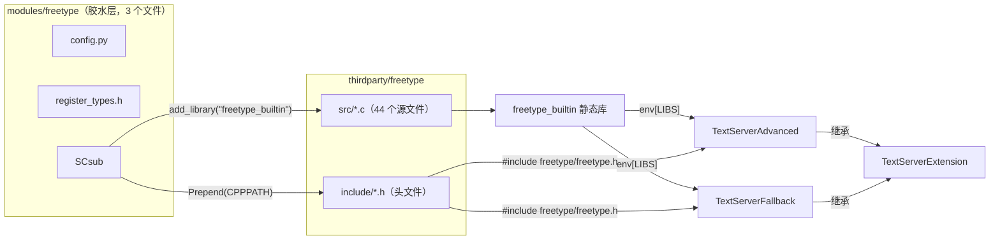
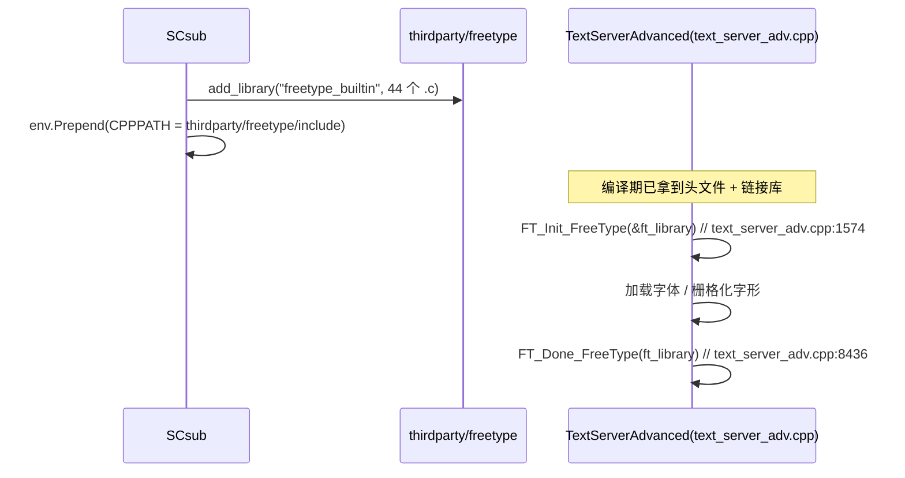

# freetype（modules）

> 一句话：freetype 是「采购员 + 送货员」——它把第三方 FreeType 字体库编译好、把头文件路径铺好，送到 TextServer 手上，自己却一个字形都不画。

**结论**：`modules/freetype` 是一个纯编译胶水模块，它不注册任何运行时类、不暴露任何脚本 API，唯一职责是把 `thirdparty/freetype` 的 44 个 `.c` 源文件编成静态库 `freetype_builtin` 并公开头文件路径，让 `TextServerAdvanced` / `TextServerFallback` 能调用 FreeType 做字体栅格化。

## 是什么 / 不是什么

- **是什么**：一个构建期（SCons）模块。`SCsub` 把第三方 FreeType 源码编成静态库，并把 `#thirdparty/freetype/include` 加到 `CPPPATH`。
- **不是什么**：它自己不栅格化字形——真正调用 `FT_Init_FreeType` 的是 TextServer 的两个实现。
- **不是什么**：它不注册任何类——`initialize_freetype_module` 是空函数（`modules/freetype/register_types.h:35`），GDScript 里看不到它任何 API。

## 在引擎里的位置



依赖方向单一：`modules/freetype` 只依赖 `thirdparty/freetype`，向下没有依赖方；上游消费者只有 `modules/text_server_adv` 和 `modules/text_server_fb`（`text_server_adv/SCsub:14`、`text_server_fb/SCsub:23` 都用 `"freetype" in env.module_list` 判断其存在）。

## 关键概念

- **编译胶水（build shim）**：模块本身零运行时逻辑，只有 `config.py` + `register_types.h` + `SCsub` 三个文件、0 个 `.cpp`。判断依据：`register_types.h:35-36` 里 `initialize_freetype_module` / `uninitialize_freetype_module` 都是空函数体。
- **`builtin_freetype` 开关**：SCons 选项，默认 `True`（`SConstruct:324`）。为 `True` 时 `SCsub:13` 的 `if env["builtin_freetype"]` 才编译第三方源码；为 `False` 则改用系统 FreeType。
- **`FT_Library` 句柄**：FreeType 的库句柄，真正持有它的是两个 TextServer 成员——`text_server_adv.h:142`、`text_server_fb.h:83` 各自有 `FT_Library ft_library = nullptr;`。freetype 模块自己不持有它。
- **编译宏**：`SCsub:69` 追加 `FT2_BUILD_LIBRARY`、`FT_CONFIG_OPTION_USE_PNG`、`FT_CONFIG_OPTION_SYSTEM_ZLIB`；启用 HarfBuzz 时追加 `FT_CONFIG_OPTION_USE_HARFBUZZ`（`SCsub:77`）。
- **HarfBuzz 联动**：TextServerAdvanced 侧在 `freetype_enabled` 时编译 `hb-ft.cc` 并定义 `HAVE_FREETYPE`（`text_server_adv/SCsub:131-160`），让 HarfBuzz 走 FreeType 拿字形数据。

## 核心文件（按阅读顺序）

1. `modules/freetype/config.py` — 模块开关：`can_build` 恒返回 `True`，`configure` 为空（`config.py:1-5`）。
2. `modules/freetype/register_types.h` — 两个空初始化函数，证明本模块不注册任何东西（`register_types.h:35-36`）。
3. `modules/freetype/SCsub` — 全部实际工作：编译 `thirdparty/freetype` 为 `freetype_builtin`、铺头文件路径、把库插进 `env["LIBS"]`。

## 数据流 / 调用链



关键点：`modules/freetype` 只在「编译期」出现一次，把库和头文件送出去；「运行期」完全由 TextServer 直接调用 FreeType C API，freetype 模块不再登场。`TextServerFallback` 走同样的链路（`FT_Init_FreeType` 在 `text_server_fb.cpp:842`，`FT_Done_FreeType` 在 `text_server_fb.cpp:5397`）。

## 中文口诀

```
freetype，胶水层，只编译来不注册。
config 一票能构建，register 空空不干活。
SCsub 拉来 44 个 c，编成 freetype_builtin 库。
头文件路径铺出来，TextServer 才是真主顾。
FT_Init_FreeType 亮句柄，Adv 与 FB 两家住。
brotli png zlib harfbuzz，按需宏开关往里注。
```

## 练习（15 分钟）

1. 打开 `modules/freetype/register_types.h`，读第 35-36 行，确认两个函数体确实为空，写下「这说明什么」。
2. 在 `modules/freetype/SCsub` 里找到 `add_library("freetype_builtin", ...)` 与 `Prepend(CPPPATH=...)`，用一句话画出「编译 → 链接 → 头文件可见」这条链。
3. 全局 grep `FT_Init_FreeType`，把调用点按目录分类，验证它只出现在 `modules/text_server_adv` 与 `modules/text_server_fb`（`thirdparty/` 里的不算）。

## 自测

- [ ] `builtin_freetype=no` 时，`SCsub` 里编译第三方源码的 `if` 分支会被跳过吗？（读 `modules/freetype/SCsub:13`）
- [ ] freetype 模块注册了几个 GDScript 可用的类？（答案：0 个，依据 `register_types.h`）
- [ ] 真正持有 `FT_Library` 句柄的是哪个类？（`TextServerAdvanced` / `TextServerFallback`）

## 一句话总结

> `modules/freetype` 是 FreeType 库的编译配送层：它负责「把 FreeType 编好、把头文件送到」，而「把字形画出来」这件事，从头到尾都是 TextServer 在干。
