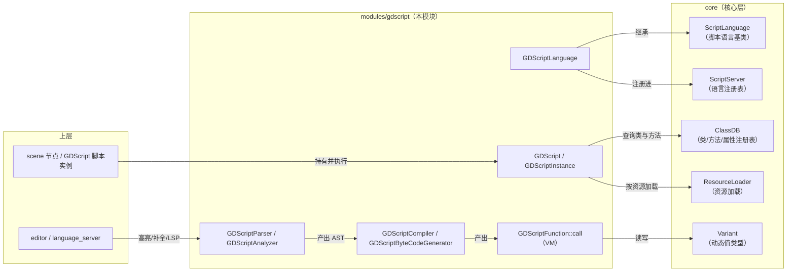
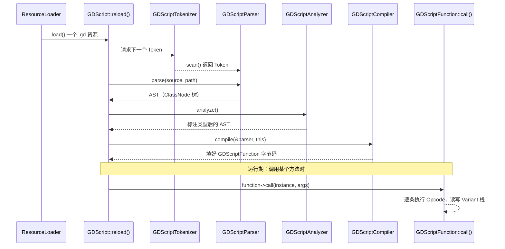

# gdscript（modules）

> 一句话：GDScript 是 Godot 的内置脚本语言，这个模块是它的「编译器 + 解释器」——把 `.gd` 文本翻译成字节码，再逐条跑起来。

**结论**：gdscript 模块负责把 GDScript 源码编译成字节码、并由内置虚拟机执行，服务对象是「所有写 `.gd` 脚本的 Godot 用户」；代价是它同时扛着编译（词法/语法/语义/代码生成）与运行（栈式 VM）两套重活，因此模块体量很大——顶层约 40 个源文件，外加 `editor/`、`language_server/`、`tests/` 三个子目录。

## 是什么 / 不是什么

它是一条「源码 → 可执行」的完整流水线：词法分析（tokenizer）→ 语法分析（parser）→ 语义分析（analyzer）→ 代码生成（compiler）→ 虚拟机（VM）执行。四个编译阶段和一台 VM，全在这个模块里。

它不是一门 AOT 编译成机器码的语言，也没有把字节码交给别的执行引擎——`.gd` 永远先被完整编译，字节码再被 `GDScriptFunction::call()` 这台栈式 VM 解释执行（`gdscript_vm.cpp:499`）。

它也不负责「注册引擎内置类」：GDScript 能认识 `Node2D`、能调用 `get_parent()`，是因为这些类和方法已经登记在核心层的 `ClassDB` 里，本模块只是通过 `ClassDB::get_method()` 去查询（`gdscript.cpp:110-121`）。

## 在引擎里的位置



## 关键概念

- **Token（词素）**：把源码切成不可再分的小块。比喻成「把句子拆成单词」。真实类锚点 `GDScriptTokenizer`（`gdscript_tokenizer.h:38`），其 `Token::Type` 枚举有上百种类型，含 `FUNC`、`INDENT`、`DEDENT` 等。
- **AST（抽象语法树）**：把 Token 按语法组织成树。比喻成「把单词拼成句子成分」。真实类锚点 `GDScriptParser`（`gdscript_parser.h:54`），所有节点都是 `GDScriptParser::Node` 的子类，如 `IfNode`、`FunctionNode`、`CallNode`。
- **类型推导（analysis）**：给 AST 每个节点标注类型、顺便做常量折叠。比喻成「检查句子是否通顺」。真实类锚点 `GDScriptAnalyzer`（`gdscript_analyzer.h:38`），分 `reduce_*`（给表达式定类型）与 `resolve_*`（处理语句/作用域）两类函数。
- **字节码与 VM**：编译器把 AST 翻译成 `GDScriptFunction::Opcode` 序列，VM 一条条执行。比喻成「把剧本改成舞台指令，演员按指令表演」。真实类锚点 `GDScriptFunction`（`gdscript_function.h:150`）与 `GDScriptByteCodeGenerator`（`gdscript_byte_codegen.h:40`）。
- **实例与语言门面**：`GDScript` 是一个「类」（编译产物），`GDScriptInstance` 是它的运行时实例；`GDScriptLanguage` 是模块对外的唯一入口，继承 `ScriptLanguage` 并注册进 `ScriptServer`（`gdscript.h:58/347/410`）。

## 核心文件（按阅读顺序）

1. `register_types.cpp` — 模块入口：`initialize_gdscript_module()` 注册 `GDScript` 类、把 `GDScriptLanguage` 挂进 `ScriptServer`、挂资源加载/保存器（`register_types.cpp:137-154`）。
2. `gdscript.h` — 三个核心类：`GDScript`（编译后的类）、`GDScriptInstance`（运行时实例）、`GDScriptLanguage`（语言门面）。
3. `gdscript_tokenizer.h` — 词法分析：`GDScriptTokenizerText` 处理文本，`GDScriptTokenizerBuffer` 处理导出的二进制 Token。
4. `gdscript_parser.h` — 语法分析 + AST 节点定义；`parse()` 是入口（`gdscript_parser.cpp:438`）。
5. `gdscript_analyzer.h` — 语义分析/类型推导，`GDScriptAnalyzer::analyze()`。
6. `gdscript_compiler.h` — 编译驱动器，`compile()` 把 AST 变成可执行的 `GDScriptFunction`。
7. `gdscript_byte_codegen.h` + `gdscript_codegen.h` — 字节码生成器（实现 `GDScriptCodeGenerator` 抽象接口）。
8. `gdscript_function.h` — 可执行函数：`Opcode` 枚举 + 栈帧布局 + `CallState`。
9. `gdscript_vm.cpp` — 虚拟机本体：`GDScriptFunction::call()` 的字节码分发循环。
10. `gdscript_cache.h` — 脚本缓存与分阶段加载（`get_shallow_script` / `get_full_script`）。

## 数据流 / 调用链

一次完整的「加载并编译一个 `.gd` 文件」走这条链，入口是 `GDScript::reload()`（`gdscript.cpp:780-902`）：



## 中文口诀

```
一段 GDScript，四步变字节。
Token 先切词，Parser 再搭树。
Analyzer 定类型，Compiler 造指令。
VM 读指令，栈上跑到底。
类靠 ClassDB，语言挂 Server。
要读主干，先看 reload。
```

## 练习（15 分钟）

1. 打开 `gdscript.cpp`，定位 `GDScript::reload()`（约 780 行），把 parse → analyze → compile 三个调用按顺序抄下来，对照本表确认各阶段的入口函数。
2. 打开 `gdscript_tokenizer.h` 的 `Token::Type` 枚举，找出 `INDENT`/`DEDENT` 在列表里的位置，理解 GDScript 用缩进块而非花括号。
3. 打开 `gdscript_function.h` 的 `Opcode` 枚举，数一数 `OPCODE_CALL*` 家族有几个成员，推测「调用」在 VM 里分了多少种形态。
4. 打开 `register_types.cpp`，找到 `ScriptServer::register_language` 那一行，确认 GDScript 是如何「挂进引擎」的。

## 自测

- [ ] `GDScript::reload()` 中，`parser.parse()` 和 `parser.parse_binary()` 二选一的判断依据是什么？（提示：看 `binary_tokens` 是否为空，`gdscript.cpp:814-818`。）
- [ ] 为什么 `GDScriptCompiler::_compile_class()` 不能依赖调用另一个类的 `_compile_class()` 得到的信息？（答案在 README 的「编译」一节。）
- [ ] VM 的本质是什么？`gdscript_vm.cpp` 里唯一真正需要读懂的入口函数叫什么？

## 一句话总结

> gdscript 模块是 Godot 的「语言运行时」：一条从 `.gd` 源码到字节码再到 VM 执行的完整流水线，通过 `ScriptServer` 挂进引擎、通过 `ClassDB` 认识引擎。
