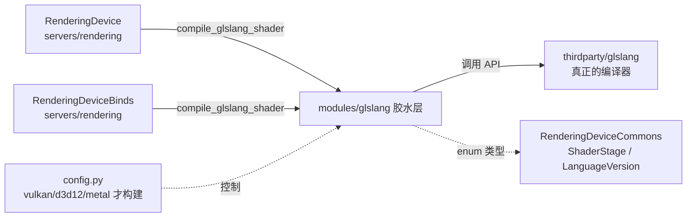
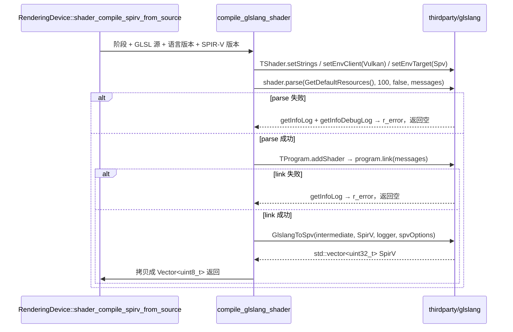

# glslang（modules）

> 一句话：它是 Godot 和第三方 glslang 编译器之间的一层「翻译胶带」——把 GLSL 源文本交出去，换回一堆 SPIR-V 字节。

**结论**：这个模块不写编译器，只做**薄封装**：把 `RenderingDevice` 送来的 GLSL 字符串喂给 thirdparty 里的 glslang，编译成 SPIR-V 字节数组还给渲染服务器，代价是替渲染层扛下 glslang 的进程级初始化和 API 细节。

## 是什么 / 不是什么

- 它**是** glslang（`thirdparty/glslang`）的胶水层：整个模块只有 1 个对外函数 `compile_glslang_shader`（`register_types.cpp:49`），外加一对初始化/反初始化函数。
- 它**不是**编译器本体：真正的词法/语法分析、中间表示、SPIR-V 生成全部在 `thirdparty/glslang/` 里，本文不展开。
- 它**不负责**解析 `#include`：调用方在进来之前就用 `ShaderIncludeDB::parse_include_files` 把 include 展开好了（`servers/rendering/rendering_device.cpp:234`）。
- 它**不注册任何可脚本化类**：`register_types.cpp` 里没有一行 `GDREGISTER_CLASS`，只有模块生命周期函数。

## 在引擎里的位置

只有两个调用方：`RenderingDevice::shader_compile_spirv_from_source`（`rendering_device.cpp:234`）和 `RenderingDeviceBinds` 里的一个点（`rendering_device_binds.cpp:201`）。依赖方向单向：渲染服务器 → 本模块 → thirdparty。

## 关键概念

1. **进程级开关**：glslang 用前要先 `InitializeProcess()`、用完 `FinalizeProcess()`，像开一次火、关一次火。这里在 `initialize_glslang_module` / `uninitialize_glslang_module` 里配对调用（`register_types.cpp:152`、`:160`）。
2. **枚举直转**：Godot 的 `ShaderLanguageVersion` / `ShaderSpirvVersion` 枚举值本身就是按 glslang 的编码写的（如 `SHADER_LANGUAGE_VULKAN_VERSION_1_1 = (1 << 22) | (1 << 12)`，`rendering_device_commons.h:620`），所以能直接 `(glslang::EShTargetClientVersion)p_language_version` 强转（`register_types.cpp:67-68`），不用写映射表。
3. **阶段映射表**：一个 `EShLanguage stages[SHADER_STAGE_MAX]` 数组把 Godot 的 10 个着色阶段（顶点/片元/细分控制/细分求值/计算/光追 5 种）对应到 glslang 的 `EShLangVertex`…`EShLangIntersect`（`register_types.cpp:51-62`）。
4. **调试信息开关**：是否往 SPIR-V 里塞调试信息由 `Engine::get_singleton()->is_generate_spirv_debug_info_enabled()` 决定，且 D3D12 下强制关闭，因为「SPIR-V → DXIL」转换不支持调试信息（`register_types.cpp:84-90`）。

## 核心文件（按阅读顺序）

1. `config.py` — 构建门槛：只有 `vulkan` / `d3d12` / `metal` 任一为真才编译本模块，OpenGL 不需要它（`config.py:1-4`）。
2. `SCsub` — 把 `thirdparty/glslang` 约 40 个 .cpp 和本模块 `*.cpp` 一起编进来，并给 thirdparty 关掉警告（`SCsub:13-80`）。
3. `shader_compile.h` — 唯一的公共头，声明 `compile_glslang_shader`（`shader_compile.h:35`）。
4. `register_types.h` — 定义 `MODULE_GLSLANG_HAS_PREREGISTER` 并声明生命周期函数（`register_types.h:33-38`）。
5. `register_types.cpp` — 全部实现：初始化、反初始化、以及 `compile_glslang_shader` 本体（`register_types.cpp:49-143`）。

## 数据流 / 调用链

主干是「**parse（语法）→ link（链接）→ GlslangToSpv（出 SPIR-V）**」三段（`register_types.cpp:99`、`:113`、`:134`），失败时把 `getInfoLog` / `getInfoDebugLog` 拼进 `r_error` 带回去。

## 中文口诀

- 胶水一层，不写编译器；GLSL 进，SPIR-V 出。
- 用前 InitializeProcess，用完 FinalizeProcess，开火关火成对来。
- 枚举值抄 glslang 编码，强转不建映射表。
- 阶段十个，映射一张 `stages[]` 表。
- parse 不过看 InfoLog，link 不过也看 InfoLog。
- D3D12 下调试信息强制关，DXIL 不吃这套。
- OpenGL 不用它，vulkan / d3d12 / metal 才构建。

## 练习（15 分钟）

1. 打开 `register_types.cpp:51-62`，数一数 `stages[]` 数组里 10 个 `EShLang*` 分别对应 Godot 的哪个 `SHADER_STAGE_*`，把映射写在纸上。
2. 在 `register_types.cpp:99` 打断点（或加临时 `print_line`），跑一个带 `.gdshader` 的项目，看一次 shader 编译是否命中 `shader.parse`。
3. 把 `register_types.cpp:75` 的 `std::string preamble = "";` 改成 `"#define FOO 1"` 再编译，确认它确实会注入到 shader 前导（验证 `setPreamble` 这条被闲置的路径）。
4. 看 `config.py:4`，确认当前平台下 `env["vulkan"]` / `env["d3d12"]` / `env["metal"]` 哪个是 True，解释为什么你的平台会/不会编进本模块。

## 自测

- [ ] `compile_glslang_shader` 的四个入参分别是什么类型？返回值的类型是什么？
- [ ] parse 失败和 link 失败，各用什么方法拿到错误信息并写回 `r_error`？
- [ ] 为什么 `ShaderLanguageVersion` 能直接强转成 `glslang::EShTargetClientVersion`？（提示：看 `rendering_device_commons.h:618-635` 的取值编码。）
- [ ] 本模块有没有注册任何 `Object` 派生类？依据是哪一行代码「没有」什么？
- [ ] `generate_spirv_debug_info` 在什么条件下会被强制置为 `false`？

## 一句话总结

> glslang 模块是第三方着色器编译器的一层「哑封装」：初始化 + 一个 `compile_glslang_shader` 函数，把 GLSL 文本交给 glslang 换成 SPIR-V 字节，仅此而已。
