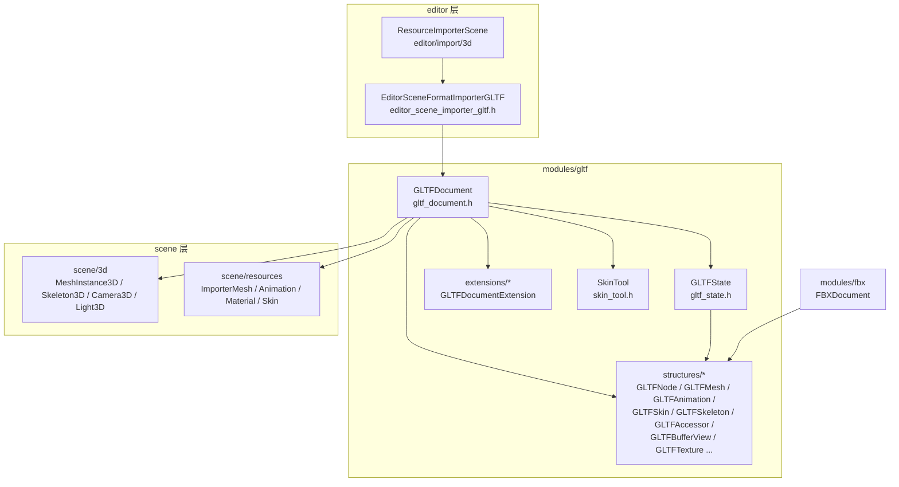
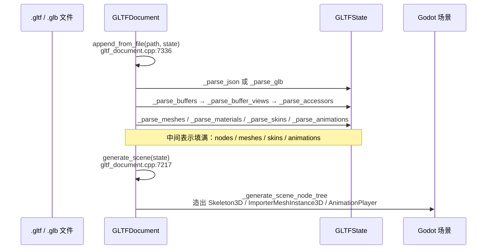

# gltf（modules）

> 一句话：gltf 模块是 Godot 与「glTF 2.0 文件」（`.gltf` / `.glb`）之间的**翻译官**——把 JSON 描述 + 二进制数据翻译成场景树，也能反向把场景树翻译回文件。

**结论**：gltf 模块负责把 glTF 2.0 文件解析成中间表示 `GLTFState`，再从它生成 Godot 场景/网格/动画（导入），以及反向导出；它服务于所有需要跨 DCC 工具交换 3D 模型的人，代价是「两头翻译」的工作量——核心实现集中在 `gltf_document.cpp`（6771 行）这一个巨类里。

## 是什么 / 不是什么

gltf 是**格式转换层**：它读文件、填 `GLTFState`、再从 `GLTFState` 造场景。它不负责 glTF 之外的格式（`.fbx` 是独立模块，但复用这里的结构类——`FBXDocument` 是 `GLTFNode`/`GLTFSkin`/`GLTFSkeleton` 的 `friend class`）；它不负责图片/压缩算法的具体实现（Ktx/WebP 纹理扩展只是调用了模块 `ktx`/`webp`）；它也不负责真正的渲染（生成的是 `ImporterMesh`/`MeshInstance3D`，交给 scene 层）。

模块自身的 README 用 5 行把分层讲得很清楚：`structures/` 是零件，`extensions/` 是可选项，`GLTFState` 装零件，`GLTFDocument` 操作零件，`editor/` 用 `GLTFDocument` 做导入导出（`modules/gltf/README.md`）。

## 在引擎里的位置



`GLTFDocument` 是唯一对外的操作入口，向下依赖 `GLTFState`（中间表示）和 `structures/`（结构类），向上被 `editor/` 的导入器调用。`modules/fbx` 不依赖 `GLTFDocument`，只借用它的结构类。

## 关键概念

- **中间表示 `GLTFState`**：像「卸货后的仓库」，把文件里的所有东西摊平成一个个数组——`nodes`、`meshes`、`materials`、`skins`、`skeletons`、`animations`、`accessors`…… 全部在这里（`gltf_state.h:49`）。解析和生成之间，数据就躺在它身上。
- **结构类 `structures/`**：像「零件」，一个 glTF 元素一个类。`GLTFNode` 记节点变换和孩子索引（`structures/gltf_node.h:37`），`GLTFMesh` 包着一个 `Ref<ImporterMesh>`（`structures/gltf_mesh.h:38`），`GLTFAnimation` 用 `Channel<T>` 存时间+值的轨道（`structures/gltf_animation.h:35`）。
- **解码器 `GLTFAccessor` / `GLTFBufferView`**：glTF 把顶点数据存成二进制 `buffer`，再用 `bufferView`（切片）+ `accessor`（解释切片成 float/vec3 等）描述。`GLTFDocument` 里一整套 `_decode_accessor_as_*` 就是把字节还原成 `PackedVector3Array` 等（`gltf_document.h:147-156`）。
- **扩展钩子 `GLTFDocumentExtension`**：glTF 靠扩展（`KHR_lights_punctual`、`KHR_materials_pbrSpecularGlossiness` 等）加功能。基类暴露 import/export 两套 `virtual` 钩子，子类只填自己关心的环节（`extensions/gltf_document_extension.h:37`）。
- **皮肤合成 `SkinTool`**：glTF 的 skin/skeleton 定义松散（joint 可以是任意节点），Godot 的 `Skeleton3D` 要求严格的骨骼树。`SkinTool` 是一堆 `static` 函数，专门负责「从松散的 joint 子图推导出合法的骨架」（`skin_tool.h:43`）。

## 核心文件（按阅读顺序）

1. `modules/gltf/register_types.cpp` — 模块入口。`initialize_gltf_module` 在 SCENE 层注册 17 个（+2 个物理 = 19 个）glTF 类，挂上 3~4 个文档扩展，TOOLS 下再注册编辑器导入器（`register_types.cpp:111`）。
2. `modules/gltf/gltf_document.h` / `gltf_document.cpp` — 核心巨类，6771 行。一条 `_parse` 一条 `_serialize`，加上公开的 `append_from_file` / `generate_scene` / `write_to_filesystem`。
3. `modules/gltf/gltf_state.h` / `gltf_state.cpp` — 中间表示，一堆 `Vector<Ref<...>>` 集合和 getter/setter。
4. `modules/gltf/structures/*.h` — 结构类，每个对应 glTF 一个元素，几乎都是薄数据壳。
5. `modules/gltf/extensions/gltf_document_extension.h` — 扩展基类，定义了 import/export 两套可覆写钩子。
6. `modules/gltf/skin_tool.h` / `skin_tool.cpp` — 皮肤/骨架的合成与校验，静态工具函数。
7. `modules/gltf/editor/editor_scene_importer_gltf.h` — 编辑器里的导入入口，对接 `ResourceImporterScene`。

## 数据流 / 调用链

导入一条线：文件 → 解析填 `GLTFState` → 从 `GLTFState` 生成场景。



导出是这条线的反向：`append_from_scene`（`gltf_document.cpp:7267`）把场景节点转成 `GLTFNode`，再由 `_serialize_meshes` / `_serialize_animations` 等写回 `GLTFState`，最后 `write_to_filesystem`（`gltf_document.cpp:7202`）落盘 `.gltf` + `.bin` 或单文件 `.glb`。

## 中文口诀

```
glTF 文件是个中转站，JSON 描述、二进制搬。
structures 是零件盒，accessor 解码出顶点。
GLTFState 是仓库，Document 是搬运员。
解析生成一条线，导出反向再走一遍。
皮肤松、骨架严，SkinTool 来捋直，
扩展功能别硬塞，钩子类里按需填。
```

## 练习（15 分钟）

1. 在 `gltf_document.cpp` 里找 `generate_scene`（约 7217 行），顺着它往下读，找到它调用的第一个 `_generate_scene_node*` 函数，确认「节点怎么逐个被造出来」。
2. 打开 `gltf_state.h`，数一下 `GLTFState` 里一共有多少个 `Vector<Ref<...>>` 成员，把它们和 glTF 规范里的顶层数组一一对上号。
3. 读 `register_types.cpp` 的 `initialize_gltf_module`，回答：为什么 `GLTFDocumentExtensionPhysics` 要「排在第一位」注册？提示看注释和 `GLTF_REGISTER_DOCUMENT_EXTENSION` 宏。

## 自测

- [ ] `GLTFDocument::append_from_file` 和 `append_from_buffer` 的区别在哪里（一个传路径一个传字节），它们最终都汇聚到哪个私有函数？
- [ ] 一个 `.glb` 文件里的二进制 buffer 是经过哪些步骤（buffer → bufferView → accessor）变成顶点数组的？说出对应的 `_parse_*` / `_decode_accessor_as_*` 函数名。
- [ ] `GLTFSkin` 的 `joints_original` 和 `joints` 两个字段有什么不同（`structures/gltf_skin.h`）？为什么 `SkinTool` 需要区分它们？

## 一句话总结

> gltf 模块是 Godot 的 glTF 2.0 翻译层：文件 ↔ `GLTFState` 中间表示 ↔ 场景树，导入导出共用同一条主线，结构类做零件、扩展钩子做可选功能、`SkinTool` 专啃「松散皮肤到严格骨架」这块硬骨头。
