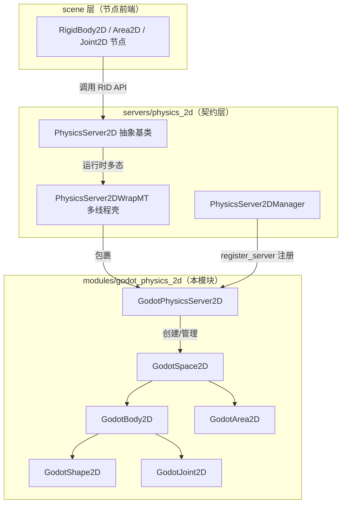
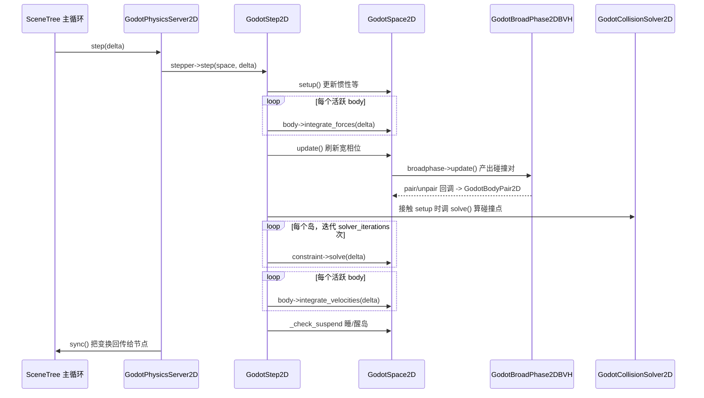

# godot_physics_2d（modules）

> 一句话：Godot 内置 2D 物理引擎——像一套「自研的迷你 Box2D」，专门填充 `servers/physics_2d` 那套抽象接口背后的空缺。

**结论**：这个模块是 Godot 引擎「默认 2D 物理服务器」的落地实现——它继承 `PhysicsServer2D` 契约，把刚体、区域、关节、碰撞检测、约束求解全部用自己的代码实现一遍，代价是维护约 33 个源文件的自研物理栈（对第三方物理库的依赖为零，但功能深度与稳定性全靠自己兜）。

## 是什么 / 不是什么

Godot 的物理系统被切成两层：`servers/physics_2d` 只定义**接口契约**（`PhysicsServer2D` 这个抽象基类），`modules/godot_physics_2d` 则给出**一份默认实现**。两者分工明确：

- **它负责**：把 `PhysicsServer2D` 里声明的每一个纯虚函数（shape/space/area/body/joint 的增删改查、`step`/`sync` 主循环、直接状态查询）真正实现出来，注册成一个名字叫 `"GodotPhysics2D"` 的服务器（`register_types.cpp:56`）。
- **它不负责**：定义接口本身（那是 `servers/physics_2d` 的事）；也不负责多线程壳——多线程由 `servers/physics_2d/physics_server_2d_wrap_mt.h` 的 `PhysicsServer2DWrapMT` 包在外面，本模块的 `GodotPhysicsServer2D` 只是被包在里面的「内核」（`register_types.cpp:49`）。

它和 `godot_physics_3d` 是两套独立代码，同样的问题在 2D/3D 各写一份；想换成第三方物理后端（如 Jolt），就注册另一个服务器名字替换默认值，本模块可整体被旁路。

## 在引擎里的位置

## 关键概念

- **服务器内核（Server）**：`GodotPhysicsServer2D` 继承 `PhysicsServer2D`（`godot_physics_server_2d.h:41`），持有 5 个 `RID_PtrOwner`（`shape_owner`/`space_owner`/`area_owner`/`body_owner`/`joint_owner`，`godot_physics_server_2d.h:60-64`），用 RID 句柄把「引擎侧拿到的数字句柄」翻译成「真实的对象指针」。
- **空间（Space）**：`GodotSpace2D`（`godot_space_2d.h:56`）是一张物理世界的容器，管着宽相位（`broadphase`）、活跃物体链表（`active_list`）和一个默认区域（`default_area`）。一个 world 对应一个 space。
- **碰撞对象（CollisionObject）**：`GodotCollisionObject2D`（`godot_collision_object_2d.h:40`）是 Body 和 Area 的公共基类，存碰撞层/掩码，并提供 `collides_with`（`godot_collision_object_2d.h:192`）做快速位掩码判定。
- **形状（Shape）**：`GodotShape2D`（`godot_shape_2d.h:45`）是几何体抽象基类，派生 `GodotCircleShape2D`、`GodotRectangleShape2D`、`GodotConvexPolygonShape2D`、`GodotConcavePolygonShape2D` 等 8 种；每种形状都要实现 `project_range`（投影）和 `get_supports`（支持点），这是 SAT 求解器的原料。
- **约束（Constraint）**：`GodotConstraint2D`（`godot_constraint_2d.h:35`）定义 `setup/pre_solve/solve` 三步虚接口。接触（`GodotBodyPair2D`）、区域重叠（`GodotAreaPair2D`）和关节（`GodotJoint2D`）都是它的子类，统一进求解器循环。

## 核心文件（按阅读顺序）

1. `register_types.cpp` — 模块入口，注册 `"GodotPhysics2D"` 服务器并设为默认（`register_types.cpp:56-57`）。
2. `godot_physics_server_2d.h` — 服务器内核接口，`PhysicsServer2D` 契约的全部 override 声明。
3. `godot_space_2d.h` — 物理世界容器与直接状态查询 `GodotPhysicsDirectSpaceState2D`。
4. `godot_body_2d.h` — 刚体，速度/质量/惯性/力冲量积分，接触记录。
5. `godot_area_2d.h` — 区域，重力/阻尼覆盖与 monitor 回调。
6. `godot_shape_2d.h` — 8 种形状的几何实现（投影 + 支持点）。
7. `godot_collision_solver_2d.h` — 碰撞求解器静态入口 `solve`（`godot_collision_solver_2d.h:46`）。
8. `godot_collision_solver_2d_sat.h` — SAT 穿透计算 `sat_2d_calculate_penetration`。
9. `godot_broad_phase_2d.h` / `godot_broad_phase_2d_bvh.h` — 宽相位抽象与 BVH 实现 `GodotBroadPhase2DBVH`。
10. `godot_constraint_2d.h` — 约束基类，岛式求解的统一抽象。
11. `godot_body_pair_2d.h` — 刚体接触约束，每个接触对最多 `MAX_CONTACTS = 2`（`godot_body_pair_2d.h:38`）。
12. `godot_joints_2d.h` — Pin/Groove/DampedSpring 三种关节（`godot_joints_2d.h:75/120/154`）。
13. `godot_step_2d.h` — 单步推进器 `GodotStep2D`，主循环在这里。

## 数据流 / 调用链

主循环的真实顺序钉在 `godot_step_2d.cpp:130-299`：积分力 → 更新宽相位 → 生成岛 → setup 约束 → pre-solve → solve（可多线程）→ 积分速度 → 睡眠检测。

## 中文口诀

- 服务器是内核，多线程壳外包，`register_types` 挂名号。
- 空间装万物，宽相位先粗筛，接触对再细算。
- 形状管投影，支持点给 SAT，凸多边形最要命。
- 约束三步走：setup 备料、pre_solve 筛、solve 反复叠。
- 先积分力，再算碰撞，后积分速度，最后睡大觉。
- 刚体是 Body，触发用 Area，关节 Contact 都叫约束。

## 练习（15 分钟）

1. 打开 `godot_step_2d.cpp` 的 `step()`，对照 `godot_space_2d.h:58-66` 的 `ElapsedTime` 枚举，把五个阶段与代码顺序一一对应，标出哪两个阶段用了 `WorkerThreadPool` 并行。
2. 在 `godot_shape_2d.h` 里找到 `GodotCircleShape2D::project_range`（约 `godot_shape_2d.h:282`），手算一个「半径 1、圆心 (0,0) 的圆在法线 (1,0) 上的投影区间」，验证等于 `[-1, 1]`。
3. 从 `godot_body_pair_2d.h:36` 的类声明出发，画出 `GodotBodyPair2D → GodotConstraint2D → GodotBody2D` 的继承/组合关系草图。

## 自测

- [ ] `register_types.cpp:56` 注册的服务器字符串名字是什么？它调用的是哪个类的哪个静态方法？
- [ ] `GodotBody2D` 里 `apply_impulse` 是同时改线性速度和角速度的，`apply_central_impulse` 为什么只改线性速度？（提示：看 `godot_body_2d.h:228-239` 里 `(p_position - center_of_mass).cross(p_impulse)` 这一项何时为零。）
- [ ] 宽相位返回的「碰撞对」为什么要放进岛（island）再求解？`godot_step_2d.cpp:95-104` 的 `_solve_island` 外层循环变量 `iterations` 来自哪里？

## 一句话总结

> `godot_physics_2d` 是 `servers/physics_2d` 契约的默认自研实现——用「宽相位粗筛 + SAT 细算 + 岛式约束求解」三件套，在零第三方依赖下把 2D 物理跑起来。
