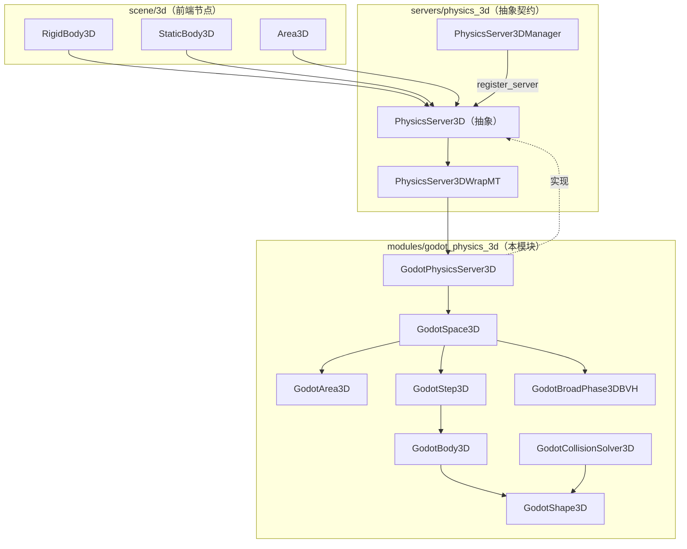
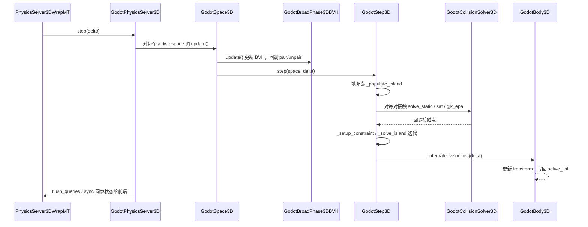

# godot_physics_3d（modules）

> 一句话：它就是 Godot 自带的那台「3D 刚体物理引擎」——场景里的 `RigidBody3D` 掉到地上、撞在一起弹开，背后都是这台引擎在算，而它自己只是 `servers/physics_3d` 那套抽象接口的一份具体实现。

**结论**：`godot_physics_3d` 是 Godot 内置的 3D 物理后端，用 `GodotPhysicsServer3D` 实现 `servers/physics_3d` 定义的 `PhysicsServer3D` 契约，为所有 3D 碰撞体提供刚体动力学、形状碰撞检测、关节与软体；代价是它是一份纯 CPU、进程内的求解器，精度与性能都受这份手写实现约束，想换引擎要换掉整个后端。

## 是什么 / 不是什么

它**负责**：把 `PhysicsServer3D` 那套 RID 接口变成真实存在的对象——刚体（`GodotBody3D`）、区域（`GodotArea3D`）、软体（`GodotSoftBody3D`）、关节（`GodotJoint3D`）、形状（`GodotShape3D`），并每个物理帧把它们推进一次（积分力、生成岛、解约束、积分速度）。

它**不负责**：定义接口本身。`PhysicsServer3D`、`PhysicsDirectSpaceState3D`、`PhysicsServer3DManager` 这些抽象类和注册机制都在 `servers/physics_3d/`，这个模块只是往管理器里登记一个名字叫 `"GodotPhysics3D"` 的实现（`register_types.cpp:56`）。它也不负责场景节点的 API——`RigidBody3D` 等节点属于 `scene/3d/`，节点把调用转发给服务器，服务器再落到这个模块。

## 在引擎里的位置



节点只认 `PhysicsServer3D` 这一张脸；管理器把 `"GodotPhysics3D"` 这个名字指向 `GodotPhysicsServer3D`（`register_types.cpp:56-57`），多线程下再套一层 `PhysicsServer3DWrapMT`（`register_types.cpp:49`）。真正的对象都活在 `GodotSpace3D`（空间）里。

## 关键概念

- **空间 Space**：一整个物理世界。比喻成「房间」，所有刚体/区域/软体都放进某个房间才参与计算。术语 `GodotSpace3D`（`godot_space_3d.h:58`），服务器用 `space_owner` 存所有空间（`godot_physics_server_3d.h:59`）。
- **形状 Shape**：碰撞的几何描述，跟「会不会动」无关。比喻成「模具」，一个盒子模具可以套在静态墙上，也能套在飞行的木箱上。术语 `GodotShape3D` 抽象基类（`godot_shape_3d.h:47`），派生出一串：`GodotSphereShape3D`、`GodotBoxShape3D`、`GodotCapsuleShape3D`、`GodotConcavePolygonShape3D`、`GodotHeightMapShape3D` 等（`godot_shape_3d.h:114-445`）。
- **碰撞对象 / 刚体**：能持有多个形状、带碰撞层/掩码、可放进空间的实体。`GodotCollisionObject3D` 是父类（`godot_collision_object_3d.h:46`），分三种 `Type`：`TYPE_AREA` / `TYPE_BODY` / `TYPE_SOFT_BODY`。`GodotBody3D` 在它之上加质量、惯性、线/角速度、冲量（`godot_body_3d.h:41`）。
- **约束 Constraint**：求解器在每帧要满足的「规则」。比喻成「拉绳/门铰链」，把两个刚体钉在一起或规定它们只能怎样动。术语 `GodotConstraint3D`，纯虚 `setup / pre_solve / solve` 三段（`godot_constraint_3d.h:76-78`）；碰撞本身也是约束——`GodotBodyPair3D` 继承自约束（`godot_body_pair_3d.h:72`）。
- **步进器 Stepper**：每帧推进的主循环。比喻成「导演」，按固定剧本走：生成岛 → 建约束 → 解约束 → 积分速度。术语 `GodotStep3D`（`godot_step_3d.h:37`），`GodotSpace3D::ElapsedTime` 枚举就是这个剧本的分镜（`godot_space_3d.h:60-68`）。

## 核心文件（按阅读顺序）

1. `register_types.cpp` — 入口：在 `MODULE_INITIALIZATION_LEVEL_SERVERS` 时把 `"GodotPhysics3D"` 注册进 `PhysicsServer3DManager` 并设为默认（第 52-58 行）。
2. `godot_physics_server_3d.h` — 服务器本体 `GodotPhysicsServer3D`，继承 `PhysicsServer3D`，声明全部 `override` 接口与 RID 持有者。
3. `godot_shape_3d.h` — 形状体系：抽象基类 + 凸/凹两大类，每个形状都要实现 `project_range`、`get_support`、`intersect_segment` 等。
4. `godot_collision_object_3d.h` — 碰撞对象基类：形状列表、层/掩码、`collides_with` / `interacts_with` 判定。
5. `godot_space_3d.h` — 空间：持有 broadphase、活跃列表、直接状态 `GodotPhysicsDirectSpaceState3D`。
6. `godot_body_3d.h` — 刚体：质量/惯性/速度/冲量/休眠，`integrate_forces` 与 `integrate_velocities`。
7. `godot_step_3d.h` — 步进器：岛（island）的填充与求解。
8. `godot_collision_solver_3d.h` — 碰撞求解器入口：`solve_static` / `solve_distance`，凸/凹分发。
9. `godot_broad_phase_3d_bvh.h` — 宽相：用 `BVH_Manager` 快速筛出可能碰撞的候选对。
10. `godot_body_pair_3d.h` — 刚体对约束：把一对碰撞的接触点变成可解的约束，含 CCD。

## 数据流 / 调用链



一次 `step` 的关键分工：`GodotSpace3D` 管「谁和谁在一个房间」，`GodotBroadPhase3DBVH` 管「谁可能撞谁」（快速排除不可能的对），`GodotCollisionSolver3D` 管「真的撞了吗、撞多深」（SAT 处理凸对，GJK/EPA 处理更一般凸对，`godot_collision_solver_3d_sat.h:35`、`gjk_epa.h:36`），`GodotStep3D` 管「把接触变成约束去解」。

## 中文口诀

```
空间装万物，形状是模具；
对象挂形状，刚体加惯性。
宽相先筛对，窄相算接触；
接触变约束，迭代把力解。
先积分速度，再同步状态；
想换别家引擎，只换服务器。
```

## 练习（15 分钟）

1. 打开 `register_types.cpp`，找到 `_createGodotPhysics3DCallback`，回答：多线程开关 `physics/3d/run_on_separate_thread` 是在哪里读的？返回的服务器外面为什么还要套一层 `PhysicsServer3DWrapMT`？
2. 打开 `godot_physics_server_3d.h` 第 81-90 行，数一数 `*_shape_create` 一共暴露了几种形状；再到 `godot_shape_3d.h` 里给每种形状找对应的类。
3. 打开 `godot_step_3d.h`，读 `_populate_island` 和 `_solve_island` 的声明，用一句话说清楚「岛（island）」是什么、为什么要分岛。
4. 打开 `godot_body_pair_3d.h`，找到 `MAX_CONTACTS` 的值，说明一对刚体最多保留几个接触点、多余的最浅点会被怎么处理（结合 `godot_body_3d.h` 里 `add_contact` 的实现）。

## 自测

- [ ] `GodotPhysicsServer3D` 是通过哪个管理器、用哪个字符串名字注册的？默认服务器是不是它？
- [ ] `PhysicsServer3D::step`、`sync`、`flush_queries` 三个动作分别在物理帧的什么时机发生（谁在前谁在后）？
- [ ] 一个 `GodotBody3D` 和一个 `GodotArea3D` 都是 `GodotCollisionObject3D`，它们最本质的区别在 `Type` 的哪个取值上体现？
- [ ] `GodotCollisionSolver3D::solve_static` 遇到「凸 vs 凹」时走哪条路径（提示：`solve_concave` 里的 `concave_callback`）？

## 一句话总结

> `godot_physics_3d` 是 Godot 内置的 3D 物理后端，把 `servers/physics_3d` 的抽象接口落成一套真实的刚体动力学求解器，主干是「空间 → 宽相筛选 → 窄相接触 → 岛式求解 → 积分同步」。
