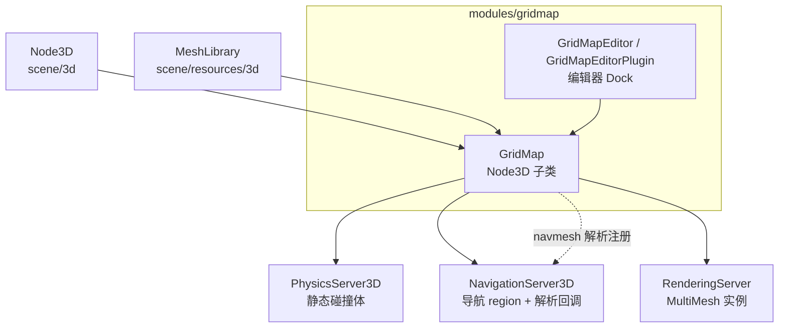
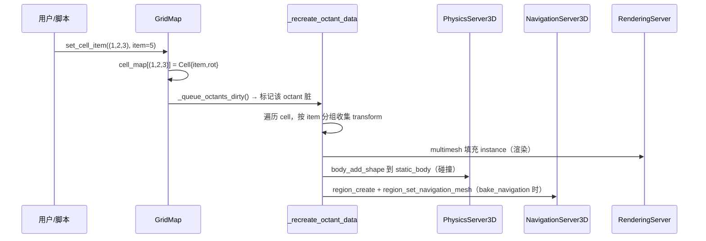

# GridMap（modules）

> 一句话：GridMap 是 3D 版的「乐高底板」——你在一个整数坐标的立方体网格上摆放 `MeshLibrary` 里的预制件（带网格、碰撞、导航），引擎帮你把它们压成多实例渲染 + 静态碰撞体 + 导航区域三份东西。

**结论**：GridMap 给 3D 场景提供「按格子铺地砖 / 砌墙」的批量建模能力，为关卡编辑器服务；代价是它只认整格、只认同一套 `MeshLibrary`，粒度粗、不灵活，且不继承 `VisualInstance3D`，没法按可视层做 cull。

## 是什么 / 不是什么

GridMap 负责「在一个均匀的三维网格里，记录每个格子放了哪个 tile（以及朝向），并把它们高效地渲染、碰撞、导航化」。它本质是一个**稀疏存储的整数坐标表**（`cell_map`），而不是一堆真实节点。

- 它**是**：一个 `Node3D` 子类，靠 `MeshLibrary` 定义「有哪些 tile 可放」，靠 `set_cell_item` 摆放（`grid_map.h:299`）。
- 它**不是**：每格一个真实 `MeshInstance3D`。渲染走 `MultimeshInstance`（八叉体里的多实例），碰撞走每个 octant 一个 `static_body`（`grid_map.h:135`），导航走每个 tile 一个 `region`（`grid_map.cpp:770`）。
- 它**不管** 2D 瓦片（那是 `TileMap`）；也不管怎么把网格烘焙成光照图（那是 `LightmapGI`，GridMap 只负责 `make_baked_meshes` 合并出可烘焙的网格）。

## 在引擎里的位置

GridMap 是 scene 层之上的可选模块：它继承 `Node3D`，运行时直接调用三个单例 server 建资源，编辑期靠自己的 `EditorPlugin` 提供摆放 UI。

- 模块入口 `register_types.cpp:43` 在 `MODULE_INITIALIZATION_LEVEL_SCENE` 阶段注册 `GridMap`，并在 `NAVIGATION_3D` 未禁用时调 `GridMap::navmesh_parse_init()`。
- 编辑期额外注册 `GridMapEditorPlugin`（`register_types.cpp:52`），它继承 `EditorPlugin`，为 3D 视口提供画笔 / 橡皮 / 选区 / 粘贴。

## 关键概念

- **Cell（单元格）**：一个整数坐标上的「坑位」。`Cell` 是个 32 位联合体，只存 `item`(16 位 tile 索引) + `rot`(5 位朝向) + `layer`(8 位)（`grid_map.h:91-97`）——一格只占 4 字节。
- **Octant（八分体）**：一批 cell 的「分区桶」。默认 `octant_size = 8`（`grid_map.h:176`），即每个 octant 是 8×8×8 个 cell 的棱柱，用于把大世界切成小块，改一块只重建一块。
- **MeshLibrary（网格库）**：tile 的「货架」，每个条目是一块 `Mesh` + 可选碰撞 `ShapeData` + 可选导航 `NavigationMesh`（`grid_map.h:747,763`）。GridMap 只存 tile 编号，不存几何。
- **24 个正交朝向**：tile 只能转「对齐坐标轴」的角度。`get_basis_with_orthogonal_index` / `get_orthogonal_index_from_basis`（`grid_map.h:303-304`）把任意朝向量化为 0~23 这 24 个方向之一。
- **烘焙导航**：`bake_navigation = true` 时，每格带导航网的 tile 都会生成一个导航 `region` 挂到导航地图上（`grid_map.cpp:769-782`）。

## 核心文件（按阅读顺序）

1. `register_types.cpp` — 模块入口：注册 `GridMap` 类，并初始化导航解析回调。
2. `grid_map.h` — 全部公共接口与内部结构（`Cell` / `Octant` / `IndexKey` / `OctantKey`），是理解主干的第一站。
3. `grid_map.cpp`（约 2000 行）— 核心实现：`_recreate_octant_data()` 把一个 octant 拆成 multimesh + 静态碰撞体 + 导航区域。
4. `editor/grid_map_editor_plugin.h` / `.cpp`（约 1780 行）— 编辑器 Dock：画笔、橡皮、选取、旋转、粘贴的交互。
5. `config.py` — 声明 `disable_3d` 时不可编译，暴露文档类 `GridMap` / `GridMapEditorPlugin`。
6. `doc_classes/GridMap.xml` — 脚本暴露的方法 / 属性 / 信号 / 常量的唯一文档来源。

## 数据流 / 调用链

一次「在格子 (1,2,3) 放 5 号 tile」的完整路径：

补充一条反向链路：当 `NavigationMesh` 的 `NavigationRegion3D` 做**运行时烘焙**时，`NavigationServer3D` 会回调 `GridMap::navmesh_parse_source_geometry`（`grid_map.cpp:1729`），按「网格实例」或「静态碰撞体」两种解析模式，把 GridMap 的几何喂给烘焙管线。

## 中文口诀

- 格子坐标存 `cell_map`，一格四字节不贪多。
- 八分体（octant）切大图，改一格只刷一桶。
- 货架叫 `MeshLibrary`，网格碰撞导航三合一。
- 渲染走 multimesh，碰撞走 static body，导航走 region。
- 摆放只调 `set_cell_item`，朝向二十四选一。
- 要进导航先开 `bake_navigation`，要进光照先 `make_baked_meshes`。

## 练习（15 分钟）

1. 打开 `grid_map.h`，找到 `Cell` 联合体，写出 `item` / `rot` / `layer` 各自的位宽，算出一个 cell 占几字节。
2. 在 `grid_map.cpp` 里搜 `_recreate_octant_data`，找出渲染、碰撞、导航三处分别调用了哪个 server 的哪个函数（各记一行）。
3. 读 `grid_map.cpp:769-782`，回答：`bake_navigation = false` 时，`Octant::NavigationCell` 还会被创建吗？`region` RID 还有效吗？

## 自测

- [ ] `get_cell_item` 对空格子返回什么？（提示：`grid_map.h:247` 的 `INVALID_CELL_ITEM`。）
- [ ] `octant_size` 默认是几？`cell_size` 默认 `Vector3` 是几？（`grid_map.h:175-176`。）
- [ ] GridMap 为什么不能按 `VisualInstance3D.layers` 做 cull？（见 `doc_classes/GridMap.xml` 的 note。）
- [ ] 导航烘焙时，`navmesh_parse_source_geometry` 支持哪两种 `ParsedGeometryType`？（`grid_map.cpp:1741,1752`。）

## 一句话总结

> GridMap 用一个稀疏的「整数坐标 → tile 编号」表，把大批同源网格合并成 multimesh 渲染 + 静态碰撞体 + 导航区域，是 3D 关卡快速搭建的省事方案，代价是粒度粗、只认整格。
