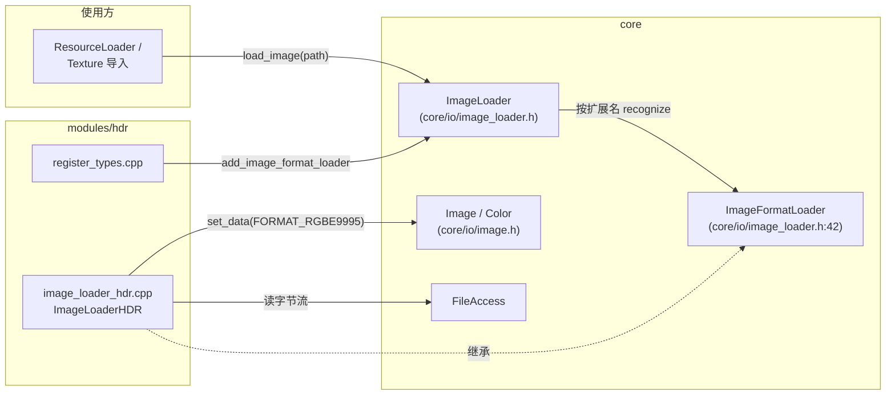
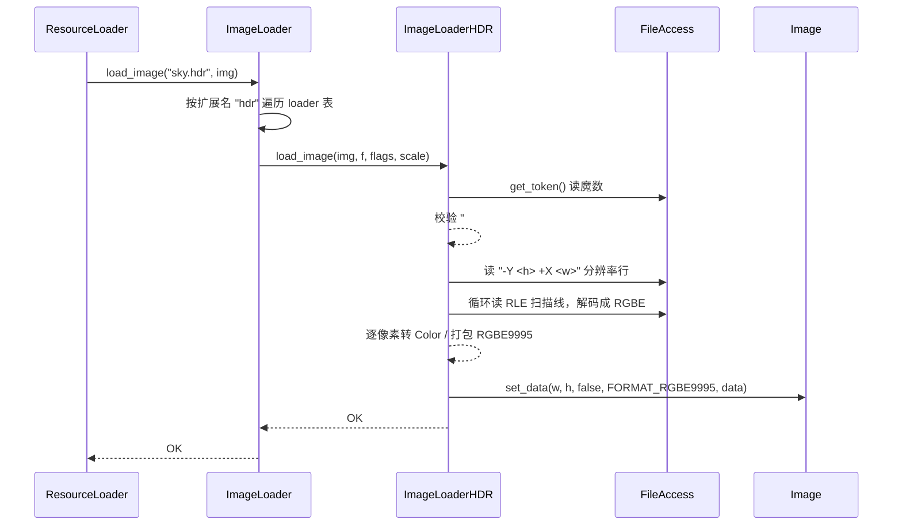

# hdr（modules）

> 一句话：一个「翻译官」，把磁盘上的 Radiance HDR（`.hdr`）RGBE 文件翻译成引擎内部能直接用的 `Image::FORMAT_RGBE9995` 像素数据。

**结论**：`hdr` 模块给 Godot 的图片加载框架（`ImageLoader`）注册一个 `ImageLoaderHDR` 格式加载器，让引擎能读 `.hdr` 高动态范围图片；代价是它只认 Radiance 的 `32-bit_rle_rgbe` 一种编码，其他 HDR 变体直接报错。

## 是什么 / 不是什么

- 它**是**一个图片格式加载器：实现 `ImageFormatLoader` 接口（`core/io/image_loader.h:42`），把自己挂进 `ImageLoader` 的加载器表里。
- 它**是**一份手写的、无第三方依赖的解析器——源码只有 6 个文件、核心逻辑约 120 行，没有 `thirdparty/` 目录，不薄封装任何外部库（对比 `basis_universal`、`astcenc` 那种「编译第三方库 + 一层胶水」的模块）。
- 它**不是**独立的图片格式类（不定义 `Image` 新枚举，直接用现成的 `FORMAT_RGBE9995`，`core/io/image.h:91`）；也不负责 HDR 显示 / 色调映射 / 压缩，那些归渲染层。

## 在引擎里的位置

## 关键概念

- **加载器注册表**：`ImageLoader` 内部用一个 `Vector<Ref<ImageFormatLoader>>` 存所有加载器（`core/io/image_loader.h:86`），谁认识这个扩展名谁就上。`hdr` 模块启动时把自己塞进这张表。
- **`ImageLoaderHDR`**：本模块唯一的类，继承 `ImageFormatLoader`，只覆写两个虚函数 `load_image` 和 `get_recognized_extensions`（`modules/hdr/image_loader_hdr.h:35`）。
- **RGBE 编码**：Radiance 格式把每个像素存成 R/G/B 三个 8bit 尾数 + 一个 8bit 共享指数 E，用极小的空间存超大动态范围。加载后统一转成引擎自带的 `FORMAT_RGBE9995` 格式（R/G/B 各 9bit 尾数 + 5bit 共享指数）。
- **`FLAG_FORCE_LINEAR`**：`ImageFormatLoader::LoaderFlags` 里的一个位（`core/io/image_loader.h:51`），置位时解码结果会额外做一次 `srgb_to_linear` 颜色空间转换（`modules/hdr/image_loader_hdr.cpp:135`）。

## 核心文件（按阅读顺序）

1. `modules/hdr/config.py` — 构建钩子，`can_build` 恒返回 `True`，任何平台都编译。
2. `modules/hdr/SCsub` — 把目录下所有 `*.cpp` 加进 `env.modules_sources`。
3. `modules/hdr/register_types.h` — 声明 `initialize_hdr_module` / `uninitialize_hdr_module`。
4. `modules/hdr/register_types.cpp` — 在 `MODULE_INITIALIZATION_LEVEL_SCENE` 阶段 `instantiate` 加载器并 `add_image_format_loader` 注册。
5. `modules/hdr/image_loader_hdr.h` — 声明 `ImageLoaderHDR` 类。
6. `modules/hdr/image_loader_hdr.cpp` — 全部解析逻辑：读头、读分辨率、解 RLE、转 RGBE9995。

## 数据流 / 调用链

一次加载 `.hdr` 图片的典型调用：

解析主干在 `load_image`（`modules/hdr/image_loader_hdr.cpp:33`）：

1. 读第一个 token，必须是 `#?RADIANCE` 或 `#?RGBE`，否则 `ERR_FILE_UNRECOGNIZED`（:36）。
2. 逐行读 header，空行结束；只接受 `FORMAT=32-bit_rle_rgbe`，其他 `FORMAT=` 报错，`#` 开头当注释忽略（:38-49）。
3. 读分辨率行，格式固定 `-Y <height> +X <width>`（:51-61）。
4. 按宽度分两条路：`width < 8 || width >= 32768` 走 flat 原始数据（:74-77），否则按 RLE 扫描线解码（:79-122）。
5. 逐像素把 RGBE 转成 `FORMAT_RGBE9995`：指数在 [-15, 15] 区间内直接位移打包（:141-144），否则或置了 `FLAG_FORCE_LINEAR` 时走浮点 `pow` + `to_rgbe9995` 慢路径（:131-139）。
6. 最后 `p_image->set_data(..., FORMAT_RGBE9995, imgdata)`（:150）。

## 中文口诀

> Radiance 头，魔数先看；RGBE 编码，共享指数。
> 分辨率行，`-Y` 高度 `+X` 宽；超窄超宽，走 flat 平铺。
> RLE 扫描，二二开头；指数偏中间，位移快打包。
> 强开线性，`srgb_to_linear`；九尾五指数，RGBE9995 收尾。

## 练习（15 分钟）

1. 打开 `modules/hdr/image_loader_hdr.cpp`，数一下 `load_image` 里一共用了几种 `ERR_*` 宏，各自对应什么异常（魔数错 / 分辨率行错 / 扫描线长度错）。
2. 在 `:129-144` 的转换循环里，指出「快路径」和「慢路径」的分界条件是什么，为什么指数落在 [-15, 15] 就能直接位移打包。
3. 读 `core/io/image_loader.h:85-99`，画一张 `ImageLoader` 加载器表的 add / remove / recognize 三者关系草图，说明 `hdr` 是如何被「按扩展名匹配」到的。

## 自测

- [ ] `ImageLoaderHDR` 覆写了基类 `ImageFormatLoader` 的哪两个纯虚函数？各自在哪一行实现？
- [ ] 为什么 `width == 8` 的 `.hdr` 文件会走 flat 分支而不是 RLE 分支？（提示：看 `:74` 的判断）
- [ ] 模块卸载时（`uninitialize_hdr_module`）做了哪两件事，顺序为何不能反？

## 一句话总结

> `hdr` 是一个自包含、零依赖的 Radiance HDR 格式加载器，通过实现 `ImageFormatLoader` 接口把 `.hdr` 的 RGBE 数据接进 Godot 统一的 `ImageLoader` 体系，输出为 `FORMAT_RGBE9995`。
