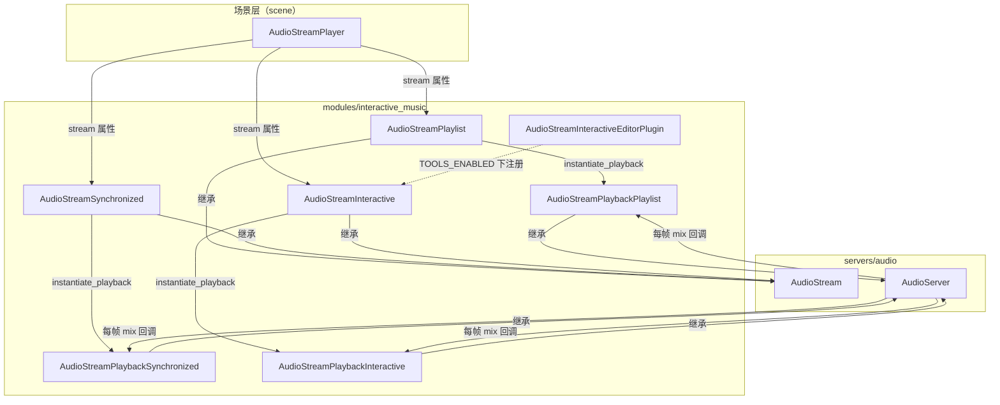
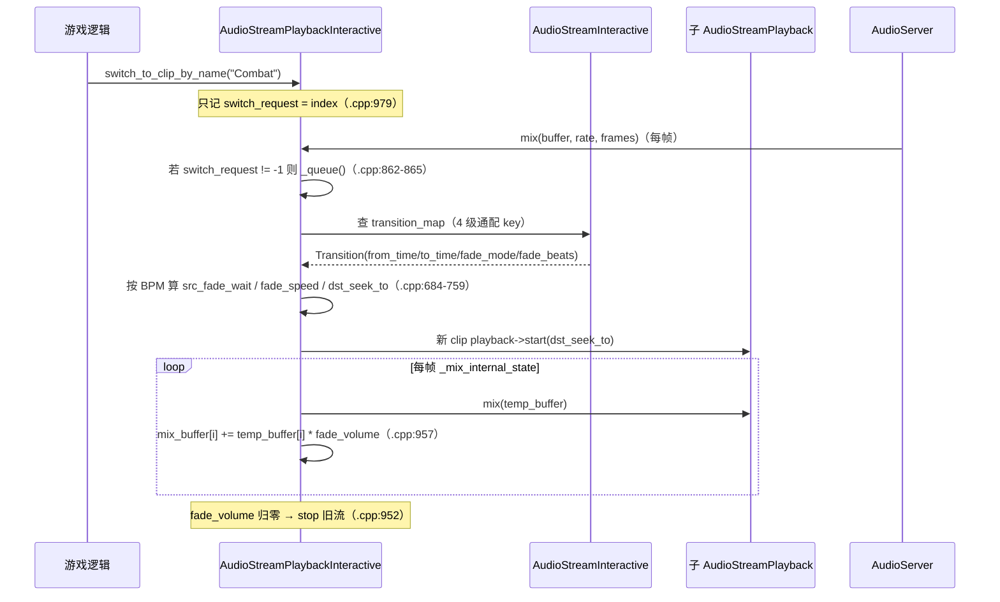

# interactive_music（modules）

> 一句话：这是 Godot 自带的「游戏配乐编排器」——把多段音频当成乐高，按 BPM 对齐地拼、切、叠、循环，而不是一段段硬播。

**结论**：`interactive_music` 模块提供 3 个「meta 音频流」（`AudioStreamPlaylist`、`AudioStreamSynchronized`、`AudioStreamInteractive`），它们自己不解码任何采样，只负责调度手下的一堆子 `AudioStream`：顺序/随机循环、多层同步叠加、按拍/小节对齐的带淡入淡出切换。代价是这些类都返回 `is_meta_stream() == true`，无法 seek、无独立 `get_length()`，播放逻辑全在 playback 侧手写。

## 是什么 / 不是什么

- **是**音频资源的调度层：每个类都继承 `AudioStream`，重写 `instantiate_playback()` 返回一个配套的 `AudioStreamPlayback`，由 `AudioServer` 在混音线程反复调用 `mix()` 把子流的采样叠出来。
- **不是**采样解码器：不碰 PCM 数据，解码交给子流自己（`AudioStreamWAV`、`AudioStreamMP3` 等）；它也不处理 3D 空间、不处理音频总线/效果（那是 `AudioStreamPlayer` / `AudioServer` / `AudioEffect` 的活）。
- **不是**节点：它是 Resource，挂到 `AudioStreamPlayer.stream` 上使用。

三个类对应游戏配乐的三条主线（本模块的全部内容）：

| 类 | 主线 | 一句话 |
| --- | --- | --- |
| `AudioStreamSynchronized` | 分层 | 多轨同起同停，每轨独立音量（dB） |
| `AudioStreamInteractive` | 过渡 | 若干 clip 之间按拍/小节对齐、带 fade 地切换 |
| `AudioStreamPlaylist` | 循环 | 一串曲子顺序或随机播放，交叉淡入淡出 |

## 在引擎里的位置

锚点：三个 stream 类与三个 playback 类的继承关系见 `audio_stream_playlist.h:37`、`audio_stream_synchronized.h:37`、`audio_stream_interactive.h:37`；它们统一 `#include "servers/audio/audio_stream.h"`（`audio_stream_interactive.h:33`）。

## 关键概念

1. **meta stream（元音频流）**：自己不产采样、只调度别人的 `AudioStream`。三个类的 `is_meta_stream()` 都返回 `true`（如 `audio_stream_interactive.h:185`）。比喻：乐团指挥不发声，只负责挥棒子。
2. **clip（片段）**：`AudioStreamInteractive` 里的一个命名音频段，存在定长数组 `Clip clips[MAX_CLIPS]`（`audio_stream_interactive.h:88`、`96`），上限 `MAX_CLIPS = 63`（`audio_stream_interactive.h:84`，注释说明因为用位掩码匹配过渡）。
3. **transition（过渡）**：从 clip A 切到 clip B 的规则，存在 `HashMap<TransitionKey, Transition, TransitionKeyHasher> transition_map`（`audio_stream_interactive.h:127`）。每条规则有 `from_time`（何时开始切）、`to_time`（目标从哪播）、`fade_mode`、`fade_beats`（`audio_stream_interactive.h:98-106`）。
4. **CLIP_ANY 通配过渡**：`CLIP_ANY = -1`（`audio_stream_interactive.h:71-73`），过渡查表时按「具体→具体 → 具体→任意 → 任意→具体 → 任意→任意」四级回退（`audio_stream_interactive.cpp:646-651`），省去为每对 clip 都配一条过渡。
5. **filler clip / hold_previous（过渡垫片 / 记住前曲）**：过渡可以用一段「垫片」音频填满等待期（`filler_clip`，`audio_stream_interactive.h:103-104`），或标记 `hold_previous` 让切走时记住来处，配合 `AutoAdvanceMode::AUTO_ADVANCE_RETURN_TO_HOLD` 播完自动跳回（`audio_stream_interactive.h:66-69`）。

## 核心文件（按阅读顺序）

1. `register_types.cpp` — 入口：`MODULE_INITIALIZATION_LEVEL_SCENE` 下 `GDREGISTER_CLASS` 注册 6 个类，`MODULE_INITIALIZATION_LEVEL_EDITOR` 下注册编辑器插件（`register_types.cpp:44-56`）。
2. `audio_stream_interactive.h` — 过渡器资源与 playback 声明：clip/transition 数据结构、4 个枚举、`State states[MAX_CLIPS]`（`.h:201-270`）。
3. `audio_stream_interactive.cpp` — 过渡器实现：`_queue()` 算 fade 参数（`.cpp:605`）、`_mix_internal_state()` 逐帧按 `fade_volume` 混音（`.cpp:900`）。
4. `audio_stream_playlist.h` / `.cpp` — 顺序/随机循环流：`_update_order()` 洗牌（`.cpp:189`）、`mix()` 交叉淡入（`.cpp:259`）。
5. `audio_stream_synchronized.h` / `.cpp` — 同步分层流：`mix()` 把每轨 `db_to_linear` 后叠加（`.cpp:218`）。
6. `editor/audio_stream_interactive_editor_plugin.h/.cpp` — 编辑器插件：`AudioStreamInteractiveEditorPlugin`（`.h:100`）+ 过渡编辑对话框 `AudioStreamInteractiveTransitionEditor`（`.h:44`）。
7. `doc_classes/*.xml`（6 个）与 `config.py` — 类文档清单（`config.py:9-17`）。

## 数据流 / 调用链

一次典型的「切换战斗曲」：

关键点：`switch_to_clip` / `switch_to_clip_by_name` 只写 `switch_request`（`audio_stream_interactive.cpp:1019`、`989`），真正的切换在下次 `mix()` 开头由 `_queue()` 执行（`.cpp:862-865`），因此切换时机是「下一次混音回调」而非调用瞬间——这是线程安全的做法。

## 中文口诀

- 三个资源三个场：Synchronized 叠声部，Interactive 管切换，Playlist 排循环。
- 自己不解码，全是 meta 流，`is_meta_stream` 一律真。
- 过渡查表四级找：具体到具体，具体到任意，任意到具体，任意到任意。
- 切换只记一个数（`switch_request`），下次 mix 才动手。
- 有 BPM 按拍对齐，没 BPM 就硬切。
- 垫片 filler 填空档，hold_previous 记住回家的路。

## 练习（15 分钟）

1. 打开 `audio_stream_interactive.cpp`，找到 `_queue()` 里计算 `src_fade_wait` 的 `switch`（`.cpp:687-721`），把 `TRANSITION_FROM_TIME_NEXT_BEAT` 分支的公式抄下来，解释 `Math::fmod(current_pos, beat_sec)` 为什么能算出「离下一拍还剩多久」。
2. 在 `audio_stream_synchronized.cpp:218` 的 `mix()` 里，找出 `Math::db_to_linear(stream->audio_stream_volume_db[i])` 这一行，说明为什么音量存 dB 但混音前要转线性。
3. 对比 `AudioStreamPlaylist::get_length()`（`audio_stream_playlist.cpp:79`）与 `AudioStreamSynchronized::get_length()`（`audio_stream_synchronized.cpp:125`）：一个求和、一个取最大值，说出各自这么做的理由。

## 自测

- [ ] `register_types.cpp` 里 6 个 `GDREGISTER_CLASS`/`GDREGISTER_ABSTRACT_CLASS` 分别是哪 6 个类，其中哪两个是 abstract？
- [ ] `AudioStreamInteractive` 的 `MAX_CLIPS` 为什么是 63 而不是 64？（提示：看 `.h:84` 的注释）
- [ ] 给 `AudioStreamPlaybackInteractive` 调 `seek(p_time)` 会发生什么？（提示：看 `.cpp:853`）

## 一句话总结

> `interactive_music` 用三个 meta 音频流把「分层叠加、按拍过渡、顺序循环」三条配乐主线封成可直接挂在 `AudioStreamPlayer` 上的 Resource，采样解码仍交给子流，自己只当调度员。
