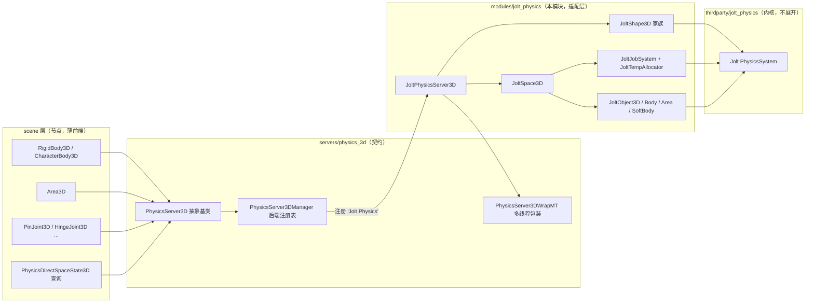
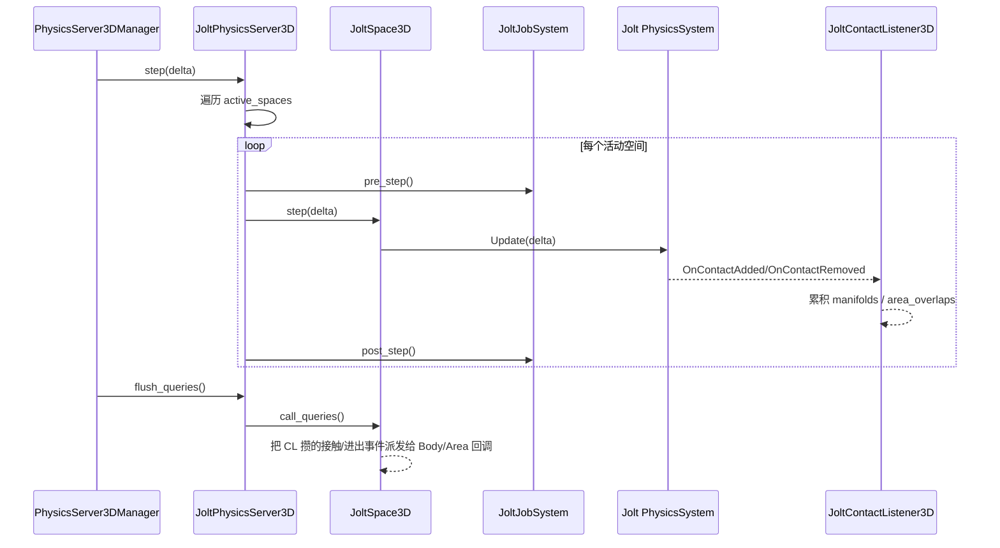

# jolt_physics（modules）

> 一句话：把第三方物理引擎 Jolt Physics 装进 Godot 的 `PhysicsServer3D`「插座」里，让引擎上层（`RigidBody3D`、`Area3D`、关节这些节点）不用改一行代码就能换一套物理内核。

**结论**：`jolt_physics` 模块是 Godot 内置 `godot_physics_3d` 之外的**第二个 3D 物理后端**——它实现约 200 个 `PhysicsServer3D` 虚函数，把 Godot 的 RID/Shape/Space/Body/Area/SoftBody/Joint 概念逐条翻译成 Jolt 的 `PhysicsSystem`/`Shape`/`Body`/`Constraint` 调用；代价是模块自带约 140 个 Jolt 第三方源文件的编译负担，以及「两套物理语义」之间的映射与近似。

## 是什么 / 不是什么

它**是**一个 `PhysicsServer3D` 的子类实现（`JoltPhysicsServer3D`），是一层「适配器」：Godot 侧说 RID，Jolt 侧说 `JPH::BodyID`，它站在中间翻译。它**不是**独立运行时、也不是可被脚本直接 `new` 的节点——`register_types.cpp:58` 里它只做一件事：把自己注册进 `PhysicsServer3DManager`，名字叫 `"Jolt Physics"`。

它**负责**：把 Godot 的 9 种形状、Body/Area/SoftBody 三种对象、6 种关节、碰撞层/掩码、空间步进与查询，全部映射到 Jolt 对应物。它**不负责**：真正解算碰撞、求解约束（那由 `thirdparty/jolt_physics/` 里的 Jolt 内核完成，本模块绝不展开）；也不负责 2D 物理（那是 `PhysicsServer2D` 的活，与本模块无关）。

## 在引擎里的位置

一张图看清关系：上层节点只认 `PhysicsServer3D` 抽象接口；`JoltPhysicsServer3D` 是那个接口的一个具体实现，它内部再通过 `JoltSpace3D`/`JoltObject3D`/`JoltShape3D` 去驱动 Jolt 内核。

## 关键概念

- **后端注册（插座）**：Godot 允许运行时切换物理后端，靠的是 `PhysicsServer3DManager` 这张「插座表」。`register_types.cpp:59` 用 `register_server("Jolt Physics", callable_mp_static(&create_jolt_physics_server))` 把工厂函数挂上去，引擎启动时按项目设置（`physics/3d/physics_engine`）挑一个来实例化。锚点：`register_types.cpp`。

- **适配对象（翻译官）**：`JoltObject3D`（`objects/jolt_object_3d.h:53`）是所有物理对象的基类，内部持有一个 `JPH::Body *`，并分出 `OBJECT_TYPE_BODY/SOFT_BODY/AREA` 三种身份。它把 Godot 的 `collision_layer`/`collision_mask` 存在自己身上，在需要时换算成 Jolt 的 `ObjectLayer`。锚点：`objects/jolt_object_3d.h`。

- **形状惰性构建（懒翻译）**：`JoltShape3D`（`shapes/jolt_shape_3d.h:41`）持有一个 `JPH::ShapeRefC`，但真正的 Jolt 形状由虚函数 `_build()` **按需**生成（`shapes/jolt_shape_3d.h:48`）。Godot 改数据时只记脏，等步进前才 `try_build()`。锚点：`shapes/jolt_shape_3d.h`。

- **分层映射（换算表）**：Jolt 要求实现 `BroadPhaseLayerInterface`/`ObjectLayerPairFilter` 等接口才能做宽相位与碰撞过滤。`JoltLayers`（`spaces/jolt_layers.h:41`）就是这张表，把 Godot 的 `(collision_layer, collision_mask)` 编码成一个 Jolt `ObjectLayer`。锚点：`spaces/jolt_layers.h`。

- **任务与内存（引擎供给）**：Jolt 内核不自己开线程，它向宿主要 `JobSystem` 和 `TempAllocator`。本模块用 `JoltJobSystem`（`spaces/jolt_job_system.h:43`）和 `JoltTempAllocator`（`spaces/jolt_temp_allocator.h:39`）补齐这两个供给，前者把 Jolt 的并行 job 接到 Godot 线程上。锚点：`spaces/jolt_job_system.h`、`spaces/jolt_temp_allocator.h`。

## 核心文件（按阅读顺序）

1. `modules/jolt_physics/register_types.cpp` — 入口：工厂函数 + 后端注册 + 设置注册，只有 69 行。
2. `modules/jolt_physics/jolt_physics_server_3d.h` — 核心适配类声明，约 200 个 `override` 虚函数 + 6 个 `RID_PtrOwner`。
3. `modules/jolt_physics/jolt_globals.cpp` — `jolt_initialize()`：把内存分配/断言钩子接到 Godot，再 `JPH::RegisterTypes()`。
4. `modules/jolt_physics/spaces/jolt_space_3d.h` — 包装一个 `JPH::PhysicsSystem`，`step()` 与 `call_queries()` 的主循环所在。
5. `modules/jolt_physics/objects/jolt_object_3d.h` — Body/Area/SoftBody 的公共基类，RID 与 `JPH::Body` 的绑定点。
6. `modules/jolt_physics/shapes/jolt_shape_3d.h` — 形状基类，`_build()` 惰性构建 Jolt 形状。
7. `modules/jolt_physics/objects/jolt_group_filter.h` — 把对象指针编码进 `CollisionGroup`，用于实现碰撞例外（collision exception）。
8. `modules/jolt_physics/jolt_project_settings.h` — 静态持有 Jolt 专属设置（睡眠阈值、步数、临时内存等）。
9. `modules/jolt_physics/SCsub` — 编译约 140 个 `thirdparty/jolt_physics/` 源文件 + 本模块 `*.cpp`。

## 数据流 / 调用链

以下是一帧里「步进 + 查询回调」的典型路径：

要点：Jolt 内核**不主动**向 Godot 汇报接触，它只在 `Update` 时回调 `JoltContactListener3D`（`spaces/jolt_contact_listener_3d.h:52`），把接触流/区域重叠先攒起来；等到 `flush_queries()`（`jolt_physics_server_3d.cpp:1645`）才由 `JoltSpace3D::call_queries()` 统一派发——这样把「物理线程」和「Godot 回调」解耦开。

## 中文口诀

- 插座一张表，后端随便挑；工厂一注册，Jolt 来报道。
- 二百虚函数，条条做翻译；RID 对上 BodyID，两套语义一桥通。
- 形状懒构建，`_build` 才落地；数据改了先记脏，步进之前再成形。
- 分层换算表，层掩码进 ObjectLayer；碰撞该不该碰，Jolt 问它要答案。
- 接触不直报，监听先存着；`flush_queries` 一声令，回调才上门。
- 任务与内存，引擎来供给；JobSystem 接线程，TempAllocator 供临时。

## 练习（15 分钟）

1. 打开 `register_types.cpp`，找 `create_jolt_physics_server()`：说明为什么它返回的是 `PhysicsServer3DWrapMT` 包过的指针，而不是裸 `JoltPhysicsServer3D`。
2. 打开 `jolt_physics_server_3d.h`，数一数 `space_owner/body_owner/shape_owner` 这几个 `RID_PtrOwner` 各对应哪一类 `free_*` 方法。
3. 打开 `jolt_shape_3d.h`，确认 `_build()` 是纯虚函数，然后在 `jolt_box_shape_3d.h` 里找到它的具体实现点。
4. 打开 `jolt_layers.h`，用一句话解释 `to_object_layer` 为什么需要 `broad_phase_layer` 和 `collision_layer/mask` 三个参数一起算。

## 自测

- [ ] `JoltPhysicsServer3D` 的六个 RID 所有者分别是哪些类型（space/area/body/soft_body/shape/joint），对应 `jolt_physics_server_3d.h:50-55` 里的哪几行？
- [ ] `step()` 里对每个活动空间做了哪三件事（`jolt_physics_server_3d.cpp:1628-1634`）？
- [ ] `JoltGroupFilter` 与 `JoltLayers` 的职责有什么不同：一个管「碰撞例外」，一个管「层/掩码过滤」，它们各自继承了 Jolt 的哪个接口？
- [ ] `jolt_initialize()`（`jolt_globals.cpp:94`）把 `JPH::Allocate` 等函数指针接到了谁身上？

## 一句话总结

> `jolt_physics` 是 Godot `PhysicsServer3D` 契约在第三方引擎 Jolt Physics 上的一个完整适配实现——上层节点零感知，内核换血靠它一条条虚函数翻译完成。
