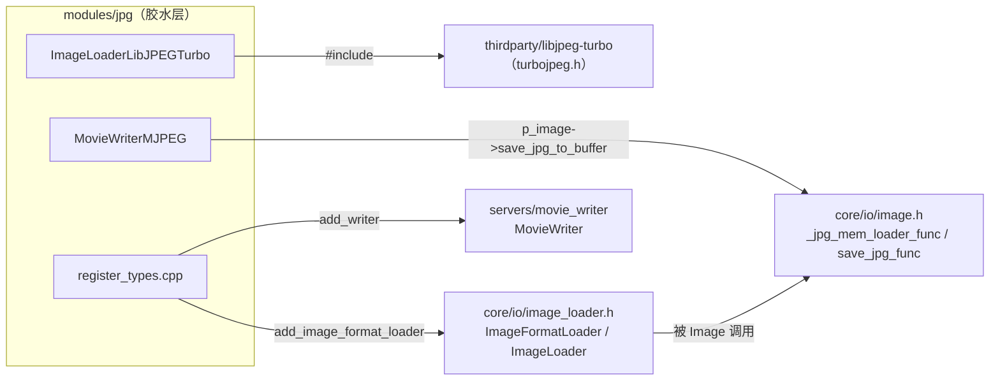
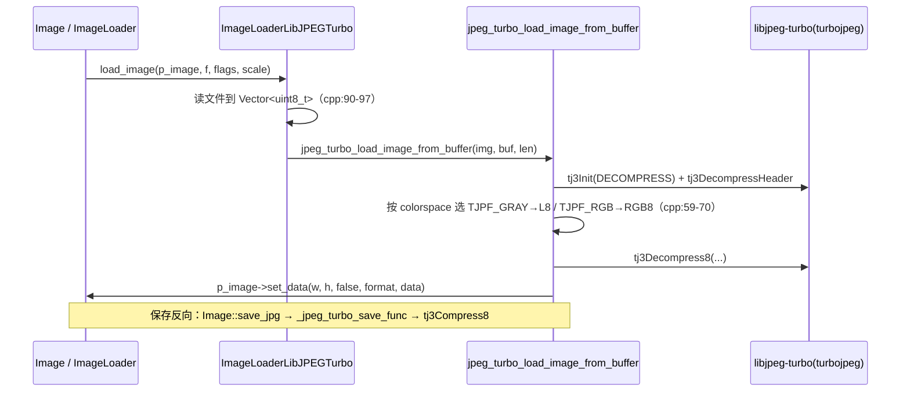

# jpg（modules）

> 一句话：jpg 模块是 Godot 和 libjpeg-turbo 之间的一块「转接头」，负责把 `.jpg/.jpeg` 图片读进 `Image`、把 `Image` 存成 JPEG，再顺手把逐帧画面打包成 `.avi` 视频。

**结论**：jpg 模块为 `Image` 注册一个 JPEG 格式 loader（读入/写出），并为 `MovieWriter` 注册一个 MJPEG-AVI 写出器；它自己不写解码算法，全部委托给 vendored 的 libjpeg-turbo，代价是编译时多编约 70 个第三方 `.c` 文件。

## 是什么 / 不是什么

- **是什么**：一段胶水层，把 `core/io/image.h` 和 `servers/movie_writer` 暴露的「函数指针插槽」填上 libjpeg-turbo 的实现，并向两个注册表报名。
- **不是什么**：它不是解码器本身——真正的 DCT/哈夫曼都在 `thirdparty/libjpeg-turbo`（`SCsub:12`），本模块一个也不碰；它也不负责 PNG/WebP 等别的格式，那些各有各的模块。

这个模块一共 8 个文件、约 26 KB 源码（不含 thirdparty），代码量极小，符合「服务器/loader 薄前端」的惯例。

## 在引擎里的位置

- 向上依赖 `core/io/image_loader.h`（`ImageFormatLoader` 基类，`image_loader_libjpeg_turbo.h:35`）和 `core/io/image.h`（三个静态函数指针，`image.h:207/213/221`）。
- 向下依赖 `thirdparty/libjpeg-turbo` 的 turbojpeg API（`image_loader_libjpeg_turbo.cpp:33`）。
- 被依赖方是 `Image`（通过函数指针）和 `MovieWriter`（通过注册表），不是直接继承 Godot 的脚本可见类。

## 关键概念

1. **格式 loader** = 「收银台」。`ImageFormatLoader` 是 `RefCounted` 基类（`core/io/image_loader.h:42`），谁想处理某种图片格式就继承它、重写 `load_image` 与 `get_recognized_extensions`，再交到 `ImageLoader` 注册表。本模块的 loader 叫 `ImageLoaderLibJPEGTurbo`。
2. **函数指针插槽** = 「预留的空插座」。`Image` 上有三个 `static inline` 函数指针（`image.h:207/213/221`）：`save_jpg_func`、`save_jpg_buffer_func`、`_jpg_mem_loader_func`，默认 `nullptr`。jpg 模块的构造函数把三个插座都插上 libjpeg 实现（`image_loader_libjpeg_turbo.cpp:194-197`）。这样 `Image::save_jpg()` 不依赖本模块编译也能声明，运行时才接通。
3. **MovieWriter** = 「视频出口」。`MovieWriter` 基类（`servers/movie_writer/movie_writer.h:37`）提供 `write_begin / write_frame / write_end` 三拍子接口；`MovieWriterMJPEG` 继承它，把每帧压成 JPEG 塞进 AVI 容器。`MovieWriter::add_writer`（`movie_writer.h:86`）是它的报名处。
4. **初始化层级** = 「上工顺序」。`initialize_jpg_module(ModuleInitializationLevel)` 用 `switch` 分两档：`SERVERS` 档先注册视频写出器，`SCENE` 档再注册图片 loader（`register_types.cpp:43/50`），卸载时按反序拆掉（`register_types.cpp:60`）。

## 核心文件（按阅读顺序）

1. `modules/jpg/config.py` — 一行 `can_build` 恒返回 `True`，本模块无条件参与构建。
2. `modules/jpg/register_types.cpp` — 唯一入口：按初始化层级注册/注销 loader 与 writer。
3. `modules/jpg/image_loader_libjpeg_turbo.h` — loader 的声明，只暴露 `load_image` 和 `get_recognized_extensions`。
4. `modules/jpg/image_loader_libjpeg_turbo.cpp` — 读/写 JPEG 的全部胶水逻辑（含保存函数）。
5. `modules/jpg/movie_writer_mjpeg.h` — AVI 写出器的声明与私有字段。
6. `modules/jpg/movie_writer_mjpeg.cpp` — 手写 AVI RIFF 头 + 逐帧 JPEG + PCM 音频。
7. `modules/jpg/SCsub` — 编译脚本，把 Godot 的 `*.cpp` 与 libjpeg-turbo 的 70 个 `.c` 一起编进来。

## 数据流 / 调用链

- 读入主链：`ImageLoaderLibJPEGTurbo::load_image`（`image_loader_libjpeg_turbo.cpp:89`）把整个文件读进内存，交给自由函数 `jpeg_turbo_load_image_from_buffer`（`:35`），后者用 turbojpeg 头解析拿到宽高和色彩空间，灰度走 `Image::FORMAT_L8`、其余走 `FORMAT_RGB8`，最后 `Image::set_data`（`:85`）。
- 保存主链：构造函数把 `Image::save_jpg_func` 指向 `_jpeg_turbo_save_func`（`:196`），它内部先把图统一转成 `FORMAT_RGB8`、设质量/精度/子采样，再 `tj3Compress8` 出字节流写盘（`:117-192`）。
- 视频链：`MovieWriterMJPEG::write_frame`（`movie_writer_mjpeg.cpp:195`）调用 `save_jpg_to_buffer` 拿 JPEG 帧，塞进 AVI 的 `00db`/`01wb` 数据块（`:201/210`）。

## 中文口诀

- 图片能读又能存，全靠 libjpeg 撑腰杆。
- 继承 loader 报个名，jpg jpeg 双后缀。
- 三个插座要插满，save 与 mem 才接通。
- 灰度走 L8，彩图走 RGB8，CMYK 一律退。
- 视频出口叫 MJPEG，逐帧 JPEG 塞 AVI。
- 先 SERVER 后 SCENE，注册卸载走反序。

## 练习（15 分钟）

1. 在 `register_types.cpp` 里把 `MODULE_INITIALIZATION_LEVEL_SCENE` 分支的两行注释掉，重新编译，用 `Image.load_from_file("x.jpg")` 加载一张图，观察报错来源——验证「loader 注册」和「函数指针插座」哪条路径先断。
2. 把 `get_recognized_extensions` 里再 `push_back("jfif")`，编译后用 `ImageLoader.get_recognized_extensions()` 确认列表多了一项。
3. 读 `movie_writer_mjpeg.cpp:51-192`，在纸上画出 AVI 文件头的块嵌套顺序（RIFF → LIST/hdrl → LIST/strl → LIST/movi）。

## 自测

- [ ] `Image::save_jpg()` 运行时调用的到底是哪个 C++ 函数？从 `Image` 侧到 libjpeg 侧的完整跳转链是什么？（提示：`image.h:207` → `image_loader_libjpeg_turbo.cpp:196`）
- [ ] 为什么 `jpeg_turbo_load_image_from_buffer` 里 `TJCS_GRAY` 映射到 `Image::FORMAT_L8`，而 CMYK 直接返回 `ERR_UNAVAILABLE`？
- [ ] `MovieWriterMJPEG` 的音频是「边写边压缩」还是「原样 PCM 塞进去」？依据是哪一行？

## 一句话总结

> jpg 模块是 Image 与 MovieWriter 各自的「JPEG 接线员」：一个注册 loader 填上 Image 的存/取函数指针，一个注册 AVI 写出器，算法全部外包给 libjpeg-turbo。
