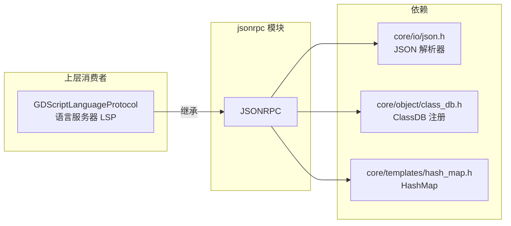
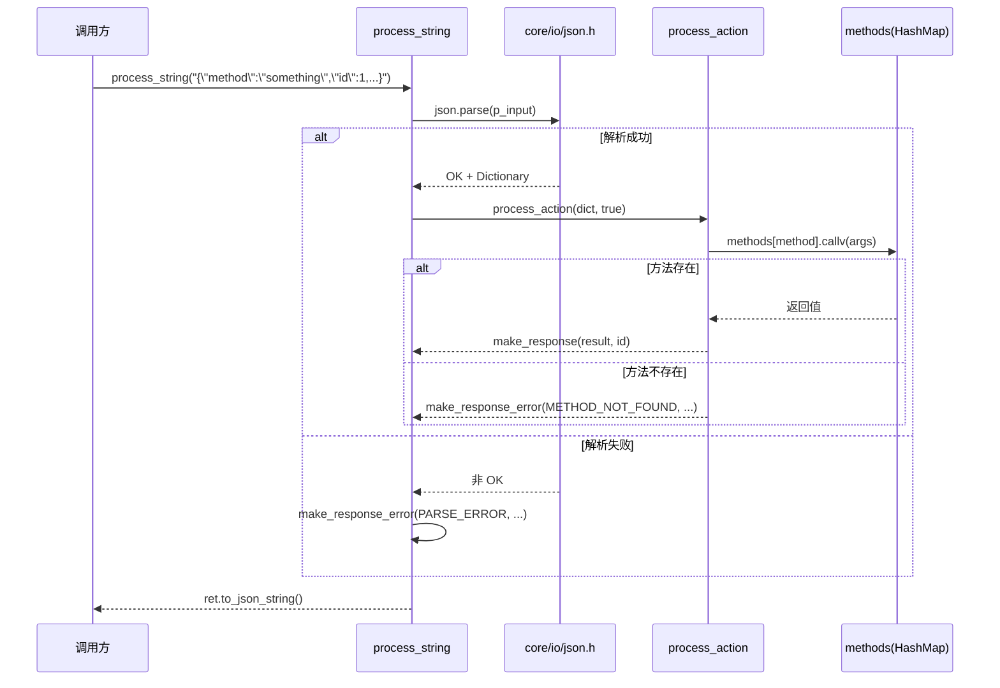

# jsonrpc（modules）

> 一句话：一个「JSON 信封收发室」——它只负责把方法调用和返回值打包成 JSON-RPC 2.0 的字典信封，再把收到的信封拆开、分发给你注册好的函数。

**结论**：这个模块把 JSON-RPC 2.0 协议的「请求 / 响应 / 通知 / 错误」四种报文封装成一个可脚本化的类 `JSONRPC`，供 GDScript 语言服务器等上层使用；代价是它不碰网络传输，只管内存里的字典和字符串。

## 是什么 / 不是什么

它负责的是 JSON-RPC 2.0 的**报文格式**：造报文（`make_*`）和解报文（`process_*`）。就像邮局的信封规范——信封上该写哪些字段、寄到哪、坏了怎么退回。

它**不**负责：

- 不负责网络传输：没有 TCP/WebSocket 连接，送信靠别的模块（如 `websocket`）。
- 不负责 JSON 语法解析本身：那是 `core/io/json.h` 的 `JSON` 类干的，`jsonrpc` 只是调用它。
- 不负责业务逻辑：你注册了什么方法，它就调用什么方法，自身零业务。

一句话：`jsonrpc` 是信封，`JSON` 是纸张，`websocket` 是邮车。

## 在引擎里的位置

`GDScriptLanguageProtocol` 直接继承 `JSONRPC`（`modules/gdscript/language_server/gdscript_language_protocol.h:47`），这是模块唯一的外部使用者。编辑器构建时，若 `module_jsonrpc_enabled` 与 `module_websocket_enabled` 都为真，GDScript 才编译语言服务器代码（`modules/gdscript/SCsub:17`）。

## 关键概念

- **方法表（method table）**：一张 `String → Callable` 的 `HashMap`（`jsonrpc.h:40`），是「方法名 → 函数」的通讯录。`set_method("something", callback)` 就是往里登记一个号码。
- **请求（request）**：带 `method`、`params`、`id` 的字典，是「请你做这件事，做完给我回执」。
- **通知（notification）**：和请求一样但没有 `id` 字段，是「请你做这件事，不用回执」。规范要求服务器对通知**绝不能**回复（`jsonrpc.cpp:135-138`）。
- **批处理（batch）**：一个 `Array` 里塞多个请求/通知，一次处理多个信封（`jsonrpc.cpp:139-158`）。
- **错误码（ErrorCode）**：5 个负数常量，从 -32700 到 -32603（`jsonrpc.h:54-60`），对应解析失败、请求非法、方法不存在、参数非法、内部错误。

## 核心文件（按阅读顺序）

1. `modules/jsonrpc/config.py` — 模块开关，`can_build` 恒返回 `True`，无任何编译依赖。
2. `modules/jsonrpc/register_types.cpp` — 入口：在 `MODULE_INITIALIZATION_LEVEL_SCENE` 阶段 `GDREGISTER_CLASS(JSONRPC)`，只注册一个类。
3. `modules/jsonrpc/jsonrpc.h` — 公共接口：`JSONRPC` 类声明、`ErrorCode` 枚举、6 个方法签名。
4. `modules/jsonrpc/jsonrpc.cpp` — 全部实现：造报文 4 个函数 + 解报文 2 个函数 + 注册方法 1 个，共 186 行。
5. `modules/jsonrpc/jsonrpc.compat.inc` — 已废弃的 `set_scope` 兼容桩（`DISABLE_DEPRECATED` 时不编译）。
6. `modules/jsonrpc/tests/test_jsonrpc.h` / `.cpp` — doctest 用例，覆盖字典请求、数组批处理、坏方法、通知不回包。

## 数据流 / 调用链

一次完整的「收到字符串 → 解析 → 分发 → 回字符串」：

两点细节：通知（无 `id`）会把结果置回 `Variant()`（空），最终 `process_string` 返回空串 `""`（`jsonrpc.cpp:178-179`）；收到 float 型 `id` 且无小数时会被规整回 int，兼容不同 JSON 实现的序列化差异（`jsonrpc.cpp:122-125`）。

## 中文口诀

- 信封不是邮车，只管装不管送。
- `make_*` 造信四兄弟，请求响应通知错误。
- `process_*` 拆信两兄弟，字典数组都认识。
- 没有 `id` 是通知，只做不回不吭声。
- 方法不在通讯录，回一个「找不到」。
- 解析先过 `JSON` 关，坏了就报 `-32700`。

## 练习（15 分钟）

1. 打开 `jsonrpc.cpp:99`，手工模拟一个输入 `{"method":"nothing","id":7}`，逐步推出返回值（应是一个 `error` 字典，`code == -32601`）。
2. 打开 `jsonrpc.cpp:60`，对照写出一段 GDScript，用 `make_request("foo", [1,2], 42)` 生成字典，看它和 `make_notification` 差在哪个字段。
3. 读 `tests/test_jsonrpc.h:139` 的通知用例，解释为什么 `test_no_response` 断言返回类型是 `Variant::NIL`。

## 自测

- [ ] `process_action` 收到一个 `Array` 但 `p_process_arr_elements == false` 时，返回什么？（提示：看 `jsonrpc.cpp:159-161`。）
- [ ] 为什么 `JSONRPC::INTERNAL_ERROR` 在这 186 行实现里从未被 `make_response_error` 主动调用？
- [ ] 通知被放进批处理数组后，处理结果数组会把它对应的响应剔除吗？（提示：看 `jsonrpc.cpp:146-149` 的空值过滤。）

## 一句话总结

> `jsonrpc` 是 Godot 里一份极简的 JSON-RPC 2.0 报文编解码器：约 186 行 C++ 实现 + 1 个脚本类 `JSONRPC`，把「方法调用」变成信封、再把信封拆回「函数调用」，是 GDScript 语言服务器与外部编辑器通信的地基。
