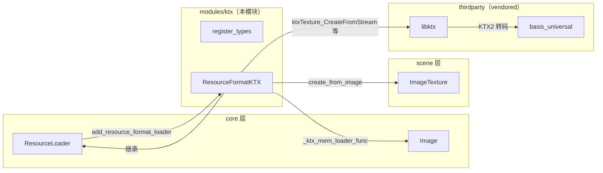
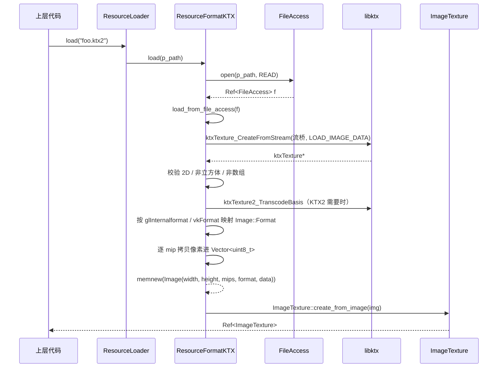

# ktx（modules）

> 一句话：ktx 模块是「图像格式的翻译官」——把 KTX/KTX2 纹理文件翻译成 Godot 能直接用的 `ImageTexture`（术语：`ResourceFormatLoader` 插件）。

**结论**：ktx 模块给引擎装上 `.ktx` / `.ktx2` 两个文件后缀的资源加载器，为 `Image` 和 `ImageTexture` 服务；代价是必须链接第三方库 libktx 与 basis_universal（解压 KTX2 里的 Basis 超压缩数据）。

## 是什么 / 不是什么

这个模块只干一件事：把磁盘上的 KTX/KTX2 文件读进内存、映射成 `Image::Format`、包成 `ImageTexture` 交出去。

它**不负责**：真正解码像素——那是 vendored 的 `thirdparty/libktx/` 干的；它也不负责把数据上传到 GPU 纹理——那是 `RenderingServer` 的事。它是 libktx 和 Godot 资源系统之间的一层「胶水」。

## 在引擎里的位置



`register_types.cpp:48` 把 `ResourceFormatKTX` 塞进全局 `ResourceLoader` 的 loader 列表；`texture_loader_ktx.cpp:613` 又把一个内存加载函数回填给 `Image::_ktx_mem_loader_func`。两条线分别接住「文件加载」和「从缓冲区加载」两个入口。

## 关键概念

- **资源格式加载器（ResourceFormatLoader）**：引擎「按后缀找翻译官」的登记表。`ResourceFormatKTX` 继承它，并声明自己能认 `.ktx`/`.ktx2`（`texture_loader_ktx.h:35`）。
- **流回调桥（ktxStream）**：libktx 想用「读/跳/定位」几个函数指针操作流，而 Godot 手里是 `FileAccess`。模块用 7 个 C 函数把二者粘起来（`texture_loader_ktx.cpp:42-82`）。
- **格式映射表**：KTX1 用 `glInternalformat`、KTX2 用 `vkFormat`，各有一大张 `switch` 翻译成 `Image::Format`（如 `VK_FORMAT_BC7_UNORM_BLOCK` → `Image::FORMAT_BPTC_RGBA`，`texture_loader_ktx.cpp:457`）。
- **KTX2 Basis 转码**：KTX2 常用 Basis 超压缩存储，读到 `VK_FORMAT_UNDEFINED` 时按硬件能力转成 BC/ASTC/ETC2，走 `ktxTexture2_TranscodeBasis`（`texture_loader_ktx.cpp:345`）。
- **内存加载函数（ImageMemLoadFunc）**：`Image` 留了一个静态函数指针 `_ktx_mem_loader_func`（`core/io/image.h:226`），本模块在构造函数里把它填成自己的 `_ktx_mem_loader_func`，这样 `Image::load_ktx_from_buffer` 才可用。

## 核心文件（按阅读顺序）

1. `modules/ktx/config.py` — 声明模块依赖 `basis_universal`，无条件可编译。
2. `modules/ktx/SCsub` — 编译 libktx 的 20 个 vendored 源文件 + 本模块 `*.cpp`。
3. `modules/ktx/register_types.h` — 暴露 `initialize_ktx_module` / `uninitialize_ktx_module` 两个入口。
4. `modules/ktx/register_types.cpp` — 在 `MODULE_INITIALIZATION_LEVEL_SCENE` 阶段注册/注销 loader（`register_types.cpp:41`）。
5. `modules/ktx/texture_loader_ktx.h` — `ResourceFormatKTX` 的接口声明。
6. `modules/ktx/texture_loader_ktx.cpp` — 全部胶水逻辑：流桥、格式映射、mip 拷贝、加载实现。

## 数据流 / 调用链



从缓冲区加载走另一条入口：`Image::load_ktx_from_buffer` 检查 `_ktx_mem_loader_func` 非空后，把字节数组交给 `_ktx_mem_loader_func`，后者用 `FileAccessMemory` 包装同一份数据，再进入同一条 `load_from_file_access` 链（`core/io/image.cpp:4503`、`texture_loader_ktx.cpp:586`）。

## 中文口诀

```
后缀 ktx 和 ktx2，翻译官叫 ResourceFormatKTX。
注册登记进 ResourceLoader，内存函数填给 Image。
流桥七函数粘 libktx，读跳定位全靠 FileAccess。
KTX1 看 glInternalformat，KTX2 看 vkFormat。
Basis 压缩要转码，硬件特性选格式。
逐级 mip 拷像素，最后包成 ImageTexture。
```

## 练习（15 分钟）

1. 打开 `texture_loader_ktx.cpp:84`，数一数 `load_from_file_access` 一共挂载了几个 `ktxStream` 函数指针，并说出 `type = eStreamTypeCustom` 的含义。
2. 找到 `register_types.cpp:46` 的 `GD_IS_CLASS_ENABLED(ImageTexture)`，解释为什么 `ImageTexture` 被裁剪时整个 loader 也不注册。
3. 在 `texture_loader_ktx.cpp` 里找出 KTX1 的 `GL_SRGB8` 和 KTX2 的 `VK_FORMAT_R8G8B8_SRGB` 分别映射到什么 `Image::Format`、`srgb` 置为多少。
4. 读 `texture_loader_ktx.cpp:509-549` 的 mip 处理，解释为什么 KTX 的 4 字节对齐会导致「不保留 mipmap」。

## 自测

- [ ] 为什么同一份字节数据能同时被「文件加载」和「内存加载」两条入口复用？（提示：`FileAccessMemory` 与流桥）
- [ ] 如果某个 KTX2 文件的 `vkFormat` 是 `VK_FORMAT_BC7_UNORM_BLOCK`，但 GPU 不支持 BC7，转码逻辑会优先选什么目标格式？（提示：`RS::get_singleton()->has_os_feature` 的优先级顺序）
- [ ] `handles_type` 里判断的是哪个父类？为什么返回 `ClassDB::is_parent_class(p_type, "Texture2D")` 而不是直接比较字符串 `"ImageTexture"`？

## 一句话总结

> ktx 模块是 Godot 资源系统与 libktx 之间的胶水：一个 `ResourceFormatLoader` 负责按后缀接活，一串流回调负责喂数据，两张格式映射表负责把 GL/VK 格式翻译成 `Image::Format`，最终产出 `ImageTexture`。
