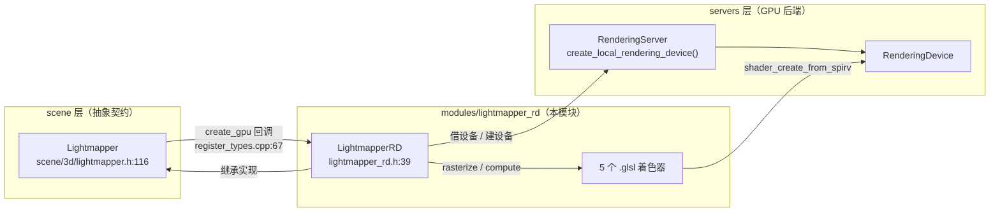
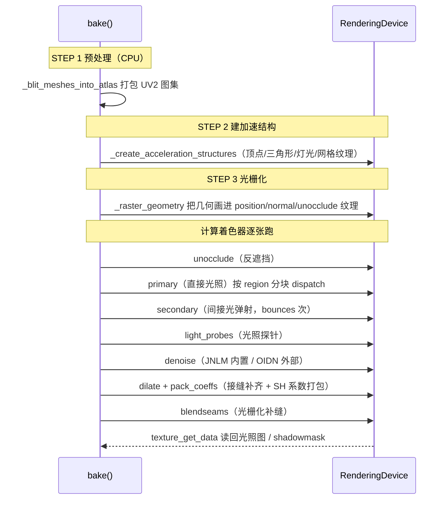

# lightmapper_rd（modules）

> 一句话：把「离线烘焙光照」这件原本要 CPU 慢慢算的事，改交给 GPU 用光栅化 + 计算着色器来做——好比把算账的活从会计一个人的草稿纸，搬到了几百个计算核心的并行流水线上。

**结论**：`lightmapper_rd` 是 Godot 的 **GPU 光照烘焙器**，为 `scene/3d/lightmapper.h` 定义的 `Lightmapper` 抽象类提供一个基于 `RenderingDevice`（RD）的实现；它负责把静态几何和灯光「拍扁」进 UV2 光照图图集，代价是**只在编辑器构建里编译**（`config.py:2` 的 `can_build` 返回 `env.editor_build`）。

## 是什么 / 不是什么

它**是**：一个烘焙器。接收网格、灯光、环境全景图，输出一张张光照图（lightmap）纹理、阴影遮罩（shadowmask）纹理和光照探针（light probe）数据。

它**不是**：
- 不是渲染器本身——它自己 `new` 一个 `RenderingDevice`（`lightmapper_rd.cpp:1181` 先找渲染服务器借，借不到再按平台手动建 Vulkan/Metal 驱动），跟场景渲染管线互不相干。
- 不是 CPU 烘焙器——CPU 实现（Embree 那套）是另一个模块/后端，通过 `Lightmapper::create_cpu` 挂接，不在这里。
- 不是运行时 GI——烘焙结果是静态贴图，游戏运行时只管采样，不做实时光追。

它服务于编辑器里点「烘焙 LightmapGI」的用户，被 `scene/3d/lightmapper.cpp:55` 的 `Lightmapper::create()` 按 `custom → gpu → cpu` 优先级选中（本模块即 `gpu` 这一档）。

## 在引擎里的位置



依赖方向：`LightmapperRD` 继承 `Lightmapper`（scene 层定义接口），运行期依赖 `RenderingDevice` 和 `RenderingServer`（servers 层）来建纹理、缓冲、管线和 dispatch。

## 关键概念

- **光照图图集（lightmap atlas）**：把所有静态网格的 UV2 展开打包成一张 2D 纹理数组。比喻：把每件衣服的布料裁片拼到同一张布料上再一起染色。锚点：`_blit_meshes_into_atlas`（`lightmapper_rd.cpp:306`，`bake()` 的 STEP 1 调用）。
- **加速结构（acceleration structure）**：不是硬件 RT 加速，而是把三角形按空间网格（grid）分桶、再聚成 cluster，供着色器快速找到「某根射线附近有哪些三角形」。锚点：`_create_acceleration_structures`（`lightmapper_rd.cpp:435`）、`grid_size = 128`（`lightmapper_rd.cpp:1127`）。
- **着色器版本（shader versions）**：一个 `lm_compute.glsl` 靠 `#define` 切成 7 种模式——`primary`/`secondary`/`unocclude`/`light_probes`/`dilate`/`denoise`/`pack_coeffs`（`lm_compute.glsl:3-9`），C++ 侧用 `get_spirv_stages("primary")` 之类的名字取对应编译结果。
- **UV2 光栅化**：先把三角形顶点当「顶点着色器」画到 UV2 坐标上，得到位置/法线/反遮挡（unocclude）三张纹理，再做后续计算。锚点：`_raster_geometry`（`lightmapper_rd.cpp:746`）、`lm_raster.glsl:1` 的 `#[vertex]`。

## 核心文件（按阅读顺序）

1. `config.py` — 构建开关：`can_build` 只在 `env.editor_build` 时放行，这是本模块「仅编辑器」的根源。
2. `register_types.cpp` — 注册类 `LightmapperRD`，并把工厂函数挂到 `Lightmapper::create_gpu`，同时定义 `rendering/lightmapping/*` 一串项目设置。
3. `lightmapper_rd.h` — 类定义：内部结构体（`BakeParameters`/`Light`/`Triangle`/`Seam` 等）和一堆 `_` 开头的私有步骤函数。
4. `lightmapper_rd.cpp`（92 KB / 2533 行，全模块最大）— 真正的烘焙流程，从 `bake()`（第 1104 行）一路往下。
5. `lm_raster.glsl` — 光栅化着色器（`#[vertex]` + `#[fragment]`），把几何画进 UV2 图集。
6. `lm_compute.glsl`（51 KB / 约 1340 行，全模块最大着色器）— 7 种 compute 模式的主战场。
7. `lm_blendseams.glsl` — 把 UV2 接缝处因插值产生的裂缝「补」掉（`lines` / `triangles` 两个 stage）。
8. `lm_common_inc.glsl` / `lm_area_lights_inc.glsl` — 被上面两个着色器 include 的公共函数（哈希、球面采样、区域光采样）。

## 数据流 / 调用链

一次 `bake()` 的主线（`lightmapper_rd.cpp:1104` 起）：



中间每个大步骤前后都有 `p_step_function(...)` 回调（如 `"Plot direct lighting"` 见 `lightmapper_rd.cpp:1762`），用于进度条和用户中止。

## 中文口诀

```
静态几何贴 UV2，图集打包先铺布。
建树分桶找得快，光栅位置法线晒。
反遮挡先清场，直接光照算主粮。
弹射循环加间接，探针探明周边亮。
去噪补缝再打包，读回贴图进存档。
```
（译：blit 打包 → 加速结构 → 光栅化 → unocclude → primary → secondary → light_probes → denoise/dilate/pack → 读回。）

## 练习（15 分钟）

1. 打开 `lightmapper_rd.cpp` 的 `bake()`，从 1104 行往下数，标出它注释里的 `STEP 1/2/3` 分别调用了哪个 `_` 开头函数，各对应口诀里哪一句。
2. 打开 `lm_compute.glsl` 第 1-10 行，对照 `lightmapper_rd.cpp` 里所有 `get_spirv_stages("...")` 调用，确认 7 个模式名一一对应。
3. 看 `register_types.cpp` 的 `GLOBAL_DEF` 块，找一个参数（如 `low_quality_ray_count`）在 `bake()` 里被 `GLOBAL_GET` 读取的位置，理解「项目设置 → 烘焙参数」的传递路径。

## 自测

- [ ] 为什么本模块只在编辑器构建里编译？从 `config.py` 找到依据。
- [ ] `Lightmapper::create()` 在什么情况下会选到 `LightmapperRD`（而不是 CPU 或自定义实现）？
- [ ] `lm_compute.glsl` 里 `MODE_LIGHT_PROBES` 对应 C++ 里哪个 `get_spirv_stages` 调用？
- [ ] 直接光照（primary）为什么按 region 分块逐块 `submit + sync`，而 unocclude 一次性放完不设 barrier？（提示：看 `lightmapper_rd.cpp:1744-1749` 与 `1860-1881` 的差异。）

## 一句话总结

> `lightmapper_rd` 用一张自建的 `RenderingDevice` 把静态光照烘焙搬上 GPU，是一条「UV2 光栅化 → 计算着色器追光 → 去噪回读」的离线管线，只在编辑器里活、为 `Lightmapper` 充当 GPU 后端。
