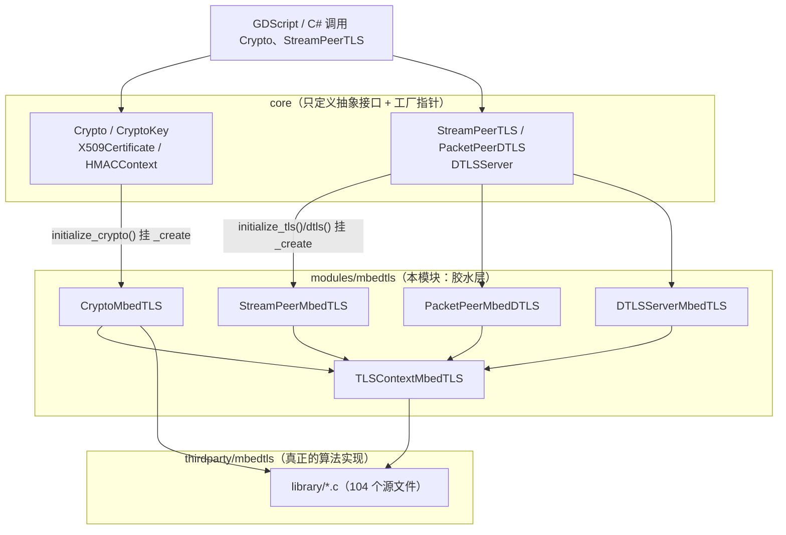
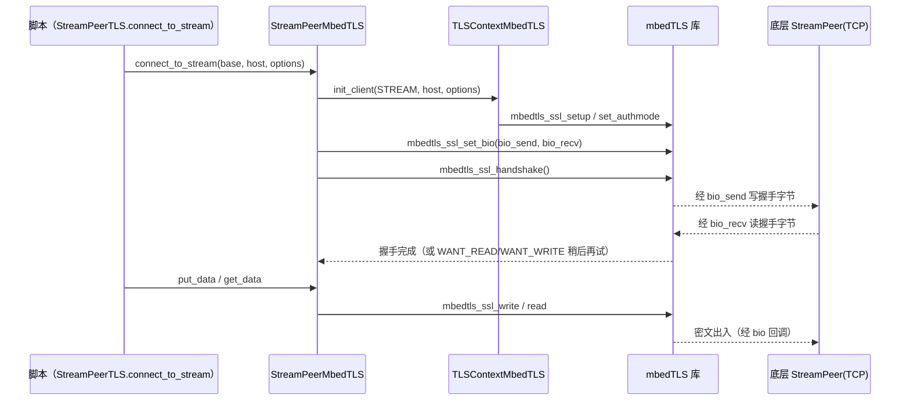

# mbedtls（modules）

> 一句话：mbedtls 模块是 Godot 的「加密与 TLS 后端」——它把 `core/` 里只画了接口的抽象类（`Crypto`、`StreamPeerTLS` 等）用第三方 mbedTLS 库逐一对号入座、填上真实现，相当于「骨架」与「肌肉」之间的接头。

**结论**：`modules/mbedtls` 是一层薄胶水，为 `core/crypto` 和 `core/io` 的加密/TLS/DTLS 抽象类提供唯一的 mbedTLS 后端实现；它不新增任何自有脚本 API，只负责在启动时把工厂函数指针挂进 `core` 的空壳类。代价是：编译期要把第三方 mbedTLS 的 104 个 `.c` 文件一起编进来（`SCsub:14-119`），且整个引擎的加密能力强绑定在这一个库上。

## 是什么 / 不是什么

**是什么**：一个「后端注册模块」。它定义了 9 个以 `MbedTLS` 结尾的类，全部继承 `core` 里的抽象基类，用第三方 mbedTLS 的 C 函数实现它们的纯虚方法。核心动作只有一件事——在 `initialize_mbedtls_module` 里调用各 `initialize_*`，把工厂函数指针写进 `core` 的静态成员。

**不是什么**：

- 它**不是**加密算法本身。AES/RSA/SHA 这些算法在 `thirdparty/mbedtls/`（`SCsub` 第 9 行起就是编它的 104 个源文件），本模块只做转发。
- 它**不是**对外 API。用户拿到的 `Crypto`、`StreamPeerTLS` 类定义在 `core/crypto/crypto.h` 和 `core/io/stream_peer_tls.h`，本模块的类名几乎不出现在脚本层。

## 在引擎里的位置



`core` 用静态函数指针 `_create`（`core/crypto/crypto.h:42,58,106,123`）留好「谁来 new 我」的空位，本模块启动时把自己的 `create` 填进去，这就是「模块向后端注入实现」的全部机制。

## 关键概念

1. **工厂函数指针注入** —— 像插座：`core` 的 `Crypto` 只留一个 `_create` 指针孔（`core/crypto/crypto.h:123`），`CryptoMbedTLS::initialize_crypto()` 把 `CryptoMbedTLS::create` 插进去（`crypto_mbedtls.cpp:313-319`）。用户调用 `Crypto.new()` 时实际造出的是 `CryptoMbedTLS`。

2. **BIO 回调桥** —— 像翻译官：mbedTLS 只想对着自己的 `bio` 读写，Godot 只想用 `StreamPeer`。`StreamPeerMbedTLS::bio_send` / `bio_recv` 把两边对起来（`stream_peer_mbedtls.cpp:36-74`），在 `mbedtls_ssl_set_bio` 里注册（`stream_peer_mbedtls.cpp:107`）。

3. **默认 CA 证书三级兜底** —— 像找钥匙：先查项目设置路径，再问操作系统要系统 CA，最后才解压内置的压缩证书（`crypto_mbedtls.cpp:350-380`）。

4. **DTLS 的 cookie** —— 像门卫：UDP 无连接、易被伪造源地址发起反射攻击，`CookieContextMbedTLS` 用 `mbedtls_ssl_conf_dtls_cookies` 做握手前的 cookie 校验（`tls_context_mbedtls.cpp:146-152`）。

5. **`TLSContextMbedTLS` 复用上下文** —— 像公共背包：把 `mbedtls_ssl_context`、`mbedtls_ssl_config`、熵源、随机数发生器打包成一个 `RefCounted`，`StreamPeerMbedTLS` / `PacketPeerMbedDTLS` 各持一份 `Ref<TLSContextMbedTLS> tls_ctx`（`stream_peer_mbedtls.h:51`、`packet_peer_mbed_dtls.h:59`）。

## 核心文件（按阅读顺序）

1. `register_types.cpp` — 模块入口，`initialize_mbedtls_module` 定义项目设置、初始化 PSA/线程，再依次挂载 crypto/TLS/DTLS 四个后端（`register_types.cpp:76-108`）。
2. `crypto_mbedtls.h` — 定义 4 个加密类：`CryptoMbedTLS`、`CryptoKeyMbedTLS`、`X509CertificateMbedTLS`、`HMACContextMbedTLS`。
3. `crypto_mbedtls.cpp` — 加密类实现 + `initialize_crypto()` 注入点 + 默认证书加载（`crypto_mbedtls.cpp:313-380`）。
4. `tls_context_mbedtls.h` / `.cpp` — `TLSContextMbedTLS` 与 `CookieContextMbedTLS`，封装 mbedTLS 的 ssl 上下文与 DTLS cookie。
5. `stream_peer_mbedtls.h` / `.cpp` — 流式 TLS（TCP 之上），`StreamPeerMbedTLS`，BIO 桥 + 握手 + 读写循环。
6. `packet_peer_mbed_dtls.h` / `.cpp` — 数据报 DTLS（UDP 之上），`PacketPeerMbedDTLS`，含定时器回调与 cookie。
7. `dtls_server_mbedtls.h` / `.cpp` — `DTLSServerMbedTLS`，DTLS 服务器端，`take_connection` 产出 `PacketPeerDTLS`。
8. `SCsub` — 编译清单：第三方 104 个 `.c`（`SCsub:14-119`）+ 本模块 `*.cpp`（`SCsub:140`）+ 可选测试（`SCsub:142-143`）。
9. `tests/test_crypto_mbedtls.cpp` — doctest 单元测试，验证 RSA 签名、加解密、自签证书、HMAC 等。

## 数据流 / 调用链

以「脚本发起一次 TLS 连接」为例：



握手是「非阻塞 + 轮询」模式：`_do_handshake()` 遇到 `MBEDTLS_ERR_SSL_WANT_READ/WRITE` 就返回 `OK`，等下次 `poll()` 再续（`stream_peer_mbedtls.cpp:82-98`）。DTLS 版本走同一条路，只是传输类型换成 `MBEDTLS_SSL_TRANSPORT_DATAGRAM` 并多挂一个 `mbedtls_ssl_set_timer_cb` 处理重传（`packet_peer_mbed_dtls.cpp:118-154`）。

## 中文口诀

```
core 画皮不画肉，mbedtls 来填漏。
工厂指针一插上，Crypto 后端就就位。
BIO 是座翻译桥，mbed 读写归流道。
证书三级找兜底，项目系统再内置。
DTLS 怕反射，cookie 门卫先拦客。
握手非阻靠轮询，WANT_READ 就下回。
```

## 练习（15 分钟）

1. 打开 `crypto_mbedtls.cpp:313-328`，画出 `initialize_crypto` 和 `finalize_crypto` 里「谁被挂上、谁被清空」的对照表。
2. 在 `stream_peer_mbedtls.cpp:36-74` 里找到 `bio_send` / `bio_recv`，说出它们各自调用了底层 `StreamPeer` 的哪个方法。
3. 读 `register_types.cpp:76-108`，列出启动时按顺序执行的 4 个 `initialize_*`，并对应到它们分别注入哪个 `core` 抽象类。

## 自测

- [ ] `CryptoMbedTLS` 继承的是哪个 `core` 抽象类？它的工厂指针在 `core` 头文件里的哪一行？（提示：`crypto_mbedtls.h` 与 `core/crypto/crypto.h`）
- [ ] `mbedtls_ssl_set_bio` 在哪个文件被调用？回调函数指针的形参类型是什么？
- [ ] DTLS 的 cookie 校验在哪一行被启用（`mbedtls_ssl_conf_dtls_cookies`），它防的是哪类攻击？
- [ ] 如果关闭 `builtin_mbedtls`，`SCsub` 会跳过哪一段编译？引擎还能不能用 `Crypto`？

## 一句话总结

> `modules/mbedtls` 是「mbedTLS 算法库」与「core 加密/TLS 抽象」之间的一层胶水：它不发明能力，只负责在启动时把第三方库的实现挂到引擎预留的工厂插座上，让 `Crypto`、`StreamPeerTLS`、`PacketPeerDTLS` 这些脚本可见的类真正可用。
