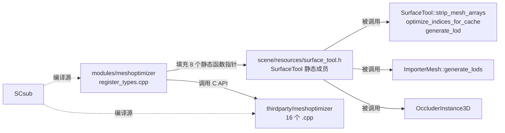
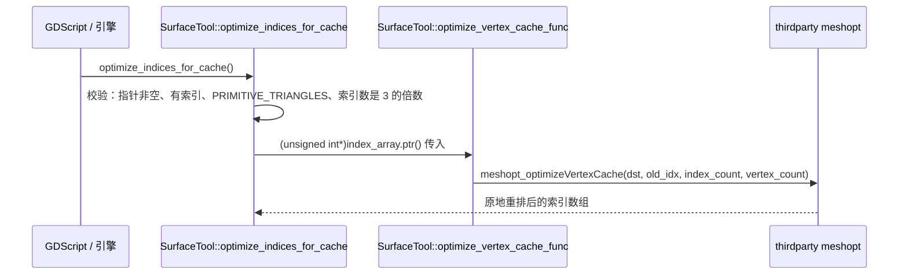

# meshoptimizer（modules）

> 一句话：把第三方 `meshoptimizer` 网格优化库「翻译」成 `SurfaceTool` 上的一排函数指针——就像一个只负责把 8 根线接对的转接头，自己不产算法。

**结论**：`modules/meshoptimizer` 是第三方 `meshoptimizer` 库的**薄封装**，不注册任何新类，只在 `MODULE_INITIALIZATION_LEVEL_SCENE` 阶段把 8 个 `meshopt_*` C 函数挂到 `SurfaceTool` 的静态函数指针上（`scene/resources/surface_tool.h:100-115`），从而让引擎获得顶点去重、索引重排、顶点缓存优化和网格简化/LOD 能力；代价是只要开了 3D 就背进 16 个 thirdparty 源文件的编译量和少量运行内存。

## 是什么 / 不是什么

- **是**：一层胶水，把 `meshopt_*` 函数指针填进 `SurfaceTool` 预留的 8 个静态成员，让 `SurfaceTool` / `ImporterMesh` 在不依赖具体库实现的情况下调用网格优化算法。
- **不是**：不包含任何优化算法——顶点缓存优化、简化、去重全在 `thirdparty/meshoptimizer/` 的 16 个 `.cpp` 里（`SCsub:14-31`），本文不展开。
- **不负责**：不负责定义网格的数据结构（那是 `SurfaceTool` / `ImporterMesh` 的事），也不管网格如何被导入、导出、上屏——它只提供「把网格数据变少/变顺」的数学计算。

## 在引擎里的位置



`SurfaceTool`（scene 层）只声明了一排 `static` 函数指针，初始值全是 `nullptr`（`surface_tool.cpp:38-45`）。meshoptimizer 模块初始化时把 `nullptr` 换成真实的 `meshopt_*` 函数，调用方才能干活；卸载时再填回 `nullptr`。

## 关键概念

- **静态函数指针 = 插座**：`SurfaceTool` 里的 8 个成员是「插座」，模块是「插头」。以 `simplify_func` 为例，类型是 `size_t (*SimplifyFunc)(unsigned int *destination, const unsigned int *indices, ...)`（`scene/resources/surface_tool.h:104-105`），谁用谁插，不用就空着。
- **顶点去重（remap）**：把重复顶点合并，生成一张「旧顶点 → 新顶点」的重映射表，再据此搬顶点和索引。对应 `generate_remap_func` / `remap_vertex_func` / `remap_index_func` 三个指针（`register_types.cpp:46-48`），由 `SurfaceTool::strip_mesh_arrays` 消费（`surface_tool.cpp:48-55`）。
- **顶点缓存优化（vertex cache）**：重排三角形索引顺序，让 GPU 顶点缓存命中率更高、片元处理更快。对应 `optimize_vertex_cache_func` → `meshopt_optimizeVertexCache`（`register_types.cpp:42`），消费点是 `SurfaceTool::optimize_indices_for_cache()`（`surface_tool.cpp:1287`）。
- **网格简化 / LOD（simplify）**：按目标索引数和误差阈值削减三角形。三兄弟 `simplify_func` / `simplify_with_attrib_func` / `simplify_scale_func`（`register_types.cpp:44-46`）分别负责纯几何简化、带顶点属性的简化、误差缩放因子；消费点是 `SurfaceTool::generate_lod()`（`surface_tool.cpp:1312`）和 `ImporterMesh::generate_lods()`（`scene/resources/3d/importer_mesh.cpp:570`）。
- **`disable_3d` 开关**：`config.py` 的 `can_build` 返回 `not env["disable_3d"]`，禁了 3D 就不编这个模块——因为它的所有消费方都在 3D 网格链路上。

## 核心文件（按阅读顺序）

1. `config.py` — `can_build` 返回 `not env["disable_3d"]`，只在 3D 开启时编译。
2. `SCsub` — 编译清单：16 个 `thirdparty/meshoptimizer/*.cpp` + 本模块 `*.cpp`，并声明模块对象依赖第三方对象。
3. `register_types.h` — 只声明 `initialize_meshoptimizer_module` / `uninitialize_meshoptimizer_module` 两个入口。
4. `register_types.cpp` — 全部胶水逻辑：`SCENE` 初始化阶段把 8 个 `meshopt_*` 函数填进 `SurfaceTool` 的静态指针，卸载时填回 `nullptr`。

## 数据流 / 调用链

以「用户调 `SurfaceTool.optimize_indices_for_cache()` 重排索引」为例：



顶点去重走另一条对称链路：`strip_mesh_arrays` 先 `generate_remap_func` 拿到重映射表，再 `remap_vertex_func` / `remap_index_func` 搬顶点和索引（`surface_tool.cpp:52-55`）；简化 LOD 则命中 `simplify_func`（`generate_lod`，`surface_tool.cpp:1335`）或 `simplify_with_attrib_func` + `simplify_scale_func`（`ImporterMesh::generate_lods`，`importer_mesh.cpp:723,789`）。

## 中文口诀

```
meshopt 是个转接头，
不造算法只接插座；
八个指针填 SurfaceTool，
去重、重排、减三角；
开 3D 才编译进来，
关 3D 整个不背锅；
简化问 LOD，去重问 remap，
缓存优化靠重排索引那个哥。
```

## 练习（15 分钟）

1. 打开 `register_types.cpp:37-50`，把 8 行赋值逐一对应到 `scene/resources/surface_tool.h:100-115` 的 8 个指针，说出每个指针「干什么活」。
2. 打开 `surface_tool.cpp:1287-1296`，列出 `optimize_indices_for_cache()` 的 4 条前置校验条件。
3. 打开 `surface_tool.cpp:1312-1340`，找到 `generate_lod()` 里用的 `simplify_options` 常量值，并说出 `WARN_DEPRECATED_MSG` 提示用户改用什么替代。
4. 打开 `SCsub:14-31`，数出 thirdparty 源文件数量，并解释 `env.Depends(module_obj, thirdparty_obj)` 那行的作用。

## 自测

- [ ] `SurfaceTool` 里那 8 个函数指针的初始值是什么？（答：`nullptr`，见 `surface_tool.cpp:38-45`）
- [ ] `config.py` 里 `can_build` 依据哪个 SCons 变量决定要不要编这个模块？
- [ ] `SurfaceTool::generate_lod()` 和 `ImporterMesh::generate_lods()` 分别用到哪几个函数指针？

## 一句话总结

> `modules/meshoptimizer` 是第三方 `meshoptimizer` 库在 Godot 里的「8 个函数指针」胶水层：把顶点去重、索引重排、顶点缓存优化、网格简化/LOD 四类算法接进 `SurfaceTool` / `ImporterMesh`，算法本体留在 `thirdparty/`。
