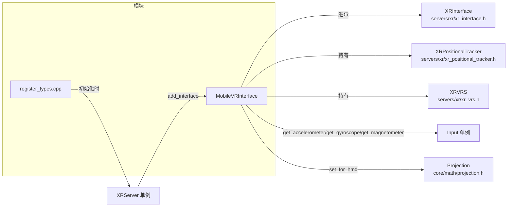
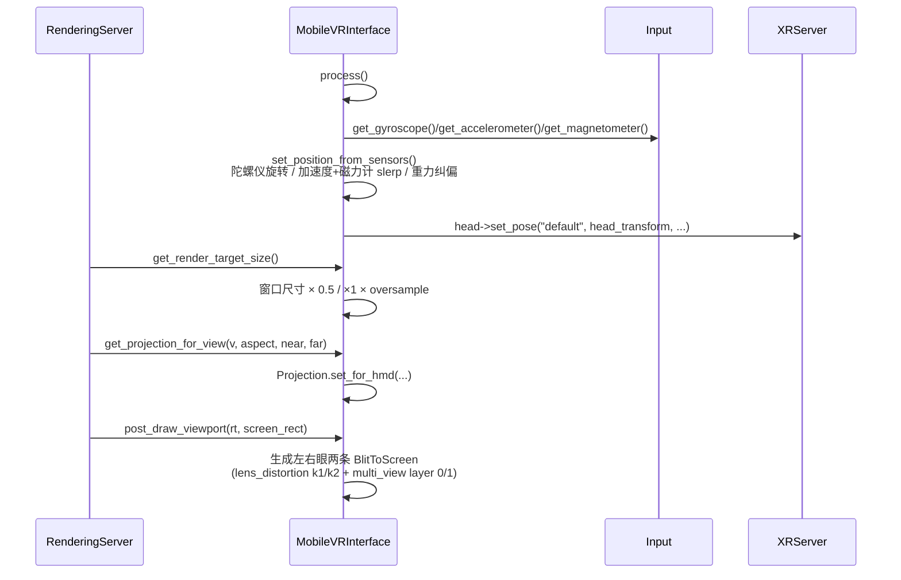

# mobile_vr（modules）

> 一句话：把手机 + 纸盒眼镜（Google Cardboard 式）变成一台「只能用陀螺仪/加速度计转头的 3DOF VR 头盔」，引擎负责把画面切两半、加透镜畸变。

**结论**：这个模块提供 `MobileVRInterface`——一个不依赖任何外部 SDK、纯靠手机传感器做**朝向跟踪（3DOF，无位置跟踪）**的最小 VR 接口，为「手机 VR 眼镜盒」服务；代价是开发者必须自己填一堆物理参数（瞳距、镜片距离、畸变系数）。

## 是什么 / 不是什么

- **是**：`XRInterface` 的一个原生实现，注册到 `XRServer` 后，让 Viewport 以立体（左右眼）方式渲染并输出到手机屏幕（`mobile_vr_interface.h:48`）。
- **是**：一个「参考实现/底座」——头文件注释明确写它是给更高级移动 VR SDK 接口（Oculus/GearVR 等）当示例和地基用的（`mobile_vr_interface.h:37-46`）。
- **不是**：不带任何位置跟踪，只有转头（yaw/pitch/roll），所以 `supports_play_area_mode` 只认 `XR_PLAY_AREA_3DOF`（`mobile_vr_interface.cpp:422-425`）。
- **不是**：不负责陀螺仪硬件读取本身——传感器数据从 `Input` 单例拿（`mobile_vr_interface.cpp:142-145`），跟踪注册/参考帧/世界缩放归 `XRServer` 管。

## 在引擎里的位置



依赖方向是：模块只依赖 `servers/xr/`（接口基类 + 跟踪器 + VRS 工具）和 `core/`（Input、Projection），自己不对上层 scene 节点暴露任何东西——它只是被 `XRServer` 选中后由渲染流程调用。

## 关键概念

1. **`MobileVRInterface`（主角类）** — 一个 `XRInterface` 子类，等于「一台虚拟头盔」。引擎问它「几个视图」「投影矩阵是什么」「相机放哪」，它按手机参数现算答案（`mobile_vr_interface.h:48`）。
2. **`XRInterface`（契约）** — 所有 VR 运行时都要实现的抽象基类，定义 `initialize` / `get_projection_for_view` / `get_transform_for_view` 等虚函数，`MobileVRInterface` 逐个 override（`mobile_vr_interface.h:149-168`）。
3. **`XRPositionalTracker`（头）** — 一个「头部跟踪器」对象，`initialize()` 时创建、注册为 `TRACKER_HEAD`，`process()` 里把算好的朝向写回它的 pose（`mobile_vr_interface.cpp:375-379`、`mobile_vr_interface.cpp:569-571`）。
4. **`XRVRS`（VRS 工具）** — 可变速率着色（Variable Rate Shading）的小工具类，`MobileVRInterface` 持有它来按眼中心生成 VRS 纹理（`mobile_vr_interface.cpp:576-591`；类定义 `servers/xr/xr_vrs.h:40`）。
5. **`Projection::set_for_hmd`（透镜投影）** — 把瞳距、屏宽、镜片距离、oversample 合成一张 HMD 投影矩阵，`get_projection_for_view` 直接调用它（`mobile_vr_interface.cpp:508`；声明 `core/math/projection.h:81`）。

## 核心文件（按阅读顺序）

1. `modules/mobile_vr/config.py` — 模块入口配置：`disable_xr` 关闭时整个模块不编译；声明文档类 `MobileVRInterface`。
2. `modules/mobile_vr/SCsub` — 一句话把目录下所有 `*.cpp` 塞进模块源文件。
3. `modules/mobile_vr/register_types.cpp` — 注册类 + 在 `SCENE` 初始化阶段实例化接口并 `add_interface` 到 `XRServer`。
4. `modules/mobile_vr/mobile_vr_interface.h` — 接口的全部成员与虚函数签名，默认参数都写在这。
5. `modules/mobile_vr/mobile_vr_interface.cpp` — 真正的实现：传感器融合、投影、渲染目标、blit 出屏。
6. `modules/mobile_vr/doc_classes/MobileVRInterface.xml` — 脚本暴露的成员/默认值文档（瞳距 6.0、屏宽 14.5、oversample 1.5 等）。

## 数据流 / 调用链

一次典型帧的调用顺序：



关键点：`set_position_from_sensors()` 里有三条优先级链——有陀螺仪就用陀螺仪积分旋转（不平滑）；没陀螺仪但有重力+磁力计就用四元数 slerp 融合（`mobile_vr_interface.cpp:189-197`）；只有重力就做「向下对齐」的漂移补偿（`mobile_vr_interface.cpp:198-212`）。

## 中文口诀

```
手机眼镜盒，全靠 MobileVRInterface 这一台。
不连 SDK 不连网，传感器三兄弟搬上台。
陀螺计转头，加速度计加磁计补姿态。
两目一张屏，中间一切左右眼分开摆。
瞳距镜距屏宽 oversample，参数填错画就歪。
透镜畸变 k1 k2 来矫正，出屏靠 BlitToScreen 左右裁。
3DOF 只转头不走路，位置高度 eye_height 一米八五抬。
```

## 练习（15 分钟）

1. 打开 `register_types.cpp`，找出 `MODULE_INITIALIZATION_LEVEL_SCENE` 判断和 `add_interface` 调用，说清「类注册」和「接口挂到 XRServer」是两件不同的事。
2. 在 `mobile_vr_interface.cpp` 里读 `get_transform_for_view`，算一下 `intraocular_dist=6.0` 时左眼（view 0）的 `origin.x` 偏移是多少（注意 `*0.01` 厘米转米、`*0.5` 各分一半）。
3. 读 `post_draw_viewport`，画出左右眼各占屏幕哪半边、`multi_view.layer` 各是几。
4. 打开 `doc_classes/MobileVRInterface.xml`，对照 `_bind_methods`，说出 `display_to_lens` 的默认值和单位（厘米）。

## 自测

- [ ] `MobileVRInterface::get_name()` 返回的字符串是什么？用它在 GDScript 里 `XRServer.find_interface(...)` 应该填什么？（提示：`mobile_vr_interface.cpp:39`）
- [ ] `get_capabilities()` 返回哪个枚举位？`supports_play_area_mode` 只接受哪种 PlayAreaMode？（提示：`mobile_vr_interface.cpp:43`、`422`）
- [ ] Android 上要能出陀螺仪数据，需要在 ProjectSettings 里打开哪几个传感器开关？（提示：`doc_classes/MobileVRInterface.xml:15`）

## 一句话总结

> mobile_vr 是 Godot 里最「裸」的移动 VR 接口：不吃任何 SDK、用手机自带传感器做 3DOF 朝向跟踪，靠开发者手填的一组物理参数把手机屏切成立体画面并叠上透镜畸变。
