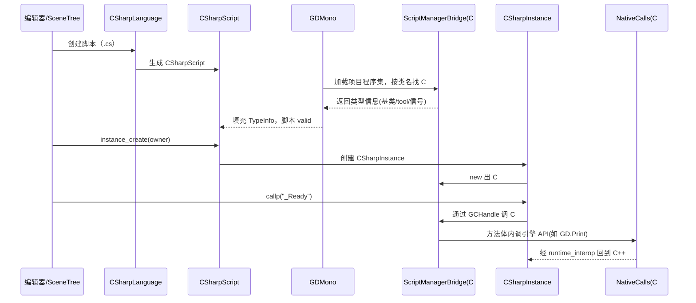

# mono（modules）

> 一句话：mono 模块是一座「双向桥」——把 .NET 的 C# 脚本接到 Godot 的脚本系统（`ScriptLanguage`/`Script`/`ScriptInstance`）上，让 C# 能调用引擎 API、引擎也能反过来调用 C# 代码。

**结论**：mono 模块负责让 C# 成为 Godot 的一等脚本语言——它启动 .NET 运行时、注册 `CSharpLanguage`、生成并维护 C# 与 C++ 之间的绑定层；代价是引入整套 .NET 工具链（hostfxr/coreclr、MSBuild、NuGet 包），是引擎里最重的可选脚本后端。

## 是什么 / 不是什么

mono 模块的本质：Godot 的脚本系统定义了一套抽象接口（`ScriptLanguage`、`Script`、`ScriptInstance`，位于 `core/object/script_language.h`），任何语言接入就是实现这套接口。GDScript 用它自己实现了一遍，mono 模块则是「用 C# 再实现一遍」，外加负责把 .NET 运行时拉起来、把 C# 代码和 C++ 对象互相"认出来"。

- **它是什么**：一个 `ScriptLanguage` 的 C# 实现（`CSharpLanguage`）、一个 `Script` 的 C# 实现（`CSharpScript`）、一个 `ScriptInstance` 的 C# 实现（`CSharpInstance`），加上 .NET 运行时管理（`GDMono`）和编译期/运行期两套绑定胶水。
- **它不是什么**：它不自己写编译器——C# 编译交给 MSBuild/Roslyn；它不重新发明 Godot 的类系统——只是给已有的 ClassDB 生成 C# 包装类；它不拥有 GDExtension 框架——只借用 GDExtension 的 instance binding 机制挂托管对象（`GDExtensionInstanceBindingCallbacks`，`csharp_script.h:443`），GDExtension 本体在 `core/extension`。

一句话分清：**编译**交给 .NET，**执行**归 CLR，**接线**（谁是谁、怎么调）才是 mono 模块自己的活。

## 在引擎里的位置

```mermaid
flowchart TB
    subgraph 引擎核心
        ScriptServer["ScriptServer<br/>(core/object)"]
        ClassDB["ClassDB"]
        ScriptLang["ScriptLanguage / Script / ScriptInstance<br/>(core/object/script_language.h)"]
        GDExt["GDExtension instance binding"]
    end

    subgraph mono 模块
        CSharpLanguage["CSharpLanguage"]
        CSharpScript["CSharpScript"]
        CSharpInstance["CSharpInstance"]
        GDMono["GDMono<br/>启动 hostfxr/coreclr"]
        ResFmt["ResourceFormatLoader/SaverCSharpScript"]
    end

    subgraph 托管层(C#)
        GodotSharp["GodotSharp 程序集<br/>GodotObject / NativeCalls / Marshaling"]
        SrcGen["Source Generators<br/>ScriptMethodsGenerator 等"]
        GodotTools["GodotTools 编辑器工具"]
    end

    ScriptServer -->|register_language| CSharpLanguage
    CSharpLanguage -->|实现| ScriptLang
    CSharpScript -->|继承| ScriptLang
    CSharpInstance -->|继承| ScriptLang
    CSharpLanguage -->|创建| CSharpScript
    CSharpScript -->|创建| CSharpInstance
    GDMono -->|加载| GodotSharp
    CSharpInstance -->|GCHandle| GodotSharp
    CSharpInstance -.->|借用 instance binding| GDExt
    GodotSharp -->|NativeCalls| ClassDB
    SrcGen -->|编译期生成| GodotSharp
    CSharpLanguage -->|注册| ResFmt
```

## 关键概念

- **`CSharpLanguage`（语言门面）**：C# 在 `ScriptServer` 里的代表。`initialize_mono_module` 里 `memnew` 之后调 `ScriptServer::register_language`（`register_types.cpp:55-57`），从此引擎知道「有一种语言叫 C#，扩展名 `.cs`」。
- **`CSharpScript`（类的镜子）**：一个 `Script` 子类（`csharp_script.h:56`），对应一个 C# 类。它不装 C# 字节码，只装「这个 C# 类的元信息」——类名、基类、是不是 tool、是不是 global class（`TypeInfo` 结构体，`csharp_script.h:63`）。
- **`CSharpInstance`（实例的壳）**：一个 `ScriptInstance` 子类（`csharp_script.h:304`），对应一个活着的 C# 对象。核心成员是一个 `MonoGCHandleData gchandle`（`csharp_script.h:316`）——一个指向托管对象的 GC 句柄，靠它把 C++ 里的 `Object` 和 C# 里的对象焊在一起。
- **`GDMono`（.NET 运行时管家）**：管 hostfxr/coreclr 两个 DLL 句柄、项目程序集路径（`mono_gd/gd_mono.h:61-69`）。真正把 CLR 跑起来的是它，`CSharpLanguage` 里存了个 `GDMono *gdmono`（`csharp_script.h:407`）。
- **`MonoBind::GodotSharp`（引擎侧单例）**：一个注册进 ClassDB 的 `Object` 单例（`mono_gd/gd_mono.h:157`），在 `register_types.cpp:53` 创建，作为 C# 世界的「总开关」（比如热重载入口 `reload_assemblies`）。

## 核心文件（按阅读顺序）

1. `modules/mono/SCsub` — 编译清单：`*.cpp` + `glue/*.cpp` + `mono_gd/*.cpp` + `utils/*.cpp`，editor 构建再加 `editor/*.cpp`。
2. `modules/mono/register_types.cpp` — 入口：注册 `CSharpScript` 类、创建 `CSharpLanguage` 并塞进 `ScriptServer`、挂上资源加载/保存器。
3. `modules/mono/csharp_script.h` — 三个核心类（`CSharpScript`/`CSharpInstance`/`CSharpLanguage`）的完整公共接口，是读这个模块最该先看的一个头。
4. `modules/mono/mono_gd/gd_mono.h` — `GDMono`（运行时）与 `MonoBind::GodotSharp`（单例）的定义。
5. `modules/mono/godotsharp_defs.h` — 命名约定常量：`BINDINGS_NAMESPACE "Godot"`、`CORE_API_ASSEMBLY_NAME "GodotSharp"`、`BINDINGS_CLASS_NATIVECALLS "NativeCalls"`。
6. `modules/mono/glue/runtime_interop.cpp` — C# → 原生方向的函数表（`get_runtime_interop_funcs`），托管代码靠它回调进引擎。
7. `modules/mono/glue/GodotSharp/` — 托管侧程序集源码：`Core/Bridge/ScriptManagerBridge.cs`、`Core/NativeInterop/Marshaling.cs`、`Core/NativeInterop/NativeFuncs.cs`。
8. `modules/mono/editor/bindings_generator.h` — `BindingsGenerator`：从 ClassDB 生成整套 C# 绑定源码（`generate_cs_api`）。
9. `modules/mono/editor/Godot.NET.Sdk/Godot.SourceGenerators/` — 编译期源生成器（`ScriptMethodsGenerator`、`ScriptPropertiesGenerator`、`ScriptSignalsGenerator` 等）。

## 数据流 / 调用链

下面是一次「引擎加载并运行一个 C# 脚本」的典型链路：



方向要点：**C# 调引擎**走 `NativeCalls`（`BindingsGenerator` 生成的 `P/Invoke` + `Marshaling` 把 `Variant` 搬过边界）；**引擎调 C#** 走 `ScriptManagerBridge`/`ManagedCallbacks` 和 `CSharpInstance` 里的 `GCHandle`。两条路都汇聚到 `runtime_interop` 这一张函数表上。

## 中文口诀

```
语言门面 CSharpLanguage，注册进 ScriptServer；
类的镜子 CSharpScript，不装字节只装元信息；
实例的壳 CSharpInstance，一根 GCHandle 焊两头；
运行时靠 GDMono，hostfxr 把 CLR 拉起；
C# 调引擎 NativeCalls，引擎调 C# 靠 GCHandle；
胶水生成靠 SourceGen，ClassDB 长出绑定树。
```

## 练习（15 分钟）

1. 打开 `modules/mono/register_types.cpp`，圈出「注册语言、注册类、注册资源加载器」三行，说出各自把什么塞进了哪个全局表。
2. 在 `csharp_script.h` 里找到 `CSharpInstance` 的 `MonoGCHandleData gchandle`，用它解释「C++ 的 Object 为什么能调用 C# 的方法」。
3. 打开 `modules/mono/editor/bindings_generator.h`，找到 `generate_cs_api` / `generate_cs_core_project` / `generate_cs_editor_project` 三个函数，说明它们分别生成什么。
4. 在 `glue/GodotSharp/GodotSharp/Core/Bridge/` 里打开 `ScriptManagerBridge.cs`，找一处「校验脚本类型是否可实例化」的代码，复述它的判断条件。

## 自测

- [ ] `CSharpLanguage` 是在哪个文件、通过哪个函数注册进 `ScriptServer` 的？`CSharpScript` 又是用哪个宏注册进 ClassDB 的？
- [ ] 引擎侧靠什么成员把「C++ 的 `Object`」和「C# 的托管对象」绑定在一起？这个机制借用了 GDExtension 的哪一类回调？
- [ ] C# 代码调用 `GD.Print` 时，指令最终是经过哪一条路径回到 C++ 的？

## 一句话总结

> mono 模块是 Godot 的 C# 脚本后端：实现 `ScriptLanguage` 三件套接入脚本系统，用 GDExtension 的 instance binding 机制把 C# 对象焊到 C++ 对象上，再靠绑定生成器和 Source Generators 铺好双向调用胶水。
