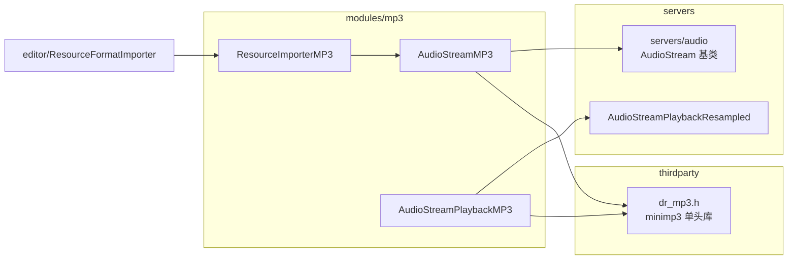
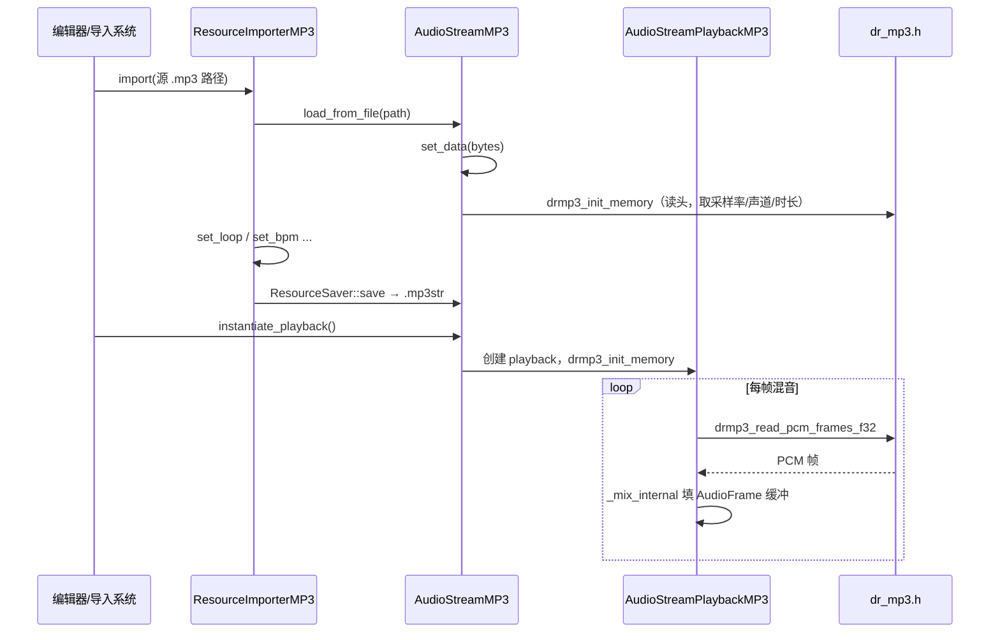

# mp3（modules）

> 一句话：把 MP3 文件塞进内存，交给 minimp3 解码成 PCM，再包装成引擎认得的 `AudioStream` 资源。

**结论**：`mp3` 模块给 Godot 增加一个 `AudioStreamMP3` 资源类（注册在 `modules/mp3/register_types.cpp:52`）和编辑器里的导入器 `ResourceImporterMP3`，让引擎能直接解码 MP3 音频流；代价是多一个模块要编译、多一份音频格式要维护。

## 是什么 / 不是什么

- **是**：一个「胶水层」——把第三方单头库 minimp3 的 C 接口，套进 Godot 的 `AudioStream` / `AudioStreamPlayback` 抽象里。
- **是**：一个编辑器导入器，把磁盘上的 `.mp3` 文件读进来、填好参数、另存成 `.mp3str` 资源（`modules/mp3/resource_importer_mp3.cpp:116`）。
- **不是**：不负责混音、不碰声卡输出——那些是 `servers/audio` 的事；MP3 编码/压缩算法本身在 `thirdparty/dr_libs/dr_mp3.h` 里，本模块只调用它。

## 在引擎里的位置

`AudioStreamMP3` 继承 `AudioStream`（`modules/mp3/audio_stream_mp3.h:90`）；它的播放器 `AudioStreamPlaybackMP3` 继承 `AudioStreamPlaybackResampled`（`modules/mp3/audio_stream_mp3.h:39`），底层数据来自 `dr_mp3.h`。

## 关键概念

- **流（Stream）与播放器（Playback）分离**：`AudioStreamMP3` 是「数据 + 元信息」，`AudioStreamPlaybackMP3` 是「一次播放会话」——Godot 音频的统一套路。比喻：歌谱（stream）和正在唱的人（playback）。
- **整块内存解码**：MP3 文件被一次性读进 `Vector<uint8_t> data`（`modules/mp3/audio_stream_mp3.h:97`），解码靠 `drmp3_init_memory` 从内存起（`modules/mp3/audio_stream_mp3.cpp:203`），不走磁盘 stdio。
- **混合器回调**：`_mix_internal` 一帧一帧用 `drmp3_read_pcm_frames_f32` 拉 PCM、填进 `AudioFrame` 缓冲（`modules/mp3/audio_stream_mp3.cpp:42`）。
- **资源导入器**：`ResourceImporterMP3` 声明它认 `.mp3` 扩展名、存成 `.mp3str`、产出 `AudioStreamMP3`（`modules/mp3/resource_importer_mp3.cpp:49-63`）。
- **节拍元数据**：`bpm` / `beat_count` / `bar_beats` 支持按拍循环（`modules/mp3/audio_stream_mp3.h:107-109`）。

## 核心文件（按阅读顺序）

1. `modules/mp3/register_types.cpp` — 模块入口，注册两个类、挂编辑器导入器回调。
2. `modules/mp3/audio_stream_mp3.h` — `AudioStreamMP3` 与 `AudioStreamPlaybackMP3` 的公开接口。
3. `modules/mp3/audio_stream_mp3.cpp` — 解码、混音、seek、循环的核心实现。
4. `modules/mp3/resource_importer_mp3.h` — 导入器类声明。
5. `modules/mp3/resource_importer_mp3.cpp` — 把 `.mp3` 读成 `AudioStreamMP3` 并存为 `.mp3str`。
6. `modules/mp3/config.py` — 编译开关 `mp3_extra_formats`、文档类清单。

## 数据流 / 调用链

导入走「文件 → 内存字节 → 元信息 → `.mp3str`」；播放走「`.mp3str` → 内存解码 → 逐帧混音」。

## 中文口诀

注册两分类齐全，流与播放分开看。
整块内存喂解码，dr_mp3 来把活干。
混音回调拉 PCM，seek 定位按帧算。
导入认 .mp3 存 .mp3str，胶水不碰声卡端。

## 练习（15 分钟）

1. 打开 `modules/mp3/register_types.cpp`，指出 `AudioStreamMP3` 在哪个初始化级别被 `GDREGISTER_CLASS` 注册。
2. 在 `audio_stream_mp3.cpp` 找到 `set_data`，看它如何用 `drmp3_init_memory` 拿到 `channels`、`sample_rate`、`length`。
3. 在 `resource_importer_mp3.cpp` 确认 `get_save_extension` 返回什么字符串，和 `RES_BASE_EXTENSION` 是否一致。

## 自测

- [ ] `AudioStreamMP3` 的基类是哪个类？`AudioStreamPlaybackMP3` 的基类又是哪个？
- [ ] 循环播放（loop）在 `_mix_internal` 里靠哪两处 `seek` 触发？`loop_offset` 从哪来？
- [ ] 为什么 `load_from_buffer` 失败时会提示「不要用 `.new()` 创建」？

## 一句话总结

> `mp3` 模块是 minimp3 与 Godot 音频抽象之间的那层胶水：负责「导入 + 解码 + 包装成 AudioStream」，不负责混音与输出。
