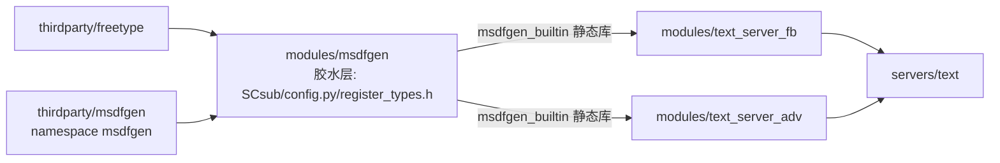
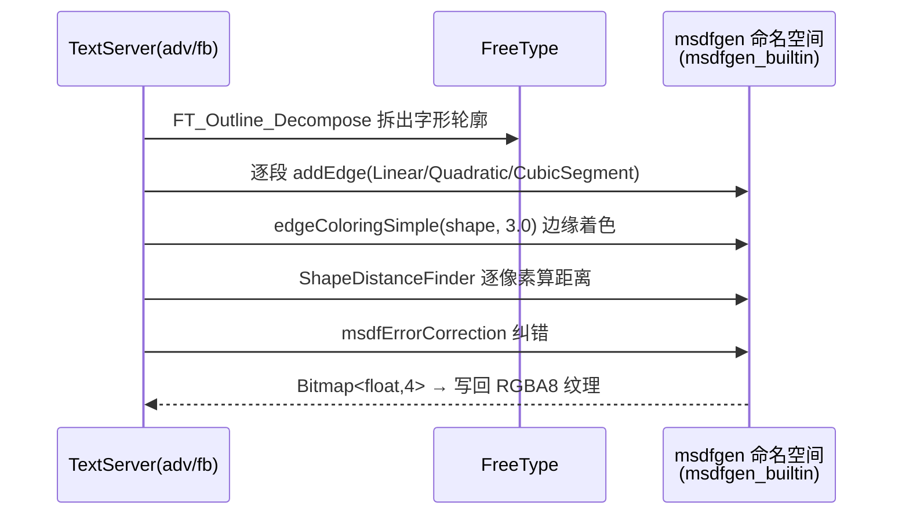

# msdfgen（modules）

> 一句话：它是「字体边缘场生成器」的外包厂商——把第三方 MSDF 库编译成静态库，交给 TextServer 去生成有向距离场（MSDF）字体纹理。

**结论**：`msdfgen` 是一个「纯胶水层」模块——它本身没有任何 Godot 类和可脚本调用 API，只做两件事：把 `thirdparty/msdfgen` 编译成一个静态库 `msdfgen_builtin`，并把它暴露给 `text_server_fb` / `text_server_adv`，让两个 TextServer 能生成多通道有向距离场（MSDF）字体纹理；代价是没有任何对外接口，想用它只能通过 TextServer 的 `Font`/`msdf_range` 属性间接触达。

## 是什么 / 不是什么

- 它**是**：一个构建期 + 链接期的胶水层。用 `SCsub` 把第三方库源码编进来，用 `config.py` 声明依赖，用一个空的 `register_types.h` 占位。
- 它**不是**：一个功能模块。整个目录只有 3 个文件（`SCsub`、`config.py`、`register_types.h`），没有自己的 `.cpp`，不注册任何类。
- MSDF 生成的**真正逻辑**不在本模块，而在 `thirdparty/msdfgen/`（vendored，不改）；把字形轮廓「喂」进 MSDF 库的**调用方**是 `modules/text_server_fb/` 和 `modules/text_server_adv/`，不在本模块。

一句话区分：本模块「负责编译和提供库」，TextServer「负责调用库干活」。

## 在引擎里的位置



- 依赖上游：`freetype` 模块（`config.py:2` 用 `module_add_dependencies("msdfgen", ["freetype"])` 声明）和 `thirdparty/msdfgen` 源码。
- 服务下游：`text_server_fb`（`config.py:2`）、`text_server_adv`（`config.py:2`）都把 `msdfgen` 列为依赖，最终向 `servers/text` 提供字体渲染能力。

## 关键概念

- **有向距离场（SDF/MSDF）**：像给每个字形画一圈「到笔画边缘有多远」的等高线图。MSDF 用 RGB 三个通道各存一份距离，转角处采样更准，小纹理也能放大后依然清晰。
- **胶水层模块**：自己不实现算法，只负责「把库编进来 + 挂到构建系统」。锚点：`modules/msdfgen/register_types.h:35-36` 的 `initialize_msdfgen_module` / `uninitialize_msdfgen_module` 函数体都是空的 `{}`。
- **构建开关 `builtin_msdfgen`**：决定要不要用内置库，默认开启。锚点：`SConstruct:325`（默认 `True`）、`modules/msdfgen/SCsub:13`。
- **静态库 `msdfgen_builtin`**：本模块唯一的产物。锚点：`modules/msdfgen/SCsub:48` 的 `add_library("msdfgen_builtin", thirdparty_sources)`。
- **`msdfgen` 命名空间**：第三方库的真实 API 都挂在这里，调用方 `#include <msdfgen.h>` 后使用。锚点：`thirdparty/msdfgen/msdfgen.h:39`。

## 核心文件（按阅读顺序）

1. `modules/msdfgen/config.py` — 声明模块依赖 `freetype`，`can_build` 恒返回 `True`（7 行，全部内容）。
2. `modules/msdfgen/SCsub` — 编译 21 个 `thirdparty/msdfgen/core/*.cpp` 成静态库，并把它插到链接顺序里（73 行）。
3. `modules/msdfgen/register_types.h` — 空的初始化/反初始化占位，证明本模块不注册任何类（35-36 行）。
4. `thirdparty/msdfgen/msdfgen.h` — 第三方库入口头文件，`namespace msdfgen` 及 `generateMSDF`/`generateMTSDF` 声明（只读了解，不改）。

## 数据流 / 调用链

下面这张图是「一次字形 MSDF 化」的真实调用链——注意首尾都发生在本模块**之外**，本模块只是中间「库在哪」的那一环：



锚点（fallback 版本，adv 版本逐行对应）：
- 入口 `TextServerFallback::rasterize_msdf`：`modules/text_server_fb/text_server_fb.cpp:400`；
- 多线程逐行算距离 `_generateMTSDF_threaded`：`text_server_fb.cpp:387`；
- 纠错收尾 `msdfgen::msdfErrorCorrection(...)`：`text_server_fb.cpp:473`；
- 整段被 `#ifdef MODULE_MSDFGEN_ENABLED` 包裹：`text_server_fb.cpp:321`（adv 版 `text_server_adv.cpp:53`）。

## 中文口诀

```
msdfgen 是空壳，自己不写一行码；
编译库成 msdfgen_builtin，交给 TextServer 去当家。
SCsub 编库、config 挂 freetype、register 空占位；
字轮廓进来，距离场出去，字体放大不模糊。
```

## 练习（15 分钟）

1. 用 `Get-ChildItem modules/msdfgen -Recurse` 确认目录里只有 3 个文件，读 `register_types.h` 确认 `initialize_msdfgen_module` 是空函数。
2. 打开 `modules/msdfgen/SCsub`，数一数 `thirdparty_sources` 数组里列了多少个 `core/*.cpp`（应为 21 个），并找到 `add_library("msdfgen_builtin", ...)` 那一行。
3. 在 `modules/text_server_fb/text_server_fb.cpp` 里搜 `rasterize_msdf`，顺着读从 `msdfgen::Shape shape;` 到 `msdfgen::msdfErrorCorrection(...)` 之间发生了什么。
4. 把 `SConstruct:325` 的 `builtin_msdfgen` 默认值改成 `False`（或命令行传 `builtin_msdfgen=no`）重新构建，观察 TextServer 是否还编译 `rasterize_msdf` 相关代码。

## 自测

- [ ] `msdfgen` 模块自己注册了哪些 Godot 类？（答案：零个，`register_types.h` 里 init/uninit 都是空函数体。）
- [ ] `msdfgen_builtin` 静态库是在哪个文件里被创建、名字写死成什么？（答案：`modules/msdfgen/SCsub:48`。）
- [ ] 真正调用 `msdfgen::` 命名空间生成 MSDF 的是哪两个模块？（答案：`text_server_fb` 和 `text_server_adv`。）

## 一句话总结

> `msdfgen` 是「只有库、没有接口」的胶水层：它把第三方 MSDF 库编成 `msdfgen_builtin` 并挂进构建系统，让两个 TextServer 拿到生成多通道有向距离场字体纹理的能力。
