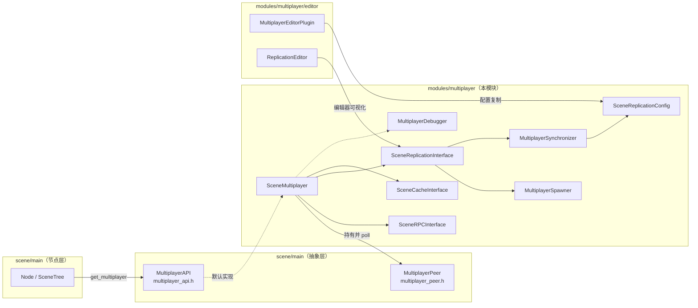
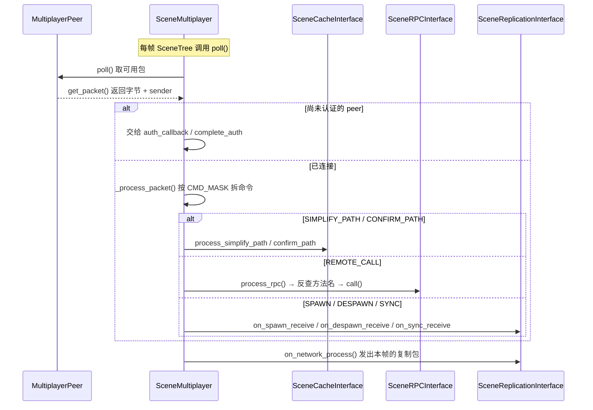

# multiplayer（modules）

> 一句话：一个「邮差 + 传声筒 + 克隆机」——`MultiplayerPeer` 负责把字节包送到对端，`SceneMultiplayer` 负责在节点之间传 RPC 调用和复制节点状态。

**结论**：这个模块把 Godot 的「多人游戏」从底层字节传输抽象成「在场景树上自动复制节点 + 远程调函数」，为游戏开发者服务；代价是引入了服务器权威、节点路径缓存、状态同步三套内部协议，复杂度全部藏在 `SceneMultiplayer` 内部。

## 是什么 / 不是什么

`multiplayer` 模块是 Godot 高层多人框架的实现层。它做三件事：

1. **传输层封装**：持有并轮询一个 `MultiplayerPeer`（`scene/main/multiplayer_peer.h:38`，ENet / WebSocket 等传输的抽象基类），把「谁发的、可靠还是不可靠、哪个通道」翻译成内部可读的包。
2. **RPC**：让任意 `Node` 上的方法能被对端「按名字」远程调用，方法名被压成 16 位 id 以省带宽（`SceneRPCInterface`，`scene_rpc_interface.h:41`）。
3. **节点复制**：让服务器一侧的 `Node` 树按规则在客户端自动「长出来」（spawn）并持续同步属性（sync），由 `SceneReplicationInterface`（`scene_replication_interface.h:42`）驱动。

它**不负责**的事情，交给别的模块：

- **不实现具体网络协议**：ENet 在 `modules/enet/`，WebSocket 在 `modules/websocket/`，WebRTC 在 `modules/webrtc/`。本模块只消费 `MultiplayerPeer` 接口。
- **不定义底层 `MultiplayerPeer` / `MultiplayerAPI` 抽象**：这两个基类在 `scene/main/`（`multiplayer_peer.h`、`multiplayer_api.h`），本模块的 `SceneMultiplayer` 只是它们的实现之一。
- **不做序列化本身**：Variant 的编解码/压缩复用 `MultiplayerAPI::encode_and_compress_variant`（`scene/main/multiplayer_api.h:57`），不在本模块。

对比句：`MultiplayerPeer` 是「路」，`SceneMultiplayer` 是「在路上跑的车」，`MultiplayerSpawner` / `MultiplayerSynchronizer` 是「车里的货物清单」。

## 在引擎里的位置

`register_types.cpp:46` 在 `MODULE_INITIALIZATION_LEVEL_SCENE` 阶段注册 5 个类：`SceneReplicationConfig`、`MultiplayerSpawner`、`MultiplayerSynchronizer`、`OfflineMultiplayerPeer`、`SceneMultiplayer`，并把默认 `MultiplayerAPI` 接口设为 `"SceneMultiplayer"`（`register_types.cpp:54`）。

## 关键概念

1. **邮差（peer 传输）**：`MultiplayerPeer` 抽象「把一包字节发给某个人 / 广播」。`SceneMultiplayer` 只在 `poll()` 里调用它，其他代码不碰字节。锚点：`scene_multiplayer.cpp:73` 的 `multiplayer_peer->poll()`。
2. **远程调用（RPC）**：把「调方法」封装成 `NETWORK_COMMAND_REMOTE_CALL` 包。方法名在两端各建一张 id 映射表，发端发 id、收端反查方法名。锚点：`SceneRPCInterface`（`scene_rpc_interface.h:41`）、`rpcp` 入口 `scene_multiplayer.cpp:578`。
3. **复制器（replicator）**：`SceneReplicationInterface` 是「让节点树跨机同步」的总调度。它跟踪哪些节点要 spawn、哪些要 sync，每帧调用 `on_network_process()` 把变化打包发出。锚点：`scene_replication_interface.h:42`。
4. **节点路径缓存（node cache）**：网络里传完整 `NodePath` 太贵，`SceneCacheInterface` 给每个节点发一个递增 id，对端按 id 还原路径。锚点：`scene_cache_interface.h:38`、命令 `NETWORK_COMMAND_SIMPLIFY_PATH`。
5. **复制清单（replication config）**：`SceneReplicationConfig` 是一张「属性清单」，记录每个属性是否在 spawn 时带、是否持续 sync、同步模式（`NEVER`/`ALWAYS`/`ON_CHANGE`）。锚点：`scene_replication_config.h:42`。

## 核心文件（按阅读顺序）

1. `scene_multiplayer.h` — 门面类 `SceneMultiplayer`，定义 8 种网络命令枚举（`REMOTE_CALL`/`SPAWN`/`SYNC`/`SYS` 等，`:68`）和三个内部接口成员。
2. `scene_multiplayer.cpp` — 核心逻辑：`poll()`（`:67`）取包、`_process_packet()`（`:215`）按命令分发、`rpcp()`（`:578`）发 RPC。
3. `scene_rpc_interface.h/.cpp` — RPC 的收发包、方法名→id 映射、调用本地校验。
4. `scene_replication_interface.h/.cpp` — 节点复制引擎：spawn/despawn/sync/delta 四类包的收发。
5. `scene_cache_interface.h/.cpp` — 节点路径与 id 的双向缓存、路径确认。
6. `multiplayer_spawner.h/.cpp` — 场景树节点 `MultiplayerSpawner`，声明「哪些场景可被复制、往哪挂」。
7. `multiplayer_synchronizer.h/.cpp` — 场景树节点 `MultiplayerSynchronizer`，声明「哪些属性要持续同步、对谁可见」。
8. `scene_replication_config.h/.cpp` — 资源 `SceneReplicationConfig`，承载复制清单。
9. `multiplayer_debugger.h/.cpp` — 三套 profiler（带宽 / RPC / 复制），喂给调试器面板。
10. `register_types.cpp` — 模块入口，注册 5 个类并设默认接口。

## 数据流 / 调用链

要点：`poll()` 里「取包→认证判断→按命令分发→复制器发帧包」是单线程顺序执行的（`scene_multiplayer.cpp:67-166`）。出方向则是用户代码调 `rpc()`（Node 层）或复制器在 `on_network_process()` 里主动 `_send_sync`/`_send_delta`（`scene_replication_interface.h:104`）。

## 中文口诀

- 网络是路，Peer 是脚；Scene 是车，poll 是油门。
- 一条命令拆八种，RPC 同步加 spawn。
- 方法压 id 省带宽，路径压 id 省字节。
- 服务器权威一棵树，客户端照单克隆。
- spawner 管「长出来」，synchronizer 管「改属性」。
- 先路径确认，再发 RPC，别对没缓存的节点喊话。

## 练习（15 分钟）

1. 打开 `scene_multiplayer.cpp:215` 的 `_process_packet()`，把 `switch` 里 8 个分支各对应的类/方法记在一张表上。
2. 从 `scene_multiplayer.cpp:67` 的 `poll()` 追到 `replicator->on_network_process()`（`:165`），确认「取包」和「发复制包」在同一次调用里完成。
3. 在 `register_types.cpp:47-57` 数出注册了几个类，并确认默认接口名是 `"SceneMultiplayer"`。
4. 读 `multiplayer_synchronizer.h:54` 的 `root_path` 默认值，思考为什么默认指向父节点（提示：对照 `AnimationPlayer` 的注释）。

## 自测

- [ ] `SceneMultiplayer` 收到的每个数据包，其「命令类型」取自第一个字节的哪几位？（见 `scene_multiplayer.h:99` 的 `CMD_MASK`）
- [ ] 为什么 RPC 和节点路径都要用「id 映射」而不是直接传字符串 / 完整路径？
- [ ] `OfflineMultiplayerPeer` 的 `get_unique_id()` 返回什么？（`scene_multiplayer.h:60`）它有什么用？

## 一句话总结

> `multiplayer` 模块是 Godot 多人游戏的中枢：向下把 `MultiplayerPeer` 的字节流翻译成 RPC 与节点复制命令，向上给 `Node` 提供「远程调函数 + 自动克隆场景」两件事。
