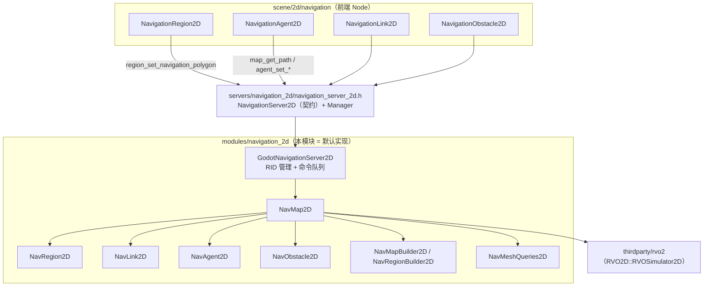
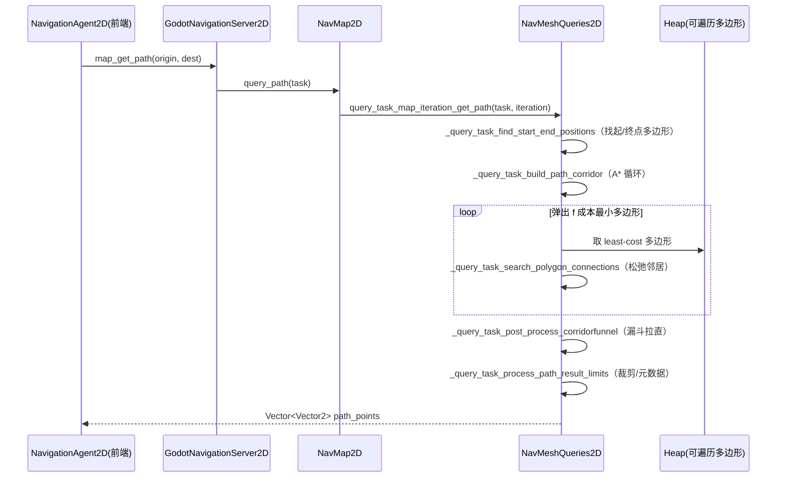

# navigation_2d（modules）

> 一句话：这是 Godot 2D 导航的「默认大脑」——把一堆多边形导航网格拼成一张可查询的图，再在这张图上跑 A* 找路，顺带用 RVO 让成群的角色互相让路。

**结论**：`modules/navigation_2d` 是 `servers/navigation_2d` 那套导航服务器契约的**默认实现**——它负责把 `NavigationPolygon` 多边形建成分区网格（region → 合并成 map）、提供 A* 寻路与最近点/随机点查询、并在 `NavMap2D` 里跑 RVO2 局部避障。代价是内存与构建耗时：多边形的边要量化进网格做合并，避障每帧还要迭代模拟。

## 是什么 / 不是什么

**是什么**：一个「服务器后端」模块，实现 `NavigationServer2D` 抽象接口（`servers/navigation_2d/navigation_server_2d.h:70` 的 `GodotNavigationServer2D : public NavigationServer2D`）。

**不是什么**：
- 不是 3D 导航——3D 由 `modules/navigation_3d` 负责，这里是 2D。
- 不定义场景里的 `NavigationRegion2D` / `NavigationAgent2D` 等节点——那些是薄前端，活在 `scene/2d/navigation/`（`scene/2d/navigation/navigation_region_2d.h:36` 等），它们只把参数转发给本模块的服务器。
- 不渲染网格、不做物理碰撞——只关心「能走/不能走」的多边形与边。

## 在引擎里的位置

## 关键概念

- **Map 是一张「区域拼图」**：`NavMap2D`（`nav_map_2d.h:51`）持有 `LocalVector<NavRegion2D *> regions`（`nav_map_2d.h:72`）和 `LocalVector<NavLink2D *> links`，把所有区域的多边形拼到一起再找路。
- **Region 是「一块导航网格」**：`NavRegion2D`（`nav_region_2d.h:41`）包装一个 `Ref<NavigationPolygon> navmesh`（`nav_region_2d.h:52`）和一个 `Transform2D`，把多边形变换到世界坐标。
- **Polygon 是「图里的节点」**：`Nav2D::Polygon`（`nav_utils_2d.h:97`）只有顶点 `vertices`、所属 owner、`surface_area`；边上的连接存成 `Nav2D::Connection`（`nav_utils_2d.h:83`，含 `pathway_start/end` 这个「门」）。
- **NavigationPoly 是「A* 的记账本」**：`Nav2D::NavigationPoly`（`nav_utils_2d.h:108`）记 `traveled_distance`（g 成本）、`distance_to_destination`（h 成本）、`total_travel_cost()`（f 成本），以及回溯用的 `back_navigation_*`。
- **避障是「独立的小世界」**：`NavMap2D` 内嵌 `RVO2D::RVOSimulator2D rvo_simulation`（`nav_map_2d.h:78`），跟 A* 是两套系统——A* 给全局路径，RVO 给局部让路。

## 核心文件（按阅读顺序）

1. `modules/navigation_2d/register_types.cpp` — 模块入口：注册 `GodotNavigation2D` 服务器并设为默认（`:48-52`）。
2. `modules/navigation_2d/2d/godot_navigation_server_2d.h` — 服务器本体：5 个 `RID_Owner` 管对象（`:79-83`），`COMMAND_*` 宏生成「sync 阶段才执行」的命令队列。
3. `modules/navigation_2d/nav_utils_2d.h` — 数据结构总纲：`Nav2D::Polygon / NavigationPoly / Connection / EdgeKey / PointKey`。
4. `modules/navigation_2d/nav_map_2d.h` — 地图：区域/链接/代理/障碍容器 + RVO 世界 + iteration 槽位。
5. `modules/navigation_2d/nav_region_2d.h` — 区域：`NavigationPolygon` + 变换 + 异步构建。
6. `modules/navigation_2d/2d/nav_region_builder_2d.h` / `nav_map_builder_2d.h` — 网格构建两阶段：先建 region，再合并进 map。
7. `modules/navigation_2d/2d/nav_mesh_queries_2d.h` — 查询中枢：A* 走廊构建 + 漏斗后处理 + 最近点/随机点。
8. `modules/navigation_2d/2d/nav_mesh_generator_2d.h` — 可选烘焙：从场景几何生成 `NavigationPolygon`（`CLIPPER2_ENABLED` 时）。

## 数据流 / 调用链

一次 A* 寻路的主线（`NavigationAgent2D.get_next_path_position` → 服务器 → 查询）：

网格构建的另一条主线：`NavRegionBuilder2D::build_iteration`（`2d/nav_region_builder_2d.h:47`）先 `_build_step_process_navmesh_data` 把 `NavigationPolygon` 变成 `Polygon`，再 `_build_step_find_edge_connection_pairs` → `_build_step_merge_edge_connection_pairs` 把相邻区域共享的边合并成 `Connection`；`NavMapBuilder2D::build_navmap_iteration`（`2d/nav_map_builder_2d.h:48`）在 map 层重复「收集 → 找边 → 合并边 → margin 连接 → navlink 连接 → 更新 iteration」，把整张图连通。两条线都用 `PointKey`（`nav_utils_2d.h:45`，把坐标量化成 32 位整数）做哈希加速找边。

## 中文口诀

- 前端是皮，服务器是骨，`GodotNavigationServer2D` 管全局。
- Region 管块，Map 管面，多边形拼图靠边连。
- 建图两段：region 先拼，map 再并，`EdgeKey` 哈希找共边。
- 寻路一步：起终定点，A* 弹最小，f = g 加 h。
- 走廊出来后，漏斗拉直线，路径才顺滑。
- 路径管全局，RVO 管邻里，代理成群不乱挤。
- 命令先排队，`sync` 才落地，多线程查图不打架。

## 练习（15 分钟）

1. 打开 `modules/navigation_2d/2d/nav_mesh_queries_2d.cpp`，定位 `_query_task_build_path_corridor`，找到「从堆里 pop 出 least-cost 多边形」那几行，确认它用的就是 `Nav2D::NavigationPoly` 的 `total_travel_cost()`。
2. 找到 `_query_task_search_polygon_connections` 里更新 `traveled_distance`（g 成本）的赋值，说出 h 成本（`distance_to_destination`）是在哪里算的。
3. 打开 `modules/navigation_2d/2d/nav_region_builder_2d.cpp` 的 `_build_step_merge_edge_connection_pairs`，用一句话说出「合并边」为什么需要 `Nav2D::EdgeKey`（`nav_utils_2d.h:54`）而不是逐个顶点比较。

## 自测

- [ ] `NavRegion2D` 和 `NavLink2D` 都继承自哪个基类？`navigation_layers / enter_cost / travel_cost / owner_id` 这些字段定义在哪一个类里？
- [ ] A* 的比较器 `NavPolyTravelCostGreaterThan`（`nav_utils_2d.h:151`）在两个 f 成本相等时，用哪个量做次级比较？
- [ ] `NavMeshPathQueryTask2D` 默认的 `pathfinding_algorithm` 和 `path_postprocessing` 分别是什么枚举值（`nav_mesh_queries_2d.h:71-72`）？
- [ ] RVO 避障和 A* 寻路是同一套系统吗？它们在 `NavMap2D` 里分别由哪个成员 / 哪个类承载？

## 一句话总结

> `modules/navigation_2d` 把一堆 2D 导航多边形拼成一张可查询的连通图，用 A* + 漏斗拉直求全局路径、用 RVO2 做局部避障，是 Godot 2D 导航在服务器层的默认大脑。
