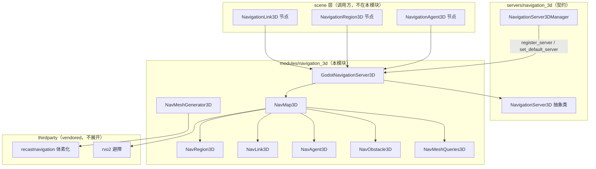
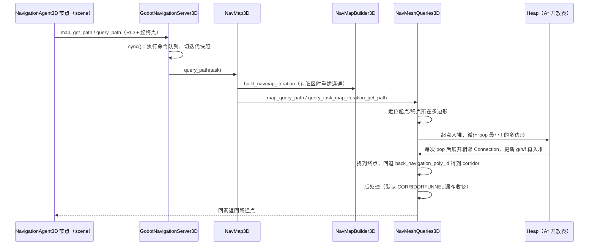

# navigation_3d（modules）

> 一句话：它是 3D 世界里「会看路的导航地图服务」——把几何体烘焙成一张可走的多边形网，再在这张网上用 A* 找路，并用 RVO 让一堆单位互不撞车。

**结论**：`modules/navigation_3d` 是 `servers/navigation_3d` 契约的默认实现，负责 3D 导航网格的烘焙、可走区域的连通合并、A* 寻路和局部队列避障；它服务的对象是 scene 层的 `NavigationAgent3D` 等节点，代价是引入 Recast / RVO2 两个三方库，并用命令队列 + 双缓冲「迭代快照」来保证多线程安全。

## 是什么 / 不是什么

- 它**负责**把一份 `NavigationMesh` 资源变成真正能查询的数据（多边形、边、连接），并在线程安全的前提下响应寻路请求。
- 它**不负责**画导航网格的可视化、也不负责 `NavigationRegion3D`/`NavigationAgent3D` 这些场景节点本身——那些节点在 `scene/3d/`，只负责把调用转发到本模块的服务器（`register_types.cpp:60` 把本模块注册成名为 `GodotNavigation3D` 的服务器）。
- 它**不负责**体素化的具体算法——那个活外包给 `thirdparty/recastnavigation`（`SCsub:15-36`）；本模块只做参数配置和结果回读。

## 在引擎里的位置

## 关键概念

- **RID 句柄 = 门牌号**：每个服务器对象（map/region/link/agent/obstacle）都用一个 `RID` 当门牌号对外暴露，内部用 `RID_Owner<T>` 管真身（`godot_navigation_server_3d.h:74-78`）。基类是 `NavRid3D`（`nav_rid_3d.h:35`）。

- **迭代快照 = 双缓冲**：地图和区域各自维护一个 `Ref<NavBaseIteration3D>` 只读快照（`NavMapIteration3D` / `NavRegionIteration3D`），后台线程在「build」副本上重建，主线程在 `sync()` 时切到「ready」副本，查询永远读同一份一致数据。这解释了 `nav_map_3d.h:144-153` 里那一串 `iteration_slots` / `iteration_dirty` / `iteration_ready` 标志。

- **多边形 + 连接 = 图**：可走区域被拆成 `Nav3D::Polygon`，相邻多边形之间靠 `Nav3D::Connection` 连成图（`nav_utils_3d.h:84-107`）。寻路就是在这张图上跑 A*。

- **g/h/f = 代价三兄弟**：`Nav3D::NavigationPoly` 里 `traveled_distance` 是 g（已走）、`distance_to_destination` 是 h（启发）、`total_travel_cost()` 是 f=g+h（`nav_utils_3d.h:124-132`）。`NavPolyTravelCostGreaterThan` 用 f 建最小堆、f 相等时比 h（`nav_utils_3d.h:152-166`）。

- **烘焙状态机 = 流水线**：`NavMeshGenerator3D::NavMeshBakeState` 把烘焙拆成 12 步（从 `CREATE_HEIGHTFIELD` 到 `BAKE_FINISHED`，`nav_mesh_generator_3d.h:57-72`），每一步都对着 Recast 的一个 `rcXxx` 调用。

## 核心文件（按阅读顺序）

1. `register_types.cpp` — 入口：注册 `GodotNavigation3D` 服务器、设为默认，并注册旧的 `NavigationMeshGenerator` 单例。
2. `3d/godot_navigation_server_3d.h` — 服务器本体：`COMMAND_1/2` 宏把每个 setter 拆成「入队命令」+「sync 阶段执行」，对外只暴露 `NavigationServer3D` 接口。
3. `nav_utils_3d.h` — 数据结构老家：`Polygon`、`Connection`、`NavigationPoly`、`EdgeKey`、`PerformanceData`，都在 `Nav3D` 命名空间里。
4. `nav_map_3d.h` — 地图：聚合 regions/links/agents/obstacles，持有 RVO 仿真器，管迭代快照。
5. `nav_region_3d.h` — 区域：持有一个 `Ref<NavigationMesh>`，把它转成多边形集合。
6. `3d/nav_mesh_queries_3d.h` — 查询：`PathQuerySlot` 里的 `Heap` 就是 A* 的开放表，`map_query_path` 是寻路入口。
7. `3d/nav_mesh_generator_3d.h` / `navigation_mesh_generator.h` — 烘焙：前者是真正干活的 `NavMeshGenerator3D`，后者是套壳的旧单例 `NavigationMeshGenerator`。
8. `3d/nav_map_builder_3d.h` / `3d/nav_region_builder_3d.h` — 构建器：把多边形/边/连接组装成迭代快照。

## 数据流 / 调用链

一次典型寻路（scene 节点 → 服务器 → A* → 结果回调）：

烘焙是另一条并行的主线：`NavMeshGenerator3D::generator_bake_from_source_geometry_data`（`nav_mesh_generator_3d.cpp:305`）把解析到的几何体喂给 Recast，`rcCreateHeightfield → rcBuildCompactHeightfield → rcErodeWalkableArea → rcBuildRegions → rcBuildContours → rcBuildPolyMesh → rcBuildPolyMeshDetail`（`nav_mesh_generator_3d.cpp:427-526`），最后把 Recast 的顶点/索引倒序映射回 `NavigationMesh` 原生格式（`nav_mesh_generator_3d.cpp:538-572`）。

## 中文口诀

> 服务器拿门牌，命令队列线程开；
> 区域装网格，地图连成图；
> 烘焙靠 Recast，避障靠 RVO；
> A* 堆里挑最小，f 等于 g 加 h；
> 迭代快照双缓冲，读写不打架。

## 练习（15 分钟）

1. 打开 `nav_utils_3d.h`，读 `NavigationPoly` 的 `traveled_distance` / `distance_to_destination` / `total_travel_cost()`，说出它们对应 A* 的哪个量。
2. 打开 `nav_mesh_queries_3d.cpp` 的 `_query_task_build_path_corridor`（约 319 行），找「从堆里 pop 最小 f 多边形」的循环，确认它 pop 的字段名。
3. 打开 `nav_mesh_generator_3d.cpp` 的 `generator_bake_from_source_geometry_data`，把每个 `rcXxx` 调用和 `nav_mesh_generator_3d.h` 里的 `NavMeshBakeState` 枚举对一遍。
4. 打开 `register_types.cpp`，说出 `GodotNavigation3D` 这个名字是在哪一行被注册、哪一行被设为默认的。

## 自测

- [ ] `NavigationPoly` 的 `back_navigation_poly_id` 和 `back_navigation_edge` 是给谁用的？（提示：寻路结束时如何从终点回溯出一条 corridor）
- [ ] `NavMap3D` 里的 `iteration_slots` 和 `NavRegion3D` 里的 `Ref<NavRegionIteration3D> iteration` 为什么能同时被主线程查询和后台线程重建而不加全局锁？
- [ ] `SCsub` 里 Recast 源码只在 `builtin_recastnavigation` 为真时编译，RVO2 分 2d/3d 两套，且 2d 在 `navigation_2d` 模块启用时跳过——这说明了本模块与 2D 导航、与三方库的什么关系？

## 一句话总结

> 本模块是 3D 导航的「地图 + 找路 + 避障」三合一服务器：把烘焙好的导航网格组织成可 A* 寻路的多边形图，用迭代快照扛住多线程，把体素化和局部队列避障外包给 Recast 与 RVO2。
