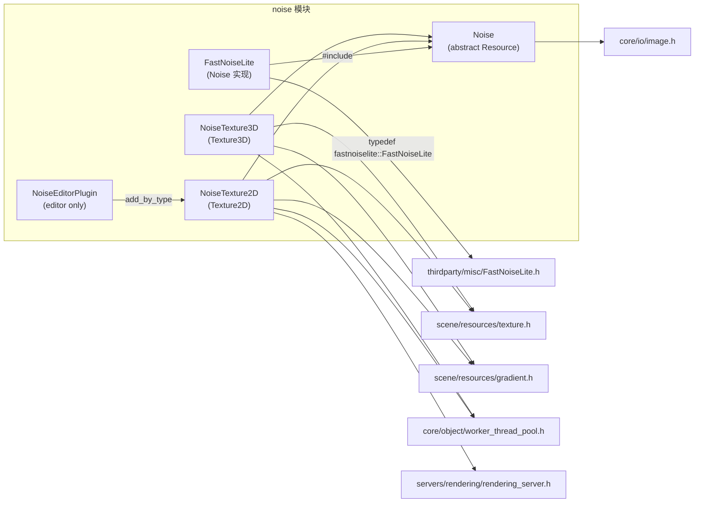

# noise（modules）

> 一句话：噪声就像「可控的随机数」，同样坐标永远吐同样的值，把数学噪声变成贴图（NoiseTexture）给材质用。

**结论**：`noise` 模块提供一套程序化噪声生成 + 噪声贴图资源，服务对象是「想在不用美术素材的情况下生成地形高度图、渐变贴图、法线贴图、体积纹理的人」；代价是只认 `Noise` 这套抽象接口，噪声算法本体来自第三方库 FastNoiseLite（vendored 在 `thirdparty/`），引擎只做封装与贴图生成。

## 是什么 / 不是什么

这个模块负责三件事：定义噪声的公共接口（`Noise`）、提供一个内置实现（`FastNoiseLite`）、把噪声采样结果烘焙成 GPU 能用的贴图资源（`NoiseTexture2D` / `NoiseTexture3D`）。

它**不负责**：真正的噪声数学（交给 `thirdparty/` 里的 FastNoiseLite）；把贴图渲染到屏幕（交给渲染服务器 `RenderingServer`）；贴图在编辑器里的可视化预览之外的高级编辑（那只是 `NoiseEditorPlugin` 一个辅助插件）。

对比一句就够：它像「噪声界的 Facade」——外部只跟 `Noise` 接口打交道，内部换哪个算法实现都可以。

## 在引擎里的位置



依赖方向很干净：`Noise` 只依赖 `core/`（`Image`、`TypedArray`）；两个 `NoiseTexture*` 抬一层，依赖 `scene/resources/`（`Texture2D`/`Texture3D`/`Gradient`）和 `servers/rendering/`（生成 GPU 纹理）。

## 关键概念

- **噪声接口（`Noise`）**：抽象基类，继承 `Resource`。像「插座」，规定任何噪声都得提供 `get_noise_1d/2d/2dv/3d/3dv` 五个采样函数（`noise.h:284-290`），以及 `get_image` / `get_seamless_image` / `get_image_3d` / `get_seamless_image_3d` 四个出图函数（`noise.h:293-298`）。子类只要实现采样，出图逻辑由基类包办。

- **FastNoiseLite（`FastNoiseLite`）**：唯一内置实现，继承 `Noise`。像「成品插头」，内部持有一个 `_FastNoiseLite _noise`（`fastnoise_lite.h:94`，即 `typedef fastnoiselite::FastNoiseLite _FastNoiseLite`，`fastnoise_lite.h:37`）。参数分四组：噪声类型（OpenSimplex2 / Perlin / Cellular / Value…）、分形（fBm / Ridged / PingPong）、Cellular 距离函数、域扭曲（domain warp）。

- **噪声贴图（`NoiseTexture2D` / `NoiseTexture3D`）**：把噪声采样结果烤成贴图的资源类。像「烘焙机」，持有一个 `Ref<Noise> noise`（`noise_texture_2d.h:66`），用 `WorkerThreadPool` 在后台线程生成 `Image`，再交给 `RenderingServer` 建 GPU 纹理。2D 默认 `512×512`（`noise_texture_2d.h:55`），3D 默认 `64×64×64`（`noise_texture_3d.h:52-54`）。

- **无缝平铺（seamless）**：`Noise::_get_seamless_image`（`noise.cpp:37`）先采样一张比目标大 10%（`blend_skirt`）的图，再交换象限、在接缝处做 alpha 混合，让左右/上下边缘能循环拼接，做可平铺的瓦片纹理。

## 核心文件（按阅读顺序）

1. `modules/noise/register_types.cpp` — 入口：注册 4 个类 + 兼容类 `NoiseTexture`（`register_types.cpp:50-54`）。
2. `modules/noise/noise.h` — 抽象基类 `Noise`，定义 5 个采样虚函数 + 4 个出图函数 + seamless 象限交换逻辑。
3. `modules/noise/noise.cpp` — `Noise` 的实现：`_get_image`（归一化/反相）、`_get_seamless_image`、`_bind_methods`。
4. `modules/noise/fastnoise_lite.h` — `FastNoiseLite` 声明，6 个枚举 + 全部参数 setter/getter。
5. `modules/noise/fastnoise_lite.cpp` — 把参数透传给 `_noise`，采样时先加 `offset` 再 `GetNoise`。
6. `modules/noise/noise_texture_2d.h` / `.cpp` — 2D 噪声贴图：后台线程生成 + 渐变调制 + 法线贴图转换 + mipmap。
7. `modules/noise/noise_texture_3d.h` / `.cpp` — 3D 噪声贴图：逐层生成 `Image` 组成体积纹理。
8. `modules/noise/config.py` — `get_doc_classes` 声明 4 个文档类；`SCsub` 编译 `*.cpp` + 编辑器下的 `editor/*.cpp`。

## 数据流 / 调用链

一次 `NoiseTexture2D` 出图的典型链路：

```mermaid
sequenceDiagram
    participant User as 用户/Inspector
    participant NT2 as NoiseTexture2D
    participant WTP as WorkerThreadPool
    participant Noise as Noise::_get_image
    participant FNL as FastNoiseLite::get_noise_2d
    participant RS as RenderingServer

    User->>NT2: set_noise() / set_width() ...
    NT2->>NT2: _queue_update() (deferred)
    NT2->>WTP: add_task(_thread_function)
    WTP->>NT2: _thread_function()
    NT2->>Noise: get_image(w,h) 或 get_seamless_image(...)
    Noise->>FNL: get_noise_2d(x,y) × w*h 次
    FNL->>FNL: offset += → DomainWarp? → _noise.GetNoise()
    FNL-->>Noise: real_t 值
    Noise-->>NT2: Ref&lt;Image&gt; (L8)
    NT2->>NT2: _modulate_with_gradient() / bump_map_to_normal_map() / generate_mipmaps()
    NT2->>RS: texture_2d_create(image)
    RS-->>NT2: RID
```

要点：出图是**后台线程**干的（`_thread_function` → `callable_mp(...).call_deferred(_generate_texture())`，`noise_texture_2d.cpp:146-148`），主线程只在 `_thread_done` 里收图、建纹理；参数一变就 `_queue_update` 合并去重（`noise_texture_2d.cpp:150-157`）。

## 中文口诀

```
噪声接口五采样，一维二维三维全。
FastNoiseLite 一个实现，Simplex Perlin Cellular 换着玩。
频率种子偏移量，分形 fBm 撑骨架。
NoiseTexture 是烘焙机，后台线程来出图。
先采样归一化，再渐变调制与法线。
无缝靠交换象限，多出 10% 裙边来糊缝。
```

## 练习（15 分钟）

1. 打开 `noise.h`，数一数 `Noise` 一共声明了几个纯虚 `= 0` 函数，列在纸上（应该 5 个采样 + 看哪几个出图是 virtual 非纯虚）。
2. 读 `fastnoise_lite.cpp:319-340`，画出 `get_noise_2d` 的执行顺序：加 offset → domain warp → GetNoise。
3. 读 `noise_texture_2d.cpp:159-185` 的 `_generate_texture`，按顺序写出它做的 4 件事（seamless 分支、渐变、法线、mipmap）。
4. 读 `register_types.cpp:48-62`，解释为什么 `NoiseTexture` 能通过 `add_compatibility_class` 指向 `NoiseTexture2D`。

## 自测

- [ ] `Noise` 的 `get_noise_2d` 是纯虚函数，那它的 `get_image` 是怎么在不调用任何派生类代码的情况下生成 L8 灰阶图的？（提示：`noise.cpp:85` 里调用了哪个虚函数）
- [ ] `FastNoiseLite` 默认噪声类型是 `TYPE_SIMPLEX_SMOOTH`，这个值在哪个文件哪一行？
- [ ] `NoiseTexture2D` 首次生成贴图为什么不用后台线程？（提示：`noise_texture_2d.cpp:209-212` 的 `first_time`）

## 一句话总结

> `noise` 模块 = 一个 `Noise` 抽象接口 + 一个 `FastNoiseLite` 实现 + 两个把噪声烤成 2D/3D 贴图的 `NoiseTexture` 资源，是「程序化生成 ↔ GPU 纹理」之间的桥。
