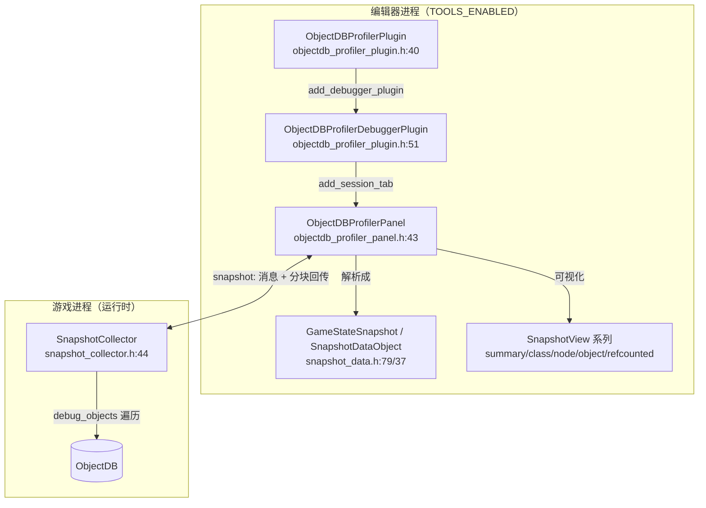
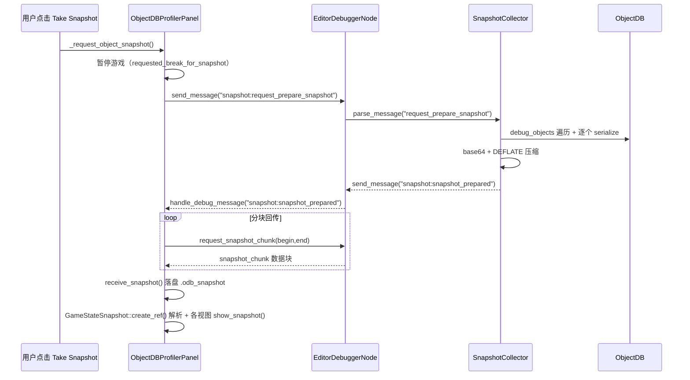

# objectdb_profiler（modules）

> 一句话：给 ObjectDB 拍一张「冻结时间的全家福」，把运行时所有存活对象连名字、引用关系、引用计数一起打包传回编辑器，供你在编辑器里翻看、对比、揪出「该释放却没释放」的对象。

**结论**：`objectdb_profiler` 是 Godot 编辑器内置的「对象数据库快照分析器」——它在调试会话里对游戏内所有存活对象做一次只读快照，压缩后分块回传编辑器并按类 / 节点树 / 对象引用 / RefCounted 计数四种视角可视化，专门帮你查内存泄漏：哪个对象没被释放、谁在偷偷持有它。代价是它只在 `debug_features` 开启时编译、只在编辑器调试会话里可用，且一次快照可能高达数 MB。

## 是什么 / 不是什么

- **是**：一个「运行时抓对象、编辑器看快照」的排查工具。游戏侧用 `SnapshotCollector` 把 ObjectDB 里每个存活对象序列化成一份传输对象（`snapshot_collector.h:36`），编辑器侧用 `ObjectDBProfilerPanel` 把这份数据画成树和列表（`editor/objectdb_profiler_panel.h:43`）。
- **不是**：一个实时的 CPU/帧率 Profiler。它不采样每帧耗时，只抓「某一时刻对象长什么样」的静态切片；实时性能分析交给 `core/profiling` 和 `servers/rendering` 那些带计时的系统。
- **不是**：一个通用内存分配器追踪器。它关心的是「对象的引用图」（谁指向谁、引用计数多少），而不是 malloc/free 的字节明细。

## 在引擎里的位置



模块边界：`objectdb_profiler` 站在调试器这条链路的末端——上游是 `core/debugger` 的 `EngineDebugger` 消息总线（`snapshot_collector.cpp:44` 注册了 `"snapshot"` 消息捕获），下游是 `editor/debugger` 的 `EditorDebuggerPlugin` 把面板挂进调试器标签页（`objectdb_profiler_plugin.cpp:52`）。它自己不发明新调试协议，只是借 `EngineDebugger` 的捕获/发送能力传数据。

## 关键概念

- **快照（Snapshot）**：冻结某一瞬间的全部存活对象，像拍照一样只读、不可改。落地类型是 `GameStateSnapshot : RefCounted`（`snapshot_data.h:79`），其 `objects` 是 `HashMap<ObjectID, SnapshotDataObject *>`。
- **传输对象**：游戏侧序列化用的轻量信封 `SnapshotDataTransportObject : SceneDebuggerObject`（`snapshot_collector.h:36`），比照远程场景树的序列化方式，另加一个 `extra_debug_data` 字典装 ref_count、node_name 等附加字段。
- **数据对象**：编辑器侧把传输对象解包成的完整视图 `SnapshotDataObject : Object`（`snapshot_data.h:37`），携带 `outbound_references` / `inbound_references` 两张引用表，供引用视图画「谁指向我 / 我指向谁」。
- **引用计数**：RefCounted 对象的 `ref_count` 在抓快照时被塞进 `extra_debug_data["ref_count"]`（`snapshot_collector.cpp:93`），这是排查「引用计数下不去」的第一线索。
- **分块回传**：快照先被 base64 + DEFLATE 压缩成字节流，再按 `request_snapshot_chunk` 的 begin/end 切片分块发送，绕开调试器单次消息的字节上限（`snapshot_collector.cpp:141-159`）。

## 核心文件（按阅读顺序）

1. `modules/objectdb_profiler/config.py` — `can_build` 返回 `env.debug_features`：非 debug 构建直接不编译本模块。
2. `modules/objectdb_profiler/SCsub` — 游戏侧编 `*.cpp`，仅 `env.editor_build` 时追加 `editor/*.cpp` 和 `editor/data_viewers/*.cpp`。
3. `modules/objectdb_profiler/register_types.cpp` — 初始化入口：`SCENE` 级调 `SnapshotCollector::initialize()`，`EDITOR` 级注册 `ObjectDBProfilerPlugin`。
4. `modules/objectdb_profiler/snapshot_collector.h` — 游戏侧核心：`SnapshotCollector` 静态类 + 传输对象定义。
5. `modules/objectdb_profiler/snapshot_collector.cpp` — 抓取、序列化、压缩、分块回传的全部逻辑。
6. `modules/objectdb_profiler/editor/objectdb_profiler_plugin.h/.cpp` — 编辑器插件与调试器插件，把面板挂进调试会话。
7. `modules/objectdb_profiler/editor/objectdb_profiler_panel.h/.cpp` — 面板 UI：发起请求、收块、落盘 `.odb_snapshot`、驱动各视图。
8. `modules/objectdb_profiler/editor/snapshot_data.h/.cpp` — 快照数据模型与引用重算。
9. `modules/objectdb_profiler/editor/data_viewers/*.h/.cpp` — 五个视图（summary / class / node / object / refcounted）加共享控件。

## 数据流 / 调用链



## 中文口诀

```
ObjectDB 拍全家福，冻结瞬间看引用；
游戏侧 Collector 抓，编辑器侧 Panel 画；
base64 再 DEFLATE，分块回传不撑爆；
类看继承，节点看树，对象看引用，计数看 ref；
谁没释放谁持有，泄漏一眼就现形。
```

## 练习（15 分钟）

1. 用 `debug` 目标构建编辑器，打开一个项目并启动调试会话，在调试器底部找到「ObjectDB」标签页，点一次 `Take ObjectDB Snapshot`。
2. 在 `summary_view` 里看「对象总数 / 按类计数」，再到 `refcounted_view` 里挑一个 `ref_count` 异常高的对象，点开它的 inbound 引用列表。
3. 抓两次快照，用 `diff_button` 对比，观察新增/消失的对象分组。
4. 打开 `snapshot_collector.cpp:52` 的 `snapshot_objects`，对照你刚看到的字段，指出 `extra_debug_data` 里 `ref_count`、`node_name`、`node_children` 分别在哪几行写入。

## 自测

- [ ] `SnapshotCollector::parse_message` 处理了哪两条消息？收到 `request_snapshot_chunk` 后，什么条件下会 `pending_snapshots.erase(request_id)`？
- [ ] 为什么快照要先压缩再分块回传？（提示：看 `snapshot_collector.cpp:137-141` 的注释和 `objectdb_profiler_panel.cpp:57` 的注释。）
- [ ] 抓快照时为什么要把游戏暂停？代码里哪个布尔量记录了「是我们自己暂停的、需要恢复」？
- [ ] 五个 `SnapshotView` 子类分别是哪几个？它们各自的分组维度是什么？

## 一句话总结

> `objectdb_profiler` 是调试期专用的对象数据库「记忆相机」：运行时冻结并打包所有存活对象，编辑器解包后按类 / 节点 / 引用 / 计数四个维度回放，帮你定位「对象为什么还活着」。
