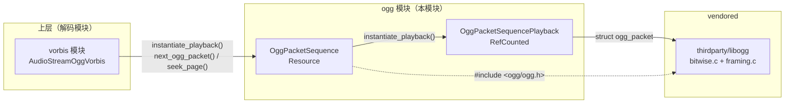
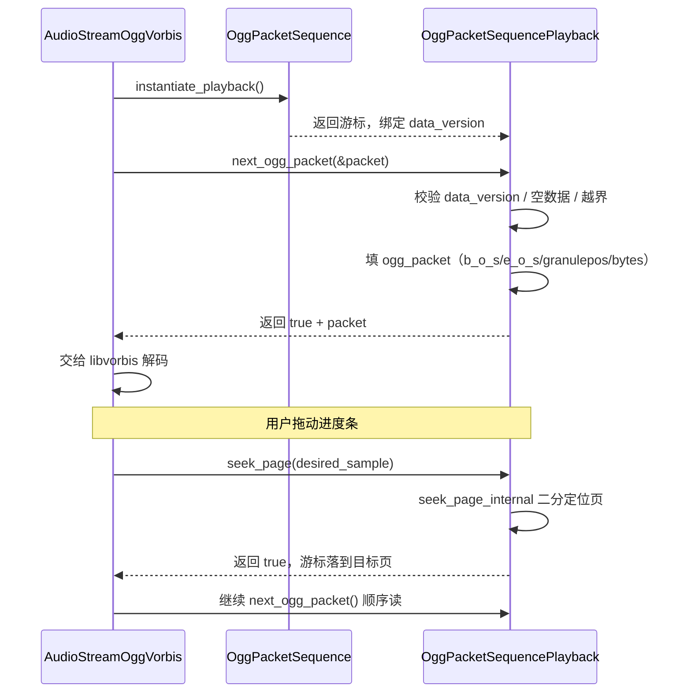

# ogg（modules）

> 一句话：把一串 OGG 包（packet）按「页 → 包」两层装进内存，再提供一个可以前进、跳页、按 granule 定位的播放游标——就像把一叠打好孔的胶卷存好，再配一个能快进快退的放映机。

**结论**：`ogg` 模块是 Godot 的 OGG 容器层，只负责「存包 + 游标」，不碰任何音频/视频解码；它把解码后交给 `vorbis` 这类编解码模块用，代价是几乎无逻辑、纯粹的数据搬运与索引（整个模块只有 2 个 C++ 源文件）。

## 是什么 / 不是什么

OGG 是一种「容器」格式：它本身不解码声音或画面，只规定比特流怎么切分成一个个 packet、packet 怎么装进 page。这个模块就是容器那一层的胶水：

- 它**负责**：把已经切好的 OGG packet 按 page 组织并缓存（`OggPacketSequence`），再提供顺序读取和按 granule 位置二分跳转（`OggPacketSequencePlayback`）。
- 它**不负责**：真正解析 Vorbis/Theora 的压缩数据。`ogg_packet_sequence.h:74` 的注释写得很直白——「OggPacketSequence doesn't understand codecs」，采样率 `sampling_rate` 只是「naively stored as a convenience」，必须由真正懂编解码的类来填。
- 它**不负责**：自己实现 OGG 封装/解封装算法。底层的 bitwise/framing 来自 vendored 的 libogg（`SCsub:13-18` 只编译 `thirdparty/libogg/bitwise.c` 和 `framing.c`），本模块不碰这部分。

值得注意的一点：源码里唯一的 in-tree 消费者是 `vorbis` 模块（`audio_stream_ogg_vorbis.h:74-75` 持有 `Ref<OggPacketSequence>` 和 `Ref<OggPacketSequencePlayback>`）。相邻的 `theora` 模块自带 OGG 容器处理、并不引用 `OggPacketSequence`（grep 全 modules 无匹配），所以本文只讲 vorbis 这条已确认的链路。

## 在引擎里的位置

要点：`OggPacketSequence` 是 `Resource`（可当资源存盘/传引用），`OggPacketSequencePlayback` 是 `RefCounted`（轻量游标，随用随建）。两者用 `friend class` 互认（`ogg_packet_sequence.h:44/96`），播放器通过 `instantiate_playback()` 拿到游标（`ogg_packet_sequence.cpp:111-118`）。

## 关键概念

1. **Page（页）** —— 容器的最小寻址单位。比喻成「一箱货」，一个 page 里可以装 0 个或多个 packet。代码里是 `Vector<Vector<PackedByteArray>> page_data`（`ogg_packet_sequence.h:47`），外层是页、里层是包。
2. **Granule position（颗粒位置）** —— 每页的「时间戳」，用来做 seek。OGG 用它定位而不是用字节偏移。存成 `Vector<uint64_t> page_granule_positions`（`ogg_packet_sequence.h:50`）。
3. **Packet（包）** —— 编解码器真正消费的单元，一个完整的 OGG packet 就是一个 `PackedByteArray`（`ogg_packet_sequence.h:46` 注释）。
4. **data_version（版本号）** —— 防「老游标读新数据」的保险丝。数据一变 `data_version++`（`ogg_packet_sequence.cpp:47/72`），旧 playback 在 `next_ogg_packet()` 第一行就比对失败返回 false（`ogg_packet_sequence.cpp:138`）。
5. **ogg_packet** —— libogg 定义的结构体（`#include <ogg/ogg.h>`，`ogg_packet_sequence.h:37`），游标把当前包填进去再交出去，含 `b_o_s/e_o_s/granulepos/packetno/bytes/packet` 字段（`ogg_packet_sequence.cpp:154-159`）。

## 核心文件（按阅读顺序）

1. `modules/ogg/register_types.cpp` — 入口，在 `MODULE_INITIALIZATION_LEVEL_SCENE` 注册 2 个类（`:37-44`）。
2. `modules/ogg/ogg_packet_sequence.h` — 全部公共接口，两个类的声明都在这一个头文件里（共 131 行）。
3. `modules/ogg/ogg_packet_sequence.cpp` — 实现：存包、游标推进、二分 seek（共 240 行）。
4. `modules/ogg/SCsub` — 编译规则：本模块 `*.cpp` + 可选编译 vendored libogg（`:13-18`）。
5. `modules/ogg/config.py` — 声明 2 个文档类名（`get_doc_classes()`）。
6. `modules/ogg/doc_classes/*.xml` — 脚本侧 API 文档（`OggPacketSequence` 有成员，`OggPacketSequencePlayback` 是空的）。

## 数据流 / 调用链

一次典型的 vorbis 播放 + seek：

顺序读的推进逻辑在 `next_ogg_packet()`（`ogg_packet_sequence.cpp:137-166`）：当 `packet_cursor` 走完当前页，就清零并 `page_cursor++` 翻到下一页（`:144-150`）。随机访问走 `seek_page()` → `seek_page_internal()` 的递归二分（`:168-203`），找到「上一页 granule ≤ 目标 < 当前页 granule」的那一页。

## 中文口诀

- 存包不解码，容器是主业。
- 页里装包，包才喂解码器。
- granule 管跳转，字节偏移靠边站。
- 版本号一加，老游标当场作废。
- 顺序读翻页，随机读二分。

## 练习（15 分钟）

1. 打开 `modules/ogg/ogg_packet_sequence.cpp`，找到 `next_ogg_packet()`，用一句话写出 `b_o_s` 在什么条件下为 true（答案在 `:154`）。
2. 在 `seek_page_internal()` 里（`:168-203`）画出二分递归的两条分支，说明为什么中间页可能「没有正确 granule」需要前后找。
3. 对比 `push_page()`（`:36-44`，C++ 内部用、未绑定脚本）与 `set_packet_data()`（`:46-57`，绑定脚本）的差异，说出它们各自的使用者是谁。

## 自测

- [ ] `OggPacketSequence` 和 `OggPacketSequencePlayback` 分别继承自哪个 Godot 基类？为什么这样设计？
- [ ] `data_version` 失效检查发生在哪个函数的哪一行？它防的是什么问题？
- [ ] `seek_page()` 返回 true 后，`packetno` 被重置为 0 的原因是什么？（提示：看 `ogg_packet_sequence.cpp:215` 的注释）

## 一句话总结

> `ogg` 模块是 Godot 的 OGG 容器胶水层：`OggPacketSequence` 存「页→包」数据，`OggPacketSequencePlayback` 提供可顺序读、可二分 seek 的游标，把解码前的原始包交给 vorbis 消费，自己一个解码字节都不碰。
