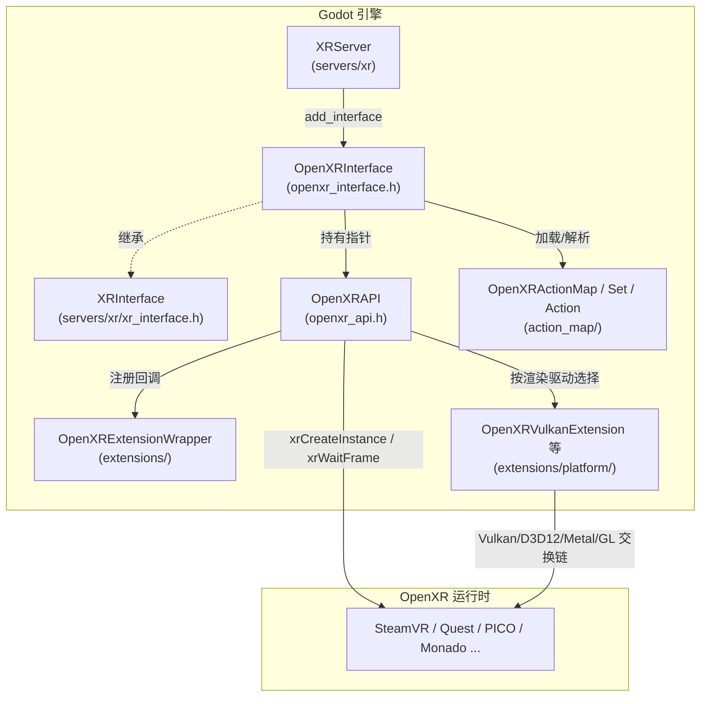
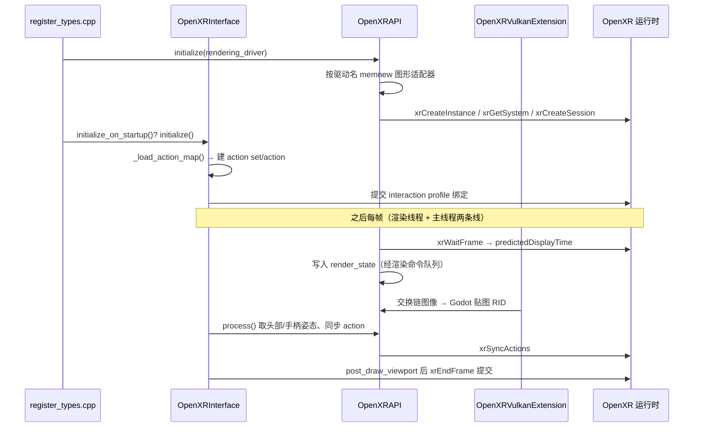

# openxr（modules）

> 一句话：OpenXR 是「VR/AR 设备的 USB-C 口」——Godot 只认这一个口，OpenXR 运行时负责把各家头显（Quest、SteamVR、PICO…）插到同一个口上。

**结论**：openxr 模块把 Khronos 的 OpenXR 标准封装成 Godot 的 `XRInterface` 子类，让引擎用统一契约驱动任意 OpenXR 运行时；代价是一整层适配代码（219 个文件：71 个 `.cpp` + 76 个 `.h` + 63 个 `.xml`），负责把「OpenXR 的实例/会话/交换链」翻译成「Godot 的 RID/贴图/变换」。

## 是什么 / 不是什么

- **是什么**：Godot `XRInterface` 契约（`servers/xr/xr_interface.h`）到 OpenXR C API 的**适配层**。核心只有一件事——把 OpenXR 运行时搬进 Godot 的 XR 服务器（`XRServer`）。
- **不是什么**：
  - 不是 OpenXR 标准本身。Khronos 的头文件和 loader 在 `thirdparty/openxr/`，本模块只管调它、封装它（`modules/openxr/openxr_api.h:46` 直接 `#include <openxr/openxr.h>`）。
  - 不是渲染后端。真正的图形 API 对接（Vulkan/D3D12/OpenGL/Metal）分给四个 `OpenXRGraphicsExtensionWrapper` 子类，不在这里画像素。
  - 不是相邻的 `mobile_vr`、`webxr` 模块。它们各自实现自己的 `XRInterface`，跟 openxr 平级。

## 在引擎里的位置

关键依赖方向：`XRServer` 只认 `XRInterface` 基类，`OpenXRInterface` 是它的一个实例；真正的 OpenXR 句柄（`XrInstance`/`XrSession`）全在 `OpenXRAPI` 单例里。

## 关键概念

1. **接口即适配器**：`OpenXRInterface` 继承 `XRInterface`（`modules/openxr/openxr_interface.h:66`），把基类的纯虚函数（`get_view_count`、`process`、`get_projection_for_view`…）逐个填成 OpenXR 语义。它自己不碰 OpenXR 句柄，只转述。
2. **API 即句柄持有者**：`OpenXRAPI`（`modules/openxr/openxr_api.h:56`）是模块内单例，存着 `XrInstance`、`XrSystemId`、`XrSession` 和一堆函数指针（`EXT_PROTO_XRRESULT_FUNC*`，`openxr_api.h:212` 起）。所有 `xr*` 调用都经过它。
3. **动作映射（Action Map）**：`OpenXRActionMap`/`OpenXRActionSet`/`OpenXRAction` 是 `Resource`（`action_map/openxr_action_map.h:39`），把「摇杆/扳机/按钮」抽象成可存盘的资源；`OpenXRInterface::_load_action_map()`（`openxr_interface.cpp:244`）把它翻译成 OpenXR 原生的 action set + interaction profile，之后 OpenXR 接管、不能再改。
4. **扩展链（pNext 链）**：`OpenXRExtensionWrapper`（`extensions/openxr_extension_wrapper.h:52`）是一套虚函数钩子，各家厂商扩展（手部追踪、注视、空间锚点…）靠往 OpenXR 的 `pNext` 结构链上追加数据来插桩。
5. **图形适配器**：`OpenXRGraphicsExtensionWrapper`（`openxr_extension_wrapper.h:211`）是抽象子类，`OpenXRVulkanExtension`/`OpenXRD3D12Extension`/`OpenXROpenGLExtension`/`OpenXRMetalExtension` 各自实现「如何把 OpenXR 交换链变成 Godot 贴图 RID」。

## 核心文件（按阅读顺序）

1. `modules/openxr/config.py` — 声明只在 linuxbsd/windows/android/macos 构建，以及 63 个需要生成文档的类名。
2. `modules/openxr/register_types.cpp` — 入口：分 `CORE`/`SERVERS`/`SCENE`/`EDITOR` 四层注册类，在 `SERVERS` 层 `memnew(OpenXRAPI)`（`register_types.cpp:246`），在 `SCENE` 层 `GDREGISTER_CLASS(OpenXRInterface)` 并 `xr_server->add_interface`（`register_types.cpp:342-349`）。
3. `modules/openxr/openxr_interface.h` — `OpenXRInterface` 公共接口，罗列了它要实现的全部 `XRInterface` 虚函数。
4. `modules/openxr/openxr_api.h` / `openxr_api.cpp` — OpenXR 句柄、函数指针、实例/会话/交换链生命周期、按渲染驱动选图形适配器（`openxr_api.cpp:1708-1746`）。
5. `modules/openxr/action_map/*` — 动作映射的资源类（`OpenXRAction`、`OpenXRActionSet`、`OpenXRActionMap`、`OpenXRInteractionProfile`、`OpenXRInteractionProfileMetadata`）。
6. `modules/openxr/extensions/openxr_extension_wrapper.h` — 扩展钩子基类，以及图形适配器抽象 `OpenXRGraphicsExtensionWrapper`。
7. `modules/openxr/extensions/platform/openxr_vulkan_extension.h` 等四个 — 具体图形 API 的交换链实现。

## 数据流 / 调用链

一次启动 + 一帧渲染的典型链路：

要点：`OpenXRAPI` 内部把「主线程」和「渲染线程」要碰的数据分开放（`openxr_api.h:351` 的 `RenderState` 结构 + 一组 `*_rt` 静态函数），通过渲染命令队列传递，避免帧计时和交换链在两条线程打架。

## 中文口诀

- 头显千千万，接口认 OpenXR 一个。
- `OpenXRInterface` 管「像不像 XR」，`OpenXRAPI` 管「真不真句柄」。
- 动作映射是纸面合同，提交给运行时后就归它管。
- 图形四兄弟（Vulkan/D3D12/GL/Metal），按驱动名对号入座。
- 扩展靠 pNext 链插桩，厂商功能不写死在主流程。
- 帧数据两条线：渲染线程碰交换链，主线程碰姿态输入。

## 练习（15 分钟）

1. 打开 `register_types.cpp`，顺着 `MODULE_INITIALIZATION_LEVEL_SERVERS` 和 `MODULE_INITIALIZATION_LEVEL_SCENE` 两个分支，标出「OpenXRAPI 何时建、OpenXRInterface 何时挂到 XRServer」。
2. 在 `openxr_api.cpp:1708` 的 `initialize()` 里，把四个图形适配器的分支各画一个框，注释上各自的渲染驱动名。
3. 读 `openxr_interface.cpp:244` 的 `_load_action_map()`，找出「编辑器提示下建 editor action set」和「运行时加载 .tres action map」两条路的分叉点。
4. 用 grep 在 `openxr_api.h` 里数一下 `EXT_PROTO_XRRESULT_FUNC` 函数指针有多少个，体会 `OpenXRAPI` 承担了多少 OpenXR 入口。

## 自测

- [ ] `OpenXRInterface` 覆盖了 `XRInterface` 的哪些纯虚函数？找一个它**没有** override 的虚函数（比如 `get_camera_feed_id`），说明为什么可以不做。
- [ ] `register_types.cpp` 里 `OpenXRAPI` 在哪个初始化层级创建？如果 `openxr_api->initialize()` 失败，代码做了什么兜底（提示 + 删对象）？
- [ ] 为什么 `OpenXRAPI::initialize(p_rendering_driver)` 拿到的是驱动名字符串而不是图形扩展对象？说出这条设计对「解耦」的意义。

## 一句话总结

> openxr 模块是 Godot `XRInterface` 契约与 Khronos OpenXR 运行时之间的一层翻译官：上半身讲 Godot 的 RID/变换/资源，下半身讲 OpenXR 的 instance/session/swapchain。
