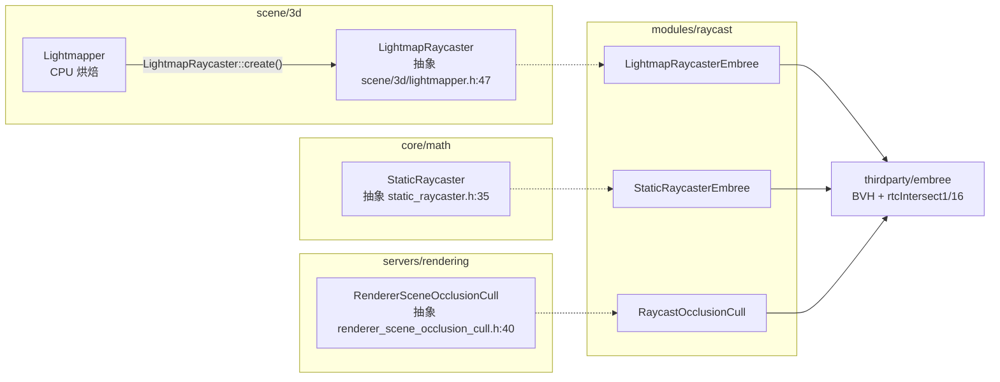
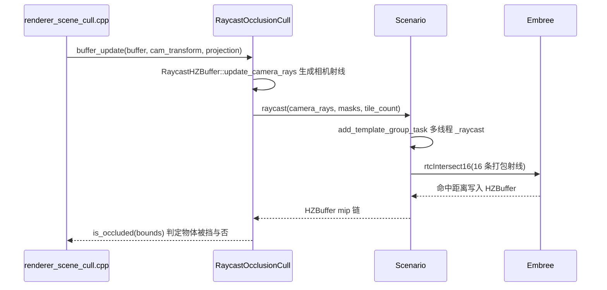

# raycast（modules）

> 一句话：把「一束光打在三角形网格上、求最近交点」这件高并发算术活，外包给 Intel 的 Embree BVH 库，给引擎当离线烘焙和运行时遮挡剔除的「射线工」。

**结论**：`modules/raycast` 是 Godot 基于 Embree 的射线求交后端，它注册三个类——`LightmapRaycasterEmbree`（CPU 光照烘焙）、`StaticRaycasterEmbree`（静态网格射线查询）、`RaycastOcclusionCull`（运行时遮挡剔除），统一走「把三角形塞进 BVH、再批量打射线」的套路；代价是拖进约 44 个 Embree 源文件的第三方依赖（`SCsub:16-61`），且前两个烘焙用 raycaster 只在 `TOOLS_ENABLED` 下编译（`register_types.cpp:44-47`）。

## 是什么 / 不是什么

- **是什么**：三个「射线求交」实现，各自继承一个抽象接口，向接口兑现同一句承诺——`add_mesh` 收三角形、`commit` 建 BVH、`intersect` 求交点。
- **不是什么**：不是游戏里那些 `RayCast3D` / `RayCast2D` / `ShapeCast3D` / `ShapeCast2D` 场景节点。它们住在 `scene/3d/physics/ray_cast_3d.h:39`、`scene/2d/physics/ray_cast_2d.h:37`，运行时走物理服务器的空间查询；本模块跟物理服务器没有调用关系。

一句话分界：**物理节点问的是「游戏世界现在撞到谁」，本模块问的是「这根离线/渲染射线打到哪个三角形」**。

## 在引擎里的位置



挂载点全在 `register_types.cpp:39-49`：`MODULE_INITIALIZATION_LEVEL_SCENE` 阶段，`TOOLS_ENABLED` 下把两个 Embree raycaster 设成默认工厂，再无条件 `memnew(RaycastOcclusionCull)` 把它挂成渲染器的遮挡剔除单例。

## 关键概念

- **BVH 场景（RTCScene）**：把所有三角形按空间包围盒排成一棵树，射线一次只沿可能命中的分支下钻。Embree 的 `RTCScene`/`RTCGeometry` 就是这棵树，`commit` 时才真正建树（`static_raycaster_embree.cpp:96-98`）。
- **抽象 raycaster 接口**：`LightmapRaycaster`（`scene/3d/lightmapper.h:47`）与 `StaticRaycaster`（`core/math/static_raycaster.h:35`）都只声明 `add_mesh/commit/intersect` 几个纯虚函数，具体算法丢给 Embree 实现。
- **函数指针工厂挂载**：每个抽象基类带一个静态 `create_function`，`make_default_raycaster()` 把「建 Embree 实例」的函数塞进去，之后全局 `create()` 就拿得到默认实现（`static_raycaster_embree.cpp:45-47`）。
- **Embree 兼容 Ray 结构体**：基类里手写一个 `alignas(16)` 的 `Ray`，字段布局和 Embree 的 `RTCRayHit` 逐字节对齐，所以能直接 `(RTCRayHit *)&r_ray` 强转传进去（`lightmapper.h:53-100`）。`geomID != INVALID_GEOMETRY_ID` 就表示命中了（`static_raycaster_embree.cpp:62`）。
- **HZBuffer（层次 Z 缓冲）**：遮挡剔除不画三角形，而是把相机射线命中的深度铺成一张多层缩小的深度图；判断某个物体是否被挡时，拿它的包围盒投影到这张图上比深度（`renderer_scene_occlusion_cull.h:59` 的 `_is_occluded`）。

## 核心文件（按阅读顺序）

1. `modules/raycast/register_types.cpp` — 模块入口：挂两个默认 raycaster + 建遮挡剔除单例。
2. `modules/raycast/lightmap_raycaster_embree.h` — 光照烘焙 raycaster，带 alpha 贴图过滤。
3. `modules/raycast/lightmap_raycaster_embree.cpp` — `add_mesh` 塞 UV2/法线顶点属性、`intersect` 调 `rtcIntersect1`。
4. `modules/raycast/static_raycaster_embree.h/.cpp` — 精简版静态网格 raycaster，只收顶点+索引。
5. `modules/raycast/raycast_occlusion_cull.h` — 遮挡剔除主体，`TILE_SIZE=4`、一次打包 16 条射线。
6. `modules/raycast/raycast_occlusion_cull.cpp` — 相机射线生成、脏实例变换、`rtcIntersect16` 批量查询。
7. `modules/raycast/SCsub` — 拖入约 44 个 Embree 源文件并强制优化。
8. `modules/raycast/config.py` — 按架构/平台判断能否编译。

## 数据流 / 调用链

运行时遮挡剔除的完整主线（每帧）：



锚点：`buffer_update` 由 `renderer_scene_cull.cpp:2781` 每帧触发，`RaycastOcclusionCull::buffer_update` 在 `raycast_occlusion_cull.cpp:596`，多线程 `_raycast` 在 `raycast_occlusion_cull.cpp:480`，真正的查询是 `rtcIntersect16`（`raycast_occlusion_cull.cpp:487`），渲染器随后用 `buffer_get_ptr` 拿到 HZBuffer 后调 `is_occluded`（`renderer_scene_cull.cpp:3431`）。

光照烘焙是另一条短链：`LightmapRaycaster::create()`（`scene/3d/lightmapper.cpp:44`）→ `LightmapRaycasterEmbree::intersect` → `rtcIntersect1`（`lightmap_raycaster_embree.cpp:71-78`），逐条求交，供 CPU Lightmapper 算光照和阴影。

## 中文口诀

```
烘焙遮挡都要射线，物理节点别来这边。
抽象接口把线定，Embree 实现把活干。
add_mesh 塞三角，commit 建好 BVH 树。
rtcIntersect 打出去，geomID 有效才算中。
烘焙一条慢慢查，遮挡一次十六发。
```

## 练习（15 分钟）

1. 打开 `modules/raycast/register_types.cpp`，找出 `TOOLS_ENABLED` 包裹的三行各做了什么。
2. 打开 `modules/raycast/static_raycaster_embree.cpp` 的 `add_mesh`，对照 Embree 的「`rtcNewGeometry` → `rtcSetNewGeometryBuffer` → `rtcCommitGeometry` → `rtcAttachGeometryByID`」四件套。
3. 打开 `modules/raycast/raycast_occlusion_cull.cpp` 的 `Scenario::_raycast`，看 16 条射线怎么打包成 `RTCRayHit16` 一次发射。
4. grep `RendererSceneOcclusionCull::get_singleton` 到 `servers/rendering/renderer_scene_cull.cpp`，数一数渲染器在多少个地方回调了本模块。

## 自测

- [ ] `RayCast3D` 节点在这个模块里吗？它运行时实际问的是哪台服务器？（答：不在，问 `PhysicsServer3D`）
- [ ] 为什么 `LightmapRaycaster::Ray` 要用 `alignas(16)`？（答：与 Embree `RTCRayHit` 内存布局对齐，才能强转传参）
- [ ] `rtcIntersect1` 和 `rtcIntersect16` 分别被哪两个类调用，为什么遮挡剔除要用 16 条打包的版本？

## 一句话总结

> `modules/raycast` 是引擎的「Embree 射线工」：烘焙、静态查询、遮挡剔除三件事，共用同一套「三角形进 BVH、批量打射线」的求交后端，和游戏玩法里的物理射线节点无关。
