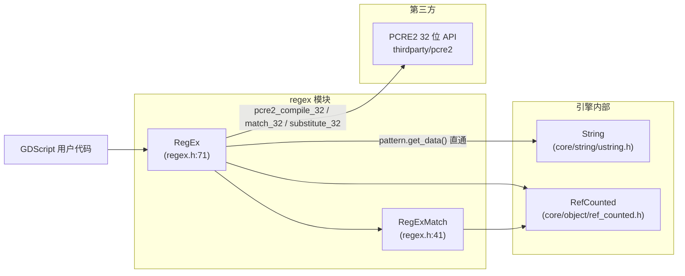
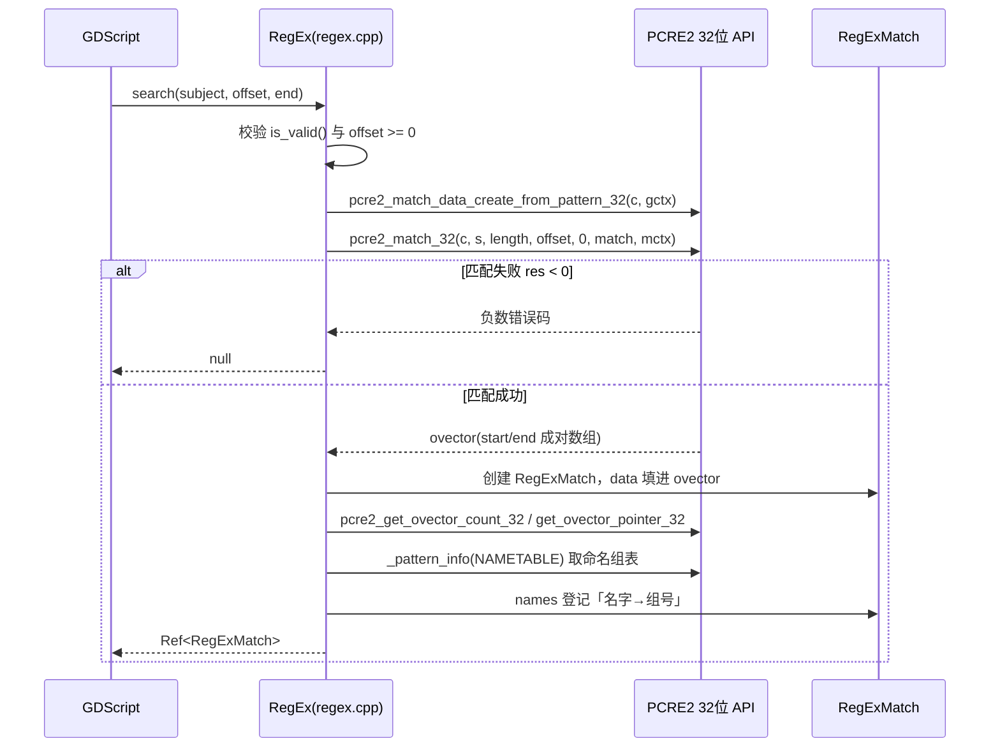

# regex（modules）

> 一句话：把「正则表达式字符串」翻译成 PCRE2 能跑的机器码，再把 PCRE2 吐出来的数字坐标，包成 GDScript 好用的 `RegExMatch` 对象。

**结论**：regex 模块是 Godot 的 `String` 与第三方 PCRE2 库之间的一层薄胶水——它只做「编译 + 匹配 + 替换」三件事的转接，不自己实现任何正则算法，代价是为此引入一个约 30 个 `.c` 的第三方库、并让 GDScript 用户多转义一次反斜杠。

## 是什么 / 不是什么

它负责：把 Godot 侧的 `RegEx`/`RegExMatch` 两个类，接到 `thirdparty/pcre2` 的 32 位 API 上，负责 UTF-32 字符串直通、匹配坐标的搬运、命名组的登记。

它不负责：正则语法本身（`\d`、`(?<name>...)`、回溯这些规则全归 PCRE2）；不负责字符串的存储与编码（那是 `core/string/ustring.h` 的 `String`）；也不负责把结果塞进渲染或 UI（那是使用方的事）。

一句话划界：regex 模块里没有一行「匹配算法」，只有「参数翻译」和「结果搬运」。

## 在引擎里的位置

两个类都继承 `RefCounted`（引用计数自动释放）；编译好的正则句柄 `code` 是 `void *`（`regex.h:75`），真实类型是 PCRE2 的 `pcre2_code_32`，藏在胶水层后面不让脚本层碰到。

## 关键概念

- **编译句柄 `code`**：一段正则要先「编译」成 PCRE2 内部结构才可复用。比喻：把乐谱排练成一支能随时开演的乐队。锚点：`RegEx::compile` 里 `code = pcre2_compile_32(...)`（`regex.cpp:192`）。
- **UTF-32 直通**：Godot 的 `String` 内部就是 `char32_t` 数组，PCRE2 的 32 位变体吃的正是 `PCRE2_UCHAR32`，所以胶水层能把 `pattern.get_data()` 直接当指针传进去，几乎零拷贝。锚点：`PCRE2_SPTR32 p = (PCRE2_SPTR32)pattern.get_data()`（`regex.cpp:190`）。
- **ovector 搬运**：PCRE2 把一次匹配的每个分组结果写进一段 `start/end` 成对数组（ovector），胶水层把它拷进 `RegExMatch` 内部的 `Vector<Range>`。锚点：`result->data.write[i].start = ovector[i * 2]`（`regex.cpp:241`）。
- **命名组表**：`(?<name>...)` 这类命名组的「名字 → 组号」映射，靠 `PCRE2_INFO_NAMETABLE` 取回后解析成 `HashMap<String,int> names`。锚点：`_pattern_info(PCRE2_INFO_NAMETABLE, &table)`（`regex.cpp:255`）。
- **RegEx 与 RegExMatch 的分工**：`RegEx` 持有编译结果、能反复 `search`/`sub`；`RegExMatch` 是一次匹配的只读快照（`subject` + `data` + `names`），由 `RegEx` 创建（`friend class RegEx`，`regex.h:53`）。

## 核心文件（按阅读顺序）

1. `modules/regex/register_types.cpp` — 模块入口，只在 `SCENE` 阶段注册 `RegExMatch`、`RegEx` 两个类（`GDREGISTER_CLASS`，共 2 个）。
2. `modules/regex/SCsub` — 构建脚本：把 PCRE2 用 16 位、32 位各编一遍，本模块以 `PCRE2_CODE_UNIT_WIDTH=0` 使用 32 位变体。
3. `modules/regex/regex.h` — 公共接口，`RegEx` 与 `RegExMatch` 两个类（109 行）。
4. `modules/regex/regex.cpp` — 唯一实现文件，`extern "C" { #include <pcre2.h> }`（`regex.cpp:37-39`），全部转接逻辑在此（432 行）。
5. `modules/regex/regex.compat.inc` — 旧签名 `create_from_string(pattern)` / `compile(pattern)` 的向后兼容胶水。
6. `modules/regex/tests/test_regex.h` — doctest 单测，18 个 `TEST_CASE` 覆盖初始化/搜索/替换/前后查找。

## 数据流 / 调用链

一次 `search` 的典型路径（`RegEx::search`，`regex.cpp:208`）：

替换 `sub` 走同一条桥，只是换成 `pcre2_substitute_32`（`regex.cpp:318`），并对 `PCRE2_ERROR_NOMEMORY` 扩容重试一次（`regex.cpp:320-324`）。

## 中文口诀

- 正则算法我不写，全靠 PCRE 来背锅。
- 三十二位直通传，UTF-32 零拷贝。
- compile 编好存 `code`，search 一查搬 ovector。
- 命名组表走 NAMETABLE，塞进 HashMap 当字典。
- 匹配失败返 null，替换内存满就扩容。

## 练习（15 分钟）

1. 打开 `modules/regex/regex.cpp`，在 `RegEx::compile`（约 180 行）找到 `pcre2_compile_32` 调用，说出那个 `flags` 变量传了什么值、为什么（提示：`regex.cpp:186`）。
2. 打开 `modules/regex/tests/test_regex.h` 的 `[RegEx] Match start and end positions`（约 269 行），对照 `RegExMatch::get_start`（`regex.cpp:128`）解释为什么 `get_start(0)` 是 6、`get_start("vowel")` 是 2。
3. 在 `regex.cpp` 的 `RegEx::search`（约 208 行）里数一数：从 `pcre2_match_32` 返回的 `ovector`，被写进 `result->data` 时下标是怎么换算的（`regex.cpp:240-243`）。

## 自测

- [ ] `RegEx` 里那个 `void *code`（`regex.h:75`）的真实类型是什么？为什么它不直接声明成 `pcre2_code_32 *`？
- [ ] 为什么 `SCsub` 里 PCRE2 要编两次（16 位和 32 位），而 `regex.cpp` 只用 `_32` 后缀的函数？
- [ ] `search_all`（`regex.cpp:274`）里，当一次匹配为空串（`start == end`）时做了什么处理，防止死循环？

## 一句话总结

> regex 模块不发明正则，它只是把 Godot 的 UTF-32 字符串和 PCRE2 的 32 位 API 对接到一起，再把手感生硬的 ovector 包成 `RegExMatch`。
